# 前置知识

## URL

### 什么是URL

- 定义

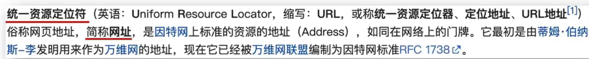

- 例如
  - https://www.baidu.com/index.html 是网页资源
  - https://www.itheima.com/images/logo.png 是图片资源
  - http://hmajax.itheima.net/api/province 是数据资源
- 简单理解：URL就是统一资源定位符，简称网址，用于访问网络上的资源


### URL的组成


#### 协议

http协议：即超文本传输协议，**规定了浏览器与服务器之间传输数据的==格式==**

除http协议外，还有https等其他协议

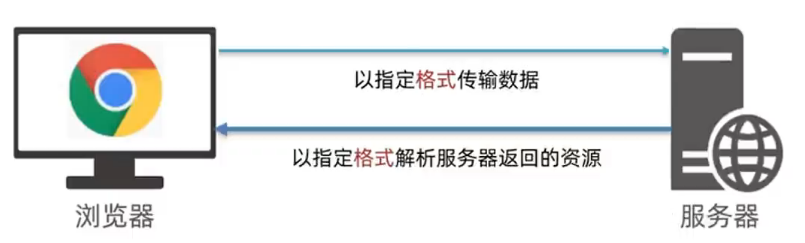

#### 域名

域名即标记**服务器在互联网中的==方位==**

例如：baidu.com   taobao.com


#### 端口号

- 端口号是用于 **标记服务器中不同功能的服务程序**
- 端口号范围：0-65535之间的整数

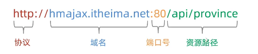

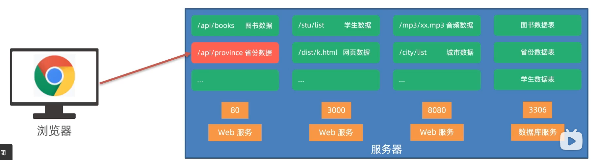

> 注意：
>
> 0-1023和一些特定的端口号被占用，我们自己编写服务程序时请避开使用


#### 资源路径

资源路径：即**标记资源在服务器下的==具体位置==**

#### 查询参数

- 定义：
  - **浏览器提供给服务器的==额外信息==，让服务器返回浏览器想要的数据**
  - 即URL中问号后面的内容
- 语法
  - ``http://xxxx.com/xxx/xxx?参数名1=值1&参数名2=值2`` 
- 在axios中的配置参数中使用params传递所有需要的参数，axios会在运行时将参数拼接到url上

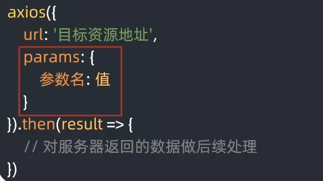


## HTTP协议-请求报文

- **请求报文**即 浏览器按照HTTP协议要求的**格式**，发送给服务器的**内容集合**

### 请求报文的组成部分

1. **请求行：包含 请求方法，URL，协议**
2. **请求头：**以键值对的格式携带的附加信息，比如：**Content-Type存储了本次浏览器携带的内容类型**
3. 空行：分隔请求头，空行之后即是发送给服务器的资源
4. **请求体：浏览器发送的资源**

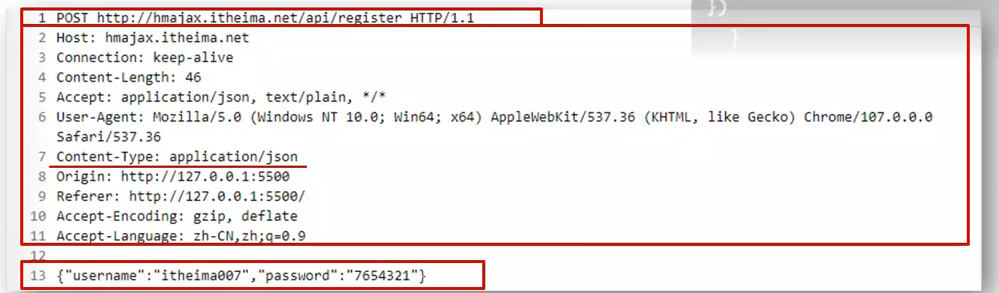

> 上述内容都可以在浏览器->F12->网络中的对应请求中找到


## HTTP协议-响应报文

HTTP协议规定了浏览器发送以及服务器返回内容的**格式**

- **响应报文**：服务器按照HTTP协议要求的**格式**，返回给浏览器的**内容**

### 响应报文的组成部分

1. **响应行(状态行)：包含协议、HTTP响应状态码、状态信息**
2. **响应头**：以键值对的格式携带的附加信息，比如：**Content-Type**
3. 空行：分隔响应头，空行之后即是服务器返回的资源
4. **响应体：返回的资源**

#### HTTP响应状态码

HTTP响应状态码：**用于表明请求是否成功**

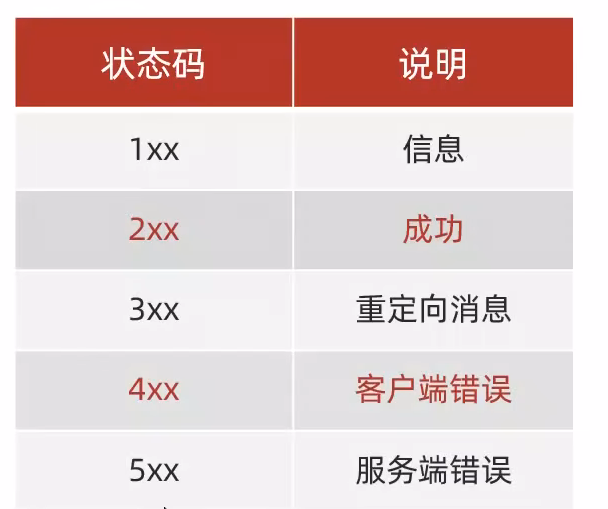

例如：**404(服务器找不到资源)**

> 与请求报文类似的，也可以在F12中找到对应的信息


## 接口文档

**接口文档**：即描述**接口**的文章(后端)

**接口**：使用AJAX和服务器通讯时，使用的**URL，请求方法，以及参数**


## form-serialize插件

- 该插件可以**快速**收集表单元素的值

在表单中有很多内容需要用户输入时，我们在获取用户输入的值时也会变得麻烦，而该插件可以帮助我们解决该问题

- 使用步骤

1. 引入该插件到网页中
2. 调用serialize插件

```javascript
const form = document.querySelector('.simple-form')
//第一个参数表示需要收集信息的表单
const data = serialize(form, {hash:true, empty:true})
```

> serialize()该函数会返回一个对象(如果hash参数值为true)
>
> - 其中对象的属性名为**各个表单元素的name属性值**，建议表单元素的name属性值，最好与接口文档参数名一致
> - serialize函数的第二个参数为一个配置对象，其中hash的值是控制获取的数据结构类型的，如果hash值为true，那么serialize函数返回一个js对象，一般在请求体里提交给服务器  ，如果hash值为false，那么返回一个查询字符串(例如uname=asldjkls&pwd=123456这样的字符串)
> - empty的值设置是否获取空值，如果empty的值为true，那么返回的对象中所有属性名都会对应到一个属性值，即使属性值为空串，如果empty的值为false，那么返回的对象中不能找到那个输入为空的表单元素名


# AJAX

## 什么是AJAX

- 定义

**异步 JavaScript 和 XML**，或 [**Ajax**](https://www.semanticscholar.org/paper/Ajax%3A-A-New-Approach-to-Web-Applications-Garrett/c440ae765ff19ddd3deda24a92ac39cef9570f1e?p2df) 本身不是一种技术，而是一种将一些现有技术结合起来使用的方法，包括：[HTML](https://developer.mozilla.org/zh-CN/docs/Web/HTML) 或 [XHTML](https://developer.mozilla.org/zh-CN/docs/Glossary/XHTML)、[CSS](https://developer.mozilla.org/zh-CN/docs/Web/CSS)、[JavaScript](https://developer.mozilla.org/zh-CN/docs/Web/JavaScript)、[DOM](https://developer.mozilla.org/zh-CN/docs/Web/API/Document_Object_Model)、[XML](https://developer.mozilla.org/zh-CN/docs/Web/XML)、[XSLT](https://developer.mozilla.org/zh-CN/docs/Web/XSLT)、以及**最重要的 [`XMLHttpRequest`](https://developer.mozilla.org/zh-CN/docs/Web/API/XMLHttpRequest) 对象**。当使用结合了这些技术的 Ajax 模型以后，网页应用能够快速地将增量更新呈现在用户界面上，而不需要重载（刷新）整个页面。这使得程序能够更快地回应用户的操作。Ajax 最吸引人的特性是它的“异步”性质，这意味着它可以与服务器通信、交换数据并更新页面，而无需刷新页面。

尽管 Ajax 中的 X 代表 XML，但是 [JSON](https://developer.mozilla.org/zh-CN/docs/Glossary/JSON) 才是首选，因为它更加轻量，而且是用 JavaScript 编写的。在 Ajax 模型中，JSON 和 XML 都被用来包装信息。

- 简单理解：**AJAX是浏览器与服务器进行数据通信的技术**


## 如何使用AJAX

### axios库

Axios 是一个基于 Promise 的 HTTP 库，可以用在浏览器和 node.js 中，实际底层也是基于**最重要的XMLHttpRequest对象**进行封装的

```javascript
<body>
  <div></div>
  //引入axios
  <script src="https://cdn.jsdelivr.net/npm/axios/dist/axios.min.js"></script>
  <script>

    axios({
      //传入配置参数
      url: 'http://hmajax.itheima.net/api/province'
    }).then(result => {
      //对获取的数据进行处理
      console.log(result);
      const data = result.data.list
      console.log(data);
      document.querySelector('div').innerHTML = data.join('</br>')
    })  
  </script>
</body>
```


#### 常用请求方法

- 请求方法：对服务器资源，要执行的操作

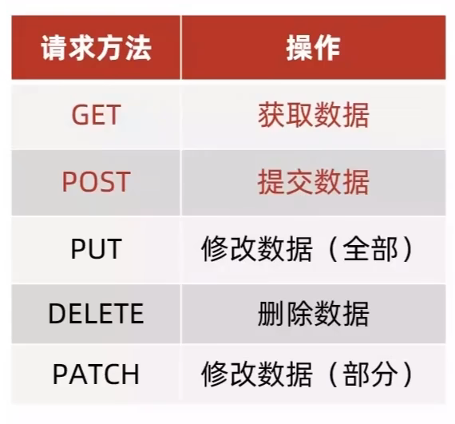

上面代码实际上为我们展示了GET请求方法，下面介绍POST请求方法，即将浏览器的数据提交到服务器进行保存

```javascript
    //路径传参时需要将参数直接添加在url的末尾作为路径
	axios({
      url: `http://hmajax.itheima.net/api/books/${curId}`,
      method: 'DELETE'
    }).then(res => {
      console.log(res);
    })
```

 


#### axios请求配置

- url：请求的URL网址
- **method**：请求的方法，如果是获取数据GET则可以忽略即默认是GET(不区分大小写，这也是前面代码无需指定method的原因)
- **data**：提交的数据

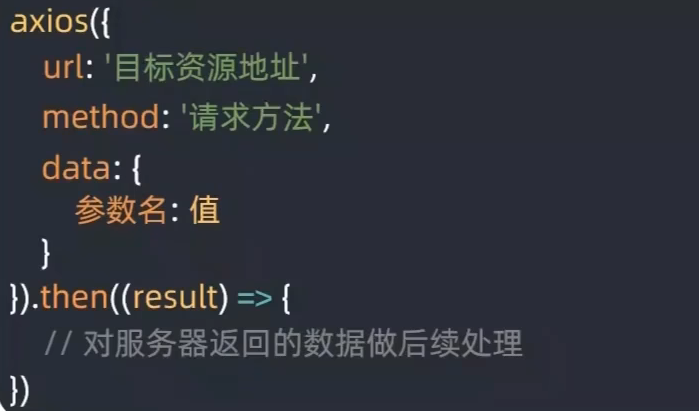

- **params** ：查询参数


#### axios错误处理 

- 场景：例如在注册同一个账号时，会在控制台看到报错信息
- 我们需要用更加直观的方式给普通用户展示错误信息
- 语法：


#### 错误排查

合理的利用 **请求报文**可以帮助我们进行代码调试，例如我们可以利用请求报文查看当前用户输入的信息是否真的发送给了服务器


#### 图片上传

- 目标：将用户在浏览器中上传的图片发送至服务器中，服务器会返回该图片的url网址，再将其渲染至页面中


- 思路：
  - 获取**图片文件**对象(使用change事件监听file的input标签，用户上传后使用dom.files属性得到用户上传的文件)
  - 使用JavaScript内置的formData对象包装文件(一般服务器接口上传文件要求formData类型)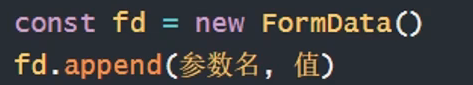
  - 提交表单到服务器，使用服务器返回的url网址

```javascript
<body>
  <!-- 文件选择元素 -->
  <input type="file" class="upload">
  
  <script src="https://cdn.jsdelivr.net/npm/axios/dist/axios.min.js"></script>
  <script>
    /**
     * 目标：图片上传，显示到网页上
     *  1. 获取图片文件
     *  2. 使用 FormData 携带图片文件
     *  3. 提交到服务器，获取图片url网址使用
    */
    document.querySelector('.upload').addEventListener('change', function () {
      // console.log(this.files[0]);
      const fd = new FormData()
      fd.append('img', this.files[0])
      axios({
        url: 'http://hmajax.itheima.net/api/uploadimg',
        method: 'POST',
        data: fd
      }).then(res => {
        // console.log(res.data.data.url);
        document.querySelector('.my-img').src = res.data.data.url
      })
    })

  </script>
</body>
```


#### axios请求拦截器

- 即**在发起请求之前，触发的配置函数，对请求参数进行额外配置**
- 本质就是将发起请求之前做的事情提取出来，实现代码复用
- 语法：

```javascript
// 添加请求拦截器
axios.interceptors.request.use(function (config) {
    // 在发送请求之前做些什么
    return config;
  }, function (error) {
    // 对请求错误做些什么
    return Promise.reject(error);
  });
```


#### axios响应拦截器

- 即**在服务器发起响应回到then/catch之前，触发的拦截函数，对响应结果统一处理**
- 本质就是将服务器响应到then/catch之前做的事情提取出来，实现代码复用

```javascript
// 添加响应拦截器
axios.interceptors.response.use(function (response) {
    // 2xx 范围内的状态码都会触发该函数。
    // 对响应数据做点什么
    return response;
  }, function (error) {
    // 超出 2xx 范围的状态码都会触发该函数。
    // 对响应错误做点什么
    return Promise.reject(error);
  });
```

- 例如：服务器返回身份验证失败，统一判断并处理


### XMLHttpRequest

`XMLHttpRequest`（**XHR**，即在F12网络中看到的xhr）对象用于与服务器交互。通过 XMLHttpRequest 可以在不刷新页面的情况下请求特定 URL，获取数据。这允许网页在不影响用户操作的情况下，更新页面的局部内容。`XMLHttpRequest` 在 [AJAX](https://developer.mozilla.org/zh-CN/docs/Glossary/AJAX) 编程中被大量使用。

实际上，前面我们所学的axios内部就是采用的XMLHttpRequest与服务器进行的交互

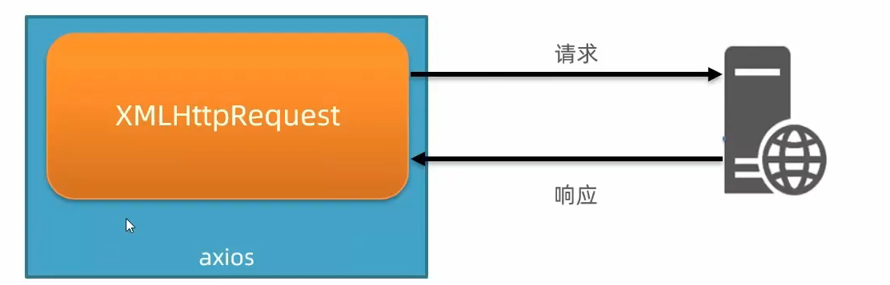

#### 使用XMLHttpRequest

- 步骤：

1. 创建XMLHttpRequest对象
2. 配置**请求方法**和请求**url地址**
3. 监听**loadend**事件，接收**响应结果**
4. 发送请求

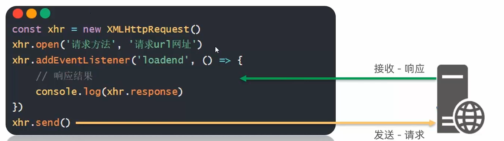

#### 查询参数

使用原生的XHR携带查询参数只需在URL的后面将参数进行拼接即可

类似：``http://xxxx.com/xxx/xxx?参数名1=值1&参数名2=值2`` 

##### URLSearchParams对象

URLSearchParams接口定义了一些实用的方法来处理 URL 的查询字符串

在实际应用中，我们将一个对象作为参数传递给其构造函数，那么再利用它的.toString方法即可得到

``参数名1=值1&参数名2=值2``这样的字符串

```javascript
      const pname = document.querySelector('.province').value
      const cname = document.querySelector('.city').value

      const qObj = {
        pname,
        cname
      }
      const qString = new URLSearchParams(qObj).toString()
      const xhr = new XMLHttpRequest()
      xhr.open('GET', `http://hmajax.itheima.net/api/area?${qString}`)
      xhr.addEventListener('loadend', function () {
        const data = JSON.parse(this.response)
        document.querySelector('.list-group').innerHTML = data.list.map(carea => `<li class="list-group-item">${carea}</li>`).join('')
      })
      xhr.send()
```

#### POST请求

在原生XHR中，POST请求的参数 需要转换为**JSON字符串**后作为参数给send()方法即可，此外还需要在请求头中设置当前请求的类型，需要调用xhr.setRequestHeader('','')方法进行设置

```javascript
      const xhr = new XMLHttpRequest()
      xhr.open('POST', 'http://hmajax.itheima.net/api/register')
      xhr.addEventListener('loadend', function () {
        console.log(this.response);
      })
      xhr.setRequestHeader('Content-Type', 'application/json')
      const userObj = {
        username: 'XIXI2112',
        password: '123456'
      }
      const userStr = JSON.stringify(userObj)
      xhr.send(userStr)
```


#### 认识Promise

> 异步编程技术使你的程序可以在执行一个可能长期运行的任务的同时继续对其他事件做出反应而不必等待任务完成。与此同时，你的程序也将在任务完成后显示结果。

- Promise对象用于**表示一个异步操作的最终完成（或失败）及其结果值**
- 使用Promise管理异步任务的好处
  - 逻辑更清晰
  - 了解axios函数内部机制
  - 解决回调函数地狱问题 

##### Promise的基本使用

```javascript
  <script>
    const p = new Promise((resolve, reject) => {
      //执行异步任务
      setTimeout(() => {
        //异步任务成功
        // resolve('异步任务成功')

        //异步任务失败
        reject(new Error('异步任务失败'))
      }, 1500)
    })

    p.then(res => {
      console.log(res);
    }).catch(res => {
      console.log(res);
    })
  </script>
```


##### Promise的三种状态

- 待定(pending)：初始状态，既没有被兑现也没有被拒绝
- 已兑现(fulfilled)：意味着，操作成功完成
- 已拒绝(rejected)：意味着，操作失败

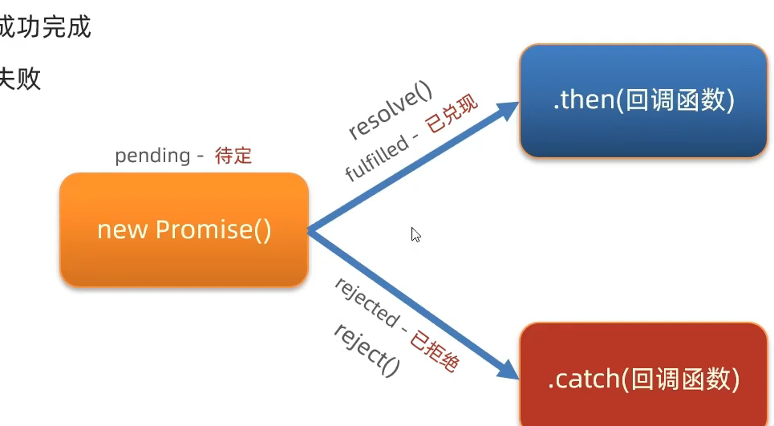

> **注意：**
>
> Promise对象一旦被**兑现/拒绝**就是已敲定了，状态无法再被改变


##### Promise.all静态方法

- Promise.all方法可以**合并多个Promise对象，等待所有同时完成(或某一个失败)**，做后续逻辑

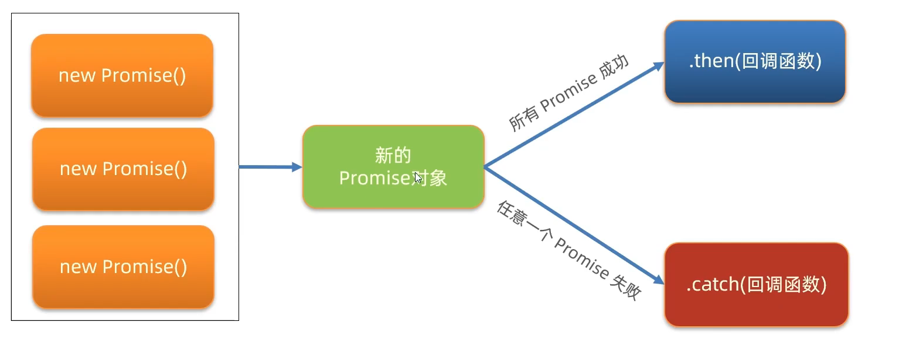

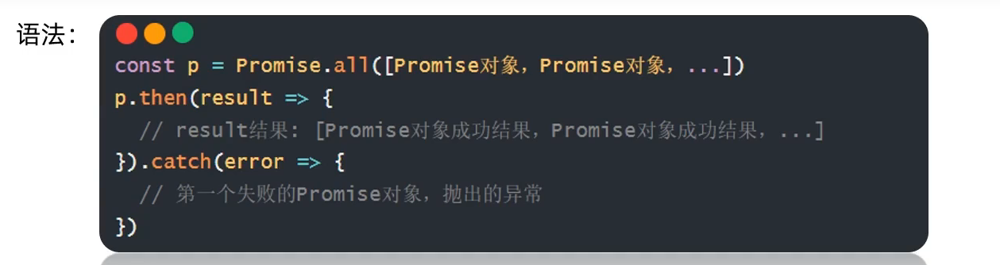

其中Promise.all的参数是一个可迭代对象

```javascript
  <script>
    /**
     * 目标：掌握Promise的all方法作用，和使用场景
     * 业务：当我需要同一时间显示多个请求的结果时，就要把多请求合并
     * 例如：默认显示"北京", "上海", "广州", "深圳"的天气在首页查看
     * code：
     * 北京-110100
     * 上海-310100
     * 广州-440100
     * 深圳-440300
    */
    const cityCode = ['110100', '310100', '440100', '440300']
    const cities = cityCode.map(city => {
      return axios({ url: 'http://hmajax.itheima.net/api/weather1', params: { city } })
    })
    const p = Promise.all(cities)
    p.then(res => {
      document.querySelector('.my-ul').innerHTML = res.map(city => {
        return `<li>${city.data.data.area}---${city.data.data.weather}</li>`
      }).join('')
    }).catch(err => {
      console.log(err);
    })
  </script>
```


#### XHR结合Promise使用

在Promise回调函数中使用xhr.status判断当前状态码来调用对应的函数

```javascript
<body>
  <p class="my-p"></p>
  <script>
    const p = new Promise((resolve, reject) => {
      const xhr = new XMLHttpRequest()
      xhr.open('GET', 'http://hmajax.itheima.net/api/province')
      xhr.addEventListener('loadend', function () {
        if (this.status >= 200 && this.status < 300) {
          resolve(this.response)
        } else {
          reject(this.response)
        }
      })
      xhr.send()
    })

    p.then(res => {
      const data = JSON.parse(res)
      document.querySelector('.my-p').innerHTML = data.list.join('</br>')
    }).catch(res => {
      document.querySelector('.my-p').innerHTML = res
    })
  </script>
</body>

```


## 进阶AJAX

### 认识同步与异步

- 同步代码

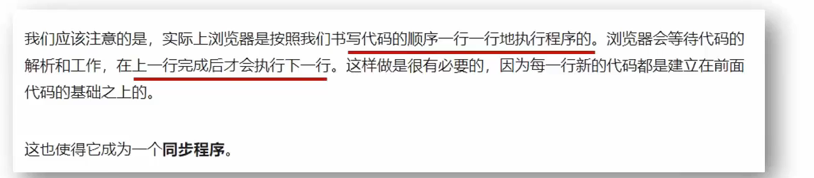

- 异步代码

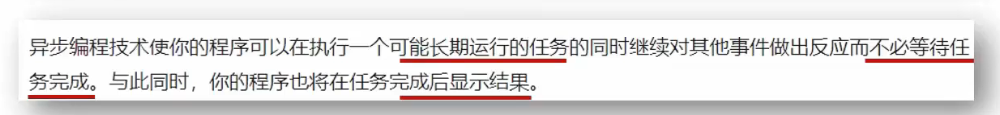

- 例如：定时器/事件/AJAX都是异步的

> 简单理解：
>
> - 同步代码：逐行执行，需要**原地等待结果**后，再继续向下执行
> - 异步代码：调用后**耗时**，不阻塞代码继续执行（不必原地等待），将来完成后触发回调函数


### 回调函数地狱

- 概念：在回调函数中**嵌套回调函数**，一直嵌套下去就形成了回调函数地狱
- 缺点：
  - 可读性差
  - 异常无法捕获
  - 耦合性严重，牵一发动全身


### Promise链式调用

- 概念：依靠then()方法会返回一个**新生成的Promise对象**特性，继续串联下一环任务，直到结束
- **细节**：==then()回调函数中的返回值，会影响新生成的Promise对象的最终状态和结果==
- 好处：通过链式调用，解决了回调函数嵌套问题(回调函数地狱)

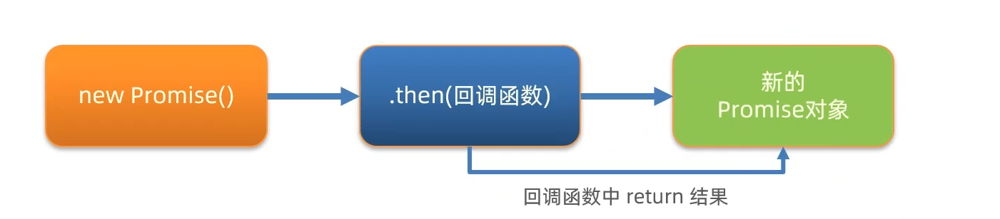

```javascript
    axios({ url: 'http://hmajax.itheima.net/api/province' }).then(res => {
      pname = res.data.list[0]
      document.querySelector('.province').innerHTML = pname
      return axios({ url: 'http://hmajax.itheima.net/api/city', params: { pname } })
    }).then(res => {
      const cname = res.data.list[0]
      document.querySelector('.city').innerHTML = cname
      return axios({ url: 'http://hmajax.itheima.net/api/area', params: { pname, cname } })
    }).then(res => {
      const area = res.data.list[0]
      document.querySelector('.area').innerHTML = area
    })
```


### async函数和await

- 定义：async 函数是使用`async`关键字声明的函数。async 函数是 [`AsyncFunction`](https://developer.mozilla.org/zh-CN/docs/Web/JavaScript/Reference/Global_Objects/AsyncFunction) 构造函数的实例，并且其中允许使用 `await` 关键字。`async` 和 `await` 关键字让我们可以用一种更简洁的方式写出基于 [`Promise`](https://developer.mozilla.org/zh-CN/docs/Web/JavaScript/Reference/Global_Objects/Promise) 的异步行为，而无需刻意地链式调用 `promise`。
- ==在async函数内，使用await关键字取代then函数，等待获取Promise对象成功状态的结果值==
- **如果await的请求返回失败结果那么代码不会再往下执行**

> 注意：
>
> await必须使用在async修饰的函数内(**await会阻止异步函数内代码的继续执行，原地等待结果**)

```javascript
    async function getData() {
      const pObj = await axios({ url: 'http://hmajax.itheima.net/api/province' })
      const pname = pObj.data.list[0]
      const cObj = await axios({ url: 'http://hmajax.itheima.net/api/city', params: { pname } })
      const cname = cObj.data.list[0]
      const areaObj = await axios({ url: 'http://hmajax.itheima.net/api/area', params: { pname, cname } })
      const area = areaObj.data.list[0]
      document.querySelector('.province').innerHTML = pname
      document.querySelector('.city').innerHTML = cname
      document.querySelector('.area').innerHTML = area
    }
    getData()
```

此外，如果想要捕获异常，按照JS语法中的try...catch进行捕获即可

如：

```javascript
    async function getData() {
      try {
        const pObj = await axios({ url: 'http://hmajax.itheima.net/api/province' })
        const pname = pObj.data.list[0]
        const cObj = await axios({ url: 'http://hmajax.itheima.net/api/city', params: { pname } })
        const cname = cObj.data.list[0]
        const areaObj = await axios({ url: 'http://hmajax.itheima.net/api/area', params: { pname, cname } })
        const area = areaObj.data.list[0]
        document.querySelector('.province').innerHTML = pname
        document.querySelector('.city').innerHTML = cname
        document.querySelector('.area').innerHTML = area
      } catch (error) {
        console.log(error);
      }
    }
```


### 事件循环

1. 什么是事件循环

- ==**执行代码和收集异步任务**，在**调用栈空闲**时，反复调用任务队列里的**回调函数** 的一种执行机制==

2. 为什么需要事件循环

- JavaScript是单线程的，为了**不阻塞JS引擎**而设计执行代码的模型

3. **JavaScript内代码具体如何执行**

- ==在调用栈中直接执行同步代码，遇到异步代码则交给宿主浏览器环境中执行==
- ==异步代码执行完毕后，则将其回调函数加入任务队列中排队==
- ==当调用栈空闲后，反复调用任务队列里的回调函数==

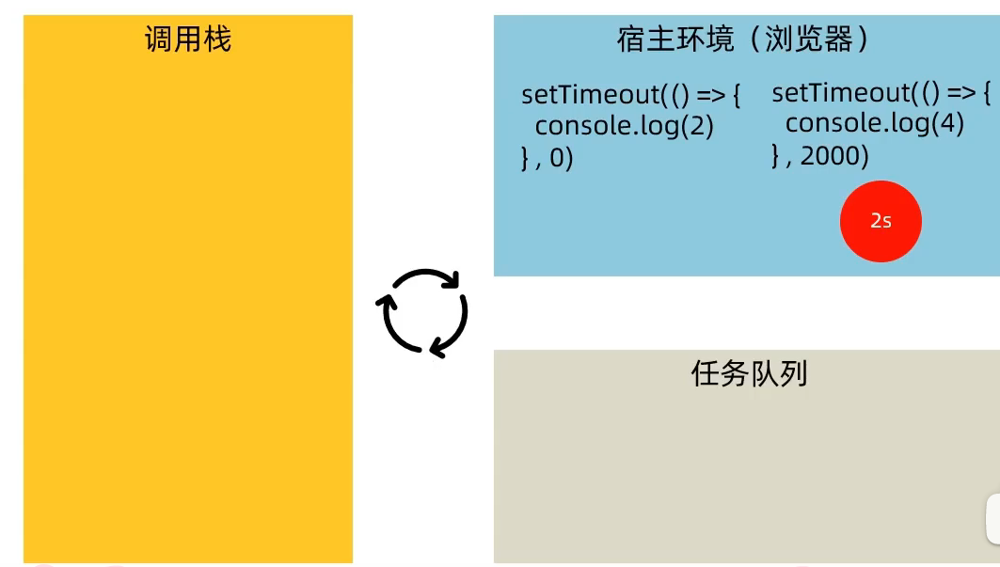


### 宏任务与微任务

ES6引入了Promise对象，让JS引擎也可以执行异步任务

因此：我们将异步任务分为：

- **宏任务**：由**浏览器环境**执行的异步代码
- **微任务**：由**JS引擎环境**执行的异步代码

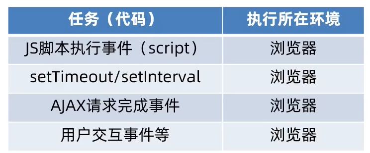

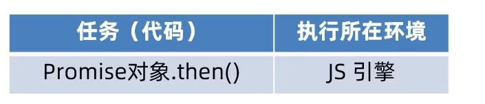

- 具体JS代码执行过程

1. 执行第一个script脚本事件宏任务，里面**同步代码**
2. 遇到宏任务/微任务交给宿主环境，有结果后回调函数进入对应队列
3. 当执行栈为空闲时，**优先清空微任务队列**(因为微任务队列执行环境更接近JS引擎)，再执行下一个宏任务，从1开始重新循环

> 注意：
>
> Promise本身是同步的，**而then和catch回调函数是异步的**

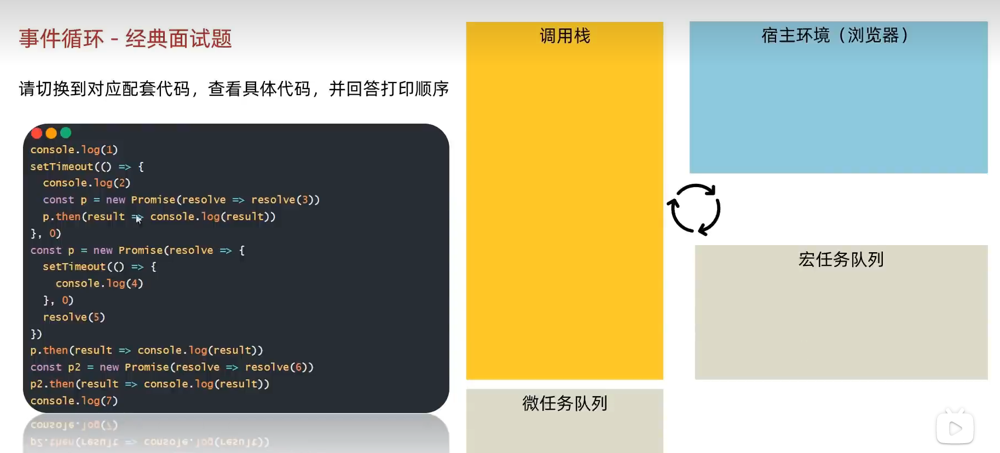


## 数据管理平台笔记

### 验证码登录流程

#### 目标

了解验证码登录的流程

#### 讲解

手机号+验证码，登录流程：


### token的介绍

- 概念：访问权限的**令牌**，本质上是一串**字符串**
- 在登录页面，正确登录之后由后端签发并返回
- 作用：判断是否有登录状态，控制访问权限

> 注意：前端只能判断token的有无，而后端才能判断token的有效性


### 富文本编辑器wangEditor

[快速开始 | wangEditor](https://www.wangeditor.com/v5/getting-started.html)


