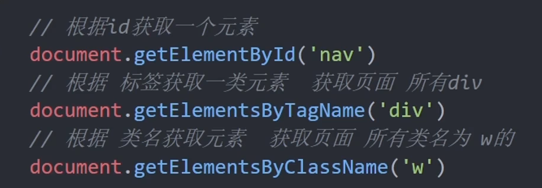
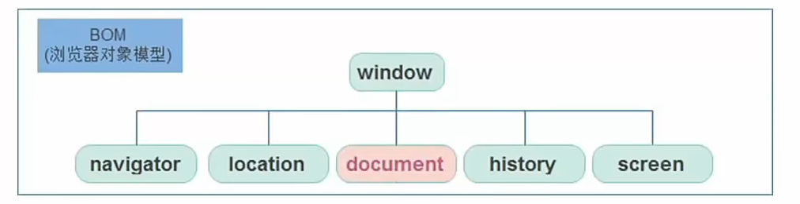
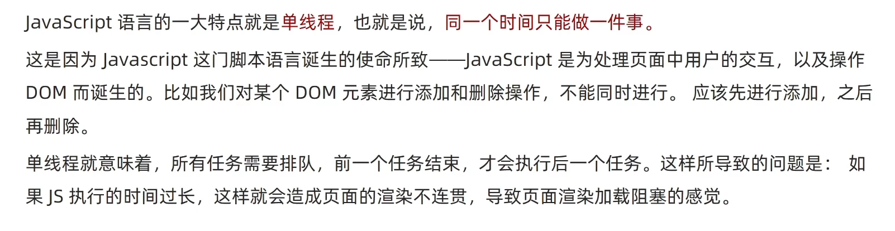
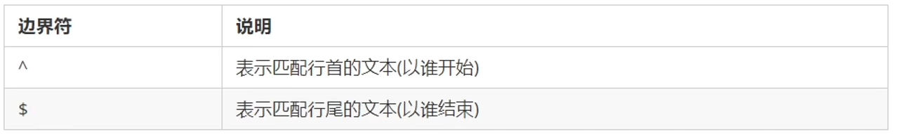
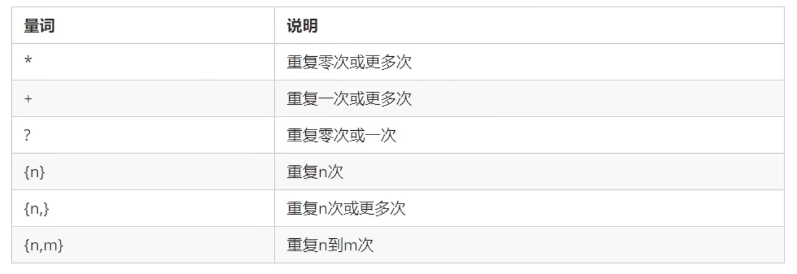

# DOM-获取元素

## Web API 基本认知

### const优先

- 建议在变量声明时使用const优先，尽量使用const
  - 因为const语义化更好：即一看就知道该变量是不变的
  - 很多变量在声明时就可以知道它不会被改变了
  - 实际开发中，如react框架基本都使用const
- 或者：有了变量先给const，如果后面发现它是需要被修改的，再改为let
- ==注意==
  - const声明的值不能修改，且const声明的变量同时需要进行初始化
  - **对于引用数据类型，const声明的变量，里面存储的不是值，而是地址，因此对于引用数据类型，除非其地址需要改变否则都可以使用const**


### Web API作用和分类

- 作用：即使用JS去操作html和浏览器
- 分类：DOM（文档对象模型）、BOM（浏览器对象模型）


### 什么是DOM

- DOM（Document Object Model——文档对象模型）是用来呈现以及与任意HTML或XML文档交互的API
- 或者说是浏览器提供的一套专门用于**操作网页内容**的功能
- 作用
  - 开发网页特效和实现用户交互


### DOM树

- DOM树是什么
  - 将HTML文档以树状结构直观地表现出来，我们称之为文档数或者是DOM树
  - 描述网页内容关系的名词
  - 作用：**文档树直观的体现了标签与标签之间的关系**


### DOM对象

- DOM对象：浏览器根据html标签生成的JS对象（对应到DOM树的每一个结点）
  - 所有的标签属性都可以在这个对象上找到
  - 修改这个对象的属性会自动映射到标签身上
- DOM的核心思想
  - 将网页内容当作对象来处理
- document对象
  - 是DOM里提供的一个对象
  - 所以它提供的属性和方法都是用来访问和操作网页内容的
    - 例如document.write()
  - 网页所有内容都在document中


## 获取DOM对象

#### 根据CSS选择器获取DOM对象（重点）

1. **选择匹配的第一个元素**

- 语法：

```javascript
document.querySelector('CSS选择器')
```

- 参数：

包含一个或多个有效的CSS选择器 字符串

- 返回值：

==CSS选择器匹配到的**第一个元素**，一个HTMLElement对象 ， 如果没有匹配到则返回null==

​	

2. **选择匹配的多个元素**

- 语法：

```javascript
document.querySelectorAll('CSS选择器')
```

- 参数：

包含一个或多个有效的CSS选择器 字符串

- 返回值：

==CSS选择器匹配到的NodeList对象集合==

>**注意：**
>
>这里的NodeList是一个伪数组：
>
>- 是有长度有索引号的数组
>- 但是没有pop、push、splice等数组方法
>
>要想得到里面的每一个元素，则通过数组遍历（for）的方式即可
>
>==哪怕只有一个元素，通过document.querySelectorAll()获取到的也是一个伪数组，里面只有一个元素而已==

#### 其他获取DOM元素方法（了解）




### 操作元素内容

#### innerText属性

- 将文本内容添加/更新到任意标签位置
- 显示纯文本，**不解析标签**


#### innerHTML属性

- 将文本内容添加/更新到任意标签位置
- **会解析标签**，多标签建议使用模板字符串


### 操作元素属性

#### 操作元素常用属性

- 可以通过JS修改/设置标签元素属性，例如src更换图片
- 语法``对象.属性 = 值``


#### 操作元素样式属性

##### 通过style属性操作CSS

- 语法
  - ``对象.style.样式属性 = 值``
- **注意**
  - 修改样式通过style属性引出
  - 如果属性有中横线-连接符，需要==转换为小驼峰命名法==（例如background-color转为backgroundColor）
  - 赋值的时候别忘了加上css单位
  - 生成的是 行内样式，权重较高


##### 操作类名（className）操作CSS

- 如果修改的样式比较多，直接通过style属性修改比较麻烦，我们可以借助css类名
- 语法：

```javascript
元素.className = 'active'
```

- 注意
  - 因为class是关键字，所以使用的className代替	
    - ==className是使用新值换旧值，如果需要保留原来的类名，那么重新赋值时也要写上原来的类名==


##### 通过classList属性 操作类控制CSS（常用）

- 为了解决className容易覆盖之前的类名，我们可以使用classList方式追加和删除类名（HTML5新增属性）
- 语法：


其中这里切换toggle的意思是：==如果有该类名则删除，如果没有该类名则追加==


##### classList.contains()方法

- 该方法以一个类名作为参数判断是否当前元素存在该类名


##### 操作表单元素属性

- 正常的有属性有取值的，跟其他标签属性没有任何区别
  - **获取：DOM对象.属性名**
  - **设置：DOM对象.属性名 = 新值**
- 表单属性中添加就有效果，移除就没有效果，一律使用**==布尔值==**表示，如果为true，代表添加了该属性，如果是false表示移除了该属性
- 比如：disabled添加则禁用某个标签，checked添加则选择某个复选框，selected添加则选择某个下拉菜单的选项


#### 自定义属性（HTML5新）

- 标准属性：即标签天生自带的属性例如class，id，title等，包括disabled与checked等
- ==自定义属性==
  - 在html5中推出了专门的data-自定义属性
  - 在标签上一律以**data-开头**
  - 在DOM对象上一律以**dataset对象**方式获取

```javascript
  <div data-id="1">1</div>
  <div class="box2" data-id="2" data-pm="dontknow">2</div>
  <div data-id="3">3</div>
  <div data-id="4">4</div>
  <div data-id="5">5</div>
  <script>
    const box2 = document.querySelector('.box2')
    console.log(box2.dataset.id);
    console.log(box2.dataset.pm);
  </script>
```


### 定时器-间歇函数

#### 定时器介绍

- 网页中可能需要某个功能：每隔一段时间自动执行一段代码，不需要我们手动触动


#### 定时器怎么使用

1. 开启定时器

``setInterval(函数，间隔时间)``

- 每隔一段时间调用这个函数一次
- 间隔时间是毫秒
- 注意在第一次调用这个函数之前也有间隔时间
- 返回值
  - 返回一个id数字是定时器的唯一标识（可能会变）

```javascript
    let itl1 = setInterval(function () {
      console.log('hhh');
    }, 100)
    function fn() {
      console.log('xxx');
    }
    setInterval(fn, 1000)
```


2. 关闭定时器

```javascript
let 变量名 = setInterval(函数，间隔时间)
clearInterval(变量名)
```

- 注意这里存储定时器的id必须使用let进行声明，可能存在多次开关定时器，每次开关定时器后的id都会改变


>好习惯：
>
>在开启操作同一个对象的定时器之前，先关闭同一个对象之前的定时器


## 事件监听（绑定）

- 什么是事件？
  - 事件是在编程时系统内发生的动作或者发生的事情
  - 比如用户在网页上点击了某个元素
- 什么是事件监听？
  - 就是让程序检测是否有事件发生，一旦事件触发，就立即调用一个函数做出响应，称为**绑定事件/注册事件**
  - 比如鼠标经过时显示下拉菜单，点击播放轮播图


### 事件监听

- 语法：

```javascript
元素对象.addEventListener('事件类型',要执行的函数)
```

- 事件监听三要素：
  - 事件源：哪个dom对象被事件触发了，要获取dom元素
  - 事件类型：用什么方式触发，比如鼠标click，鼠标经过mouseover等
  - 事件调用的函数：触发后需要做什么，触发一次执行一次
- 注意：
  - 事件类型要加引号


>实际上在我们给某个对象绑定了事件后，该事件的函数也是存储在了该元素对象中
>
>例如我们给obj绑定了click点击事件，我们如果遇到与该点击事件同样的业务逻辑，还可以通过obj.click()调用该函数


### 事件监听版本（了解）

- DOM Level0
  - ``事件源.on事件 = function(){}``
  - 例如对象.onclick = function(){}
- DOM Level2
  - ``事件源.addEventListener(事件，事件处理函数)``
- 区别
  - 传统on注册
    - 同一个对象对于同一个事件后面注册的事件会覆盖前面注册的事件
    - 直接使用null进行事件解绑
    - 只有事件冒泡，没有捕获
  - 事件监听注册
    - 后面注册的事件不会覆盖前面注册的事件（同一个事件）
    - 可以通过第三个参数确定是否是冒泡阶段执行还是捕获阶段
    - 必须使用removeEventListener解绑事件
    - 匿名函数无法解绑


### 事件类型

#### 鼠标事件

- click点击
- mouseenter鼠标进入
  - mouseenter与hover的区别：hover只有鼠标在元素的位置才有效果，而mouseenter则不一定
- mouseleave鼠标离开
- mousemove事件鼠标移动即触发


##### 两组鼠标经过事件的区别

实际上鼠标经过事件有以下两组：

- mouseover与mouseout 会存在冒泡效果
- mouseenter与mouseleave 没有冒泡效果（推荐）
- [可参考mouseenter与mouseover为何这般纠缠不清？ - 掘金 (juejin.cn)](https://juejin.cn/post/6844903480470028302)


#### 焦点事件

- focus获得焦点
- blur失去焦点


#### 键盘事件

- keydown键盘按下
- keyup键盘弹起


#### 用户输入事件

- input用户每输入一次字符响应一次


#### 表单提交事件

- submit用户点击提交一次响应一次
- 注意表单提交事件一般都会带有默认行为 **跳转页面**，一般需要e.preventDefault()
- 绑定在表单标签form上


#### change事件

- 当某个元素失去焦点时，其内容发生变化时发生的事件为change事件，常用于**表单验证**


### 事件对象

#### 什么是事件对象

- 事件对象是什么
  - 也是个对象，这个对象中**存储了事件触发时的相关信息**
  - 例如，鼠标点击事件中，事件对象存了鼠标在哪个位置点击等信息
- 使用场景
  - 判断用户按下哪个键、点击了哪个元素，从而做出响应


#### 获取事件对象

- 语法
  - 在事件绑定的函数的第一个参数就是事件对象
  - 一般命名为event、ev、e

```javascript
元素.addEventListener('click',function(e){
    
})
```


#### 常用属性

- type
  - 获取当前的事件类型
- clientX/clientY
  - 获取光标相对于浏览器可见窗口左上角的位置
- offsetX/offsetY
  - 获取光标相对于当前DOM元素左上角的位置
- key
  - 用户按下的键盘键的值
  - 不再使用老版本的keyCode 
- pageX与pageY
  - 获取鼠标在页面坐标  


### 环境对象this

- 环境对象指的是函数内部特殊的变量this，它代表着当前函数运行时所处的环境
- 作用
  - 弄清楚this的指向，可以使得我们的代码更加整洁
- 函数的调用方式不同，this指向的对象也不同
- ==谁调用，this就是谁==是判断this指向的粗略规则


### 回调函数

- 如果将函数A作为参数传递给函数B，那么我们称函数A为**回调函数**
- 例如定时器和事件绑定中都有回调函数


## Dom事件进阶

### 事件流

#### 事件流与两个阶段说明

- 事件流：**是事件完整执行过程中的流动路径**


- 说明：假设页面中有个div，当触发事件时，会经历两个阶段，分别是捕获阶段、冒泡阶段
- 简单来说：==捕获阶段是 从父到子 ，冒泡阶段是从子到父==
- 实际工作中都是使用事件冒泡为主


#### 事件捕获（简单了解）

- 即从DOM的根元素开始执行对应的事件（从外到里）
- 事件捕获需要写对应代码才能使用
- 代码：

```javascript
DOM.addEventListener(事件类型,事件处理函数,是否使用捕获机制)
```

- addEventListener()第三个参数传入true则代表捕获阶段触发
- ==若传入false则代表**冒泡阶段触发**，**默认是false**==
- 如果使用老版本的事件监听，则只有冒泡，没有捕获


#### 事件冒泡

- 概念：==**当一个元素的事件被触发时，同样的事件将会在该元素的所有祖先元素这种依次触发，该过程则称为事件冒泡**==
- 即当一个元素触发事件后，会依次向上调用所有父级元素的**同名事件**
- 事件冒泡是默认存在的，只不过祖先元素可能没有同名事件


#### 阻止冒泡

- 问题：因为默认就有冒泡的存在，所以容易导致事件影响到父级元素
- 需求：将事件限制在当前元素中，就需要阻止事件冒泡
- 前提：拿到事件对象e
- 语法

```javascript
事件对象.stopPropagation()
```

- 注意：==此方法可以阻断事件流动传播，不光阻止冒泡，也阻止捕获==


#### 阻止默认行为

我们某些情况下，需要阻止默认行为的发生，比如阻止链接的跳转，表单域跳转等

- 语法：

```javascript
e.preventDefault()
```


#### 解绑事件

- on事件方式，直接使用null覆盖原来的函数对象即可实现解绑
- 语法:

```javascript
    const btn = document.querySelector('button')
    btn.onclick = function () {
      alert('点击了')
    }
    //事件解绑
    btn.onclick = null
```

- addEventListener方式，必须使用removeEventListener方法解绑
- 例如

```javascript
    const btn = document.querySelector('button')
    function fn() {
      alert('点击了')
    }
    btn.addEventListener('click', fn)
    btn.removeEventListener('click', fn)
```

- 注意：==这种方式下，匿名函数不能被解绑==


### 事件委托

- 事件委托是利用事件流的特征解决一些开发需求的知识技巧
  - 优点：减少注册次数，提高程序性能
  - 原理：事件委托实际利用的是**事件冒泡**的特点
    - 给**父元素注册事件**，当我们触发子元素时，会冒泡到父元素身上，从而触发父元素事件
    - 有时候如果使用事件委托可能导致子元素都被影响，使用事件对象.tagName可以判断真正触发事件的元素


### 其他事件

#### 页面加载事件

- 加载外部资源（例如图片、外联CSS和JavaScript等）加载完成时触发的事件
- 应用场景：
  - 有时候需要等待页面资源全部处理完毕再做一些事情
  - 老代码喜欢把script代码写在head中，会导致直接找DOM元素找不到
- 事件名：**load**
- 监听页面所有资源加载完毕：
  - 给window添加load事件

```javascript
window.addEventListener('load',function() {
    //执行操作
})
```

>注意：
>
>不光可以监听整个页面资源加载完毕，也可以针对某个元素绑定load事件，例如img

> 了解：
>
> - 事件名：DOMContentLoaded	
> - 当初始的HTML文档（标签/元素）被完全加载和解析完成之后，DOMContentLoaded事件被触发，**而无需等待样式表、图像等完全加载（与load的区别）**
> - 监听页面DOM加载完毕：
>   - **给document添加DOMContentedLoaded事件**
>
> ```javascript
> document.addEventListener('DOMContentedLoaded',function() {
>     
> })
> ```


#### 元素滚动事件

- 滚动条持续滚动时触发的事件
- 应用场景：
  - 很多网页需要检测用户把页面滚动到某个区域后做一些处理，比如，固定导航栏，返回顶部等
- 事件名：**scroll**
- 监听整个页面滚动(window或document)：

```javascript
window.addEventListener('scroll',function() {
    
})
```

- 监听某个元素内部滚动直接给某个元素添加该事件即可


> 当页面被JS操作滚动时，如果想要实现丝滑滚动效果可以使用CSS属性scroll-behavior: smooth


##### 获取位置

- scrollLeft和scrollTop(属性)
  - 获取被卷去的大小
  - 获取元素内容向左、向上滚出去看不到的距离
  - 这两个值==可读可写==
  - 返回值和属性值都为数字型


> 注意：
>
> 检测页面滚动的距离我们操作的对象是==HTML==，
>
> 获取html对象方法：**document.documentElement**


##### 滚动到指定的坐标

- scrollTo()方法可以把内容滚动到指定的坐标

```javascript
window.scrollTo(0,1000)
//让页面滚动到y轴1000像素的位置
```


#### 页面尺寸事件

- 会在窗口尺寸改变时触发的事件
  - 事件名：**resize**


##### 获取元素宽高

- 获取宽高：
  - 获取元素的可见部分宽高==（不包含边框，margin，滚动条等）==
  - 属性名：**clientWidth和clientHeight**


### 元素的尺寸与位置

- 获取宽高
  - 获取元素自身宽高、包含元素自身设置的宽高、padding、border（相比clientWidth与clientHeight多一个border）
  - **offsetWidth和offsetHeight**
  - 获取出来的是数值，方便计算
  - **注意**：获取到的是==可视宽高==，如果盒子是隐藏的，获取结果为0
- 获取位置
  - ==获取元素距离自己定位父级元素的左、上距离==
  - ==**offsetLeft和offsetTop**注意是只读属性==


>了解：
>
>```javascript
>element.getBoundingClientRect()
>```
>
>**该方法返回元素的大小以及其相对于视口的位置**（即相对于可见窗口区域）

​	

### 总结


## DOM操作

### 日期对象

- 日期对象：用于表示时间的对象Date
- 作用：可以得到当前的系统时间


#### 实例化

- 在代码中使用**new关键字**创建对象时，这个操作便被称为**实例化**
- 创建一个时间对象并获取时间
  - 获得当前时间

```javascript
const date = new Date()//date对象内存储当前时间
const date0 = new Date('2023-9-1 10:00:00')//date0对象内存储指定时间
```


#### 日期对象方法

- 使用场景：在日期对象中返回的数据通常我们不会直接使用，需要转换为其他格式


- 结合定时器使用即可做出时间效果
- 其他方法
  - **日期对象.toLocaleString()返回日期对象中时间的``2023/9/1 09:41:55``格式字符串**
  - **日期对象.toLocaleDateString()返回日期对象中时间的``2023/9/1``格式字符串**
  - **日期对象.toLocaleTimeString()返回日期对象中时间的`` 09:41:55``格式字符串**


#### 时间戳

- 使用场景：如果计算倒计时效果，前面的方法无法直接计算，需要借助于时间戳完成
- 什么是时间戳：
  - **是指1970年01月01日00时00分00秒起至现在的毫秒数，它是一种特殊的计量时间的方式**
- 算法：
  - 将来的时间戳-当前时间戳=剩余时间毫秒数（类比数轴相减）
  - 再将剩余时间毫秒数转化为年月日时分秒 即可得到倒计时时间


##### 如何获取时间戳

1. 日期对象.getTime()
2. **简写 +new Date()**
   - 无需实例化，直接将日期对象转化为数字型即可
3. 使用Date.now()
   - **只能得到当前的时间戳，前面两种方法能得到当前时间戳外还能得到指定时间戳**


### 节点操作

#### DOM节点

- DOM节点
  - DOM树中的每一个内容都称之为节点
- 节点类型
  - **元素节点**
    - 所有的标签 比如body、div
    - html是根节点
  - 属性节点
    - 所有的属性 比如href
  - 文本节点
    - 所有的文本	
  - 其他


#### 查找节点

注意这里的查找节点**针对的是DOM树中节点之间的关系**进行查找，利用好节点之间的关系可以**减少querySelector的使用**

例如：我们点击关闭按钮，关闭按钮是整个盒子的儿子节点，我们利用它们之间的关系得到整个盒子的对象添加display:none便不再需要使用querySelector获取整个盒子了 

##### 父节点查找

- parentNode属性
- 返回**最近一级**的父节点，找不到则返回null

```javascript
子元素.parentNode
```


##### 子节点查找

- childNodes（了解）
  - 获取所有子节点，包括文本节点、注释节点等
- **children属性**（重点）
  - 仅获取**所有元素节点**(最近一级)
  - 返回伪数组

```javascript
父元素.children
```


##### 兄弟关系查找

- 上一个兄弟节点
  - previousElementSibling属性
- 下一个兄弟节点
  - nextElementSibling属性


#### 新增节点

##### 创建节点

- 语法

```javascript
document.createElement('标签名')
```

- 返回创建节点的对象


##### 追加节点

- 要想在界面看到，还得插入到某个父元素中
- 插入到父元素的最后一个子元素：

```javascript
父元素.appendChild(要插入的元素)
```

- 插入到父元素某个子元素的前面

```javascript
父元素.insertBefore(要插入的元素, 在哪个元素前面)
```


##### 克隆节点

- 语法：

```javascript
元素.cloneNode(布尔值)
```

- cloneNode会克隆出一个跟原标签一样的元素
  - **参数为true，则代表克隆时会包含后代节点一起克隆**
  - **参数为false，则代表克隆时不会包含后代节点**
  - **默认为false**


##### 删除节点

- 在JavaScript原生DOM中，要删除元素必须经过**父元素删除**
- 语法：

```javascript
父元素.removeChild(要删除的元素)
Element.remove() //方法，把对象从它所属的 DOM 树中删除。
```

>注意：
>
>- 如果不存在父子关系则删除不成功
>- 删除节点和隐藏节点（display:none）有区别：隐藏节点还是存在的，删除节点则是从html中删除节点


### M端事件（即移动端事件）

移动端也有自己独特的地方，比如**触屏事件touch**(也称为触摸事件)，Android和IOS都有

- touch对象代表一个触摸点，触摸点可能是一根手指/触摸笔
- 触屏事件响应手指/笔对屏幕操作
- 常见触屏事件如下：
  - touchstart：手指触摸到一个DOM元素时触发
  - touchmove：手指在一个DOM元素上滑动时触发
  - touchend：手指从DOM元素上移开时触发


### 插件

- 插件就是别人写好的一些代码，我们只需要复制对应的代码，就可以直接实现对应的效果
- 学习插件的基本过程：
  - **熟悉官网，了解这个插件可以完成什么需求**
  - **看在线演示，找到符合自己需求的demo**
  - **查看基本使用流程**
  - **查看API文档，去配置自己的插件**


## BOM操作

### Window对象

#### BOM(浏览器对象模型)

- BOM(Browser Object Model)是浏览器对象模型



- window是一个全局对象，也可以说是JavaScript中的**顶级对象**
- 像document、alert()、console.log()这些都是window的属性，基本DOM的属性和方法都是window的(即BOM>DOM)
- 所有**通过var定义在全局作用域中的变量、函数**都会变成window对象的属性和方法
- window对象下的属性和方法在使用时可以省略window


#### 定时器-延时函数

- JavaScript内置的一个用于让代码延迟执行的函数
- 函数名
  - setTimeout()
- 语法：

```javascript
setTimeout(回调函数, 等待的毫秒数)
```

- 与前面所学的定时器不同的是，setTimeout仅仅执行一次回调函数，即理解为将一段代码延迟执行，平时省略window
- 清除延时函数语法：

```javascript
let timer = setTimeout(回调函数, 等待的毫秒数)
clearTimeout(timer)
```

> 注意
>
> - 延时器需要等待，所以后面的代码先执行
> - 每一次调用延时器都会产生一个新的延时器
> - 在setTimeout的回调函数内无法使用clearTimeout清除定时器


#### JS执行机制



- 为了解决这个问题，利用多核CPU的能力，HTML5提出了Web Worker标准，**运行JavaScript脚本创建多个线程**，但是子线程完 全受主线程控制，且不得操作DOM。所以，这个新标准并没有改变JavaScript单线程的本质。
- 于是，JavaScript中出现了==同步和异步==
  - 同步即必须先做完一件事才能做另外一件事
  - 异步即在做一件事的同时可以做另外的事情
- 同步任务
  - 同步任务都在主线程上执行，形成一个**执行栈**
- 异步任务
  - JS的异步是通过回调函数(即哪些不知道什么时候执行的函数/耗时长的函数)实现的
  - 包括：
    1. 普通事件：如click、resize等
    2. 资源加载：如load、error等
    3. 定时器：如setInterval、setTimeout等
  - 异步任务被添加到**任务队列**(也叫消息队列)中


- **执行机制**如下：

1. **先执行执行栈中的同步任务**
2. **异步任务放入任务队列中**
3. **一旦执行栈中所有同步任务执行完毕，系统就会按次序读取任务队列中的异步任务，于是被读取的异步任务结束等待状态进入执行栈，开始执行**


- 由于主线程不断重复地获取任务、执行任务、再获取任务、再执行任务，这种机制被称为==事件循环（event loop）==


#### location对象

- location的数据类型是对象，**它拆分并保存了URL地址的各个组成部分**
- **常用属性和方法：**
- **href属性**可以获取到完整的URL地址，可读可写，对其赋值时会进行页面的跳转
  - 通常设置定时器计时跳转页面
- **search属性**获取地址中携带的参数 ，即url中?后面的部分
- **hash属性**获取地址中的哈希值，即url#后面部分
- **reload()方法**用于刷新当前页面(相当于普通刷新F5)，参数为true时表示强制刷新(ctrl+F5)


#### navigation对象

- navigation对象记录的是**当前浏览器自身的相关信息**
- 常用属性和方法：
  - 通过userAgent检测浏览器的版本及平台


#### history对象

- history主要**管理历史记录，该对象与浏览器地址栏的操作相关联**，比如前进、后退
- 常用属性与方法：
  - back()后退
  - forward()前进
  - go(参数)参数为1则前进一个页面，参数为-1则后退一个页面


### 本地存储

#### 本地存储介绍

- 数据存储在**用户浏览器**中
- 设置、读取方便，甚至刷新页面不丢失数据
- 容量较大，sessionStorage和localStorage都约5M 


#### 本地存储分类

##### localStorage

- 作用：将数据永久存储在本地（用户电脑），除非手动删除，否则关闭页面也在
- 特性：
  - 可以多窗口共享（同一浏览器可以共享）
  - 以键值对形式存储
- 语法：
  - 存储数据：``localStorage.setItem('key', 'value')``
  - 读取数据：``localStorage.getItem('key')``
  - 删除数据：``localStorage.removeItem('key')``
  - 更改数据：``localStorage.setItem('key', 'value')``如果已经存在键key则修改值为value

> **注意：**
>
> 本地存储只能存储字符串


##### sessionStorage

- 特性
  - **生命周期为关闭浏览器窗口**
  - 在同一个窗口下数据可以共享
  - 以键值对形式存储
  - 语法与localStorage一致 


#### 存储复杂数据类型

- 本地只能存储字符串，无法存储复杂数据类型
- 实际解决办法：
  - 将我们想要存储的数据作为一个对象转化为JSON字符串，再存储在本地
  - 语法：``JSON.stringify(复杂数据类型)``
  - JSON：JSON对象是属性与属性值都有引号，且统一是双引号
- 在本地取出复杂数据类型我们发现得到的是JSON字符串
- 实际解决办法：
  - 将取出的JSON字符串转为对象
  - 语法：``JSON.parse(localStorage.getItem('obj'))``


## 正则表达式

### 介绍

- 正则表达式(Regular Expression)是用于匹配字符串中字符组合的一种模式，在JavaScript中，正则表达式也是对象
- 通常用来查找、替换哪些符合正则表达式的文本，许多语言都支持正则表达式
- 使用场景：
  - 验证用户表单输入是否合法
  - 过滤页面内容的敏感词，或者提取字符串中我们想要的部分


### 语法

1. 定义正则表达式语法

```javascript
const 变量名 = /表达式/
//其中/  /是正则表达式的字面量
```

2. 判断是否有合法的字符串

test()方法 用于查看正则表达式与指定的字符串是否匹配

- 语法

```javascript
regObj.test(被检测的字符串)
```

- 匹配则返回true反之返回false	

3. exec()方法检索（查找）符合规则的字符串

- 语法：

```javascript
regObj.exec(被检测的字符串)
```

- 如果匹配成功返回数组，否则返回null


### 元字符

- 普通字符：即只能描述自身的字符，也就是说普通字符只能匹配字符串中与它们相同的字符
- **元字符（特殊字符）**
  - 是一些具有特殊涵义的字符
  - 例如规定只能输入英文字母 的 元字符写法：[a-z]


#### 边界符

- 正则表达式中的边界符用于提示**字符所处位置**，主要有两个字符



- 如果^与$在一起，则必须是**精确匹配**（即只选一个就好）


#### 量词

- 量词用于**设定某个模式出现的次数**



这里类似所学编译原理的闭包概念

> 注意：逗号左右两侧不要出现空格


#### 字符类

- **[]匹配字符集合**


- **使用连字符-可以指定字符范围**
  - 例如所有小写字母[a-z]
  - [a-zA-Z]大小写都可以
  - [0-9]表示数字
- **[]里面加上取反字符^**
  - 例如``[^a-z]``表示除了小写字母以外的字符
  - **注意要写到中括号里面**
- . 匹配除了换行符之外的任何单个字符
- 预定义类
  - 指的是某些**常见模式的简写方式**


### 修饰符

- 修饰符约束正则执行的某些细节行为，例如是否区分大小写、是否支持多行匹配等


- 语法：

```javascript
/表达式/修饰符
```

- 常见修饰符
  - **修饰符i是ignore的缩写，正则匹配时不区分大小写**
  - **修饰符g是global的缩写，匹配所有满足正则表达式的结果**


### replace的使用

在实际开发中，有时会有过滤敏感词的需求，此时会经常使用到字符串的replace方法

```javascript
字符串.replace(正则表达式, 替换的文本)
```

- 语法如上，该方法将字符串中匹配的内容进行替换最后返回最终字符串

pp