# 前端工程化

- 概念：开发项目直到上线，过程中集成的所有**工具和技术**
- Node.js是前端工程化的基础（因为Node.js可以主动读取前端代码内容）


# Node.js

## 什么是Node.js

- 概念：Node.js是一个跨平台JavaScript运行环境，使得开发者可以搭建服务器端的JavaScript应用程序
  - 简单来说就是执行在服务端的JavaScript
- 作用：使用Node.js编写服务器端程序
  - 编写数据接口，提供网页资源浏览功能


## Node.js为何能执行JS

首先，浏览器能够执行JS代码，依靠的是浏览器内核中的**V8引擎**(C++程序)

其次，Node.js基于ChromeV8引擎进行封装(运行环境)，即简单理解为Node.js将V8引擎从浏览器中拿了出来

**区别：浏览器与Node.js都支持ECMAScript标准语法，但Node.js有自己独立的API，没有DOM和BOM等**


## 使用Node.js

### fs模块-读写文件

- 模块：类似插件，封装了方法和属性(python中模块的概念)

- fs模块：封装了与本机文件系统进行交互的方法和属性

- 语法：

  1. 加载fs模块对象``const fs = require('fs')``

  2. 创建并写入文件内容``fs.writeFile('文件路径', '写入内容' , err=>{写入后的回调函数})``

  3. 读取文件内容``fs.readFile('文件路径', (err,data)=>{读取后的回调函数})``


> 注意这里readFile读取后的回调函数中的data得到的是文件内容的Buffer数据流，即计算机中16进制的存储信息，如果需要显示原本的内容可以调用data.toString()方法


### path模块-路径处理

- 问题：

因为在Nodejs环境的代码中，js代码不再依靠html文件，而是可以直接使用终端进行执行

因此==代码的相对路径值以终端中的路径为起点，而不再是原先的VsCode资源管理器==，因此容易导致目标文件找不到的错误

- 建议：在Node.js代码中的路径，都使用**绝对路径**
- 补充：**__dirname**内置变量(获取当前模块目录-绝对路径)
- 注意：==path.join()会检测当前适用于本平台的分隔符，作为定界符，将所有的路径片段连接在一起==
- 语法：

1. 加载path模块 ``const path = require('path')``
2. 使用path.join()方法，拼接路径``path.join('路径1', '路径2', ...)``


### http模块-创建Web服务

- 语法：

1. 加载http模块，创建web服务对象
2. 监听request请求事件，设置响应头和响应体
3. 配置该服务的端口号同时开始监听(启动web服务)
4. 浏览器请求http:localhost:3000测试

```javascript
const http = require('http')
const server = http.createServer()

//监听请求事件
server.on('request', (ret, res) => {
  res.setHeader('Content-Type', 'text/plain;charset=utf-8')
  res.end('欢迎使用Nodejs与http模块创建的web服务')
})

//配置端口号并开始监听
server.listen(3000, () => {
  console.log('开始监听');
})
```


## NodeJs使用过程中遇到的问题与解答

> path模块下的resolve与join路径拼接有何不同
>
> [path.resolve 与 path.join 的区别 - 知乎 (zhihu.com)](https://zhuanlan.zhihu.com/p/269536704#:~:text=%E6%80%BB%E7%BB%93%E4%B8%8B%E6%9D%A5%E5%B0%B1%E6%98%AF%EF%BC%9A%201%EF%BC%8C%E4%B8%A4%E8%80%85%E8%8E%B7%E5%8F%96%E7%9A%84%E8%B7%AF%E5%BE%84%E7%9B%B8%E5%AF%B9%E6%80%A7%E4%B8%8D%E4%B8%80%E6%A0%B7%EF%BC%9A%EF%BC%88%E7%AC%AC%E4%B8%80%E7%BB%84%EF%BC%8C%E7%AC%AC%E4%BA%8C%E7%BB%84%EF%BC%89%20join%20%E8%8E%B7%E5%8F%96%E7%9A%84%E6%98%AF%E6%A0%87%E5%87%86%E5%8C%96%E7%9A%84%E7%9B%B8%E5%AF%B9%E8%B7%AF%E5%BE%84%20resolve%20%E8%8E%B7%E5%8F%96%E7%9A%84%E6%98%AF%E7%BB%9D%E5%AF%B9%E8%B7%AF%E5%BE%84%202%EF%BC%8C%E5%A4%84%E7%90%86,%27%2F%27%20%E7%9A%84%E6%96%B9%E5%BC%8F%E4%B8%8D%E4%B8%80%E6%A0%B7%20%E5%AF%B9%E4%BA%8E%20join%20%EF%BC%8C%E5%B8%A6%E4%B8%8D%E5%B8%A6%20%2F%20%E5%A4%84%E7%90%86%E6%96%B9%E5%BC%8F%E9%83%BD%E6%98%AF%E4%B8%80%E6%A0%B7%EF%BC%9A%E7%9B%B4%E6%8E%A5%E6%8B%BC%E6%8E%A5%EF%BC%88%E7%AC%AC%E4%B8%89%E7%BB%84%EF%BC%8C%E7%AC%AC%E5%9B%9B%E7%BB%84%EF%BC%89)
>
> - 两者区别：
>
> **注： 当前工作目录为 /home/myself/node**
>
> 1、**join是把各个path片段连接在一起， resolve把‘／’当成根目录**
>
> path.join('/a', '/b') // Outputs '/a/b'
> path.resolve('/a', '/b') // Outputs '/b'
>
> 2、**join直接拼接字段，resolve解析路径并返回**
>
> path.join("a", "b1", "..", "b2")
>
> console打印会得到"a/b2"
>
> path.resolve("a", "b1", "..", "b2")
>
> console打印得到"/home/myself/node/a/b2"


## Nodejs入门

### 进程管理

**process**是一个**全局内置对象**，可以在代码中的任何位置访问此对象，这个对象代表我们的node.js代码宿主的操作系统**进程**对象。

使用process对象可以截获进程的异常、退出等事件，也可以获取进程的当前目录、环境变量、内存占用等信息，还可以执行进程退出、工作目录切换等操作。


#### cwd函数

cwd即curent work dir当前工作目录，用于查看当前应用程序的工作目录，使用语法如下：

```js
process.cwd();
```


#### chdir函数

如果需要改变应用程序目录，就要使用chdir函数了，它的用法如下：

```js
process.chdir("目录");
```


#### stdout

stdout是标准输出流，用于将内容打印到输出设备上，``console.log()``就是对他的封装

```js
console.log = function(d){
    process.stdout.write(d+'\n');
}
```


#### stderr

stderr是标准错误流，和stdout的作用差不多，不同的是它是用来打印错误信息的，我们可以通过它来捕获错误信息，基本使用方法如下：

```js
process.stderr.write(输入内容);
```


#### stdin

stdin是进程输入流，我们可以通过注册事件的方式来获取输入的内容，如下：

```js
process.stdin.on('readable', function() {
  var chunk = process.stdin.read();
  if (chunk !== null) {
    process.stdout.write('data: ' + chunk);
  }
});
```

示例中的chunk就是输入流中的内容。


#### exit函数

exit函数用于杀死进程，退出程序，示例如下：

```js
process.exit(code);
```

参数code为退出后返回的代码，如果省略则默认返回0；


#### 监听进程事件

使用``process.on()``方法进行监听进程事件

- exit事件

当进程要退出之前，会触发**exit**事件。通过监听*exit*事件，我们可就以在进程退出前进行一些清理工作：

```js
process.on('exit',function(){
	console.log('I am tired...')
})
var tick = Date.now()
console.log(tick)
process.exit()
```

- uncaughtException事件

如果进程发生了未捕捉的异常，会触发**uncaughtException**事件。通过监听这个事件，你可以 让进程优雅的退出：

```js
process.on('uncaughtException',function(err){
	console.log('err：',err)
})
throw new Error('我是故意的嘻嘻')
```


#### 编码设置

在我们的输入输出的内容中有中文的时候，可能会乱码的问题，这是因为编码不同造成的，所以在这种情况下需要为流设置编码，如下示例：

```js
process.stdin.setEncoding(编码);
process.stdout.setEncoding(编码);
process.stderr.setEncoding(编码);
```


## 文件IO

在开发中，我们经常需要对文件进行操作，nodejs提供了一个名为``fs``的模块来支持操作文件


### 写入文件

fs模块提供writeFile函数，可以**异步的**将数据写入一个文件, **如果文件已经存在则会被替换**。用法如下：

例：fs.writeFile(filename, data, callback)

```js
var fs= require("fs");
 
fs.writeFile('test.txt', 'Hello Node', function (err) {
   if (err) throw err;
   console.log('Saved successfully'); //文件被保存
});
 
```

数据参数可以是string或者是Buffer,编码格式参数可选，默认为"utf8"，回调函数只有一个参数err。


### 追加写入

fs模块提供了另外一个函数``appendFile``允许我们对文件内容进行追加而非覆盖，如果文件不存在则会自动创建新的文件，同样的，该函数也是**异步的**

例：fs.appendFile(文件名,数据,编码,回调函数(err));

```js
var fs= require("fs");
 
fs.appendFile('test.txt', 'data to append', function (err) {
   if (err) throw err;
 
    //数据被添加到文件的尾部
    console.log('The "data to append" was appended to file!'); 
});
```

编码格式默认为"utf8"，


### exists函数

该函数用于检查一个文件是否存在

例：fs.exists(文件，回调函数(exists));

exists的回调函数只有一个参数，类型为布尔型，通过它来表示文件是否存在。

```js
var fs= require("fs");
 
fs.exists('/etc/passwd', function (exists) {
  console.log(exists ? "存在" : "不存在!");
});
```


### rename函数

``rename``函数允许我们重命名一个文件

```js
var fs= require("fs");
 
fs.rename(旧文件名，新文件名，回调函数(err){
   if (err) throw err;
   console.log('Successful modification,');
});
```

注意：这里的参数``旧文件名，新文件名``可以是``oldPath,newPath``，也就是说，我们可以利用rename实现文件移动

```js
var fs = require('fs');
 
fs.rename(oldPath,newPath,function (err) {
   if (err) throw err;
   console.log('renamed complete');
});
```


### 读取文件

例：fs.readFile(文件,编码,回调函数);

```js
const fs = require('fs')

fs.readFile('/etc/test1.txt','utf8',function(err,data){
	if(err)throw err
    console.log('读取到：',data)
})
```

回调函数里面的data,就是读取的文件内容。


### unlink函数

``unlink``函数用于删除文件，该函数是**异步的**

例：fs.unlink(文件,回调函数(err));

```js
var fs = require('fs');
 
fs.unlink(文件, function(err) {
  if (err) throw err;
  console.log('successfully deleted');
});
```


### mkdir函数

mkdir函数用于创建一个目录

```js
fs.mkdir(路径，权限，回调函数(err));
参数

路径：新创建的目录。
权限：可选参数，只在linux下有效，表示目录的权限，默认为0777，表示文件所有者、文件所有者所在的组的用户、所有用户，都有权限进行读、写、执行的操作。
回调函数：当发生错误时，错误信息会传递给回调函数的err参数。
```

```js
const fs = require('fs')

fs.mkdir('/myDir',function(err){
	if(err) throw err
    console.log('目录创建成功')
})
```


### rmdir函数

删除目录使用``rmdir``

rmdir函数可以删除指定的目录：

例：fs.rmdir(路径，回调函数(err));

```js
const fs = require('fs')

fs.rmdir('/myDir',function(err){
	if(err) throw err
    console.log('目录删除成功')
})
```


### readdir

readdir函数可以读取到指定目录下所有的文件，示例如下：

```js
const fs = require('fs')

fs.readdir('/',function(err,files) {
	if(err) throw err
    console.log('所有文件:',files)
})

```

回调函数 (callback) 接受两个参数 (err, files) 其中 files 是一个存储目录中所包含的文件名称的数组，数组中不包括 '.' 和 '..'


## URL处理

node.js为互联网而生，和url打交道是无法避免的了，**url模块**提供一些基础的url处理


### 解析URL-parse函数

parse函数用于解析URL，并返回一个JSON格式的数组

```js
const url  = require('url')

console.log(url.parse('https://www.baidu.com'))
```

```js
{
  protocol: 'https:',
  slashes: true,
  auth: null,
  host: 'www.baidu.com',
  port: null,
  hostname: 'www.baidu.com',
  hash: null,
  search: null,
  query: null,
  pathname: '/',
  path: '/',
  href: 'https://www.baidu.com/' 
}
```

- 第二个参数

parse函数的第二个参数是布尔类型，当参数为true时，会将**查询条件**也解析成json格式的对象。

```js
const url  = require('url')

console.log(url.parse('http://www.baidu.com?page=1',false))
console.log(url.parse('http://www.baidu.com?page=1',true))

//返回值
 { protocol: 'http:',
  slashes: true,
  auth: null,
  host: 'www.baidu.com',
  port: null,
  hostname: 'www.baidu.com',
  hash: null,
  search: '?page=1',
  query: 'page=1',
  pathname: '/',
  path: '/?page=1',
  href: 'http://www.baidu.com/?page=1' }
 
{ protocol: 'http:',
  slashes: true,
  auth: null,
  host: 'www.baidu.com',
  port: null,
  hostname: 'www.baidu.com',
  hash: null,
  search: '?page=1',
  query: { page: '1' },
  pathname: '/',
  path: '/?page=1',
  href: 'http://www.baidu.com/?page=1' }
```

可以看到query字段返回值格式的不同


- 第三个参数

parse函数的第三个参数也是布尔类型的，当参数为true，解析时会将url的"//"和第一个"/"之间的部分解析为主机名，示例如下：

```js
var url = require('url');
url.parse('http://www.baidu.com/news',false,true);
```

经过测试，发现不传第三个参数/传值为false都可以得到host字段值


### format函数

format函数与parse函数作用相反，它的参数是一个json对象，返回值是一个组装的URL

```js
const url  = require('url')

console.log(url.format({
	protocol:'https',
  	hostname:'www.baidu.com',
  	port:'8080',
  	pathname:'/news',
  	query:{page:1}
}))
// 返回值
> https://www.baidu.com:8080/news?page=1
```


### resolve函数

该函数的参数是两个路径，第一个参数是当前路径或开始路径，第二个则是想要去往的路径，返回一个组装好的url

```js
const url  = require('url')

console.log(url.resolve('http://www.baidu.com/','http://www.baidu.com/one'))
console.log(url.resolve('http://www.baidu.com/one','http://www.baidu.com/two'))

// 返回值
> http://www.baidu.com/one
> http://www.baidu.com/two
```


## path优化

path模块包含一套用于处理和转换文件路径的工具集,用于处理目录的对象，提高用户开发效率


### normalize函数

normalize函数将不符合规范的路径经过格式化转换为标准路径,解析路径中的.与..外，还能去掉多余的斜杠。

```JS
const path = require('path')

console.log(path.normalize('./path///mydir/./'))
// 结果
path/mydir
```


### join函数

join函数将传入的多个路径拼接为标准路径并进行格式化，返回规范的路径，避免手工拼接路径字符串的繁琐. 如下示例：

```js
const path = require('path')

console.log(path.join('///you','/are','./beautiful'))
// 打印
/you/are/beautiful
```


### dirname函数

该函数用于返回路径中的目录名

```js
const path = require('path')

console.log(path.dirname('/foo/dir/test.txt'))
// 打印
/foo/dir
```


### basename函数

basename函数用于返回路径中的最后一部分，并且可以进行条件排除

```js
例1：path.basename('路径字符串');

例2：path.basename('路径字符串', '[ext]')<排除[ext]后缀字符串>;

const path = require('path')

console.log(path.basename('/foo/mydir/index.html'))
console.log(path.basename('/foo/mydir/index.html','.html'))
// 打印
index.html
index
```


### extname函数

extname函数用于返回路径中文件的扩展名，以最后一个'.'开始,返回'.'以及'.'以后的所有字符串,如没有'.',则返回空字符串). 如下示例：

```js
const path = require('path')

console.log(path.extname('index.html'))
// 打印
.html
```


## 字符串转换

```Query String``模块用于实现**URL参数字符串与参数对象之间的互相转换**，提供了"stringify"、"parse"等一些实用函数来针对字符串进行处理，通过序列化和反序列化，来更好的应对实际开发中的条件需求，对于逻辑的处理也提供了很好的帮助


### stringify函数

该函数用于序列化对象，即将对象转换为一个字符串（默认分隔符``&``默认分配符``=``）

```js
const querystring  = require('querystring')

console.log(querystring.stringify({
	get:['fire','ice'],
  	want:'go'
}))
// 打印
> get=fire&get=ice&want=go
```

> 该函数拥有第二个参数与第三个参数分别用于指定需要使用的分隔符与分配符的
>
> ```js
> querystring.stringify("对象"，"分隔符"，"分配符")
>
> const querystring  = require('querystring')
>
> console.log(querystring.stringify({
> 	get:['fire','ice'],
>   	want:'go'
> },'@','#'))
> // 打印
> > get#fire@get#ice@want#go
> ```


### parse函数

与stringify函数相反，反序列化函数parse用于将字符串转换为对象（默认分隔符``&``默认分配符``=``）

```js
const querystring  = require('querystring')

console.log(querystring.parse('get=fire&get=ice&want=go'))
// 打印
> { get: [ 'fire', 'ice' ], want: 'go' }

```

同理，parse的第二个参数与第三个参数也是用于指定想要的分隔符与分配符的


## 实用工具

util模块呢，是一个Node.js核心模块，提供常用函数的集合，用于弥补核心JavaScript的一些功能过于精简的不足。并且还提供了一系列常用工具，用来对数据的输出和验证。


### inspect函数

``util.inspect(object,[showHidden],[depth],[colors])``是一个将任意对象转换为字符串的函数，通常用于调试和错误输出。它至少接受一个参数object，即要转换的对象,我们来学习它的简单用法。使用语法如下：

```js
var util = require('util');
var result = util.inspect(object);
console.log(result);
```


### format函数

format函数根据第一个参数，返回一个格式化字符串，第一个参数是一个可包含零个或多个占位符的字符串。每一个占位符被替换为与其对应的转换后的值，支持的占位符有："%s(字符串)"、"%d(数字<整型和浮点型>)"、"%j(JSON)"、"%(单独一个百分号则不作为一个参数)"。(类似c语言的printf)

```js
1：如果占位符没有相对应的参数，占位符将不会被替换.如示例：

var util = require('util');
var result = util.format('%s:%s', 'foo');
console.log(result);
运行结果：
'foo:%s'

2：如果有多个参数占位符，额外的参数将会调用util.inspect()转换为字符串。这些字符串被连接在一起，并且以空格分隔。如示例：

var util = require('util');
var result = util.format('%s:%s', 'foo', 'bar', 'baz');
console.log(result);
运行结果：
'foo:bar baz'

3：如果第一个参数是一个非格式化字符串，则会把所有的参数转成字符串并以空格隔开拼接在一块，而且返回该字符串。如示例：

var util = require('util');
var result = util.format(1, 2, 3);
console.log(result);
运行结果：
'1 2 3'
```


### isArray函数

isArray函数可以判断对象是否为数组类型，是则返回ture,否则为false。语法如下：

```js
var util = require('util');
var result = util.isArray(object);
console.log(result);
```


### isDate函数

isDate函数可以判断对象是否为日期类型，是则返回ture,否则返回false。语法如下：

```js
var util = require('util');
var result = util.isDate(object);
console.log(result);
```


### isRegExp函数

isRegExp函数可以判断对象是否为正则类型，是则返回ture,否则返回false。语法如下：

```js
var util = require('util');
var result = util.isRegExp(object);
console.log(result);
```


## 子进程

众所周知node.js是基于单线程模型架构，这样的设计可以带来高效的CPU利用率，但是无法却利用多个核心的CPU，为了解决这个问题，node.js提供了child_process模块，通过多进程来实现对多核CPU的利用. child_process模块提供了四个创建子进程的函数，分别是spawn，exec，execFile和fork。


### spawn函数

spawn函数用给定的命令发布一个子进程，只能运行指定的程序，参数需要在列表中给出。如下示例：

```js
var child_process = require('child_process');
var child = child_process.spawn( command );
child.stdout.on('data', function(data) {
  console.log(data);
});
```


### exec函数

exec也是一个创建子进程的函数，与spawn函数不同它可以直接接受一个回调函数作为参数，回调函数有三个参数，分别是err, stdout , stderr，基本使用方法如下：

```js
var child_process = require('child_process');
child_process.exec( command , function(err, stdout , stderr ) {
  console.log( stdout );
});
```


### execFile函数

execFile函数与exec函数类似，但execFile函数更显得精简，因为它可以直接执行所指定的文件，基本使用方法如下：

```js
var child_process = require('child_process');
child_process.execFile( file , function(err, stdout , stderr ) {
  console.log( stdout );
});
```


### fork函数

fork函数可直接运行Node.js模块，所以我们可以直接通过指定模块路径而直接进行操作。使用方法如下：

```js
var child_process = require('child_process');
child_process.fork( modulePath );
```


# npm模块化

## 模块化


- 概念：项目是由很多个模块文件组成的
- 好处：提高代码复用性，按需加载，独立作用域
- 使用：需要标准语法(commonJs)导出与导入进行使用

### CommonJS标准

对于模块的导入导出语法如下

1. **导出：module.exports = {}**
2. **导入：require('模块名或路径')**

```javascript
const baseUrl = 'http://www.baidu.com'
const getArrSum = arr => arr.reduce((sum, item) => sum + item, 0)

module.exports = {
  url: baseUrl,
  arrSum: getArrSum
  //其中url与arrSum是对外属性名
}
```

> 对于内置模块：导入时直接传入模块的名字即可
>
> 对于自定义模块：导入时需要传入该模块的路径


### ECMAScript-默认导出与导入

- 语法：
  1. 导出： export default {}
  2. 导入：import 变量名 from '模块名或路径'

> 注意NodeJs默认支持的是CommonJS标准语法
>
> 如果需要使用ECMAScript标准语法，在运行模块所在文件夹下新建一个package.json文件并设置{"type":"module"}


### ECMAScript标准-命名导出与导入

- 语法：

1. 导出：export 修饰定义语句
2. 导入：import {同名变量} from '模块名或路径'

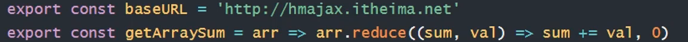

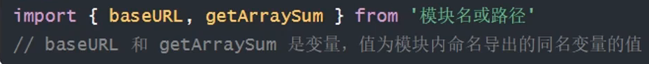

> 这样可以选择某个模块的特定内容进行导入导出


### 总结

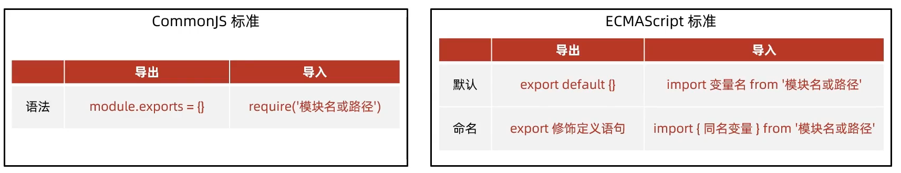

> 推荐：
>
> CommonJs标准一般应用在Node.js项目环境中
>
> ECMAScript标准一般应用在前端工程化项目中


## 包的概念

- 包 就是将**模块、代码、其他资料**聚合成的一个**文件夹**
- 分类
  - 项目包：主要用于编写项目和业务逻辑
  - 软件包：封装**工具和方法**进行使用
- 要求：
  - **根目录下，必须要有package.json文件(记录包的清单信息)**
- 注意：
  - 导入软件包的时候，引入的默认是index.js模块文件/配置json 文件中main属性指定的模块文件
  - 其中index.js文件就是该软件包的出口，因为它将所有模块内的方法工具导入到本模块再同时导出

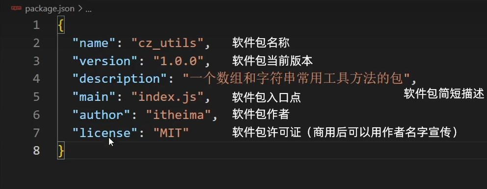


## npm-软件包管理器

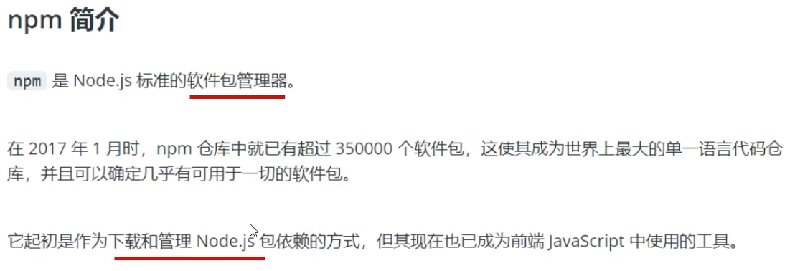

### npm的使用

1. 初始化清单文件：``npm init -y 用于得到package.json文件(该文件可以记录当前项目下载过的软件包)，有则略过该命令    y 的含义：yes的意思，在init的时候省去了敲回车的步骤，生成的默认的package.json``
2. 下载软件包： ``npm i 软件包名称``
3. 使用软件包

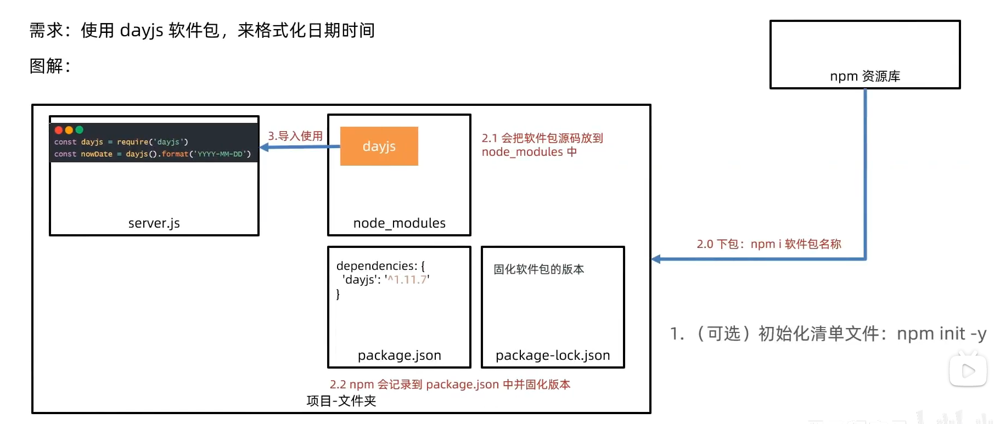

> 下载包之后，会自动生成package-lock.json这个文件作用是锁定当前包的版本，避免在项目过程中包的作者对包进行了更改导致项目错误
>
> 注意：
>
> 项目目录不允许存在中文或特殊符号路径，否则无法使用npm init -y命令


### 下载所有依赖

有时候我们从开源平台上clone项目到本地后，经常会发现没有项目相关的包，这是**因为自己使用npm下载依赖比磁盘传递拷贝要快得多**，因此作者只在项目里放入package-lock.json文件和package.json文件即可

- 语法：项目终端输入``npm i``

即可下载package.json中记录的所有软件包到当前项目了


### 全局软件包nodemon

首先认识什么是全局软件包，前面我们学习的npm下载包的类型实际上是本地软件包

- 软件包区别：
  - **本地软件包**：**当前项目**使用，**封装属性和方法**，存在于node_modules
  - **全局软件包**：**本机所有的项目**都可以使用，**封装命令和工具**，存在于系统设置的位置
- nodemon全局软件包的作用：代替node命令，监测代码更改，自动重启程序


### 删除软件包

- 语法
- ``npm uni 软件包名``
- uni即uninstall
- 删除全局软件包则在上面这条名加上参数-g即可


# Webpack

## 什么是Webpack

- 定义


- 静态模块：指的是编写代码过程中的，html，css，js，图片等固定内容的文件
- **打包**：把静态模块内容，压缩、整合、转译等(前端工程化)
  - 例如把less/sass转为css代码
  - 把ES6+降级为ES5
  - 支持多种模块标准语法


## Webpack的使用

1. 新建并初始化项目，编写业务逻辑代码
2. 下载webpack webpack-cli 到当前项目中(注意最好不要全局下载，可以实现版本独立)，并配置局部自定义命令
3. 运行打包命令，自 动生成disk分发目录(压缩和优化后的代码，用于最终运行的代码)

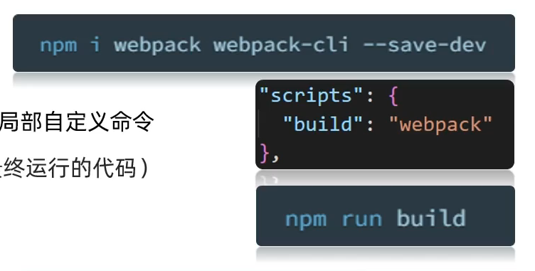


### 修改Webpack打包入口和出口

前面我们在Webpack的使用过程中可以注意到，Webpack的默认打包入口是src/index.js，出口是disk/main.js

查看官方文档[概念 | webpack 中文文档 | webpack 中文文档 | webpack 中文网 (webpackjs.com)](https://www.webpackjs.com/concepts/)

- 语法

```javascript
const path = require('path');

module.exports = {
  //入口
  entry: path.join(__dirname, 'src/login/index.js'),
  //出口
  output: {
    path: path.resolve(__dirname, 'dist'),
    filename: './login/index.js',
    clean: true//是否在打包时清除之前打包的输出
  },
};
```


### HtmlWebpackPlugin(Webpack自动生成HTML文件)

[HtmlWebpackPlugin](https://www.webpackjs.com/plugins/html-webpack-plugin/)

前面我们对JS代码进行打包后输出到disk目录下，那么我们自然需要将其应用在html页面上查看效果，可是每次都要将html文件复制到disk目录下很麻烦，因此我们需要HtmlWebpackPlugin插件

1. 安装``npm install --save-dev html-webpack-plugin``
2. 在Webpack配置文件中引入并设置相关配置
3. 重新打包查看效果


### Webpack打包CSS代码

- 由于Webpack默认只识别JS代码，因此为了css代码一起打包，我们需要使用到webpack的加载器loader

[css-loader](https://www.webpackjs.com/loaders/css-loader/):解析css代码

[style-loader](https://www.webpackjs.com/loaders/style-loader/):将css插入到DOM

- 使用步骤

1. 安装css-loader``npm install --save-dev css-loader``
2. 将你的css文件与webpack打包入口相关联``import css from "file.css";``
3. 配置webpack参数(查看文档)


### 提取css代码为单独文件

上一小节所学的css-loader会将我们的css代码存储在JS模块中，实际开发中，我们并不希望如此

因为：单独的css文件可以被浏览器缓存，减少js文件体积，加速网页显示速度

[MiniCssExtractPlugin](https://www.webpackjs.com/plugins/mini-css-extract-plugin/)：提取css代码

- 使用步骤

1. 下载``npm install --save-dev mini-css-extract-plugin``
2. 配置参数
3. 重新打包

> 注意：mini-css-extract-plugin不能与style-loader一起使用


### 优化单独CSS文件

经过上一小节的实验，发现将css样式单独提取为一个css文件后其实它并没有经过压缩的

解决办法：[CssMinimizerWebpackPlugin](https://www.webpackjs.com/plugins/css-minimizer-webpack-plugin/)

- 使用步骤：

1. 安装``npm install css-minimizer-webpack-plugin --save-dev``
2. 配置参数(看文档)
3. 重新打包


### 打包less代码

[less-loader](https://www.webpackjs.com/loaders/less-loader/)：使得Webpack支持将less代码编译为css代码

使用步骤：

1. 安装less和less-loader(less-loader需要less支持)``npm install less less-loader --save-dev``
2. 将less文件引入到index.js入口中
3. 配置参数(看文档)
4. 重新打包


### 打包图片

[资源模块 ](https://www.webpackjs.com/guides/asset-modules/)：Webpack5内置资源模块(字体、图片等)，无需额外下载loader

使用步骤：

1. 将本地图片引入到入口文件index.js中，如果是网络资源文件直接写上字符串即可


2. 配置webpack.config.js即可
   - 占位符[hash]对模块内容做算法设计，得到映射的数字字母组合的字符串，即一个文件名hash一个字符串
   - 占位符[ext]使用当前模块原本的占位符，例如：.png/.jpg等字符串
   - 占位符[query]保留引入文件时代码的查询参数(只有URL生效)

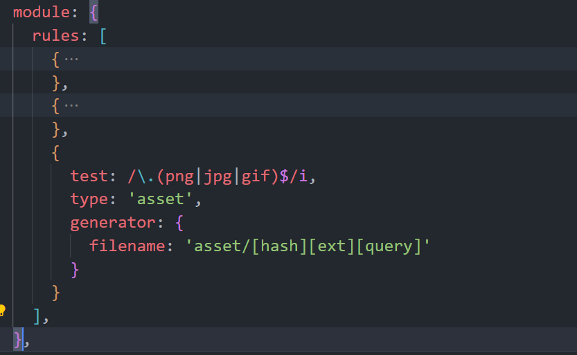

> 注意：这里使用type:'asset'后webpack会自动判断文件的打包格式
>
> - 大于8KB文件，发送一个单独的文件并且导出URL地址
> - 小于8KB文件，导出一个data URI(base64字符串)
>
> 这是因为大文件如果被导出为dataURI的话体积会变大


### 搭建开发环境

问题：每次修改源代码，都需要手动输入命令重新打包

[开发环境](https://www.webpackjs.com/guides/development/#using-webpack-dev-server)：配置webpack-dev-server快速开发应用程序

作用：启动Web服务，自动检测代码变化，热更新到网页中

**注意**：dist目录和打包内容是在内存中(更新快)

步骤：

1. 下载包``npm install --save-dev webpack-dev-server``
2. 设置打包模式为开发模式，并配置自定义命令
3. 启动web服务即可

> 注意：
>
> - webpack-dev-server借助http模块创建8080默认web服务
> - 默认以public目录作为服务器根目录
> - webpack-dev-server根据配置，打包相关代码在内存当中，并且以output.path的值作为服务器根目录


### 两种打包模式

打包模式：告知Webpack使用相应模式的内置优化

分类：


设置方式：

- 方式1：在webpack.config.js中配置文件设置mode选项
- 方式2：在package.json命令行设置mode参数(一般设置build命令为生产模式，dev命令为开发模式)

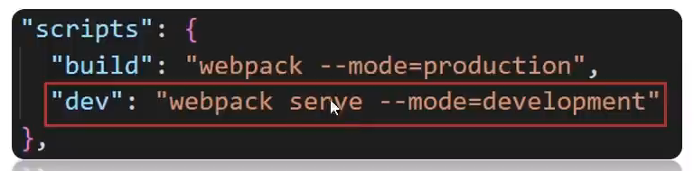

> 需要注意的是：如果两种方式同时使用，那么会优先使用命令行设置的参数	，因此推荐使用命令行设置


#### 打包模式的应用

需求：在开发模式下使用style-loader内嵌JS代码使得测试页面渲染更快，在生产模式下提取CSS为单独文件，减少js文件体积，用户网页加载更快

[方案1](https://www.webpackjs.com/configuration/mode)：将webpack.config.js配置导出作为函数，但是局限性大(只接受两种模式)

方案2：借助cross-env(跨平台通用)包命令，设置参数区分环境

​	使用步骤：

  		1. 下载cross-env包``npm i cross-env --save-dev``
  		2. 配置自定义命令，传入参数和值(会绑定到**process.env对象**下)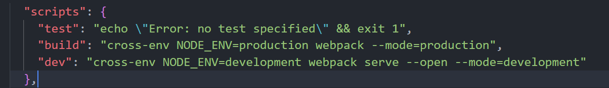
  		3. 在webpack.config.js区分不同环境使用不同配置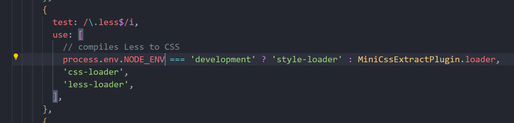
  		4. 重新打包


[方案3](https://webpack.docschina.org/guides/production/#setup)：配置不同的webpack.config.js(适用于在不同环境下配置差异较大的情况)


### 前端-注入环境变量

需求：前端项目中，希望开发模式下打印语句生效，生产模式下打印语句失效

方法步骤：

1. 插入webpack内置插件[DefinePlugin](https://www.webpackjs.com/plugins/define-plugin/)
2. 传入自己想要的环境变量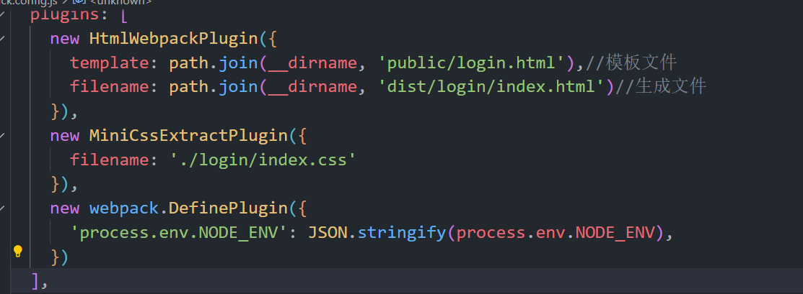
3. 使用环境变量进行判断执行不同的代码即可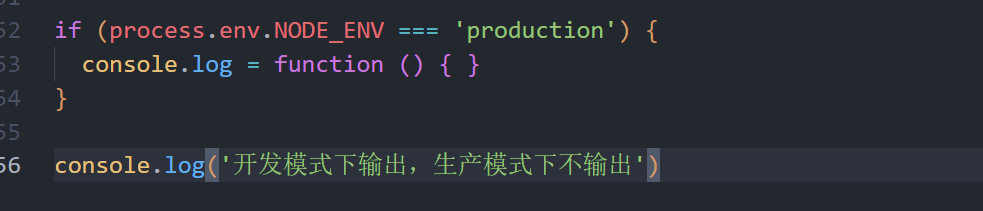


### 开发环境调错-source map

问题：代码被压缩和混淆，无法正确定位源代码的位置(行数和列数)

[source map](https://webpack.docschina.org/guides/development/#using-source-maps)：可以准确追踪error和warning在原始代码的位置

推荐设置：webpack.config.js配置devtool选项

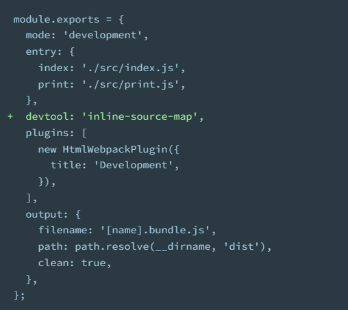

inline-source-map选项：把源码的位置信息一起打包在 js 文件内

> 注意：source map 仅适用于开发环境，不要在生产环境使用（防止被轻易查看源码位置）
>
> 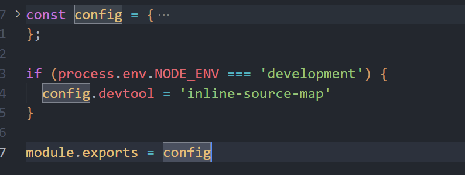


### 解析别名alias

[解析别名](https://webpack.docschina.org/configuration/resolve#resolvealias)：在Nodejs中我们常使用绝对路径，但是绝对路径一般比较冗长

解决：在webpack.config.js中配置解析别名@来代表绝对路径

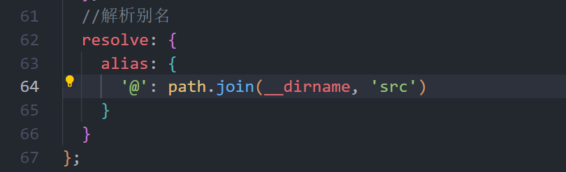

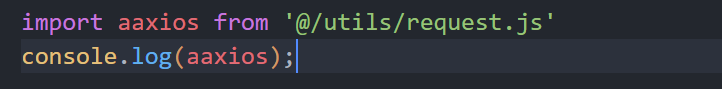


### 优化-CDN使用

首先了解什么是CDN

CDN定义：内容分发网络，指的是一组分布在各个地区的服务器

作用：将静态资源文件/第三方库放在CDN网络中各个服务器中，供用户就近请求获取

**好处：减轻自己服务器请求压力，且就近请求物理延迟低，配套缓存策略**


**需求：开发模式中使用本地第三方库，生产模式下使用CDN加载**

步骤：

1. 在html中引入第三方库的CDN地址并且使用模板语法判断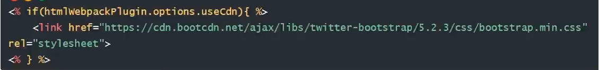自定义属性useCdn用于判断是否使用cdn
2. 配置webpack.config.js中external外部扩展选项(即避免某些import的包被打包)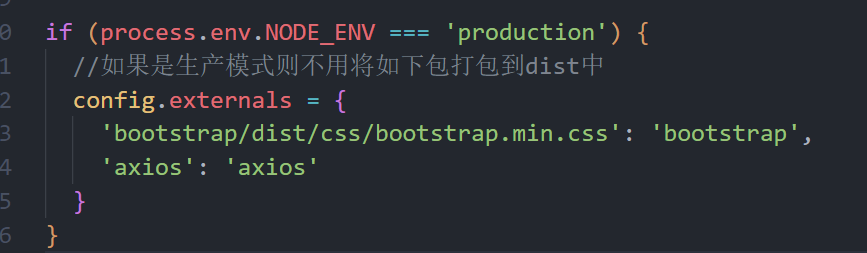
3. 重新打包即可


### 多页面打包

单页面：单个html文件，切换DOM的方式实现不同业务逻辑展示，后续会学到

多页面：多个html文件，切换页面实现不同业务逻辑展示

步骤：

1. 准备源码(html,css,js)放到src对应文件夹中，并改用模块化语法进行导入导出
2. 配置webpack.config.js多入口和多页面设置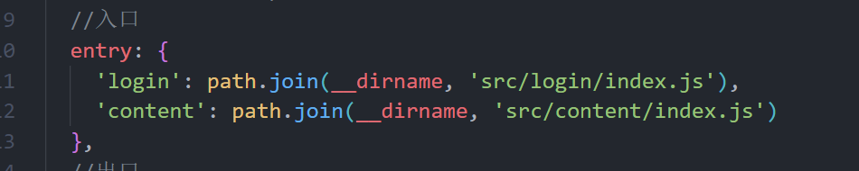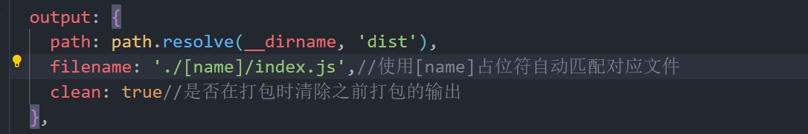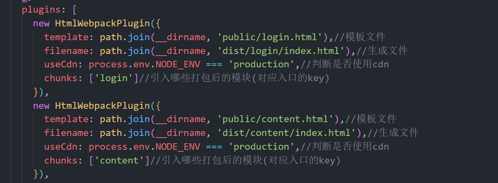涉及页面文件的参数都需要进行更改
3. 重新打包

> 注意最好配置打包出口dist的目录结构与src文件夹一致，这样方便页面跳转


### 优化-分割公共代码

实际上，在多页面的开发中，经常出现多个页面引用同一段代码的情况

而webpack也会因此在每个页面打包的时候分别重复打包，我们希望将这些公共的代码提取出来

[SplitChunksPlugin](https://www.webpackjs.com/plugins/split-chunks-plugin/#root)：配置webpack.config.js中的splitChunks分割功能

```javascript
    splitChunks: {
      chunks: 'all', // 所有模块动态非动态移入的都分割分析
      cacheGroups: { // 分隔组
        commons: { // 抽取公共模块
          minSize: 0, // 抽取的chunk最小大小字节
          minChunks: 2, // 最小引用数
          reuseExistingChunk: true, // 当前 chunk 包含已从主 bundle 中拆分出的模块，则它将被重用
          name(module, chunks, cacheGroupKey) { // 分离出模块文件名
            const allChunksNames = chunks.map((item) => item.name).join('~') // 模块名1~模块名2
            return `./js/${allChunksNames}` // 输出到 dist 目录下位置
          }
        }
      }
    }
```


# Git

## 了解Git

- 一个免费开源、分布式的代码版本控制系统，帮助开发团队维护代码
- 作用：记录代码内容，切换代码版本，多人开发时高效合并代码内容

## 使用Git

### Git仓库

- Git仓库：是记录文件状态内容的地方，存储着修改的历史记录
- 创建：

1. 把当前本地文件夹转换为Git仓库：命令git init
2. 从其他服务器上克隆Git仓库


### Git的三个区域

Git使用时：

- 工作区：实际开发时操作的文件夹
- 暂存区：保存之前的准备区域(暂存改动过的文件)
  - 版本库：提交并保存暂存区中的内容，产生一个版本快照


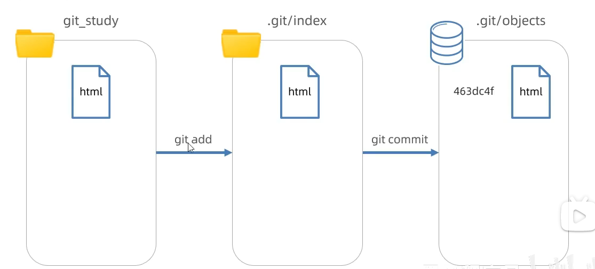


### Git文件状态

- Git文件2种状态：
  - 未跟踪：新文件，从未被Git管理过
  - 已跟踪：Git已经知道和管理的文件
- 使用：修改文件，暂存，提交保存记录，如此往复


### 暂存区的使用

- 暂存区：起到一个临时存储的功能，可以临时恢复代码内容，与版本库解耦
- 如果没有暂存区，那么一直commit，版本也就变得很多
- 命令：
  - 暂存区覆盖工作区：``git restore 目标文件``(注意：完全确认覆盖时使用)
  - 从暂存区移除文件：``git rm --cached 目标文件``


### Git回退版本

- 概念：把版本库某个版本对应的内容快照，恢复到工作区/暂存区
- 命令：
  - 查看提交历史：``git log --oneline``或``git reflog --oneline``
  - 回退命令：
    - ``git reset --soft 版本号``
    - ``git reset --hard 版本号``
    - ``git reset --mixed 版本号(默认)``
- 注意：
  - 只有记录在版本库的提交记录才能恢复
  - 回退后，继续修改->暂存->提交操作即可(还是在原先版本的后面新增新的版本)

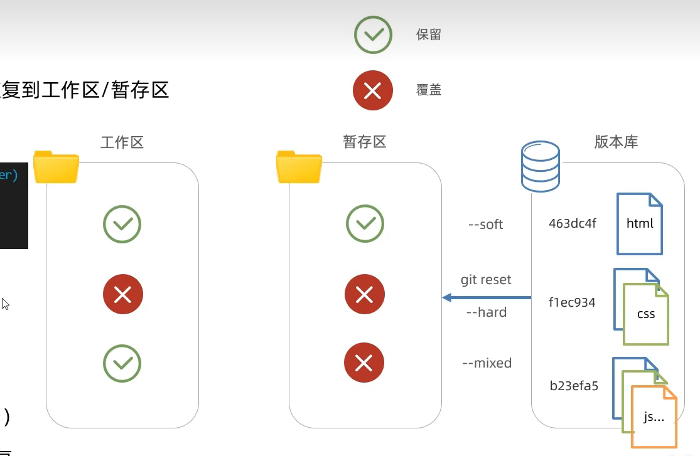


### 删除文件

1. 手动删除工作区文件
2. 暂存变更/手动删除暂存区文件造成变更
3. 提交保存


### 忽略文件

- 概念：.gitignore文件可以让git彻底忽略跟踪指定文件
- 目的：让git仓库更小更快，避免重复无意义的文件管理
- 例如
  - 系统或软件自动生成的文件
  - 编译产生的结果文件
  - 运行时生成的日志文件，缓存文件，临时文件等
  - 涉密文件，密码，秘钥等文件
- 步骤：
  1. 项目根目录新建.gitignore文件
  2. 填入相关配置

> 注意：如果文件已经被暂存区跟踪过了，可以从暂存区中移除即可

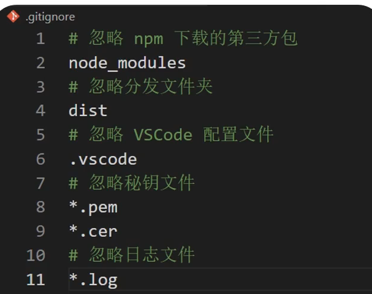


### 分支

- 概念：本质是指向提交结点的可变指针，默认名字是master/main
- 注意：HEAD指针影响工作区/暂存区的代码状态 

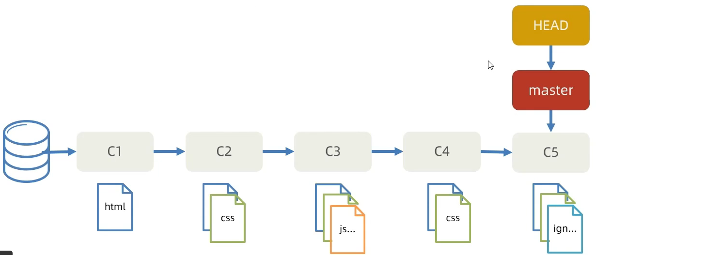

- 命令：
  - 创建分支：``git branch 分支名``
  - 切换分支：``git checkout 分支名``


#### 分支的合并与删除

- 步骤：
  1. 切回到要合入的分支上：``git checkout master``
  2. 合并其他分支过来：``git merge 其他分支名``
  3. 删除合并后的分支指针：``git branch -d 其他分支名``

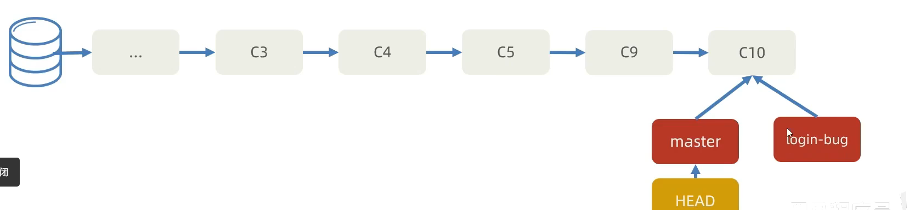


#### 合并与提交

- 合并提交：在原分支产生了新的提交记录后，再合并回去时发生，自动使用多个快照记录合并后产生一次新的提交
- 步骤：
  1. 切回到要合入的分支上：``git checkout master``
  2. 合并其他分支过来：``git merge 其他分支名``
  3. 删除合并后的分支：``git branch -d 其他分支名``


> 注意：
>
> 提交记录的顺序按照产生的先后顺序排列，而非合并的顺序

#### 应用

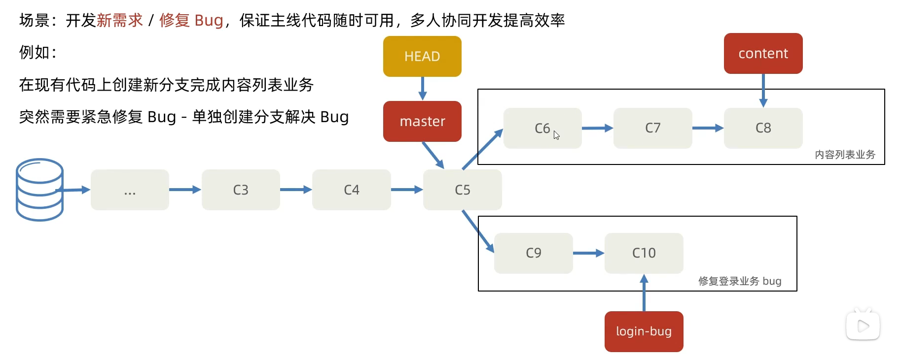

#### 合并冲突

- 概念：不同分支中，对同一个文件的同一部分修改，Git无法判断你要使用哪个版本，因此产生合并冲突
- 解决
  1. 打开VSCode找到冲突文件并手动解决
  2. 解决后需要提交一次记录


### 常用命令总结

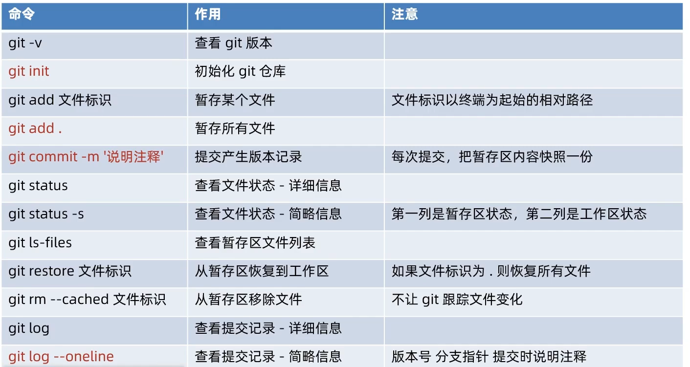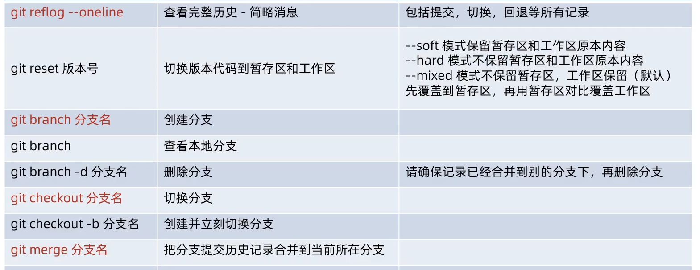


## Git远程仓库

- 概念：托管在因特网或其他网络中的你的项目的版本库
- 作用：保存版本库的历史记录，多人协作
- 创建：公司自己的服务器/第三方托管平台(Gitee,GitLab,GitHub)


### 使用Git远程仓库

- 步骤：
  1. 注册第三方托管平台网站账号
  2. 新建仓库得到仓库地址
  3. 本地仓库添加远程仓库地址
  4. 本地推送版本记录到远程仓库
- 命令
  - 本地添加远程仓库``git remote add 远程仓库别名 远程仓库地址``
  - 本地推送版本记录到远程仓库``git push -u 远程仓库别名 本地分支名:远程分支名``（-u参数将设置远程仓库的默认分支）


### 克隆

- 拷贝一个Git仓库到本地，进行使用
- 命令：``git clone 远程仓库地址``
- 效果：在运行命令所在文件夹，生成work项目文件夹(包含版本库，并映射到暂存区和工作区)
- 注意：
  - Git本地仓库clone后即建立好与远程仓库的链接
  - 仓库公开可以随意克隆，但是推送需要身为仓库团队成员


### 拉取

- 命令``git pull origin 远程分支名:本地分支名``等价于
- ``git fetch origin master:master(获取远程分支记录到本地，未合并)`` ``git merge origin/master(把远程分支记录合并到当前master分支下)``

> 建议个人在每次提交commit之前先pull一下避免自己推送的代码将其他人推送的代码覆盖了


### 命令总结

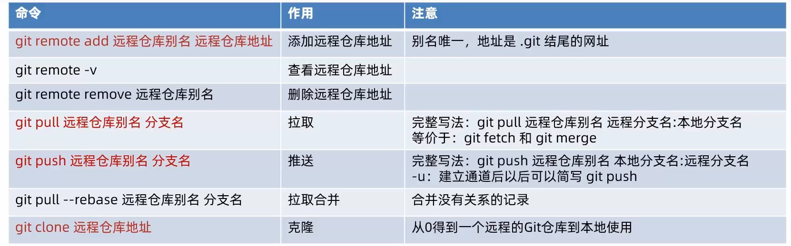


## 问题

### error: failed to push some refs to如何解决

[参考资料](https://blog.csdn.net/qq_45893999/article/details/106273214)

**原因：**我们在创建仓库的时候，都会勾选“使用Reamdme文件初始化这个于是我们的仓库就有了README.m和.gitignore文件，然后我们把本地项目关联到这个仓库，并把项目推送到仓库时，我们在关联本地与远程时，两端都是有内容的，但是这两份内容并没有联系，当我们推送到远程或者从远程拉取内容时，都会有没有被跟踪的内容，于是你看git报的详细错误中总是会让你先拉取再推送，但是拉取总是失败。
**解决：**``git pull --rebase origin master``拉取再重新push即可

 