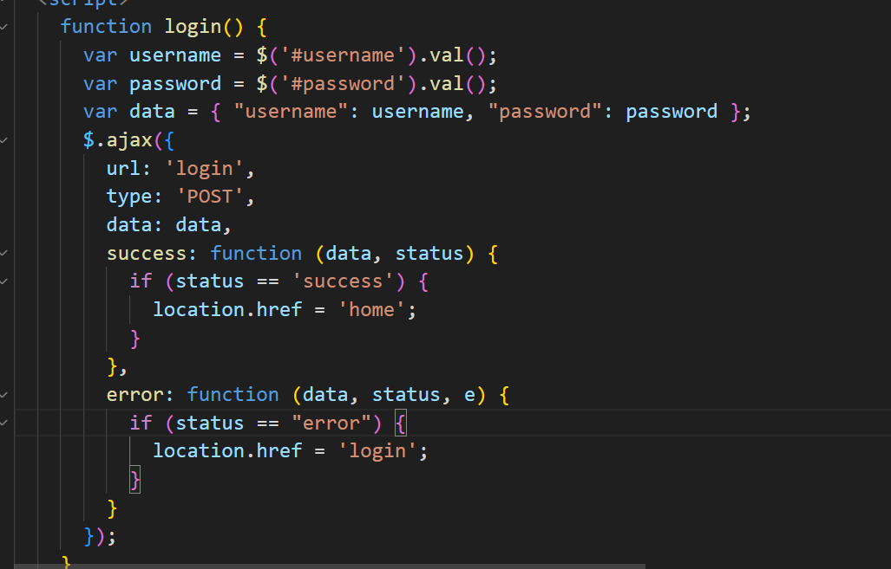

# Node.js入门

## 什么是Node.js

- 概念：Node.js是一个跨平台JavaScript运行环境，使得开发者可以搭建服务器端的JavaScript应用程序
  - 简单来说就是执行在服务端的JavaScript
- 作用：使用Node.js编写服务器端程序
  - 编写数据接口，提供网页资源浏览功能

## Node.js为何能执行JS

首先，浏览器能够执行JS代码，依靠的是浏览器内核中的**V8引擎**(C++程序)

其次，Node.js基于ChromeV8引擎进行封装(运行环境)，即简单理解为Node.js将V8引擎从浏览器中拿了出来

**区别：浏览器与Node.js都支持ECMAScript标准语法，但Node.js有自己独立的API，没有DOM和BOM等**


## 使用Node.js

### fs模块-读写文件

- 模块：类似插件，封装了方法和属性(python中模块的概念)
- fs模块：封装了与本机文件系统进行交互的方法和属性
- 语法：
  1. 加载fs模块对象``const fs = require('fs')``
  2. 创建并写入文件内容``fs.writeFile('文件路径', '写入内容' , err=>{写入后的回调函数})``
  3. 读取文件内容``fs.readFile('文件路径', (err,data)=>{读取后的回调函数})``

> 注意这里readFile读取后的回调函数中的data得到的是文件内容的Buffer数据流，即计算机中16进制的存储信息，如果需要显示原本的内容可以调用data.toString()方法


### path模块-路径处理

- 问题：

因为在Nodejs环境的代码中，js代码不再依靠html文件，而是可以直接使用终端进行执行

因此==代码的相对路径值以终端中的路径为起点，而不再是原先的VsCode资源管理器==，因此容易导致目标文件找不到的错误

- 建议：在Node.js代码中的路径，都使用**绝对路径**
- 补充：**__dirname**内置变量(获取当前模块目录-绝对路径)
- 注意：==path.join()会检测当前适用于本平台的分隔符，作为定界符，将所有的路径片段连接在一起==
- 语法：

1. 加载path模块 ``const path = require('path')``
2. 使用path.join()方法，拼接路径``path.join('路径1', '路径2', ...)``


### http模块-创建Web服务

- 语法：

1. 加载http模块，创建web服务对象
2. 监听request请求事件，设置响应头和响应体
3. 配置该服务的端口号同时开始监听(启动web服务)
4. 浏览器请求http:localhost:3000测试

```javascript
const http = require('http')
const server = http.createServer()

//监听请求事件
server.on('request', (ret, res) => {
  res.setHeader('Content-Type', 'text/plain;charset=utf-8')
  res.end('欢迎使用Nodejs与http模块创建的web服务')
})

//配置端口号并开始监听
server.listen(3000, () => {
  console.log('开始监听');
})
```


## NodeJs使用过程中遇到的问题与解答

> path模块下的resolve与join路径拼接有何不同
>
> [path.resolve 与 path.join 的区别 - 知乎 (zhihu.com)](https://zhuanlan.zhihu.com/p/269536704#:~:text=%E6%80%BB%E7%BB%93%E4%B8%8B%E6%9D%A5%E5%B0%B1%E6%98%AF%EF%BC%9A%201%EF%BC%8C%E4%B8%A4%E8%80%85%E8%8E%B7%E5%8F%96%E7%9A%84%E8%B7%AF%E5%BE%84%E7%9B%B8%E5%AF%B9%E6%80%A7%E4%B8%8D%E4%B8%80%E6%A0%B7%EF%BC%9A%EF%BC%88%E7%AC%AC%E4%B8%80%E7%BB%84%EF%BC%8C%E7%AC%AC%E4%BA%8C%E7%BB%84%EF%BC%89%20join%20%E8%8E%B7%E5%8F%96%E7%9A%84%E6%98%AF%E6%A0%87%E5%87%86%E5%8C%96%E7%9A%84%E7%9B%B8%E5%AF%B9%E8%B7%AF%E5%BE%84%20resolve%20%E8%8E%B7%E5%8F%96%E7%9A%84%E6%98%AF%E7%BB%9D%E5%AF%B9%E8%B7%AF%E5%BE%84%202%EF%BC%8C%E5%A4%84%E7%90%86,%27%2F%27%20%E7%9A%84%E6%96%B9%E5%BC%8F%E4%B8%8D%E4%B8%80%E6%A0%B7%20%E5%AF%B9%E4%BA%8E%20join%20%EF%BC%8C%E5%B8%A6%E4%B8%8D%E5%B8%A6%20%2F%20%E5%A4%84%E7%90%86%E6%96%B9%E5%BC%8F%E9%83%BD%E6%98%AF%E4%B8%80%E6%A0%B7%EF%BC%9A%E7%9B%B4%E6%8E%A5%E6%8B%BC%E6%8E%A5%EF%BC%88%E7%AC%AC%E4%B8%89%E7%BB%84%EF%BC%8C%E7%AC%AC%E5%9B%9B%E7%BB%84%EF%BC%89)
>
> - 两者区别：
>
> **注： 当前工作目录为 /home/myself/node**
>
> 1、**join是把各个path片段连接在一起， resolve把‘／’当成根目录**
>
> path.join('/a', '/b') // Outputs '/a/b'
> path.resolve('/a', '/b') // Outputs '/b'
>
> 2、**join直接拼接字段，resolve解析路径并返回**
>
> path.join("a", "b1", "..", "b2")
>
> console打印会得到"a/b2"
>
> path.resolve("a", "b1", "..", "b2")
>
> console打印得到"/home/myself/node/a/b2"


## Nodejs入门

### 进程管理

**process**是一个**全局内置对象**，可以在代码中的任何位置访问此对象，这个对象代表我们的node.js代码宿主的操作系统**进程**对象。

使用process对象可以截获进程的异常、退出等事件，也可以获取进程的当前目录、环境变量、内存占用等信息，还可以执行进程退出、工作目录切换等操作。


#### cwd函数

cwd即curent work dir当前工作目录，用于查看当前应用程序的工作目录，使用语法如下：

```js
process.cwd();
```


#### chdir函数

如果需要改变应用程序目录，就要使用chdir函数了，它的用法如下：

```js
process.chdir("目录");
```


#### stdout

stdout是标准输出流，用于将内容打印到输出设备上，``console.log()``就是对他的封装

```js
console.log = function(d){
    process.stdout.write(d+'\n');
}
```


#### stderr

stderr是标准错误流，和stdout的作用差不多，不同的是它是用来打印错误信息的，我们可以通过它来捕获错误信息，基本使用方法如下：

```js
process.stderr.write(输入内容);
```


#### stdin

stdin是进程输入流，我们可以通过注册事件的方式来获取输入的内容，如下：

```js
process.stdin.on('readable', function() {
  var chunk = process.stdin.read();
  if (chunk !== null) {
    process.stdout.write('data: ' + chunk);
  }
});
```

示例中的chunk就是输入流中的内容。


#### exit函数

exit函数用于杀死进程，退出程序，示例如下：

```js
process.exit(code);
```

参数code为退出后返回的代码，如果省略则默认返回0；


#### 监听进程事件

使用``process.on()``方法进行监听进程事件

- exit事件

当进程要退出之前，会触发**exit**事件。通过监听*exit*事件，我们可就以在进程退出前进行一些清理工作：

```js
process.on('exit',function(){
	console.log('I am tired...')
})
var tick = Date.now()
console.log(tick)
process.exit()
```

- uncaughtException事件

如果进程发生了未捕捉的异常，会触发**uncaughtException**事件。通过监听这个事件，你可以 让进程优雅的退出：

```js
process.on('uncaughtException',function(err){
	console.log('err：',err)
})
throw new Error('我是故意的嘻嘻')
```


#### 编码设置

在我们的输入输出的内容中有中文的时候，可能会乱码的问题，这是因为编码不同造成的，所以在这种情况下需要为流设置编码，如下示例：

```js
process.stdin.setEncoding(编码);
process.stdout.setEncoding(编码);
process.stderr.setEncoding(编码);
```


## 文件IO

在开发中，我们经常需要对文件进行操作，nodejs提供了一个名为``fs``的模块来支持操作文件


### 写入文件

fs模块提供writeFile函数，可以**异步的**将数据写入一个文件, **如果文件已经存在则会被替换**。用法如下：

例：fs.writeFile(filename, data, callback)

```js
var fs= require("fs");
 
fs.writeFile('test.txt', 'Hello Node', function (err) {
   if (err) throw err;
   console.log('Saved successfully'); //文件被保存
});
 
```

数据参数可以是string或者是Buffer,编码格式参数可选，默认为"utf8"，回调函数只有一个参数err。


### 追加写入

fs模块提供了另外一个函数``appendFile``允许我们对文件内容进行追加而非覆盖，如果文件不存在则会自动创建新的文件，同样的，该函数也是**异步的**

例：fs.appendFile(文件名,数据,编码,回调函数(err));

```js
var fs= require("fs");
 
fs.appendFile('test.txt', 'data to append', function (err) {
   if (err) throw err;
 
    //数据被添加到文件的尾部
    console.log('The "data to append" was appended to file!'); 
});
```

编码格式默认为"utf8"，


### exists函数

该函数用于检查一个文件是否存在

例：fs.exists(文件，回调函数(exists));

exists的回调函数只有一个参数，类型为布尔型，通过它来表示文件是否存在。

```js
var fs= require("fs");
 
fs.exists('/etc/passwd', function (exists) {
  console.log(exists ? "存在" : "不存在!");
});
```


### rename函数

``rename``函数允许我们重命名一个文件

```js
var fs= require("fs");
 
fs.rename(旧文件名，新文件名，回调函数(err){
   if (err) throw err;
   console.log('Successful modification,');
});
```

注意：这里的参数``旧文件名，新文件名``可以是``oldPath,newPath``，也就是说，我们可以利用rename实现文件移动

```js
var fs = require('fs');
 
fs.rename(oldPath,newPath,function (err) {
   if (err) throw err;
   console.log('renamed complete');
});
```


### 读取文件

例：fs.readFile(文件,编码,回调函数);

```js
const fs = require('fs')

fs.readFile('/etc/test1.txt','utf8',function(err,data){
	if(err)throw err
    console.log('读取到：',data)
})
```

回调函数里面的data,就是读取的文件内容。


### unlink函数

``unlink``函数用于删除文件，该函数是**异步的**

例：fs.unlink(文件,回调函数(err));

```js
var fs = require('fs');
 
fs.unlink(文件, function(err) {
  if (err) throw err;
  console.log('successfully deleted');
});
```


### mkdir函数

mkdir函数用于创建一个目录

```js
fs.mkdir(路径，权限，回调函数(err));
参数

路径：新创建的目录。
权限：可选参数，只在linux下有效，表示目录的权限，默认为0777，表示文件所有者、文件所有者所在的组的用户、所有用户，都有权限进行读、写、执行的操作。
回调函数：当发生错误时，错误信息会传递给回调函数的err参数。
```

```js
const fs = require('fs')

fs.mkdir('/myDir',function(err){
	if(err) throw err
    console.log('目录创建成功')
})
```


### rmdir函数

删除目录使用``rmdir``

rmdir函数可以删除指定的目录：

例：fs.rmdir(路径，回调函数(err));

```js
const fs = require('fs')

fs.rmdir('/myDir',function(err){
	if(err) throw err
    console.log('目录删除成功')
})
```


### readdir

readdir函数可以读取到指定目录下所有的文件，示例如下：

```js
const fs = require('fs')

fs.readdir('/',function(err,files) {
	if(err) throw err
    console.log('所有文件:',files)
})

```

回调函数 (callback) 接受两个参数 (err, files) 其中 files 是一个存储目录中所包含的文件名称的数组，数组中不包括 '.' 和 '..'


## URL处理

node.js为互联网而生，和url打交道是无法避免的了，**url模块**提供一些基础的url处理


### 解析URL-parse函数

parse函数用于解析URL，并返回一个JSON格式的数组

```js
const url  = require('url')

console.log(url.parse('https://www.baidu.com'))
```

```js
{
  protocol: 'https:',
  slashes: true,
  auth: null,
  host: 'www.baidu.com',
  port: null,
  hostname: 'www.baidu.com',
  hash: null,
  search: null,
  query: null,
  pathname: '/',
  path: '/',
  href: 'https://www.baidu.com/' 
}
```

- 第二个参数

parse函数的第二个参数是布尔类型，当参数为true时，会将**查询条件**也解析成json格式的对象。

```js
const url  = require('url')

console.log(url.parse('http://www.baidu.com?page=1',false))
console.log(url.parse('http://www.baidu.com?page=1',true))

//返回值
 { protocol: 'http:',
  slashes: true,
  auth: null,
  host: 'www.baidu.com',
  port: null,
  hostname: 'www.baidu.com',
  hash: null,
  search: '?page=1',
  query: 'page=1',
  pathname: '/',
  path: '/?page=1',
  href: 'http://www.baidu.com/?page=1' }
 
{ protocol: 'http:',
  slashes: true,
  auth: null,
  host: 'www.baidu.com',
  port: null,
  hostname: 'www.baidu.com',
  hash: null,
  search: '?page=1',
  query: { page: '1' },
  pathname: '/',
  path: '/?page=1',
  href: 'http://www.baidu.com/?page=1' }
```

可以看到query字段返回值格式的不同


- 第三个参数

parse函数的第三个参数也是布尔类型的，当参数为true，解析时会将url的"//"和第一个"/"之间的部分解析为主机名，示例如下：

```js
var url = require('url');
url.parse('http://www.baidu.com/news',false,true);
```

经过测试，发现不传第三个参数/传值为false都可以得到host字段值


### format函数

format函数与parse函数作用相反，它的参数是一个json对象，返回值是一个组装的URL

```js
const url  = require('url')

console.log(url.format({
	protocol:'https',
  	hostname:'www.baidu.com',
  	port:'8080',
  	pathname:'/news',
  	query:{page:1}
}))
// 返回值
> https://www.baidu.com:8080/news?page=1
```


### resolve函数

该函数的参数是两个路径，第一个参数是当前路径或开始路径，第二个则是想要去往的路径，返回一个组装好的url

```js
const url  = require('url')

console.log(url.resolve('http://www.baidu.com/','http://www.baidu.com/one'))
console.log(url.resolve('http://www.baidu.com/one','http://www.baidu.com/two'))

// 返回值
> http://www.baidu.com/one
> http://www.baidu.com/two
```


## path优化

path模块包含一套用于处理和转换文件路径的工具集,用于处理目录的对象，提高用户开发效率


### normalize函数

normalize函数将不符合规范的路径经过格式化转换为标准路径,解析路径中的.与..外，还能去掉多余的斜杠。

```js
const path = require('path')

console.log(path.normalize('./path///mydir/./'))
// 结果
path/mydir
```


### join函数

join函数将传入的多个路径拼接为标准路径并进行格式化，返回规范的路径，避免手工拼接路径字符串的繁琐. 如下示例：

```js
const path = require('path')

console.log(path.join('///you','/are','./beautiful'))
// 打印
/you/are/beautiful
```


### dirname函数

该函数用于返回路径中的目录名

```js
const path = require('path')

console.log(path.dirname('/foo/dir/test.txt'))
// 打印
/foo/dir
```


### basename函数

basename函数用于返回路径中的最后一部分，并且可以进行条件排除

```js
例1：path.basename('路径字符串');

例2：path.basename('路径字符串', '[ext]')<排除[ext]后缀字符串>;

const path = require('path')

console.log(path.basename('/foo/mydir/index.html'))
console.log(path.basename('/foo/mydir/index.html','.html'))
// 打印
index.html
index
```


### extname函数

extname函数用于返回路径中文件的扩展名，以最后一个'.'开始,返回'.'以及'.'以后的所有字符串,如没有'.',则返回空字符串). 如下示例：

```js
const path = require('path')

console.log(path.extname('index.html'))
// 打印
.html
```


## 字符串转换

```Query String``模块用于实现**URL参数字符串与参数对象之间的互相转换**，提供了"stringify"、"parse"等一些实用函数来针对字符串进行处理，通过序列化和反序列化，来更好的应对实际开发中的条件需求，对于逻辑的处理也提供了很好的帮助


### stringify函数

该函数用于序列化对象，即将对象转换为一个字符串（默认分隔符``&``默认分配符``=``）

```js
const querystring  = require('querystring')

console.log(querystring.stringify({
	get:['fire','ice'],
  	want:'go'
}))
// 打印
> get=fire&get=ice&want=go
```

> 该函数拥有第二个参数与第三个参数分别用于指定需要使用的分隔符与分配符的
>
> ```js
> querystring.stringify("对象"，"分隔符"，"分配符")
>
> const querystring  = require('querystring')
>
> console.log(querystring.stringify({
> 	get:['fire','ice'],
>   	want:'go'
> },'@','#'))
> // 打印
> > get#fire@get#ice@want#go
> ```


### parse函数

与stringify函数相反，反序列化函数parse用于将字符串转换为对象（默认分隔符``&``默认分配符``=``）

```js
const querystring  = require('querystring')

console.log(querystring.parse('get=fire&get=ice&want=go'))
// 打印
> { get: [ 'fire', 'ice' ], want: 'go' }

```

同理，parse的第二个参数与第三个参数也是用于指定想要的分隔符与分配符的


## 实用工具

util模块呢，是一个Node.js核心模块，提供常用函数的集合，用于弥补核心JavaScript的一些功能过于精简的不足。并且还提供了一系列常用工具，用来对数据的输出和验证。


### inspect函数

``util.inspect(object,[showHidden],[depth],[colors])``是一个将任意对象转换为字符串的函数，通常用于调试和错误输出。它至少接受一个参数object，即要转换的对象,我们来学习它的简单用法。使用语法如下：

```js
var util = require('util');
var result = util.inspect(object);
console.log(result);
```


### format函数

format函数根据第一个参数，返回一个格式化字符串，第一个参数是一个可包含零个或多个占位符的字符串。每一个占位符被替换为与其对应的转换后的值，支持的占位符有："%s(字符串)"、"%d(数字<整型和浮点型>)"、"%j(JSON)"、"%(单独一个百分号则不作为一个参数)"。(类似c语言的printf)

```js
1：如果占位符没有相对应的参数，占位符将不会被替换.如示例：

var util = require('util');
var result = util.format('%s:%s', 'foo');
console.log(result);
运行结果：
'foo:%s'

2：如果有多个参数占位符，额外的参数将会调用util.inspect()转换为字符串。这些字符串被连接在一起，并且以空格分隔。如示例：

var util = require('util');
var result = util.format('%s:%s', 'foo', 'bar', 'baz');
console.log(result);
运行结果：
'foo:bar baz'

3：如果第一个参数是一个非格式化字符串，则会把所有的参数转成字符串并以空格隔开拼接在一块，而且返回该字符串。如示例：

var util = require('util');
var result = util.format(1, 2, 3);
console.log(result);
运行结果：
'1 2 3'
```


### isArray函数

isArray函数可以判断对象是否为数组类型，是则返回ture,否则为false。语法如下：

```js
var util = require('util');
var result = util.isArray(object);
console.log(result);
```


### isDate函数

isDate函数可以判断对象是否为日期类型，是则返回ture,否则返回false。语法如下：

```js
var util = require('util');
var result = util.isDate(object);
console.log(result);
```


### isRegExp函数

isRegExp函数可以判断对象是否为正则类型，是则返回ture,否则返回false。语法如下：

```js
var util = require('util');
var result = util.isRegExp(object);
console.log(result);
```


## 子进程

众所周知node.js是基于单线程模型架构，这样的设计可以带来高效的CPU利用率，但是无法却利用多个核心的CPU，为了解决这个问题，node.js提供了child_process模块，通过多进程来实现对多核CPU的利用. child_process模块提供了四个创建子进程的函数，分别是spawn，exec，execFile和fork。


### spawn函数

spawn函数用给定的命令发布一个子进程，只能运行指定的程序，参数需要在列表中给出。如下示例：

```js
var child_process = require('child_process');
var child = child_process.spawn( command );
child.stdout.on('data', function(data) {
  console.log(data);
});
```


### exec函数

exec也是一个创建子进程的函数，与spawn函数不同它可以直接接受一个回调函数作为参数，回调函数有三个参数，分别是err, stdout , stderr，基本使用方法如下：

```js
var child_process = require('child_process');
child_process.exec( command , function(err, stdout , stderr ) {
  console.log( stdout );
});
```


### execFile函数

execFile函数与exec函数类似，但execFile函数更显得精简，因为它可以直接执行所指定的文件，基本使用方法如下：

```js
var child_process = require('child_process');
child_process.execFile( file , function(err, stdout , stderr ) {
  console.log( stdout );
});
```


### fork函数

fork函数可直接运行Node.js模块，所以我们可以直接通过指定模块路径而直接进行操作。使用方法如下：

```js
var child_process = require('child_process');
child_process.fork( modulePath );
```


# Express

## 基础知识

### Express介绍

Express是一个简洁、灵活的node.js Web应用开发框架, 它提供一系列强大的功能，比如：模板解析、静态文件服务、中间件、路由控制等等,并且还可以使用插件或整合其他模块来帮助你创建各种 Web和移动设备应用,是目前最流行的基于Node.js的Web开发框架，并且支持Ejs、jade等多种模板，可以快速地搭建一个具有完整功能的网站。

Express 框架核心特性：

- 可以设置**中间件**来响应 HTTP 请求。
- 定义了**路由**表用于执行不同的 HTTP 请求动作。
- 可以通过向**模板**传递参数来动态渲染 HTML 页面。


### 创建应用

想要使用express，需要先安包

```js
 npm install express
```

**获取、引用**

```
var express = require('express');var app = express();
```

通过变量“app”我们就可以调用express的各种方法了

下面我们创建一个简单的应用：

```js
let express = require('express');
let app = express();

// 这是express的get方法---根据请求路径来处理客户端发出的GET请求
// 其中回调函数的两个参数分别表示请求信息和响应信息
app.get('/', (req, res) => {
  res.send('Hello World');
});

app.get('/about', function(request, response) {
   response.send('Welcome to the about page!');
});
// 路径匹配不到则发送404 error
app.get("*", function(request, response) {
    response.send("404 error!");
});

// 启动服务开始监听8081端口
let server = app.listen(8081, () => {
  let host = server.address().address;
  let port = server.address().port;

  console.log('应用实例，访问地址为 http://%s:%s', host, port);
});
```


### 简述中间件

1. 什么是中间件

中间件(middleware)就是处理HTTP请求的函数，用来完成各种特定的任务，比如检查用户是否登录、分析数据、以及其他**在需要最终将数据发送给用户之前完成的任务**。 它最大的**特点**就是，**一个中间件处理完，可以把相应数据再传递给下一个中间件**。

2.一个不进行任何操作、只传递request对象的中间件，大概是这样：

```js
function Middleware(request, response, next) { 
   next();
}
```

上面代码的next为中间件的回调函数。**如果它带有参数，则代表抛出一个错误，参数为错误文本**。

```js
function Middleware(request, response, next) { 
   next('出错了！');
}
```

　　**抛出错误以后，后面的中间件将不再执行**，直到发现一个错误处理函数为止。**如果没有调用next方法,后面注册的函数也是不会执行的**。


### all函数

与`get`函数不同，`app.all`函数可以匹配指定路由下的所有HTTP动词，也就是说它可以过滤所有路径的请求，如果使用all函数定义中间件，那么就相当于所有请求都必须先通过此该中间件。

```js
格式：app.all(path,function(request, response));
```

如下所示，我们使用all函数在请求之前设置响应头属性。

```js
var express = require("express");
var app = express();
 
app.all("*", function(request, response, next) {
    response.writeHead(200, { "Content-Type": "text/html;charset=utf-8" });      //设置响应头属性值
    next();
});
 
app.get("/", function(request, response) {
    response.end("欢迎来到首页!");
});
 
app.get("/about", function(request, response) {
    response.end("欢迎来到about页面!");
});
 
app.get("*", function(request, response) {
    response.end("404 - 未找到!");
});
 
app.listen(80);
```

上面代码参数中的“*”表示对所有路径有效，这个方法在给特定前缀路径或者任意路径上处理时会特别有用，不管我们请求任何路径都会事先经过all函数


### use方法

#### 基本用法1

use是express调用中间件的方法，它返回一个函数。

```js
格式：app.use([path], function(request, response, next){});
可选参数path默认为"/"。
```

1.使用中间件

```js
app.use(express.static(path.join(__dirname, '/')));
```

如上呢，我们就使用use函数调用express中间件设定了静态文件目录的访问路径(这里假设为根路径)。

2.如何连续调用两个中间件呢，如下示例：

```js
var express = require('express');
var app = express();
 
app.use(function(request, response, next){
    console.log("method："+request.method+" ==== "+"url："+request.url);
    next();
});
 
app.use(function(request, response){
    response.writeHead(200, { "Content-Type": "text/html;charset=utf-8" });
    response.end('示例：连续调用两个中间件');
});
 
app.listen(80);
```

回调函数的next参数，表示接受其他中间件的调用，函数体中的next()，表示将请求数据传递给下一个中间件。

上面代码先调用第一个中间件，在控制台输出一行信息，然后通过next()，调用第二个中间件，输出HTTP回应。由于第二个中间件没有调用next方法，所以req对象就不再向后传递了。


#### 基本用法2

use方法不仅可以调用中间件，还可以根据请求的网址，返回不同的网页内容，如下示例：

```js
var express = require("express");
var app = express();
 
app.use(function(request, response, next) {
   if(request.url == "/") {
      response.send("Welcome to the homepage!");
   }else {
      next();
   }
});
 
app.use(function(request, response, next) {
   if(request.url == "/about") {
     response.send("Welcome to the about page!");
   }else {
     next();
   }
});
 
app.use(function(request, response) {
  response.send("404 error!");
});
app.listen(80);
```


### 回调函数

Express回调函数有两个参数，分别是request(简称req)和response(简称res)，request代表客户端发来的HTTP请求，response代表发向客户端的HTTP回应，这两个参数都是对象。示例如下:

```js
function(req, res) {
 
});
```


### 获取主机、路径

1.`req.host`返回请求头里取的主机名(不包含端口号)。

2.`req.path`返回请求的URL的路径名


### Get请求

#### query

query是一个可获取客户端get请求路径参数的对象属性，包含着被解析过的请求参数对象，默认为{}。

```js
const express = require('express');
const app = express();

app.get('*', function (req, res, next) {
  for (let key in req.query) {
    console.log(key, req.query[key]);
  }
  res.send('测试query属性');
})

app.listen(8081)
```

启动服务后，在浏览器访问[localhost:8081/?param1=1&param2=2](http://localhost:8081/?param1=1&param2=2)即可看到参数

> #### 例1： /search?n=Lenka
>
> ```js
> req.query.n  // "Lenka"
> ```
>
> #### 例2： /shoes?order=desc&shoe[color]=blue&shoe[type]=converse
>
> ```js
> req.query.order  // "desc"
>  
> req.query.shoe.color  // "blue"
>  
> req.query.shoe.type  // "converse"
> ```


#### params

和属性query不一样的是，通过req.params我们只能获取**路由参数**

```js
格式：req.param("参数名")；
```

例子1：假设路由规则为 /user/:name/，请求路径/user/mike,如下：

```js
app.get("/user/:name/", function(req, res) {
    console.log(req.param("name")); //mike
    res.send("使用req.param属性获取具有路由规则的参数对象值!");
});
```

PS：所谓“路由”，就是指为不同的访问路径，指定不同的处理方法。

例2：当然我们也可以请求复杂的路由规则，如/user/:name/:id，假设请求地址为：/user/mike/123，如下：

```js
app.get("/user/:name/:id", function(req, res) {
    console.log(req.params.id); //"123"
    res.send("使用req.params属性复杂路由规则的参数对象值!");
});
```


### send

send()方法向浏览器发送一个响应信息，并可以智能处理不同类型的数据。格式如下：

```js
res.send([body|status], [body]);
```

1.当参数为一个String时，Content-Type默认设置为"text/html"。

```js
res.send('Hello World'); //Hello World
```

2.当参数为Array或Object时，Express会返回一个JSON。

```js
res.send({ user: 'tobi' }); //{"user":"tobi"}
res.send([1,2,3]); //[1,2,3]
```

3.当参数为一个Number时，并且没有上面提到的任何一条在响应体里，Express会帮你设置一个响应体，比如：200会返回字符"OK"。

```js
res.send(200); // OK
res.send(404); // Not Found
res.send(500); // Internal Server Error
```

send方法在输出响应时会自动进行一些设置，比如HEAD信息、HTTP缓存支持等等。继续学习 


## 实现登录功能

### 模板引擎

在nodejs中使用express框架，它默认的是ejs和jade渲染模板，今天我们就以ejs模板为例，讲述模板渲染网页模板的基础功能

1. 安装ejs模板

```js
npm i ejs
```

2. 使用ejs模板

```js
//指定渲染模板文件的后缀名为ejs
app.set('view engine', 'ejs');
```

但是默认ejs模板只支持渲染以ejs为扩展名的文件，可能在使用的时候会觉得它的代码书写方式很不爽还是想用html的形式去书写，该怎么办呢，这时就得去修改模板引擎了，也就会用到express的engine函数。

```js
// 修改模板文件的后缀名为html
app.set( 'view engine', 'html' );
// 运行ejs模块
app.engine( '.html', require( 'ejs' ).__express );
// 这个__express是ejs模块的一个公共属性，表示要渲染的文件扩展名
```


### 静态资源

如果要在网页中加载静态文件（css、js、img），就需要另外指定一个存放静态文件的目录，当浏览器发出非HTML文件请求时，服务器端就会到这个目录下去寻找相关文件。

1.项目目录下添加一个存放静态文件的目录为public。

2.在public目录下在添加三个存放js、css、img的目录，相应取名为javascripts、stylesheets、images。

3.然后就可以把相关文件放到相应的目录下了。

4.比如，浏览器发出如下的样式表请求：

```html
 <link href="/stylesheets/bootstrap.min.css" rel="stylesheet" media="screen">
```

服务器端就到public/stylesheets/目录中寻找bootstrap.min.css文件。

有了静态目录文件，我们还得在启动文件里告诉它这个静态文件路径，需要指定一下，如下所示：

```js
app.use(express.static(require('path').join(__dirname, 'public')));
```

**PS：express.static —— 指定静态文件的查找目录。**


### 添加网页

将我们需要的页面写好之后（这里我们有index.html、login.html、home.html三个页面），就可以将它们放到服务器上了，项目中我们会新建一个目录用来单独存放模板文件，这里我们就统一放到根路径上了。

1. 和静态文件一样，我们也要设置views存放的目录，如下：

```js
// 设定views变量，意为视图存放的目录app.set('views', __dirname);
app.set('views', __dirname);
```


### 访问我们的网页

我们要如何对网页模板进行访问呢，这就要用到res对象的render函数了。

1.render函数，对网页模板进行渲染。

2.格式：res.render(view, [locals], callback);

3.参数view就是模板的文件名callback用来处理返回的渲染后的字符串，options、callback可省略，在渲染模板时[locals](http://www.hubwiz.com/class/JSON%E6%A0%BC%E5%BC%8F)可为其模板传入变量值，在模板中就可以调用所传变量了，在后面我们会讲述具体使用方法，也可先自行使用看其效果。

4.比如渲染我们刚刚添加的index.html页面，我们就可以在app.js中写入如下内容：

```js
const express = require('express');
const app = express();
const path = require('path');

// 在当前目录获取视图文件
app.set('views', __dirname);

app.set('view engine', 'html')
app.engine('.html', require('ejs').__express);

app.get('/login', function (req, res) {
  res.render('login');
});
app.get('/', function (req, res) {
  res.render('index');
});
app.get('/home', function (req, res) {
  res.render('home');
});


app.listen(8081)

```


### URL重定向

redirect方法允许网址的重定向，跳转到指定的url并且可以指定status，默认为302方式。

```js
格式：res.redirect([status], url);
```

例1：使用一个完整的url跳转到一个完全不同的域名。

```js
res.redirect("http://www.hubwiz.com");
```

例2：跳转指定页面，比如登陆页，如下：

```js
res.redirect("login");
```


### post请求

1.post方法 —— 根据请求路径来处理客户端发出的Post请求。

2.格式：app.post(path,function(req, res));

3.和get方法一样，path为请求的路径，第二个参数为处理请求的回调函数，req和res分别代表请求信息和响应信息。

4.例如处理login的post请求，如下示例

```js
app.post('/login',function(req,res){
 
});
```


#### body

body属性解析客户端的post请求参数，通过它我们可以获取请求路径的参数值

**req.body不是nodejs默认提供的，需要载入中间件body-parser中间件才可以使用req.body**

> ```js
> const bodyParser = require('body-parser');
> app.use(bodyParser.json());
> app.use(bodyParser.urlencoded({ extended: true }));
> ```

```js
格式：req.body.参数名；
```


### 页面访问控制

session用于存储用户状态，但是如果我们实际要渲染信息/变量到页面，我们还是需要使用到`res.locals`

`res.locals`对象保存在一次请求范围内的响应体中的本地变量值。

**PS：注意，中间件的放置顺序很重要，等同于执行顺序。而且，中间件必须放在HTTP动词方法之前，否则不会执行。**

理解：**在每次get方法执行前需要先执行到中间件**

用户输入用户名和密码正确，则执行

```js
    req.session.user = user;
    res.send(200);
```

当`send(200)`后，页面跳转



执行`get`方法前，先执行中间件

```js
app.use(function (req, res, next) {
  // 存储用户本地变量
  res.locals.user = req.session.user;
  // 存储异常信息
  var err = req.session.error;
  res.locals.message = '';
  if (err) res.locals.message = '<div style="margin-bottom: 20px;color:red;">' + err + '</div>';
  next();
});
```

再执行`get`方法，因为刚刚执行中间件已经存储用户变量，因此直接渲染出home页面

```js
app.get('/home', function (req, res) {
  if (req.session.user) {
    res.render('home');
  } else {
    req.session.error = "请先登录"
    res.redirect('login');
  }
});
```

其他逻辑类似这里不在赘述

完整代码如下：

```js
const session = require('express-session');

app.use(session({
  secret: 'secret',
  resave: true,
  saveUninitialized: false,
  cookie: {
    maxAge: 1000 * 60 * 30
  }
}));

app.use(function (req, res, next) {
  res.locals.user = req.session.user;
  var err = req.session.error;
  res.locals.message = '';
  if (err) res.locals.message = '<div style="margin-bottom: 20px;color:red;">' + err + '</div>';
  next();
});

app.get('/login', function (req, res) {
  res.render('login');
});
app.post("/login", function (req, res) {
  var user = {
    username: 'admin',
    password: 'admin'
  }
  if (req.body.username == user.username && req.body.password == user.password) {
    req.session.user = user;
    res.send(200);
  } else {
    req.session.error = "用户名或密码不正确";
    res.send(404);
  }
});

app.get('/index', function (req, res) {
  res.render('index');
});
app.get('/home', function (req, res) {
  if (req.session.user) {
    res.render('home');
  } else {
    req.session.error = "请先登录"
    res.redirect('login');
  }
});
app.get('/layout', function (req, res) {
  req.session.user = null;
  req.session.error = null;
  res.redirect('index');
});


app.listen(8081)

```


