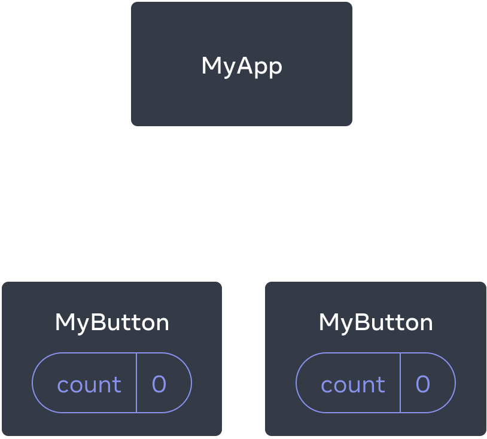
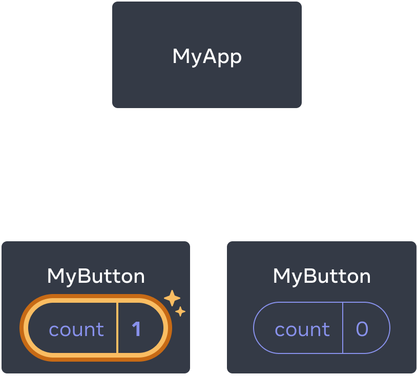
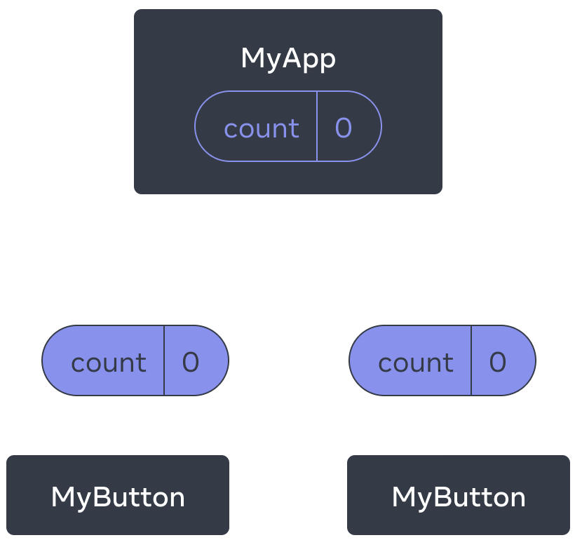

# 快速入门

## 创建和嵌套组件

React 应用程序是由 **组件** 组成的。一个组件是 UI（用户界面）的一部分，它拥有自己的逻辑和外观。组件可以小到一个按钮，也可以大到整个页面。

React 组件是**返回标签的 JavaScript 函数**：

```js
function MyButton() {
  return (
    <button>I'm a button</button>
  );
}
```

这样，我们就声明了一个名为`MyButton`的组件

```jsx
// export default 关键字指定了文件中的主要组件
export default function MyApp() {
  return (
    <div>
      <h1>Welcome to my app</h1>
      <MyButton />
    </div>
  );
}
```

组件名规范：React 组件必须以**大写字母开头**，而 HTML 标签则必须是小写字母


## 使用JSX编写标签

React推荐使用JSX编写代码，JSX 比 HTML 更加严格。**你必须闭合标签**，如 `<br />`。你的组件也不能返回多个 JSX 标签。**你必须将它们包裹到一个共享的父级中**，比如 `<div>...</div>` 或使用空的 `<>...</>` 包裹：

```js
function AboutPage() {
  return (
    <>
      <h1>About</h1>
      <p>Hello there.<br />How do you do?</p>
    </>
  );
}
```


## 添加样式

在 React 中，你可以使用 `className` 来指定一个 CSS 的 class。它与 HTML 的 [`class`](https://developer.mozilla.org/zh-CN/docs/Web/HTML/Global_attributes/class) 属性的工作方式相同：

```html

```

```css
/* In your CSS */
.avatar {
  border-radius: 50%;
}
```

React 并没有规定你如何添加 CSS 文件。最简单的方式是使用 HTML 的 `link`标签。

> 现在React也允许我们使用`class`指定类名


## 显示数据

JSX 会让你把标签放到 JavaScript 中，如果想要将变量的值进行展现，请使用**大括号**

```jsx
return (
  <h1>
    {user.name}
  </h1>
);
```

你还可以将 JSX 属性 “转义到 JavaScript”，但你必须使用大括号 **而非** 引号。例如，`className="avatar"` 是将 `"avatar"` 字符串传递给 `className`，作为 CSS 的 class。但 `src={user.imageUrl}` 会读取 JavaScript 的 `user.imageUrl` 变量，然后将该值作为 `src` 属性传递：

```jsx
return (
  
);

const user = {
  name: 'Hedy Lamarr',
  imageUrl: 'https://i.imgur.com/yXOvdOSs.jpg',
  imageSize: 90,
};

export default function Profile() {
  return (
    <>
      <h1>{user.name}</h1>
      
    </>
  );
}

```


## 条件渲染

React 没有特殊的语法来编写条件语句，因此你使用的就是普通的 JavaScript 代码。例如使用 [`if`](https://developer.mozilla.org/zh-CN/docs/Web/JavaScript/Reference/Statements/if...else) 语句根据条件引入 JSX：

```jsx
let content;

if (isLoggedIn) {

  content = <AdminPanel />;

} else {

  content = <LoginForm />;

}

return (

  <div>

    {content}

  </div>

);
```

如果你喜欢更为紧凑的代码，可以使用 [条件 `?` 运算符](https://developer.mozilla.org/zh-CN/docs/Web/JavaScript/Reference/Operators/Conditional_Operator)。与 `if` 不同的是，它工作于 JSX 内部：

```jsx
<div>

  {isLoggedIn ? (

    <AdminPanel />

  ) : (

    <LoginForm />

  )}

</div>
```

当你不需要 `else` 分支时，你还可以使用 [逻辑 `&&` 语法](https://developer.mozilla.org/zh-CN/docs/Web/JavaScript/Reference/Operators/Logical_AND#short-circuit_evaluation)：

```jsx
<div>

  {isLoggedIn && <AdminPanel />}

</div>
```

所有这些方法也适用于有条件地指定属性。如果你对 JavaScript 语法不熟悉，你可以从一直使用 `if...else` 开始。


## 渲染列表

你将依赖 JavaScript 的特性，例如 [`for` 循环](https://developer.mozilla.org/zh-CN/docs/Web/JavaScript/Reference/Statements/for) 和 [array 的 `map()` 函数](https://developer.mozilla.org/zh-CN/docs/Web/JavaScript/Reference/Global_Objects/Array/map) 来渲染组件列表。

假设你有一个产品数组：

```js
const products = [

  { title: 'Cabbage', id: 1 },

  { title: 'Garlic', id: 2 },

  { title: 'Apple', id: 3 },

];
```

在你的组件中，使用 `map()` 函数将这个数组转换为 `<li>` 标签构成的列表:

```jsx
const listItems = products.map(product =>

  <li key={product.id}>

    {product.title}

  </li>

);


return (

  <ul>{listItems}</ul>

);
```

注意， `<li>` 有一个 `key` 属性。对于列表中的每一个元素，你都应该传递一个字符串或者数字给 `key`，用于在其兄弟节点中唯一标识该元素。通常 key 来自你的数据，比如数据库中的 ID。如果你在后续插入、删除或重新排序这些项目，React 将依靠你提供的 key 来思考发生了什么（这点与Vue类似）


##  响应事件

你可以通过在组件中声明 **事件处理** 函数来响应事件：

```jsx
function MyButton() {
  function handleClick() {
    alert('You clicked me!');
  }

  return (
    <button onClick={handleClick}>
      Click me
    </button>
  );
}
```

**注意**，`onClick={handleClick}` 的结尾没有小括号！不要 **调用** 事件处理函数：你只需 **把函数传递给事件** 即可。当用户点击按钮时 React 会调用你传递的事件处理函数。


## 更新界面

通常你会希望你的组件 “记住” 一些信息并展示出来，比如一个按钮被点击的次数。要做到这一点，你需要在你的组件中添加 **state**。

首先，从 React 引入 [`useState`](https://react.docschina.org/reference/react/useState)（这是React内置的一个hook）：

```js
import { useState } from 'react';
```

现在你可以在你的组件中声明一个 **state 变量**：

```js
function MyButton() {

  const [count, setCount] = useState(0);
	// 借用Vue的概念就是声明了一个响应式变量
    // 注意React与Vue都是响应式的，但是二者实现的原理是不同的
  // ...
```

你将从 `useState` 中获得两样东西：当前的 state（`count`），以及用于更新它的函数（`setCount`）。你可以给它们起任何名字，但按照惯例会像 `[something, setSomething]` 这样为它们命名。

第一次显示按钮时，`count` 的值为 `0`，因为你把 `0` 传给了 `useState()`。当你想改变 state 时，调用 `setCount()` 并将新的值传递给它。点击该按钮计数器将递增：

```jsx
function MyButton() {

  const [count, setCount] = useState(0);


  function handleClick() {

    setCount(count + 1);

  }


  return (

    <button onClick={handleClick}>

      Clicked {count} times

    </button>

  );

}
```

React 将再次调用你的组件函数。第一次 `count` 变成 `1`。接着点击会变成 `2`。继续点击会逐步递增。

如果你多次渲染同一个组件，每个组件都会拥有自己的 state。你可以尝试点击不同的按钮：

注意，每个按钮会 “记住” 自己的 `count`，而不影响其他按钮。


## 使用Hook

以 `use` 开头的函数被称为 **Hook**。`useState` 是 React 提供的一个内置 Hook。你可以在 [React API 参考](https://react.docschina.org/reference/react) 中找到其他内置的 Hook。你也可以通过组合现有的 Hook 来编写属于你自己的 Hook。

Hook 比普通函数更为严格。你只能在你的组件（或其他 Hook）的 **顶层** 调用 Hook。如果你想在一个条件或循环中使用 `useState`，请提取一个新的组件并在组件内部使用它。


## 组件间共享数据

在前面的示例中，每个 `MyButton` 都有自己独立的 `count`，当每个按钮被点击时，只有被点击按钮的 `count` 才会发生改变：



起初，每个 `MyButton` 的 `count` state 均为 `0`



第一个 `MyButton` 会将 `count` 更新为 `1`

然而，你经常需要组件 **共享数据并一起更新**。

为了使得 `MyButton` 组件显示相同的 `count` 并一起更新，你需要将各个按钮的 state “向上” 移动到最接近包含所有按钮的组件之中。

在这个示例中，它是 `MyApp`：



起初，`MyApp` 的 `count` state 为 `0` 并传递给了两个子组件


点击后，`MyApp` 将 `count` state 更新为 `1`，并将其传递给两个子组件

此刻，当你点击任何一个按钮时，`MyApp` 中的 `count` 都将改变，同时会改变 `MyButton` 中的两个 count。具体代码如下：

首先，将 `MyButton` 的 **state 上移到** `MyApp` 中：

```jsx
export default function MyApp() {
  const [count, setCount] = useState(0);

  function handleClick() {
    setCount(count + 1);
  }

  return (
    <div>
      <h1>Counters that update together</h1>
      <MyButton count={count} onClick={handleClick} />
      <MyButton count={count} onClick={handleClick} />
    </div>
  );
}

function MyButton({ count, onClick }) {
  return (
    <button onClick={onClick}>
      Clicked {count} times
    </button>
  );
}
```

使用这种方式传递的信息被称作 **prop**。此时 `MyApp` 组件包含了 `count` state 以及 `handleClick` 事件处理函数，并将它们作为 **prop 传递给** 了每个按钮。


# 记录与解决问题

- 为什么使用className设置元素的class？？？

React 不使用 class 并不是技术问题，而是哲学问题。

React 一开始的理念就是与浏览器的` DOM API `保持一致而不是 HTML，因为这样会和元素的创建更为接近。

在DOM元素上设置 class 需要使用 className 这个 API：

```js
const arr = document.createElement("div")
arr.className = "hello" 
```

但是随着React的更新，现在设置元素的类名也允许使用`class`了，但是在`class`与`className`一起使用时，`className	`的优先级会更高