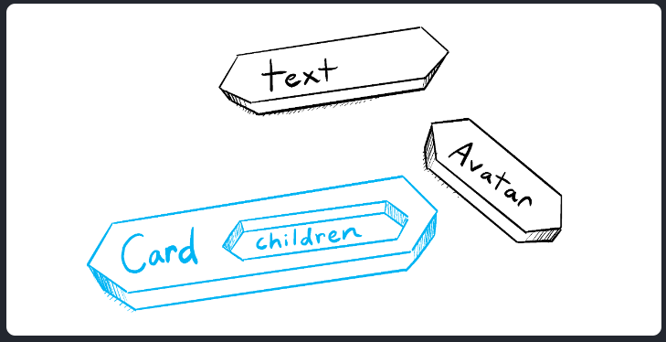
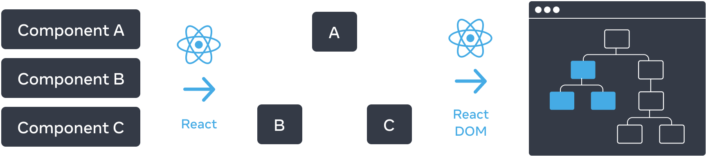
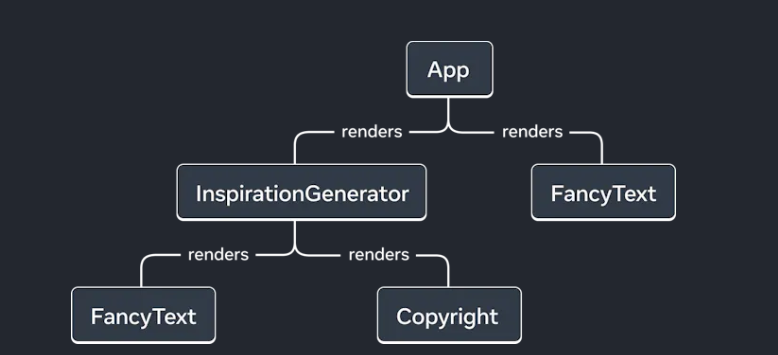

# 快速入门

## 创建和嵌套组件

React 应用程序是由 **组件** 组成的。一个组件是 UI（用户界面）的一部分，它拥有自己的逻辑和外观。组件可以小到一个按钮，也可以大到整个页面。

React 组件是**返回标签的 JavaScript 函数**：

```js
function MyButton() {
  return (
    <button>I'm a button</button>
  );
}
```

这样，我们就声明了一个名为`MyButton`的组件

```jsx
// export default 关键字指定了文件中的主要组件
export default function MyApp() {
  return (
    <div>
      <h1>Welcome to my app</h1>
      <MyButton />
    </div>
  );
}
```

组件名规范：React 组件必须以**大写字母开头**，而 HTML 标签则必须是小写字母


## 使用JSX编写标签

React推荐使用JSX编写代码，JSX 比 HTML 更加严格。**你必须闭合标签**，如 `<br />`。你的组件也不能返回多个 JSX 标签。**你必须将它们包裹到一个共享的父级中**，比如 `<div>...</div>` 或使用空的 `<>...</>` 包裹：

```js
function AboutPage() {
  return (
    <>
      <h1>About</h1>
      <p>Hello there.<br />How do you do?</p>
    </>
  );
}
```


## 添加样式

在 React 中，你可以使用 `className` 来指定一个 CSS 的 class。它与 HTML 的 [`class`](https://developer.mozilla.org/zh-CN/docs/Web/HTML/Global_attributes/class) 属性的工作方式相同：

```html

```

```css
/* In your CSS */
.avatar {
  border-radius: 50%;
}
```

React 并没有规定你如何添加 CSS 文件。最简单的方式是使用 HTML 的 `link`标签。

> 现在React也允许我们使用`class`指定类名


## 显示数据

JSX 会让你把标签放到 JavaScript 中，如果想要将变量的值进行展现，请使用**大括号**

```jsx
return (
  <h1>
    {user.name}
  </h1>
);
```

你还可以将 JSX 属性 “转义到 JavaScript”，但你必须使用大括号 **而非** 引号。例如，`className="avatar"` 是将 `"avatar"` 字符串传递给 `className`，作为 CSS 的 class。但 `src={user.imageUrl}` 会读取 JavaScript 的 `user.imageUrl` 变量，然后将该值作为 `src` 属性传递：

```jsx
return (
  
);

const user = {
  name: 'Hedy Lamarr',
  imageUrl: 'https://i.imgur.com/yXOvdOSs.jpg',
  imageSize: 90,
};

export default function Profile() {
  return (
    <>
      <h1>{user.name}</h1>
      
    </>
  );
}

```


## 条件渲染

React 没有特殊的语法来编写条件语句，因此你使用的就是普通的 JavaScript 代码。例如使用 [`if`](https://developer.mozilla.org/zh-CN/docs/Web/JavaScript/Reference/Statements/if...else) 语句根据条件引入 JSX：

```jsx
let content;

if (isLoggedIn) {

  content = <AdminPanel />;

} else {

  content = <LoginForm />;

}

return (

  <div>

    {content}

  </div>

);
```

如果你喜欢更为紧凑的代码，可以使用 [条件 `?` 运算符](https://developer.mozilla.org/zh-CN/docs/Web/JavaScript/Reference/Operators/Conditional_Operator)。与 `if` 不同的是，它工作于 JSX 内部：

```jsx
<div>

  {isLoggedIn ? (

    <AdminPanel />

  ) : (

    <LoginForm />

  )}

</div>
```

当你不需要 `else` 分支时，你还可以使用 [逻辑 `&&` 语法](https://developer.mozilla.org/zh-CN/docs/Web/JavaScript/Reference/Operators/Logical_AND#short-circuit_evaluation)：

```jsx
<div>

  {isLoggedIn && <AdminPanel />}

</div>
```

所有这些方法也适用于有条件地指定属性。如果你对 JavaScript 语法不熟悉，你可以从一直使用 `if...else` 开始。


## 渲染列表

你将依赖 JavaScript 的特性，例如 [`for` 循环](https://developer.mozilla.org/zh-CN/docs/Web/JavaScript/Reference/Statements/for) 和 [array 的 `map()` 函数](https://developer.mozilla.org/zh-CN/docs/Web/JavaScript/Reference/Global_Objects/Array/map) 来渲染组件列表。

假设你有一个产品数组：

```js
const products = [

  { title: 'Cabbage', id: 1 },

  { title: 'Garlic', id: 2 },

  { title: 'Apple', id: 3 },

];
```

在你的组件中，使用 `map()` 函数将这个数组转换为 `<li>` 标签构成的列表:

```jsx
const listItems = products.map(product =>

  <li key={product.id}>

    {product.title}

  </li>

);


return (

  <ul>{listItems}</ul>

);
```

注意， `<li>` 有一个 `key` 属性。对于列表中的每一个元素，你都应该传递一个字符串或者数字给 `key`，用于在其兄弟节点中唯一标识该元素。通常 key 来自你的数据，比如数据库中的 ID。如果你在后续插入、删除或重新排序这些项目，React 将依靠你提供的 key 来思考发生了什么（这点与Vue类似）


##  响应事件

你可以通过在组件中声明 **事件处理** 函数来响应事件：

```jsx
function MyButton() {
  function handleClick() {
    alert('You clicked me!');
  }

  return (
    <button onClick={handleClick}>
      Click me
    </button>
  );
}
```

**注意**，`onClick={handleClick}` 的结尾没有小括号！不要 **调用** 事件处理函数：你只需 **把函数传递给事件** 即可。当用户点击按钮时 React 会调用你传递的事件处理函数。


## 更新界面

通常你会希望你的组件 “记住” 一些信息并展示出来，比如一个按钮被点击的次数。要做到这一点，你需要在你的组件中添加 **state**。

首先，从 React 引入 [`useState`](https://react.docschina.org/reference/react/useState)（这是React内置的一个hook）：

```js
import { useState } from 'react';
```

现在你可以在你的组件中声明一个 **state 变量**：

```js
function MyButton() {

  const [count, setCount] = useState(0);
	// 借用Vue的概念就是声明了一个响应式变量
    // 注意React与Vue都是响应式的，但是二者实现的原理是不同的
  // ...
```

你将从 `useState` 中获得两样东西：当前的 state（`count`），以及用于更新它的函数（`setCount`）。你可以给它们起任何名字，但按照惯例会像 `[something, setSomething]` 这样为它们命名。

第一次显示按钮时，`count` 的值为 `0`，因为你把 `0` 传给了 `useState()`。当你想改变 state 时，调用 `setCount()` 并将新的值传递给它。点击该按钮计数器将递增：

```jsx
function MyButton() {

  const [count, setCount] = useState(0);


  function handleClick() {

    setCount(count + 1);

  }


  return (

    <button onClick={handleClick}>

      Clicked {count} times

    </button>

  );

}
```

React 将再次调用你的组件函数。第一次 `count` 变成 `1`。接着点击会变成 `2`。继续点击会逐步递增。

如果你多次渲染同一个组件，每个组件都会拥有自己的 state。你可以尝试点击不同的按钮：

注意，每个按钮会 “记住” 自己的 `count`，而不影响其他按钮。


## 使用Hook

以 `use` 开头的函数被称为 **Hook**。`useState` 是 React 提供的一个内置 Hook。你可以在 [React API 参考](https://react.docschina.org/reference/react) 中找到其他内置的 Hook。你也可以通过组合现有的 Hook 来编写属于你自己的 Hook。

Hook 比普通函数更为严格。你只能在你的组件（或其他 Hook）的 **顶层** 调用 Hook。如果你想在一个条件或循环中使用 `useState`，请提取一个新的组件并在组件内部使用它。


## 组件间共享数据

在前面的示例中，每个 `MyButton` 都有自己独立的 `count`，当每个按钮被点击时，只有被点击按钮的 `count` 才会发生改变：


起初，每个 `MyButton` 的 `count` state 均为 `0`


第一个 `MyButton` 会将 `count` 更新为 `1`

然而，你经常需要组件 **共享数据并一起更新**。

为了使得 `MyButton` 组件显示相同的 `count` 并一起更新，你需要将各个按钮的 state “向上” 移动到最接近包含所有按钮的组件之中。

在这个示例中，它是 `MyApp`：


起初，`MyApp` 的 `count` state 为 `0` 并传递给了两个子组件


点击后，`MyApp` 将 `count` state 更新为 `1`，并将其传递给两个子组件

此刻，当你点击任何一个按钮时，`MyApp` 中的 `count` 都将改变，同时会改变 `MyButton` 中的两个 count。具体代码如下：

首先，将 `MyButton` 的 **state 上移到** `MyApp` 中：

```jsx
export default function MyApp() {
  const [count, setCount] = useState(0);

  function handleClick() {
    setCount(count + 1);
  }

  return (
    <div>
      <h1>Counters that update together</h1>
      <MyButton count={count} onClick={handleClick} />
      <MyButton count={count} onClick={handleClick} />
    </div>
  );
}

function MyButton({ count, onClick }) {
  return (
    <button onClick={onClick}>
      Clicked {count} times
    </button>
  );
}
```

使用这种方式传递的信息被称作 **prop**。此时 `MyApp` 组件包含了 `count` state 以及 `handleClick` 事件处理函数，并将它们作为 **prop 传递给** 了每个按钮。


# React哲学

这是一章对React应用设计与搭建过程的思考，当你使用 React 构建用户界面时，你首先会把它分解成一个个 **组件**，然后，你需要把这些组件连接在一起，使数据流经它们。

以下学习都建立在你已经拥有了一些JSON数据以及一个原型图的情况下：

```json
[
  { category: "Fruits", price: "$1", stocked: true, name: "Apple" },
  { category: "Fruits", price: "$1", stocked: true, name: "Dragonfruit" },
  { category: "Fruits", price: "$2", stocked: false, name: "Passionfruit" },
  { category: "Vegetables", price: "$2", stocked: true, name: "Spinach" },
  { category: "Vegetables", price: "$4", stocked: false, name: "Pumpkin" },
  { category: "Vegetables", price: "$1", stocked: true, name: "Peas" }
]
```


## 将UI拆解为组件层级结构

我们可以在原型图上就进行组件和子组件的划分并命名：

- **程序设计**——使用同样的技术决定你是否应该创建一个新的函数或者对象。这一技术即 [单一功能原理](https://en.wikipedia.org/wiki/Single_responsibility_principle)，也就是说，一个组件理想情况下应仅做一件事情。但随着功能的持续增长，它应该被分解为更小的子组件。
- **CSS**——思考你将把类选择器用于何处。(然而，组件并没有那么细的粒度。)
- **设计**——思考你将如何组织布局的层级。

以下展示了五个组件:

1. `FilterableProductTable`（灰色）包含完整的应用。
2. `SearchBar`（蓝色）获取用户输入。
3. `ProductTable`（淡紫色）根据用户输入，展示和过滤清单。
4. `ProductCategoryRow`（绿色）展示每个类别的表头。
5. `ProductRow`（黄色）展示每个产品的行。

当然了，这不是唯一的划分组件方式


## 搭建静态结构

现在你已经拥有了你自己的组件层级结构，是时候实现你的应用程序了。最直接的办法是根据你的数据模型，构建一个不带任何交互的 UI 渲染代码版本…经常是先构建一个静态版本比较简单，然后再一个个添加交互。构建一个静态版本需要写大量的代码，并不需要什么思考; 但添加交互需要大量的思考，却不需要大量的代码。

**构建应用程序的静态版本来渲染你的数据模型，将构建 [组件](https://zh-hans.react.dev/learn/your-first-component) 并复用其它的组件，然后使用 [props](https://zh-hans.react.dev/learn/passing-props-to-a-component) 进行传递数据。**

**不要在静态版本中使用 state 进行构建。state 只是为交互提供的保留功能，即数据会随着时间变化。因为这是一个静态应用程序，所以并不需要。**

这里搭建的方式通常有两种：

- 自上而下：适用于小项目
- 自下而上：适用于项目

在构建你的组件之后，即拥有一个渲染数据模型的可复用组件库。因为这是一个静态应用程序，组件仅返回 JSX。最顶层组件将接收你的数据模型作为其 prop。这被称之为 **单向数据流**，因为数据从树的顶层组件传递到下面的组件。


## 找出UI精简而完整的state表示

**考虑将 state 作为应用程序需要记住改变数据的最小集合。**

组织 state 最重要的一条原则是保持它 [DRY（不要自我重复）](https://en.wikipedia.org/wiki/Don%27t_repeat_yourself)。计算出你应用程序需要的绝对精简 state 表示，按需计算其它一切。举个例子，如果你正在构建一个购物列表，你可将他们在 state 中存储为数组。如果你同时想展示列表中物品数量，不需要将其另存为一个新的 state。取而代之，可以通过读取你数组的长度来实现。

举栗子：

1. 产品原始列表
2. 搜索用户键入的文本
3. 复选框的值
4. 过滤后的产品列表

其中哪些是 state 呢？标记出那些不是的:

我们考虑三个要素：

- 随着时间推移 **保持不变**？如此，便不是 state。
- 通过 props **从父组件传递**？如此，便不是 state。
- 是否可以基于已存在于组件中的 state 或者 props **进行计算**？如此，它肯定不是state！
- 剩下的则可能是state

据此，我们可以判断：

1. 原始列表（json数据是请求得到的） **被作为 props 传递，所以不是 state**。
2. 搜索文本似乎应该是 state，因为它会随着时间的推移而变化，并且无法从任何东西中计算出来。
3. 复选框的值似乎是 state，因为它会随着时间的推移而变化，并且无法从任何东西中计算出来。
4. 过滤后列表中的产品 **不是 state，因为可以通过被原始列表中的产品，根据搜索框文本和复选框的值进行计算**。

> **props vs state** 
>
> 在 React 中有两种“模型”数据：props 和 state。下面是它们的不同之处:
>
> - [**props** 像是你传递的参数](https://zh-hans.react.dev/learn/passing-props-to-a-component) 至函数。它们使父组件可以传递数据给子组件，定制它们的展示。举个例子，`Form` 可以传递 `color` prop 至 `Button`。
> - [**state** 像是组件的内存](https://zh-hans.react.dev/learn/state-a-components-memory)。它使组件可以对一些信息保持追踪，并根据交互来改变。举个例子，`Input` 可以保持对 `inputValue` state 的追踪。


## 验证state的放置位置

在考虑好你的应用所需的最小state数据后，我们还需要确认它们的放置位置

**记住**：React 使用**单向数据流**，通过组件层级结构从父组件传递数据至子组件。要搞清楚哪个组件拥有哪个 state

基本步骤：

1. 寻找每一个基于特定state渲染的组件
2. 寻找它们最近且共同的父组件（可能没有，没有则创建）
3. 决定放置位置
   1. 通常可以直接放置state在它们共同的父组件中
   2. 也可以将state放置在它们父组件上层的组件

例如在这个应用例子中：

state有搜索文本框内容state、checkbox的state

- `ProductTable` 需要基于 state (搜索文本和复选框值) 过滤产品列表。
- `SearchBar` 需要展示 state (搜索文本和复选框值)。

它们的第一个共同父组件为`FilterableProductTable`

因此，我们可以将state放置在该父组件中


## 添加反向数据流

即**深层结构的表单组件需要在 通过传入的方法 中更新 state**。


# 描述用户界面

##你的第一个组件

该内容与前面的内容存在重复，因此这里只记录部分内容

- 陷阱

  - React 组件是常规的 JavaScript 函数，但 **组件的名称必须以大写字母开头**，否则它们将无法运行！（这是因为在React中是以命名来区分html元素与组件元素的）

  - 如果你的标签和 `return` 关键字不在同一行，则必须把它包裹在一对括号中（同时必须只有一个父元素）

    ```js
    return (
      <div>
        
      </div>
    );
    ```

  - 永远不要在组件内定义组件


## 组件的导入与导出

### 根组件文件

当你嵌套了越来越多的组件时，则需要将它们拆分成不同的文件。这样可以使得查找文件更加容易，并且能在更多地方复用这些组件。

```js
// app.js
function Profile() {
  return (
    
  );
}

export default function Gallery() {
  return (
    <section>
      <h1>了不起的科学家们</h1>
      <Profile />
      <Profile />
      <Profile />
    </section>
  );
}

```

在此示例中，所有组件目前都定义在 **根组件** `App.js` 文件中。具体还需根据项目配置决定，有些根组件可能会声明在其他文件中。如果你使用的框架基于文件进行路由，如 Next.js，那你每个页面的根组件都会不一样。


### 导出和导入一个组件

当根组件复用的组件越来越多时，将一些组件移出根组件会更加合理，使得组件更加模块化，并且可在其他文件中复用。你可以根据以下三个步骤对组件进行拆分：

1. **创建** 一个新的 JS 文件来存放该组件。
2. **导出** 该文件中的函数组件（可以使用 [默认导出](https://developer.mozilla.org/docs/Web/JavaScript/Reference/Statements/export#using_the_default_export) 或 [具名导出](https://developer.mozilla.org/docs/Web/JavaScript/Reference/Statements/export#using_named_exports)）
3. 在需要使用该组件的文件中 **导入**（可以根据相应的导出方式使用 [默认导入](https://developer.mozilla.org/docs/Web/JavaScript/Reference/Statements/import#importing_defaults) 或 [具名导入](https://developer.mozilla.org/docs/Web/JavaScript/Reference/Statements/import#import_a_single_export_from_a_module)）。

例如：

```js
// Gallery.js
function Profile() {
  return (
    
  );
}

export default function Gallery() {
  return (
    <section>
      <h1>了不起的科学家们</h1>
      <Profile />
      <Profile />
      <Profile />
    </section>
  );
}

// App.js
import Gallery from './Gallery.js';

export default function App() {
  return (
    <Gallery />
  );
}

```

>  **默认导出 vs 具名导出**
>
> 这是 JavaScript 里两个主要用来导出值的方式：默认导出和具名导出。到目前为止，我们的示例中只用到了默认导出。但你可以在一个文件中，选择使用其中一种，或者两种都使用。**一个文件里有且仅有一个 默认 导出，但是可以有任意多个 具名 导出。**
>
> 组件的导出方式决定了其导入方式。当你用默认导入的方式，导入具名导出的组件时，就会报错。如下表格可以帮你更好地理解它们：
>
> | 语法 | 导出语句                              | 导入语句                                |
> | ---- | ------------------------------------- | --------------------------------------- |
> | 默认 | `export default function Button() {}` | `import Button from './Button.js';`     |
> | 具名 | `export function Button() {}`         | `import { Button } from './Button.js';` |
>
> 当使用**默认导入**时，你可以在 `import` 语句后面进行**任意命名**。比如 `import Banana from './Button.js'`，如此你能获得与默认导出一致的内容。相反，对于**具名导入，导入和导出的名字必须一致**。这也是为什么称其为 **具名** 导入的原因！
>
> **通常，文件中仅包含一个组件时，人们会选择默认导出，而当文件中包含多个组件或某个值需要导出时，则会选择具名导出。** 无论选择哪种方式，请记得给你的组件和相应的文件命名一个有意义的名字。我们不建议创建未命名的组件，比如 `export default () => {}`，因为这样会使得调试变得异常困难。


## 使用JSX书写

###什么是JSX

**JSX** 是 JavaScript 语法扩展，可以让你在 JavaScript 文件中书写类似 HTML 的标签。

在React中，我们推荐使用JSX进行编码

但是请注意：[JSX and React 是相互独立的](https://reactjs.org/blog/2020/09/22/introducing-the-new-jsx-transform.html#whats-a-jsx-transform) 东西。但它们经常一起使用，但你 **可以** 单独使用它们中的任意一个，JSX 是一种语法扩展，而 React 则是一个 JavaScript 的库。


### JSX规则

1. 只能返回一个根元素

如果想要在一个组件中包含多个元素，**需要用一个父标签把它们包裹起来**。

例如，你可以使用一个 `<div>` 标签：

```jsx
<div>

  <h1>海蒂·拉玛的待办事项</h1>

  

  <ul>

    ...

  </ul>

</div>
```

如果你不想在标签中增加一个额外的 `<div>`，可以用 `<>` 和 `</>` 元素来代替：

```jsx
<>

  <h1>海蒂·拉玛的待办事项</h1>

  

  <ul>

    ...

  </ul>

</>
```

这个空标签被称作 *Fragment*。React Fragment 允许你将子元素分组，而不会在 HTML 结构中添加额外节点。

> **为什么多个 JSX 标签需要被一个父元素包裹？**
>
> JSX 虽然看起来很像 HTML，但在底层其实被转化为了 **JavaScript 对象**，你**不能在一个函数中返回多个对象**，除非用一个数组把他们包装起来。这就是为什么多个 JSX 标签必须要用一个父元素或者 Fragment 来包裹。


2. 标签必须闭合

JSX 要求标签必须正确闭合。**像 `` 这样的自闭合标签必须书写成 ``，而像 `<li>oranges` 这样只有开始标签的元素必须带有闭合标签**，需要改为 `<li>oranges</li>`。


3. 使用驼峰命名法

JSX 最终会被转化为 JavaScript，而 JSX 中的属性也会变成 JavaScript 对象中的键值对。

也就是说属性的命名需要遵循例如对象的键的命名，就像变量名称不能包含 `-` 符号或者像 `class` 这样的保留字。

例如，需要用 `strokeWidth` 代替 `stroke-width`。由于 `class` 是一个保留字，所以在 React 中需要用 `className` 来代替。这也是 [DOM 属性中的命名](https://developer.mozilla.org/zh-CN/docs/Web/API/Element/className):

> **陷阱**
>
> 由于历史原因，[`aria-*`](https://developer.mozilla.org/docs/Web/Accessibility/ARIA) 和 [`data-*`](https://developer.mozilla.org/docs/Learn/HTML/Howto/Use_data_attributes) 属性是以带 `-` 符号的 HTML 格式书写的。


### JSX转化器

将现有的 HTML 中的所有属性转化 JSX 的格式是很繁琐的。我们建议使用 [转化器](https://transform.tools/html-to-jsx) 将 HTML 和 SVG 标签转化为 JSX。


### 通过大括号使用JavaScript

可以在哪里使用大括号？

在 JSX 中，只能在以下两种场景中使用大括号：

1. 用作 JSX 标签内的**文本**：`<h1>{name}'s To Do List</h1>` 是有效的，但是 `<{tag}>Gregorio Y. Zara's To Do List</{tag}>` 无效。
2. 用作紧跟在 `=` 符号后的 **属性**：`src={avatar}` 会读取 `avatar` 变量，但是 `src="{avatar}"` 只会传一个字符串 `{avatar}`。

大括号内的任何 JavaScript 表达式都能正常运行，包括像 `formatDate()` 这样的函数调用

特别的，可以传递一个对象，但是对象也是使用大括号声明的，因此会出现"双大括号"的情况

> **陷阱：**
>
> 内联 `style` 属性 使用驼峰命名法编写。
>
> 例如，HTML `<ul style="background-color: black">` 在你的组件里应该写成 `<ul style={{ backgroundColor: 'black' }}>`。

对象与大括号的更多可能：

```jsx
const person = {

  name: 'Gregorio Y. Zara',

  theme: {

    backgroundColor: 'black',

    color: 'pink'

  }

};
```

该组件可以这样使用来自 `person` 的值：

```jsx
<div style={person.theme}>

  <h1>{person.name}'s Todos</h1>
```


## 将Props传递给组件

React 组件使用 *props* 来互相通信。每个父组件都可以提供 props 给它的子组件，从而将一些信息传递给它。Props 可能会让你想起 HTML 属性，但你可以通过它们传递任何 JavaScript 值，包括对象、数组和函数。


### 向组件传递props

1. 将props传递给子组件

```jsx
export default function Profile() {
  return (
    <Avatar
      person={{ name: 'Lin Lanying', imageId: '1bX5QH6' }}
      size={100}
    />
  );
}
```


2. 在子组件中读取props

```jsx
function Avatar({ person, size }) {
  // 在这里 person 和 size 是可访问的
}
```

这里实际上子组件的第一个参数是一个对象，里面存储了所有父组件传递的props，我们只是将其解构了

你可以将 props 想象成可以调整的“旋钮”。它们的作用与函数的参数相同 —— 事实上，props **正是** 组件的唯一参数！ React 组件函数接受一个参数，一个 `props` 对象：

```jsx
function Avatar(props) {

  let person = props.person;

  let size = props.size;

  // ...

}
```

通常你不需要整个 `props` 对象，所以可以将它解构为单独的 props。


### 给prop指定一个默认值

如果你想在没有指定值的情况下给 prop 一个默认值，你可以通过在参数后面写 `=` 和默认值来进行解构：

```jsx
function Avatar({ person, size = 100 }) {

  // ...

}
```

现在， 如果 `<Avatar person={...} />` 渲染时没有 `size` prop，  `size` 将被赋值为 `100`。

**默认值仅在缺少 `size` prop 或 `size={undefined}` 时生效**。 但是如果你传递了 `size={null}` 或 `size={0}`，默认值将 **不** 被使用。


### 使用展开语法传递props

有时候子组件如果需要接受很多props，例如：

```jsx
function Profile({ person, size, isSepia, thickBorder }) {
  return (
    <div className="card">
      <Avatar
        person={person}
        size={size}
        isSepia={isSepia}
        thickBorder={thickBorder}
      />
    </div>
  );
}
```

因为这些组件Profile不直接使用他们本身的任何 props，所以使用更简洁的“展开”语法是有意义的：

```jsx
function Profile(props) {

  return (

    <div className="card">

      <Avatar {...props} />

    </div>

  );

}
```

这会将 `Profile` 的所有 props 转发到 `Avatar`，而不列出每个名字。

**请克制地使用展开语法。**

属性展开在某些情况下很有用，但是也很容易将不必要的 props 传递给不相关的组件，或者将无效的 HTML 属性传递给 DOM。因此我们建议谨慎的使用该语法。

> 你还可以选择只保留当前组件需要的props，并且使用展开运算符将其他props传递下去
>
> ```jsx
> const Button = props => {
>   const { kind, ...other } = props;
>   const className = kind === "primary" ? "PrimaryButton" : "SecondaryButton";
>   return <button className={className} {...other} />;
> };
>
> const App = () => {
>   return (
>     <div>
>       <Button kind="primary" onClick={() => console.log("clicked!")}>
>         Hello World!
>       </Button>
>     </div>
>   );
> };
> //在上述例子中，kind 的 prop 会被安全的保留，它将不会被传递给 DOM 中的 <button> 元素。 所有其他的 props 会通过 ...other 对象传递，使得这个组件的应用可以非常灵活。你可以看到它传递了一个 onClick 和 children 属性。
> ```


### 将JSX作为子组件传递

友情提示：类似Vue中的插槽概念

嵌套浏览器内置标签是很常见的：

```jsx
<div>
  
</div>
```

如果我们的组件嵌套会发生什么？？？

当您将内容嵌套在 JSX 标签中时，父组件将在名为 `children` 的 prop 中接收到该内容。例如，下面的 `Card` 组件将接收一个被设为 `<Avatar />` 的 `children` prop 并将其包裹在 div 中渲染：

```jsx
// App.js
import Avatar from './Avatar.js';

function Card({ children }) {
  return (
    <div className="card">
      {children}
    </div>
  );
}

export default function Profile() {
  return (
    <Card>
      <Avatar
        size={100}
        person={{ 
          name: 'Katsuko Saruhashi',
          imageId: 'YfeOqp2'
        }}
      />
    </Card>
  );
}

// Avatar.js
import { getImageUrl } from './utils.js';

export default function Avatar({ person, size }) {
  return (
    
  );
}

```

可以想象将带有 `children` prop 的组件看作有一个“洞”，可以由其父组件使用任意 JSX 来“填充”。你会经常使用 `children` prop 来进行视觉包装：面板、网格等等。




### Props如何随时间变化

**一个组件可能会随着时间的推移收到不同的 props。** Props 并不总是静态的！

然而，props 是 [不可变的](https://en.wikipedia.org/wiki/Immutable_object)（一个计算机科学术语，意思是“不可改变”）。当一个组件需要改变它的 props（例如，响应用户交互或新数据）时，它不得不“请求”它的**父组件**传递 **不同的 props** —— 一个新对象！它的旧 props 将被丢弃，最终 JavaScript 引擎将回收它们占用的内存。

总结：Props 是只读的时间快照：每次渲染都会收到新版本的 props。


## 条件渲染

### 条件返回JSX

```jsx
if (isPacked) {
  return <li className="item">{name} ✔</li>;
}
return <li className="item">{name}</li>;
```


### 选择性返回null

在一些情况下，你不想有任何东西进行渲染。比如，你不想显示已经打包好的物品。但一个组件必须返回一些东西。这种情况下，你可以直接返回 `null`。

```jsx
if (isPacked) {
  return null;
}

return <li className="item">{name}</li>;
```

如果组件的 `isPacked` 属性为 `true`，那么它将只返回 `null`。否则，它将返回相应的 JSX 用来渲染。

通常情况下，你可以在父组件里选择是否要渲染该组件


### 三目运算符

- 在 JSX 中，`{cond ? <A /> : <B />}` 表示 *“当 cond 为真值时, 渲染 <A />，否则 <B />”*。

你还可以这样实现：

```jsx
return (

  <li className="item">
    {isPacked ? name + ' ✔' : name}
  </li>

);
```


### 与运算符

- 在 JSX 中，`{cond && <A />}` 表示 *“当 cond 为真值时, 渲染 <A />，否则不进行渲染”*。

```jsx
return (
  <li className="item">
    {name} {isPacked && '✔'}
  </li>
);
```

> **陷阱：**
>
> **切勿将数字放在 && 左侧.**
>
> JavaScript 会自动将左侧的值转换成布尔类型以判断条件成立与否。
>
> 然而，如果左侧是 `0`，整个表达式将变成左侧的值（`0`），React 此时则会渲染 `0` 而不是不进行渲染。
>
> 例如，一个常见的错误是 `messageCount && <p>New messages</p>`。其原本是想当 `messageCount` 为 0 的时候不进行渲染，但实际上却渲染了 `0`。
>
> 为了更正，可以将左侧的值改成布尔类型：`messageCount > 0 && <p>New messages</p>`。


### 选择性地将JSX赋予给变量

当这些快捷方式妨碍写普通代码时，可以考虑使用 `if` 语句和变量。因为你可以使用 [`let`](https://developer.mozilla.org/zh-CN/docs/Web/JavaScript/Reference/Statements/let) 进行重复赋值，所以一开始你可以将你想展示的（这里指的是物品的名字）作为默认值赋予给该变量。

```js
let itemContent = name;
```

结合 `if` 语句，当 `isPacked` 为 `true` 时，将 JSX 表达式的值重新赋值给 `itemContent`：

```jsx
if (isPacked) {
  itemContent = name + " ✔";
}
```

[在 JSX 中通过大括号使用 JavaScript](https://zh-hans.react.dev/learn/javascript-in-jsx-with-curly-braces#using-curly-braces-a-window-into-the-javascript-world)。将变量用大括号嵌入在返回的 JSX 树中，来嵌套计算好的表达式与 JSX：

```jsx
<li className="item">
  {itemContent}
</li>
```

这种方式虽然比较冗长，但是最为灵活

跟之前的一样，这个方式不仅仅适用于文本，任意的 JSX 均适用：

```jsx
function Item({ name, isPacked }) {
  let itemContent = name;
  if (isPacked) {
    itemContent = (
      <del>
        {name + " ✔"}
      </del>
    );
  }
  return (
    <li className="item">
      {itemContent}
    </li>
  );
}
```


## 渲染列表

### 从数组中渲染数据

假设我们拥有这样的一个数据

```js
const people = [
  '凯瑟琳·约翰逊: 数学家',
  '马里奥·莫利纳: 化学家',
  '穆罕默德·阿卜杜勒·萨拉姆: 物理学家',
  '珀西·莱温·朱利亚: 化学家',
  '苏布拉马尼扬·钱德拉塞卡: 天体物理学家',
];
```

1. 遍历这个数组中的每一项，获取新的JSX节点

```jsx
const listItems = people.map(person => <li>{person}</li>);
```

2. 将`listItems`用`<ul>`包裹起来，然后返回：

```jsx
return <ul>{listItems}</ul>;
```

> 如果我们只需要数组中的某些数据，也可以先对数据使用`filter`方法进行过滤后再`map`


### 用key保持列表项的顺序

你必须给数组中的每一项都指定一个 `key`——它可以是字符串或数字的形式，只要能唯一标识出各个数组项就行：

这些 key 会告诉 React，每个组件对应着数组里的哪一项，所以 React 可以把它们匹配起来。这在数组项进行移动（例如排序）、插入或删除等操作时非常重要。一个合适的 `key` 可以帮助 React 推断发生了什么，从而得以正确地更新 DOM 树。

用作 key 的值应该在数据中提前就准备好，而不是在运行时才随手生成：

> 注意：
>
> 直接放在`map`方法内的JSX元素一般都需要指定key值

> 为每个列表项显示多个DOM节点：
>
> 假设我们`map`方法中返回的元素不止一个，也就是说我们使用了`<></>`将内容进行了包裹
>
> 但是这个时候，我们会发现`<></>`实际上是**不能接受key值**的，那么我们要怎么办呢？
>
> 你只能要么把生成的节点用一个 `<div>` 标签包裹起来，要么使用长一点但更明确的 `<Fragment>` 写法：
>
> ```jsx
> import { Fragment } from 'react';
>
>
> // ...
> const listItems = people.map(person =>
>   <Fragment key={person.id}>
>     <h1>{person.name}</h1>
>     <p>{person.bio}</p>
>   </Fragment>
> );
> ```
>
> 这里的 Fragment 标签本身并不会出现在 DOM 上，这串代码最终会转换成 `<h1>`、`<p>`、`<h1>`、`<p>`…… 的列表。
>
> 温馨提示：
>
> 前面提到的`<></>`也是一个`Fragment`标签，只不过不接受key值而已


### 如何选择key值

不同来源的数据往往对应不同的 key 值获取方式：

- **来自数据库的数据：** 如果你的数据是从数据库中获取的，那你可以直接使用数据表中的主键，因为它们天然具有唯一性。
- **本地产生数据：** 如果你数据的产生和保存都在本地（例如笔记软件里的笔记），那么你可以使用一个自增计数器或者一个类似 [`uuid`](https://www.npmjs.com/package/uuid) 的库来生成 key。

key需要满足的条件有：

- **key 值在兄弟节点之间必须是唯一的。** 不过不要求全局唯一，在不同的数组中可以使用相同的 key。
- **key 值不能改变**，否则就失去了使用 key 的意义！所以千万不要在渲染时动态地生成 key（这也是为什么不要使用下标作为key的原因，因为如果元素的位置改变了，key也就变了）。


### 为什么需要key

设想一下，假如你桌面上的文件都没有文件名，取而代之的是，你需要通过文件的位置顺序来区分它们———第一个文件，第二个文件，以此类推。也许你也不是不能接受这种方式，可是一旦你删除了其中的一个文件，这种组织方式就会变得混乱无比。原来的第二个文件可能会变成第一个文件，第三个文件会成为第二个文件……

React 里需要 key 和文件夹里的文件需要有文件名的道理是类似的。它们（key 和文件名）都让我们可以从众多的兄弟元素中唯一标识出某一项（JSX 节点或文件）。而一个精心选择的 key 值所能提供的信息远远不止于这个元素在数组中的位置。即使元素的位置在渲染的过程中发生了改变，它提供的 `key` 值也能让 React 在整个生命周期中一直认得它。

> **陷阱**：
>
> 组件不会把 `key` 当作 props 的一部分。Key 的存在只对 React 本身起到提示作用。即**你不会在子组件的props中拿到一个叫key的值**
>
> 如果你的组件需要一个 ID，那么请把它作为一个单独的 prop 传给组件： `<Profile key={id} userId={id} />`

> 你可能会想直接把数组项的索引当作 key 值来用，实际上，如果你没有显式地指定 `key` 值，React 确实默认会这么做。但是数组项的顺序在插入、删除或者重新排序等操作中会发生改变，此时把索引顺序用作 key 值会产生一些微妙且令人困惑的 bug。
>
> 与之类似，请不要在运行过程中动态地产生 key，像是 `key={Math.random()}` 这种方式。这会导致每次重新渲染后的 key 值都不一样，从而使得所有的组件和 DOM 元素每次都要重新创建。这不仅会造成运行变慢的问题，更有可能导致用户输入的丢失。所以，使用能从给定数据中稳定取得的值才是明智的选择。


## 保持组件纯粹

部分 JavaScript 函数是 **纯粹** 的，这类函数通常被称为**纯函数**

**纯函数仅执行计算操作，不做其他操作**。你可以通过将组件按纯函数严格编写，以避免一些随着代码库的增长而出现的、令人困扰的 bug 以及不可预测的行为


### 纯函数：组件作为公式

在计算机科学中（尤其是函数式编程的世界中），[纯函数](https://wikipedia.org/wiki/Pure_function) 通常具有如下特征：

- **只负责自己的任务**。它**不会更改在该函数调用前就已存在的对象或变量**。
- **输入相同，则输出相同**。给定相同的输入，纯函数应总是返回相同的结果。

```jsx
// 这是一个纯函数
function double(number) {
  return 2 * number;
}
```


### 非纯函数的结果

React 的渲染过程必须自始至终是纯粹的。组件应该只 **返回** 它们的 JSX，而不 **改变** 在**渲染前，就已存在的任何对象或变量** — 这将会使它们变得不纯粹！

例如：

```jsx
let guest = 0;

function Cup() {
  // Bad：正在更改预先存在的变量！
  guest = guest + 1;
  return <h2>Tea cup for guest #{guest}</h2>;
}

export default function TeaSet() {
  return (
    <>
      <Cup />
      <Cup />
      <Cup />
    </>
  );
}

```

该组件正在读写其外部声明的 `guest` 变量。这意味着 **多次调用这个组件会产生不同的 JSX**！

并且，如果 **其他** 组件读取 `guest` ，它们也会产生不同的 JSX，其结果取决于它们何时被渲染！这是无法预测的。

你可以将`guest`作为prop传入来修复

```jsx
function Cup({ guest }) {
  return <h2>Tea cup for guest #{guest}</h2>;
}

export default function TeaSet() {
  return (
    <>
      <Cup guest={1} />
      <Cup guest={2} />
      <Cup guest={3} />
    </>
  );
}

```

> **严格模式检测非纯函数：**
>
> 在 React 中，你可以在渲染时读取三种输入：[props](https://zh-hans.react.dev/learn/passing-props-to-a-component)，[state](https://zh-hans.react.dev/learn/state-a-components-memory) 和 [context](https://zh-hans.react.dev/learn/passing-data-deeply-with-context)。你应该始终将这些输入视为只读。
>
> 当你想根据用户输入 *更改* 某些内容时，你应该 [设置状态](https://zh-hans.react.dev/learn/state-a-components-memory)，而不是直接写入变量。当你的组件正在渲染时，你永远不应该改变预先存在的变量或对象。
>
> React 提供了 “**严格模式”，在严格模式下开发时，它将会调用每个组件函数两次**。**通过重复调用组件函数，严格模式有助于找到违反这些规则的组件**。
>
> 我们注意到，原始示例显示的是 “Guest #2”、“Guest #4” 和 “Guest #6”，而不是 “Guest #1”、“Guest #2” 和 “Guest #3”。原来的函数并不纯粹，因此调用它两次就出现了问题。但对于修复后的纯函数版本，即使调用该函数两次也能得到正确结果。**纯函数仅仅执行计算，因此调用它们两次不会改变任何东西** — 就像两次调用 `double(2)` 并不会改变返回值，两次求解 y = 2x 不会改变 y 的值一样。相同的输入，总是返回相同的输出。
>
> **严格模式在生产环境下不生效**，因此它不会降低应用程序的速度。如需引入严格模式，你可以用 `<React.StrictMode>` 包裹根组件。一些框架会默认这样做。


### 局部mutation

组件改变了 **预先存在的** 变量的值。为了让它听起来更可怕一点，我们将这种现象称为 **突变（mutation）**

**你完全可以在渲染时更改你 刚刚 创建的变量和对象**

例如：

```jsx
function Cup({ guest }) {
  return <h2>Tea cup for guest #{guest}</h2>;
}

export default function TeaGathering() {
  let cups = [];
  for (let i = 1; i <= 12; i++) {
    cups.push(<Cup key={i} guest={i} />);
  }
  return cups;
}

```


### 事件处理函数与纯函数

函数式编程在很大程度上依赖于纯函数，但 **某些事物** 在特定情况下不得不发生改变。这是编程的要义！这些变动包括更新屏幕、启动动画、更改数据等，它们被称为 **副作用**。它们是 **“额外”** 发生的事情，与渲染过程无关。

在 React 中，**副作用通常属于 事件处理程序**。事件处理程序是 React 在你执行某些操作（如单击按钮）时运行的函数。即使事件处理程序是在你的组件 **内部** 定义的，它们也不会在渲染期间运行！ **因此事件处理程序无需是纯函数**。

如果你用尽一切办法，仍无法为副作用找到合适的事件处理程序，你还可以调用组件中的 [`useEffect`](https://zh-hans.react.dev/reference/react/useEffect) 方法将其附加到返回的 JSX 中。这会告诉 React 在渲染结束后执行它。**然而，这种方法应该是你最后的手段**。

> 理解**副作用**
>
> 在 React 中，**副作用指的是与组件渲染结果无关的任何操作**，例如：
>
> 1. 发送网络请求
> 2. 修改 DOM 元素
> 3. 访问本地存储
> 4. 订阅或取消订阅事件
> 5. 改变组件状态外的变量等
>
> 这些操作会影响组件的行为和状态，但是并不会直接影响渲染结果。在 React 中，应该将副作用分离出来，以便更好地控制组件的行为和状态。
>
> 通常，React 使用钩子函数（如 useEffect）来处理副作用。在 useEffect 中，可以执行一些副作用操作，例如发送网络请求或订阅事件，以及在组件卸载时清除这些操作。这可以保持组件的一致性和可维护性。
>
> [理解 Effect Hooks 副作用 - 掘金 (juejin.cn)](https://juejin.cn/post/7215484775640350757)


### 为什么React重视纯函数

编写纯函数需要遵循一些习惯和规程。但它开启了绝妙的机遇：

- 你的组件可以在不同的环境下运行 — 例如，在服务器上！由于它们针对相同的输入，总是返回相同的结果，因此一个组件可以满足多个用户请求。
- 你可以为那些输入未更改的组件来 [跳过渲染](https://zh-hans.react.dev/reference/react/memo)，以提高性能。这是安全的做法，因为纯函数总是返回相同的结果，所以可以安全地缓存它们。
- 如果在渲染深层组件树的过程中，某些数据发生了变化，React 可以重新开始渲染，而不会浪费时间完成过时的渲染。纯粹性使得它随时可以安全地停止计算。

我们正在构建的每个 React 新特性都利用到了纯函数。从数据获取到动画再到性能，保持组件的纯粹可以充分释放 React 范式的能力。


## 将UI视为树

当 React 应用程序逐渐成形时，许多组件会出现嵌套。那么 React 是如何跟踪应用程序组件结构的？

React 以及许多其他 UI 库，都将 UI 建模为树

树是项目与UI之间的关系模型，通常使用树结构来表示UI，例如浏览器就是使用树结构来建模HTML(DOM树)与CSS(CSSOM)



如上，React从组件中建立UI树，并且UI树最后用于渲染DOM


### 渲染树

组件的一个主要特性是能够由其他组件组合而成。在 [嵌套组件](https://zh-hans.react.dev/learn/your-first-component#nesting-and-organizing-components) 中有父组件和子组件的概念，其中每个父组件本身可能是另一个组件的子组件。

当渲染 React 应用程序时，可以在一个称为渲染树的树中建模这种关系。



React 创建的 UI 树是由渲染过的组件构成的，被称为**渲染树**。

在条件渲染中


尽管渲染树可能在不同的渲染过程中有所不同，但通常这些树有助于识别 React 应用程序中的顶级和叶子组件。顶级组件是离根组件最近的组件，它们影响其下所有组件的渲染性能，通常包含最多复杂性。叶子组件位于树的底部，没有子组件，通常会频繁重新渲染。


### 模块依赖树

在 React 应用程序中，可以使用树来建模的另一个关系是应用程序的模块依赖关系


# 记录与解决问题

- 为什么使用className设置元素的class？？？

React 不使用 class 并不是技术问题，而是哲学问题。

React 一开始的理念就是与浏览器的` DOM API `保持一致而不是 HTML，因为这样会和元素的创建更为接近。

在DOM元素上设置 class 需要使用 className 这个 API：

```js
const arr = document.createElement("div")
arr.className = "hello" 
```

但是随着React的更新，现在设置元素的类名也允许使用`class`了，但是在`class`与`className`一起使用时，`className	`的优先级会更高