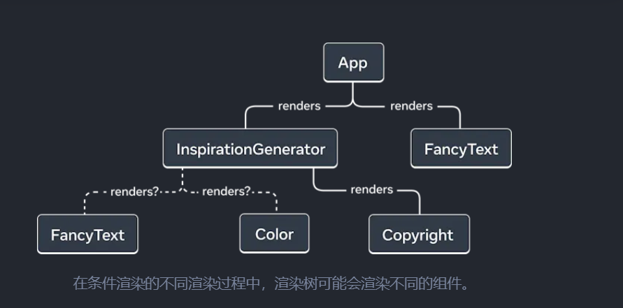
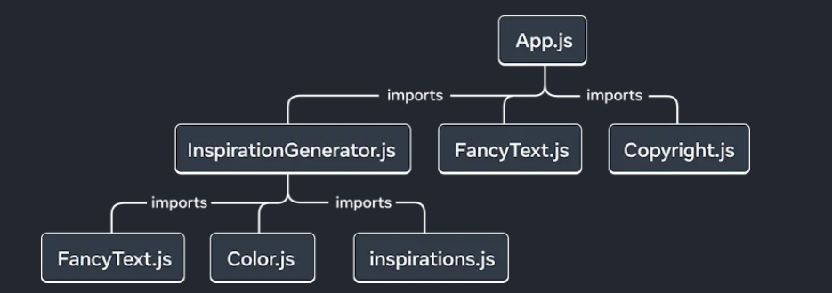
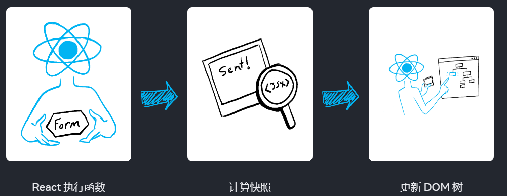
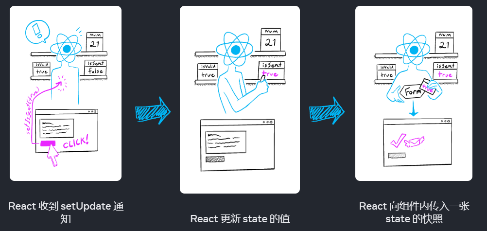
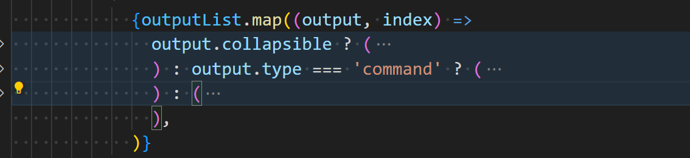
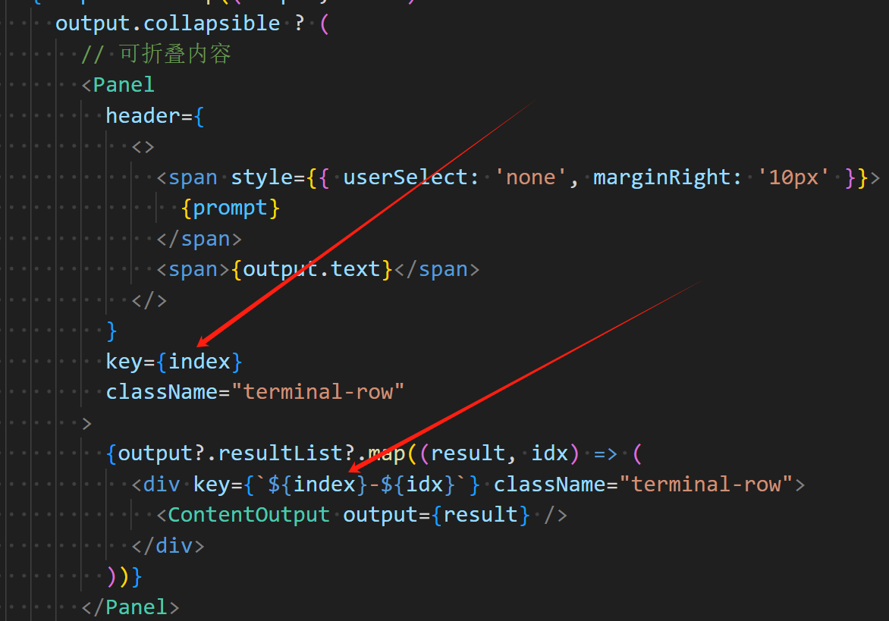
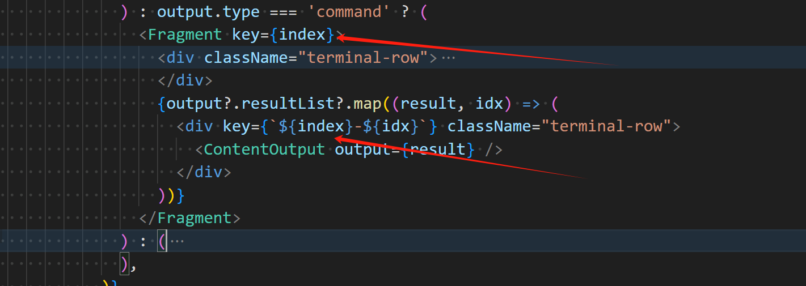

# 快速入门

## 创建和嵌套组件

React 应用程序是由 **组件** 组成的。一个组件是 UI（用户界面）的一部分，它拥有自己的逻辑和外观。组件可以小到一个按钮，也可以大到整个页面。

React 组件是**返回标签的 JavaScript 函数**：

```js
function MyButton() {
  return (
    <button>I'm a button</button>
  );
}
```

这样，我们就声明了一个名为`MyButton`的组件

```jsx
// export default 关键字指定了文件中的主要组件
export default function MyApp() {
  return (
    <div>
      <h1>Welcome to my app</h1>
      <MyButton />
    </div>
  );
}
```

组件名规范：React 组件必须以**大写字母开头**，而 HTML 标签则必须是小写字母


## 使用JSX编写标签

React推荐使用JSX编写代码，JSX 比 HTML 更加严格。**你必须闭合标签**，如 `<br />`。你的组件也不能返回多个 JSX 标签。**你必须将它们包裹到一个共享的父级中**，比如 `<div>...</div>` 或使用空的 `<>...</>` 包裹：

```js
function AboutPage() {
  return (
    <>
      <h1>About</h1>
      <p>Hello there.<br />How do you do?</p>
    </>
  );
}
```


## 添加样式

在 React 中，你可以使用 `className` 来指定一个 CSS 的 class。它与 HTML 的 [`class`](https://developer.mozilla.org/zh-CN/docs/Web/HTML/Global_attributes/class) 属性的工作方式相同：

```html

```

```css
/* In your CSS */
.avatar {
  border-radius: 50%;
}
```

React 并没有规定你如何添加 CSS 文件。最简单的方式是使用 HTML 的 `link`标签。

> 现在React也允许我们使用`class`指定类名


## 显示数据

JSX 会让你把标签放到 JavaScript 中，如果想要将变量的值进行展现，请使用**大括号**

```jsx
return (
  <h1>
    {user.name}
  </h1>
);
```

你还可以将 JSX 属性 “转义到 JavaScript”，但你必须使用大括号 **而非** 引号。例如，`className="avatar"` 是将 `"avatar"` 字符串传递给 `className`，作为 CSS 的 class。但 `src={user.imageUrl}` 会读取 JavaScript 的 `user.imageUrl` 变量，然后将该值作为 `src` 属性传递：

```jsx
return (
  
);

const user = {
  name: 'Hedy Lamarr',
  imageUrl: 'https://i.imgur.com/yXOvdOSs.jpg',
  imageSize: 90,
};

export default function Profile() {
  return (
    <>
      <h1>{user.name}</h1>
      
    </>
  );
}

```


## 条件渲染

React 没有特殊的语法来编写条件语句，因此你使用的就是普通的 JavaScript 代码。例如使用 [`if`](https://developer.mozilla.org/zh-CN/docs/Web/JavaScript/Reference/Statements/if...else) 语句根据条件引入 JSX：

```jsx
let content;

if (isLoggedIn) {

  content = <AdminPanel />;

} else {

  content = <LoginForm />;

}

return (

  <div>

    {content}

  </div>

);
```

如果你喜欢更为紧凑的代码，可以使用 [条件 `?` 运算符](https://developer.mozilla.org/zh-CN/docs/Web/JavaScript/Reference/Operators/Conditional_Operator)。与 `if` 不同的是，它工作于 JSX 内部：

```jsx
<div>

  {isLoggedIn ? (

    <AdminPanel />

  ) : (

    <LoginForm />

  )}

</div>
```

当你不需要 `else` 分支时，你还可以使用 [逻辑 `&&` 语法](https://developer.mozilla.org/zh-CN/docs/Web/JavaScript/Reference/Operators/Logical_AND#short-circuit_evaluation)：

```jsx
<div>

  {isLoggedIn && <AdminPanel />}

</div>
```

所有这些方法也适用于有条件地指定属性。如果你对 JavaScript 语法不熟悉，你可以从一直使用 `if...else` 开始。


## 渲染列表

你将依赖 JavaScript 的特性，例如 [`for` 循环](https://developer.mozilla.org/zh-CN/docs/Web/JavaScript/Reference/Statements/for) 和 [array 的 `map()` 函数](https://developer.mozilla.org/zh-CN/docs/Web/JavaScript/Reference/Global_Objects/Array/map) 来渲染组件列表。

假设你有一个产品数组：

```js
const products = [

  { title: 'Cabbage', id: 1 },

  { title: 'Garlic', id: 2 },

  { title: 'Apple', id: 3 },

];
```

在你的组件中，使用 `map()` 函数将这个数组转换为 `<li>` 标签构成的列表:

```jsx
const listItems = products.map(product =>

  <li key={product.id}>

    {product.title}

  </li>

);


return (

  <ul>{listItems}</ul>

);
```

注意， `<li>` 有一个 `key` 属性。对于列表中的每一个元素，你都应该传递一个字符串或者数字给 `key`，用于在其兄弟节点中唯一标识该元素。通常 key 来自你的数据，比如数据库中的 ID。如果你在后续插入、删除或重新排序这些项目，React 将依靠你提供的 key 来思考发生了什么（这点与Vue类似）


##  响应事件

你可以通过在组件中声明 **事件处理** 函数来响应事件：

```jsx
function MyButton() {
  function handleClick() {
    alert('You clicked me!');
  }

  return (
    <button onClick={handleClick}>
      Click me
    </button>
  );
}
```

**注意**，`onClick={handleClick}` 的结尾没有小括号！不要 **调用** 事件处理函数：你只需 **把函数传递给事件** 即可。当用户点击按钮时 React 会调用你传递的事件处理函数。


## 更新界面

通常你会希望你的组件 “记住” 一些信息并展示出来，比如一个按钮被点击的次数。要做到这一点，你需要在你的组件中添加 **state**。

首先，从 React 引入 [`useState`](https://react.docschina.org/reference/react/useState)（这是React内置的一个hook）：

```js
import { useState } from 'react';
```

现在你可以在你的组件中声明一个 **state 变量**：

```js
function MyButton() {

  const [count, setCount] = useState(0);
	// 借用Vue的概念就是声明了一个响应式变量
    // 注意React与Vue都是响应式的，但是二者实现的原理是不同的
  // ...
```

你将从 `useState` 中获得两样东西：当前的 state（`count`），以及用于更新它的函数（`setCount`）。你可以给它们起任何名字，但按照惯例会像 `[something, setSomething]` 这样为它们命名。

第一次显示按钮时，`count` 的值为 `0`，因为你把 `0` 传给了 `useState()`。当你想改变 state 时，调用 `setCount()` 并将新的值传递给它。点击该按钮计数器将递增：

```jsx
function MyButton() {

  const [count, setCount] = useState(0);


  function handleClick() {

    setCount(count + 1);

  }


  return (

    <button onClick={handleClick}>

      Clicked {count} times

    </button>

  );

}
```

React 将再次调用你的组件函数。第一次 `count` 变成 `1`。接着点击会变成 `2`。继续点击会逐步递增。

如果你多次渲染同一个组件，每个组件都会拥有自己的 state。你可以尝试点击不同的按钮：

注意，每个按钮会 “记住” 自己的 `count`，而不影响其他按钮。


## 使用Hook

以 `use` 开头的函数被称为 **Hook**。`useState` 是 React 提供的一个内置 Hook。你可以在 [React API 参考](https://react.docschina.org/reference/react) 中找到其他内置的 Hook。你也可以通过组合现有的 Hook 来编写属于你自己的 Hook。

Hook 比普通函数更为严格。你只能在你的组件（或其他 Hook）的 **顶层** 调用 Hook。如果你想在一个条件或循环中使用 `useState`，请提取一个新的组件并在组件内部使用它。


## 组件间共享数据

在前面的示例中，每个 `MyButton` 都有自己独立的 `count`，当每个按钮被点击时，只有被点击按钮的 `count` 才会发生改变：


起初，每个 `MyButton` 的 `count` state 均为 `0`


第一个 `MyButton` 会将 `count` 更新为 `1`

然而，你经常需要组件 **共享数据并一起更新**。

为了使得 `MyButton` 组件显示相同的 `count` 并一起更新，你需要将各个按钮的 state “向上” 移动到最接近包含所有按钮的组件之中。

在这个示例中，它是 `MyApp`：


起初，`MyApp` 的 `count` state 为 `0` 并传递给了两个子组件


点击后，`MyApp` 将 `count` state 更新为 `1`，并将其传递给两个子组件

此刻，当你点击任何一个按钮时，`MyApp` 中的 `count` 都将改变，同时会改变 `MyButton` 中的两个 count。具体代码如下：

首先，将 `MyButton` 的 **state 上移到** `MyApp` 中：

```jsx
export default function MyApp() {
  const [count, setCount] = useState(0);

  function handleClick() {
    setCount(count + 1);
  }

  return (
    <div>
      <h1>Counters that update together</h1>
      <MyButton count={count} onClick={handleClick} />
      <MyButton count={count} onClick={handleClick} />
    </div>
  );
}

function MyButton({ count, onClick }) {
  return (
    <button onClick={onClick}>
      Clicked {count} times
    </button>
  );
}
```

使用这种方式传递的信息被称作 **prop**。此时 `MyApp` 组件包含了 `count` state 以及 `handleClick` 事件处理函数，并将它们作为 **prop 传递给** 了每个按钮。


# React哲学

这是一章对React应用设计与搭建过程的思考，当你使用 React 构建用户界面时，你首先会把它分解成一个个 **组件**，然后，你需要把这些组件连接在一起，使数据流经它们。

以下学习都建立在你已经拥有了一些JSON数据以及一个原型图的情况下：

```json
[
  { category: "Fruits", price: "$1", stocked: true, name: "Apple" },
  { category: "Fruits", price: "$1", stocked: true, name: "Dragonfruit" },
  { category: "Fruits", price: "$2", stocked: false, name: "Passionfruit" },
  { category: "Vegetables", price: "$2", stocked: true, name: "Spinach" },
  { category: "Vegetables", price: "$4", stocked: false, name: "Pumpkin" },
  { category: "Vegetables", price: "$1", stocked: true, name: "Peas" }
]
```


## 将UI拆解为组件层级结构

我们可以在原型图上就进行组件和子组件的划分并命名：

- **程序设计**——使用同样的技术决定你是否应该创建一个新的函数或者对象。这一技术即 [单一功能原理](https://en.wikipedia.org/wiki/Single_responsibility_principle)，也就是说，一个组件理想情况下应仅做一件事情。但随着功能的持续增长，它应该被分解为更小的子组件。
- **CSS**——思考你将把类选择器用于何处。(然而，组件并没有那么细的粒度。)
- **设计**——思考你将如何组织布局的层级。

以下展示了五个组件:

1. `FilterableProductTable`（灰色）包含完整的应用。
2. `SearchBar`（蓝色）获取用户输入。
3. `ProductTable`（淡紫色）根据用户输入，展示和过滤清单。
4. `ProductCategoryRow`（绿色）展示每个类别的表头。
5. `ProductRow`（黄色）展示每个产品的行。

当然了，这不是唯一的划分组件方式


## 搭建静态结构

现在你已经拥有了你自己的组件层级结构，是时候实现你的应用程序了。最直接的办法是根据你的数据模型，构建一个不带任何交互的 UI 渲染代码版本…经常是先构建一个静态版本比较简单，然后再一个个添加交互。构建一个静态版本需要写大量的代码，并不需要什么思考; 但添加交互需要大量的思考，却不需要大量的代码。

**构建应用程序的静态版本来渲染你的数据模型，将构建 [组件](https://zh-hans.react.dev/learn/your-first-component) 并复用其它的组件，然后使用 [props](https://zh-hans.react.dev/learn/passing-props-to-a-component) 进行传递数据。**

**不要在静态版本中使用 state 进行构建。state 只是为交互提供的保留功能，即数据会随着时间变化。因为这是一个静态应用程序，所以并不需要。**

这里搭建的方式通常有两种：

- 自上而下：适用于小项目
- 自下而上：适用于项目

在构建你的组件之后，即拥有一个渲染数据模型的可复用组件库。因为这是一个静态应用程序，组件仅返回 JSX。最顶层组件将接收你的数据模型作为其 prop。这被称之为 **单向数据流**，因为数据从树的顶层组件传递到下面的组件。


## 找出UI精简而完整的state表示

**考虑将 state 作为应用程序需要记住改变数据的最小集合。**

组织 state 最重要的一条原则是保持它 [DRY（不要自我重复）](https://en.wikipedia.org/wiki/Don%27t_repeat_yourself)。计算出你应用程序需要的绝对精简 state 表示，按需计算其它一切。举个例子，如果你正在构建一个购物列表，你可将他们在 state 中存储为数组。如果你同时想展示列表中物品数量，不需要将其另存为一个新的 state。取而代之，可以通过读取你数组的长度来实现。

举栗子：

1. 产品原始列表
2. 搜索用户键入的文本
3. 复选框的值
4. 过滤后的产品列表

其中哪些是 state 呢？标记出那些不是的:

我们考虑三个要素：

- 随着时间推移 **保持不变**？如此，便不是 state。
- 通过 props **从父组件传递**？如此，便不是 state。
- 是否可以基于已存在于组件中的 state 或者 props **进行计算**？如此，它肯定不是state！
- 剩下的则可能是state

据此，我们可以判断：

1. 原始列表（json数据是请求得到的） **被作为 props 传递，所以不是 state**。
2. 搜索文本似乎应该是 state，因为它会随着时间的推移而变化，并且无法从任何东西中计算出来。
3. 复选框的值似乎是 state，因为它会随着时间的推移而变化，并且无法从任何东西中计算出来。
4. 过滤后列表中的产品 **不是 state，因为可以通过被原始列表中的产品，根据搜索框文本和复选框的值进行计算**。

> **props vs state** 
>
> 在 React 中有两种“模型”数据：props 和 state。下面是它们的不同之处:
>
> - [**props** 像是你传递的参数](https://zh-hans.react.dev/learn/passing-props-to-a-component) 至函数。它们使父组件可以传递数据给子组件，定制它们的展示。举个例子，`Form` 可以传递 `color` prop 至 `Button`。
> - [**state** 像是组件的内存](https://zh-hans.react.dev/learn/state-a-components-memory)。它使组件可以对一些信息保持追踪，并根据交互来改变。举个例子，`Input` 可以保持对 `inputValue` state 的追踪。


## 验证state的放置位置

在考虑好你的应用所需的最小state数据后，我们还需要确认它们的放置位置

**记住**：React 使用**单向数据流**，通过组件层级结构从父组件传递数据至子组件。要搞清楚哪个组件拥有哪个 state

基本步骤：

1. 寻找每一个基于特定state渲染的组件
2. 寻找它们最近且共同的父组件（可能没有，没有则创建）
3. 决定放置位置
   1. 通常可以直接放置state在它们共同的父组件中
   2. 也可以将state放置在它们父组件上层的组件

例如在这个应用例子中：

state有搜索文本框内容state、checkbox的state

- `ProductTable` 需要基于 state (搜索文本和复选框值) 过滤产品列表。
- `SearchBar` 需要展示 state (搜索文本和复选框值)。

它们的第一个共同父组件为`FilterableProductTable`

因此，我们可以将state放置在该父组件中


## 添加反向数据流

即**深层结构的表单组件需要在 通过传入的方法 中更新 state**。


# 描述用户界面

## 你的第一个组件

该内容与前面的内容存在重复，因此这里只记录部分内容

- 陷阱

  - React 组件是常规的 JavaScript 函数，但 **组件的名称必须以大写字母开头**，否则它们将无法运行！（这是因为在React中是以命名来区分html元素与组件元素的）

  - 如果你的标签和 `return` 关键字不在同一行，则必须把它包裹在一对括号中（同时必须只有一个父元素）

    ```js
    return (
      <div>
        
      </div>
    );
    ```

  - 永远不要在组件内定义组件


## 组件的导入与导出

### 根组件文件

当你嵌套了越来越多的组件时，则需要将它们拆分成不同的文件。这样可以使得查找文件更加容易，并且能在更多地方复用这些组件。

```js
// app.js
function Profile() {
  return (
    
  );
}

export default function Gallery() {
  return (
    <section>
      <h1>了不起的科学家们</h1>
      <Profile />
      <Profile />
      <Profile />
    </section>
  );
}

```

在此示例中，所有组件目前都定义在 **根组件** `App.js` 文件中。具体还需根据项目配置决定，有些根组件可能会声明在其他文件中。如果你使用的框架基于文件进行路由，如 Next.js，那你每个页面的根组件都会不一样。


### 导出和导入一个组件

当根组件复用的组件越来越多时，将一些组件移出根组件会更加合理，使得组件更加模块化，并且可在其他文件中复用。你可以根据以下三个步骤对组件进行拆分：

1. **创建** 一个新的 JS 文件来存放该组件。
2. **导出** 该文件中的函数组件（可以使用 [默认导出](https://developer.mozilla.org/docs/Web/JavaScript/Reference/Statements/export#using_the_default_export) 或 [具名导出](https://developer.mozilla.org/docs/Web/JavaScript/Reference/Statements/export#using_named_exports)）
3. 在需要使用该组件的文件中 **导入**（可以根据相应的导出方式使用 [默认导入](https://developer.mozilla.org/docs/Web/JavaScript/Reference/Statements/import#importing_defaults) 或 [具名导入](https://developer.mozilla.org/docs/Web/JavaScript/Reference/Statements/import#import_a_single_export_from_a_module)）。

例如：

```js
// Gallery.js
function Profile() {
  return (
    
  );
}

export default function Gallery() {
  return (
    <section>
      <h1>了不起的科学家们</h1>
      <Profile />
      <Profile />
      <Profile />
    </section>
  );
}

// App.js
import Gallery from './Gallery.js';

export default function App() {
  return (
    <Gallery />
  );
}

```

>  **默认导出 vs 具名导出**
>
> 这是 JavaScript 里两个主要用来导出值的方式：默认导出和具名导出。到目前为止，我们的示例中只用到了默认导出。但你可以在一个文件中，选择使用其中一种，或者两种都使用。**一个文件里有且仅有一个 默认 导出，但是可以有任意多个 具名 导出。**
>
> 组件的导出方式决定了其导入方式。当你用默认导入的方式，导入具名导出的组件时，就会报错。如下表格可以帮你更好地理解它们：
>
> | 语法 | 导出语句                              | 导入语句                                |
> | ---- | ------------------------------------- | --------------------------------------- |
> | 默认 | `export default function Button() {}` | `import Button from './Button.js';`     |
> | 具名 | `export function Button() {}`         | `import { Button } from './Button.js';` |
>
> 当使用**默认导入**时，你可以在 `import` 语句后面进行**任意命名**。比如 `import Banana from './Button.js'`，如此你能获得与默认导出一致的内容。相反，对于**具名导入，导入和导出的名字必须一致**。这也是为什么称其为 **具名** 导入的原因！
>
> **通常，文件中仅包含一个组件时，人们会选择默认导出，而当文件中包含多个组件或某个值需要导出时，则会选择具名导出。** 无论选择哪种方式，请记得给你的组件和相应的文件命名一个有意义的名字。我们不建议创建未命名的组件，比如 `export default () => {}`，因为这样会使得调试变得异常困难。


## 使用JSX书写

### 什么是JSX

**JSX** 是 JavaScript 语法扩展，可以让你在 JavaScript 文件中书写类似 HTML 的标签。

在React中，我们推荐使用JSX进行编码

但是请注意：[JSX and React 是相互独立的](https://reactjs.org/blog/2020/09/22/introducing-the-new-jsx-transform.html#whats-a-jsx-transform) 东西。但它们经常一起使用，但你 **可以** 单独使用它们中的任意一个，JSX 是一种语法扩展，而 React 则是一个 JavaScript 的库。


### JSX规则

1. 只能返回一个根元素

如果想要在一个组件中包含多个元素，**需要用一个父标签把它们包裹起来**。

例如，你可以使用一个 `<div>` 标签：

```jsx
<div>

  <h1>海蒂·拉玛的待办事项</h1>

  

  <ul>

    ...

  </ul>

</div>
```

如果你不想在标签中增加一个额外的 `<div>`，可以用 `<>` 和 `</>` 元素来代替：

```jsx
<>

  <h1>海蒂·拉玛的待办事项</h1>

  

  <ul>

    ...

  </ul>

</>
```

这个空标签被称作 *Fragment*。React Fragment 允许你将子元素分组，而不会在 HTML 结构中添加额外节点。

> **为什么多个 JSX 标签需要被一个父元素包裹？**
>
> JSX 虽然看起来很像 HTML，但在底层其实被转化为了 **JavaScript 对象**，你**不能在一个函数中返回多个对象**，除非用一个数组把他们包装起来。这就是为什么多个 JSX 标签必须要用一个父元素或者 Fragment 来包裹。


2. 标签必须闭合

JSX 要求标签必须正确闭合。**像 `` 这样的自闭合标签必须书写成 ``，而像 `<li>oranges` 这样只有开始标签的元素必须带有闭合标签**，需要改为 `<li>oranges</li>`。


3. 使用驼峰命名法

JSX 最终会被转化为 JavaScript，而 JSX 中的属性也会变成 JavaScript 对象中的键值对。

也就是说属性的命名需要遵循例如对象的键的命名，就像变量名称不能包含 `-` 符号或者像 `class` 这样的保留字。

例如，需要用 `strokeWidth` 代替 `stroke-width`。由于 `class` 是一个保留字，所以在 React 中需要用 `className` 来代替。这也是 [DOM 属性中的命名](https://developer.mozilla.org/zh-CN/docs/Web/API/Element/className):

> **陷阱**
>
> 由于历史原因，[`aria-*`](https://developer.mozilla.org/docs/Web/Accessibility/ARIA) 和 [`data-*`](https://developer.mozilla.org/docs/Learn/HTML/Howto/Use_data_attributes) 属性是以带 `-` 符号的 HTML 格式书写的。


### JSX转化器

将现有的 HTML 中的所有属性转化 JSX 的格式是很繁琐的。我们建议使用 [转化器](https://transform.tools/html-to-jsx) 将 HTML 和 SVG 标签转化为 JSX。


### 通过大括号使用JavaScript

可以在哪里使用大括号？

在 JSX 中，只能在以下两种场景中使用大括号：

1. 用作 JSX 标签内的**文本**：`<h1>{name}'s To Do List</h1>` 是有效的，但是 `<{tag}>Gregorio Y. Zara's To Do List</{tag}>` 无效。
2. 用作紧跟在 `=` 符号后的 **属性**：`src={avatar}` 会读取 `avatar` 变量，但是 `src="{avatar}"` 只会传一个字符串 `{avatar}`。

大括号内的任何 JavaScript 表达式都能正常运行，包括像 `formatDate()` 这样的函数调用

特别的，可以传递一个对象，但是对象也是使用大括号声明的，因此会出现"双大括号"的情况

> **陷阱：**
>
> 内联 `style` 属性 使用驼峰命名法编写。
>
> 例如，HTML `<ul style="background-color: black">` 在你的组件里应该写成 `<ul style={{ backgroundColor: 'black' }}>`。

对象与大括号的更多可能：

```jsx
const person = {

  name: 'Gregorio Y. Zara',

  theme: {

    backgroundColor: 'black',

    color: 'pink'

  }

};
```

该组件可以这样使用来自 `person` 的值：

```jsx
<div style={person.theme}>

  <h1>{person.name}'s Todos</h1>
```


## 将Props传递给组件

React 组件使用 *props* 来互相通信。每个父组件都可以提供 props 给它的子组件，从而将一些信息传递给它。Props 可能会让你想起 HTML 属性，但你可以通过它们传递任何 JavaScript 值，包括对象、数组和函数。


### 向组件传递props

1. 将props传递给子组件

```jsx
export default function Profile() {
  return (
    <Avatar
      person={{ name: 'Lin Lanying', imageId: '1bX5QH6' }}
      size={100}
    />
  );
}
```


2. 在子组件中读取props

```jsx
function Avatar({ person, size }) {
  // 在这里 person 和 size 是可访问的
}
```

这里实际上子组件的第一个参数是一个对象，里面存储了所有父组件传递的props，我们只是将其解构了

你可以将 props 想象成可以调整的“旋钮”。它们的作用与函数的参数相同 —— 事实上，props **正是** **组件的唯一参数**！ React 组件函数接受一个参数，一个 `props` 对象：

```jsx
function Avatar(props) {

  let person = props.person;

  let size = props.size;

  // ...

}
```

通常你不需要整个 `props` 对象，所以可以将它解构为单独的 props。


### 给prop指定一个默认值

如果你想在没有指定值的情况下给 prop 一个默认值，你可以通过在参数后面写 `=` 和默认值来进行解构：

```jsx
function Avatar({ person, size = 100 }) {

  // ...

}
```

现在， 如果 `<Avatar person={...} />` 渲染时没有 `size` prop，  `size` 将被赋值为 `100`。

**默认值仅在缺少 `size` prop 或 `size={undefined}` 时生效**。 但是如果你传递了 `size={null}` 或 `size={0}`，默认值将 **不** 被使用。


### 使用展开语法传递props

有时候子组件如果需要接受很多props，例如：

```jsx
function Profile({ person, size, isSepia, thickBorder }) {
  return (
    <div className="card">
      <Avatar
        person={person}
        size={size}
        isSepia={isSepia}
        thickBorder={thickBorder}
      />
    </div>
  );
}
```

因为这些组件Profile不直接使用他们本身的任何 props，所以使用更简洁的“展开”语法是有意义的：

```jsx
function Profile(props) {

  return (

    <div className="card">

      <Avatar {...props} />

    </div>

  );

}
```

这会将 `Profile` 的所有 props 转发到 `Avatar`，而不列出每个名字。

**请克制地使用展开语法。**

属性展开在某些情况下很有用，但是也很容易将不必要的 props 传递给不相关的组件，或者将无效的 HTML 属性传递给 DOM。因此我们建议谨慎的使用该语法。

> 你还可以选择只保留当前组件需要的props，并且使用展开运算符将其他props传递下去
>
> ```jsx
> const Button = props => {
>   const { kind, ...other } = props;
>   const className = kind === "primary" ? "PrimaryButton" : "SecondaryButton";
>   return <button className={className} {...other} />;
> };
>
> const App = () => {
>   return (
>     <div>
>       <Button kind="primary" onClick={() => console.log("clicked!")}>
>         Hello World!
>       </Button>
>     </div>
>   );
> };
> //在上述例子中，kind 的 prop 会被安全的保留，它将不会被传递给 DOM 中的 <button> 元素。 所有其他的 props 会通过 ...other 对象传递，使得这个组件的应用可以非常灵活。你可以看到它传递了一个 onClick 和 children 属性。
> ```


### 将JSX作为子组件传递

友情提示：类似Vue中的插槽概念

嵌套浏览器内置标签是很常见的：

```jsx
<div>
  
</div>
```

如果我们的组件嵌套会发生什么？？？

当您将内容嵌套在 JSX 标签中时，父组件将在名为 `children` 的 prop 中接收到该内容。例如，下面的 `Card` 组件将接收一个被设为 `<Avatar />` 的 `children` prop 并将其包裹在 div 中渲染：

```jsx
// App.js
import Avatar from './Avatar.js';

function Card({ children }) {
  return (
    <div className="card">
      {children}
    </div>
  );
}

export default function Profile() {
  return (
    <Card>
      <Avatar
        size={100}
        person={{ 
          name: 'Katsuko Saruhashi',
          imageId: 'YfeOqp2'
        }}
      />
    </Card>
  );
}

// Avatar.js
import { getImageUrl } from './utils.js';

export default function Avatar({ person, size }) {
  return (
    
  );
}

```

可以想象将带有 `children` prop 的组件看作有一个“洞”，可以由其父组件使用任意 JSX 来“填充”。你会经常使用 `children` prop 来进行视觉包装：面板、网格等等。


### Props如何随时间变化

**一个组件可能会随着时间的推移收到不同的 props。** Props 并不总是静态的！

然而，props 是 [不可变的](https://en.wikipedia.org/wiki/Immutable_object)（一个计算机科学术语，意思是“不可改变”）。当一个组件需要改变它的 props（例如，响应用户交互或新数据）时，它不得不“请求”它的**父组件**传递 **不同的 props** —— 一个新对象！它的旧 props 将被丢弃，最终 JavaScript 引擎将回收它们占用的内存。

总结：Props 是只读的时间快照：每次渲染都会收到新版本的 props。


## 条件渲染

### 条件返回JSX

```jsx
if (isPacked) {
  return <li className="item">{name} ✔</li>;
}
return <li className="item">{name}</li>;
```


### 选择性返回null

在一些情况下，你不想有任何东西进行渲染。比如，你不想显示已经打包好的物品。但一个组件必须返回一些东西。这种情况下，你可以直接返回 `null`。

```jsx
if (isPacked) {
  return null;
}

return <li className="item">{name}</li>;
```

如果组件的 `isPacked` 属性为 `true`，那么它将只返回 `null`。否则，它将返回相应的 JSX 用来渲染。

通常情况下，你可以在父组件里选择是否要渲染该组件


### 三目运算符

- 在 JSX 中，`{cond ? <A /> : <B />}` 表示 *“当 cond 为真值时, 渲染 <A />，否则 <B />”*。

你还可以这样实现：

```jsx
return (

  <li className="item">
    {isPacked ? name + ' ✔' : name}
  </li>

);
```


### 与运算符

- 在 JSX 中，`{cond && <A />}` 表示 *“当 cond 为真值时, 渲染 <A />，否则不进行渲染”*。

```jsx
return (
  <li className="item">
    {name} {isPacked && '✔'}
  </li>
);
```

> **陷阱：**
>
> **切勿将数字放在 && 左侧.**
>
> JavaScript 会自动将左侧的值转换成布尔类型以判断条件成立与否。
>
> 然而，如果左侧是 `0`，整个表达式将变成左侧的值（`0`），React 此时则会渲染 `0` 而不是不进行渲染。
>
> 例如，一个常见的错误是 `messageCount && <p>New messages</p>`。其原本是想当 `messageCount` 为 0 的时候不进行渲染，但实际上却渲染了 `0`。
>
> 为了更正，可以将左侧的值改成布尔类型：`messageCount > 0 && <p>New messages</p>`。


### 选择性地将JSX赋予给变量

当这些快捷方式妨碍写普通代码时，可以考虑使用 `if` 语句和变量。因为你可以使用 [`let`](https://developer.mozilla.org/zh-CN/docs/Web/JavaScript/Reference/Statements/let) 进行重复赋值，所以一开始你可以将你想展示的（这里指的是物品的名字）作为默认值赋予给该变量。

```js
let itemContent = name;
```

结合 `if` 语句，当 `isPacked` 为 `true` 时，将 JSX 表达式的值重新赋值给 `itemContent`：

```jsx
if (isPacked) {
  itemContent = name + " ✔";
}
```

[在 JSX 中通过大括号使用 JavaScript](https://zh-hans.react.dev/learn/javascript-in-jsx-with-curly-braces#using-curly-braces-a-window-into-the-javascript-world)。将变量用大括号嵌入在返回的 JSX 树中，来嵌套计算好的表达式与 JSX：

```jsx
<li className="item">
  {itemContent}
</li>
```

这种方式虽然比较冗长，但是最为灵活

跟之前的一样，这个方式不仅仅适用于文本，任意的 JSX 均适用：

```jsx
function Item({ name, isPacked }) {
  let itemContent = name;
  if (isPacked) {
    itemContent = (
      <del>
        {name + " ✔"}
      </del>
    );
  }
  return (
    <li className="item">
      {itemContent}
    </li>
  );
}
```


### 记录一下遇到的写法

```jsx
  return (
    <form onSubmit={e => {
      e.preventDefault();
      setIsEditing(!isEditing);
    }}>
      <label>
        First name:{' '}
        // 直接在jsx里的大括号内条件判断返回jsx
        {isEditing ? (
          <input
            value={firstName}
            onChange={e => {
              setFirstName(e.target.value)
            }}
          />
        ) : (
          <b>{firstName}</b>
        )}
      </label>
    </form>
  );
```


## 渲染列表

### 从数组中渲染数据

假设我们拥有这样的一个数据

```js
const people = [
  '凯瑟琳·约翰逊: 数学家',
  '马里奥·莫利纳: 化学家',
  '穆罕默德·阿卜杜勒·萨拉姆: 物理学家',
  '珀西·莱温·朱利亚: 化学家',
  '苏布拉马尼扬·钱德拉塞卡: 天体物理学家',
];
```

1. 遍历这个数组中的每一项，获取新的JSX节点

```jsx
const listItems = people.map(person => <li>{person}</li>);
```

2. 将`listItems`用`<ul>`包裹起来，然后返回：

```jsx
return <ul>{listItems}</ul>;
```

> 如果我们只需要数组中的某些数据，也可以先对数据使用`filter`方法进行过滤后再`map`


### 用key保持列表项的顺序

你必须给数组中的每一项都指定一个 `key`——它可以是字符串或数字的形式，只要能唯一标识出各个数组项就行：

这些 key 会告诉 React，每个组件对应着数组里的哪一项，所以 React 可以把它们匹配起来。这在数组项进行移动（例如排序）、插入或删除等操作时非常重要。一个合适的 `key` 可以帮助 React 推断发生了什么，从而得以正确地更新 DOM 树。

用作 key 的值应该在数据中提前就准备好，而不是在运行时才随手生成：

> **注意**：
>
> 直接放在`map`方法内的JSX元素一般都需要指定key值

> 为每个列表项显示多个DOM节点：
>
> 假设我们`map`方法中返回的元素不止一个，也就是说我们使用了`<></>`将内容进行了包裹
>
> 但是这个时候，我们会发现`<></>`实际上是**不能接受key值**的，那么我们要怎么办呢？
>
> 你只能要么把生成的节点用一个 `<div>` 标签包裹起来，要么使用长一点但更明确的 `<Fragment>` 写法：
>
> ```jsx
> import { Fragment } from 'react';
>
>
> // ...
> const listItems = people.map(person =>
>   <Fragment key={person.id}>
>     <h1>{person.name}</h1>
>     <p>{person.bio}</p>
>   </Fragment>
> );
> ```
>
> 这里的 Fragment 标签本身并不会出现在 DOM 上，这串代码最终会转换成 `<h1>`、`<p>`、`<h1>`、`<p>`…… 的列表。
>
> 温馨提示：
>
> 前面提到的`<></>`也是一个`Fragment`标签，只不过不接受key值而已


### 如何选择key值

不同来源的数据往往对应不同的 key 值获取方式：

- **来自数据库的数据：** 如果你的数据是从数据库中获取的，那你可以直接使用数据表中的主键，因为它们天然具有唯一性。
- **本地产生数据：** 如果你数据的产生和保存都在本地（例如笔记软件里的笔记），那么你可以使用一个自增计数器或者一个类似 [`uuid`](https://www.npmjs.com/package/uuid) 的库来生成 key。

key需要满足的条件有：

- **key 值在兄弟节点之间必须是唯一的。** 不过不要求全局唯一，在不同的数组中可以使用相同的 key。
- **key 值不能改变**，否则就失去了使用 key 的意义！所以千万不要在渲染时动态地生成 key（这也是为什么不要使用下标作为key的原因，因为如果元素的位置改变了，key也就变了）。


### 为什么需要key

设想一下，假如你桌面上的文件都没有文件名，取而代之的是，你需要通过文件的位置顺序来区分它们———第一个文件，第二个文件，以此类推。也许你也不是不能接受这种方式，可是一旦你删除了其中的一个文件，这种组织方式就会变得混乱无比。原来的第二个文件可能会变成第一个文件，第三个文件会成为第二个文件……

React 里需要 key 和文件夹里的文件需要有文件名的道理是类似的。它们（key 和文件名）都让我们可以从众多的兄弟元素中唯一标识出某一项（JSX 节点或文件）。而一个精心选择的 key 值所能提供的信息远远不止于这个元素在数组中的位置。即使元素的位置在渲染的过程中发生了改变，它提供的 `key` 值也能让 React 在整个生命周期中一直认得它。

> **陷阱**：
>
> 组件不会把 `key` 当作 props 的一部分。Key 的存在只对 React 本身起到提示作用。即**你不会在子组件的props中拿到一个叫key的值**
>
> 如果你的组件需要一个 ID，那么请把它作为一个单独的 prop 传给组件： `<Profile key={id} userId={id} />`

> 你可能会想直接把数组项的索引当作 key 值来用，实际上，如果你没有显式地指定 `key` 值，React 确实默认会这么做。但是数组项的顺序在插入、删除或者重新排序等操作中会发生改变，此时把索引顺序用作 key 值会产生一些微妙且令人困惑的 bug。
>
> 与之类似，请不要在运行过程中动态地产生 key，像是 `key={Math.random()}` 这种方式。这会导致每次重新渲染后的 key 值都不一样，从而使得所有的组件和 DOM 元素每次都要重新创建。这不仅会造成运行变慢的问题，更有可能导致用户输入的丢失。所以，使用能从给定数据中稳定取得的值才是明智的选择。


## 保持组件纯粹

部分 JavaScript 函数是 **纯粹** 的，这类函数通常被称为**纯函数**

**纯函数仅执行计算操作，不做其他操作**。你可以通过将组件按纯函数严格编写，以避免一些随着代码库的增长而出现的、令人困扰的 bug 以及不可预测的行为


### 纯函数：组件作为公式

在计算机科学中（尤其是函数式编程的世界中），[纯函数](https://wikipedia.org/wiki/Pure_function) 通常具有如下特征：

- **只负责自己的任务**。它**不会更改在该函数调用前就已存在的对象或变量**。
- **输入相同，则输出相同**。给定相同的输入，纯函数应总是返回相同的结果。

```jsx
// 这是一个纯函数
function double(number) {
  return 2 * number;
}
```


### 非纯函数的结果

React 的渲染过程必须自始至终是纯粹的。组件应该只 **返回** 它们的 JSX，而不 **改变** 在**渲染前，就已存在的任何对象或变量** — 这将会使它们变得不纯粹！

例如：

```jsx
let guest = 0;

function Cup() {
  // Bad：正在更改预先存在的变量！
  guest = guest + 1;
  return <h2>Tea cup for guest #{guest}</h2>;
}

export default function TeaSet() {
  return (
    <>
      <Cup />
      <Cup />
      <Cup />
    </>
  );
}

```

该组件正在读写其外部声明的 `guest` 变量。这意味着 **多次调用这个组件会产生不同的 JSX**！

并且，如果 **其他** 组件读取 `guest` ，它们也会产生不同的 JSX，其结果取决于它们何时被渲染！这是无法预测的。

你可以将`guest`作为prop传入来修复

```jsx
function Cup({ guest }) {
  return <h2>Tea cup for guest #{guest}</h2>;
}

export default function TeaSet() {
  return (
    <>
      <Cup guest={1} />
      <Cup guest={2} />
      <Cup guest={3} />
    </>
  );
}

```

> **严格模式检测非纯函数：**
>
> 在 React 中，你可以在渲染时读取三种输入：[props](https://zh-hans.react.dev/learn/passing-props-to-a-component)，[state](https://zh-hans.react.dev/learn/state-a-components-memory) 和 [context](https://zh-hans.react.dev/learn/passing-data-deeply-with-context)。你应该始终将这些输入视为只读。
>
> 当你想根据用户输入 *更改* 某些内容时，你应该 [设置状态](https://zh-hans.react.dev/learn/state-a-components-memory)，而不是直接写入变量。当你的组件正在渲染时，你永远不应该改变预先存在的变量或对象。
>
> React 提供了 “**严格模式”，在严格模式下开发时，它将会调用每个组件函数两次**。**通过重复调用组件函数，严格模式有助于找到违反这些规则的组件**。
>
> 我们注意到，原始示例显示的是 “Guest #2”、“Guest #4” 和 “Guest #6”，而不是 “Guest #1”、“Guest #2” 和 “Guest #3”。原来的函数并不纯粹，因此调用它两次就出现了问题。但对于修复后的纯函数版本，即使调用该函数两次也能得到正确结果。**纯函数仅仅执行计算，因此调用它们两次不会改变任何东西** — 就像两次调用 `double(2)` 并不会改变返回值，两次求解 y = 2x 不会改变 y 的值一样。相同的输入，总是返回相同的输出。
>
> **严格模式在生产环境下不生效**，因此它不会降低应用程序的速度。如需引入严格模式，你可以用 `<React.StrictMode>` 包裹根组件。一些框架会默认这样做。


### 局部mutation

组件改变了 **预先存在的** 变量的值。为了让它听起来更可怕一点，我们将这种现象称为 **突变（mutation）**

**你完全可以在渲染时更改你 刚刚 创建的变量和对象**

例如：

```jsx
function Cup({ guest }) {
  return <h2>Tea cup for guest #{guest}</h2>;
}

export default function TeaGathering() {
  let cups = [];
  for (let i = 1; i <= 12; i++) {
    cups.push(<Cup key={i} guest={i} />);
  }
  return cups;
}

```

这里不会有影响，因为每次渲染时，你都是在函数内部创建的它们，在函数之外的代码并不会知道发生了什么，这就被称为 **“局部 mutation”** — 如同藏在组件里的小秘密。


### 事件处理函数与纯函数

函数式编程在很大程度上依赖于纯函数，但 **某些事物** 在特定情况下不得不发生改变。这是编程的要义！这些变动包括更新屏幕、启动动画、更改数据、操作DOM、发送请求等，它们被称为 **副作用**。它们是 **“额外”** 发生的事情，与渲染过程无关。

在 React 中，**副作用通常属于 事件处理程序**。事件处理程序是 React 在你执行某些操作（如单击按钮）时运行的函数。即使事件处理程序是在你的组件 **内部** 定义的，它们也不会在渲染期间运行！ **因此事件处理程序无需是纯函数**。

如果你用尽一切办法，仍无法为副作用找到合适的事件处理程序，你还可以调用组件中的 [`useEffect`](https://zh-hans.react.dev/reference/react/useEffect) 方法将其附加到返回的 JSX 中。这会告诉 React 在渲染结束后执行它。**然而，这种方法应该是你最后的手段**。

> 理解**副作用**
>
> 在 React 中，**副作用指的是与组件渲染结果无关的任何操作**，例如：
>
> 1. 发送网络请求
> 2. 修改 DOM 元素
> 3. 访问本地存储
> 4. 订阅或取消订阅事件
> 5. 改变组件状态外的变量等
>
> 这些操作会影响组件的行为和状态，但是并不会直接影响渲染结果。在 React 中，应该将副作用分离出来，以便更好地控制组件的行为和状态。
>
> 通常，React 使用钩子函数（如 useEffect）来处理副作用。在 useEffect 中，可以执行一些副作用操作，例如发送网络请求或订阅事件，以及在组件卸载时清除这些操作。这可以保持组件的一致性和可维护性。
>
> [理解 Effect Hooks 副作用 - 掘金 (juejin.cn)](https://juejin.cn/post/7215484775640350757)


### 为什么React重视纯函数

编写纯函数需要遵循一些习惯和规程。但它开启了绝妙的机遇：

- **你的组件可以在不同的环境下运行** — 例如，在服务器上！由于它们针对相同的输入，总是返回相同的结果，因此一个组件可以满足多个用户请求。
- 你可以为那些输入未更改的组件来 [跳过渲染](https://zh-hans.react.dev/reference/react/memo)，以**提高性能**。这是安全的做法，因为纯函数总是返回相同的结果，所以可以安全地缓存它们。
- 如果在渲染深层组件树的过程中，某些数据发生了变化，React 可以重新开始渲染，而不会浪费时间完成过时的渲染。纯粹性使得它随时可以安全地停止计算。

我们正在构建的每个 React 新特性都利用到了纯函数。从数据获取到动画再到性能，保持组件的纯粹可以充分释放 React 范式的能力。


## 将UI视为树

当 React 应用程序逐渐成形时，许多组件会出现嵌套。那么 React 是如何跟踪应用程序组件结构的？

React 以及许多其他 UI 库，都将 UI 建模为树

树是项目与UI之间的关系模型，通常使用树结构来表示UI，例如浏览器就是使用树结构来建模HTML(DOM树)与CSS(CSSOM)


如上，React从组件中建立UI树，并且UI树最后用于渲染DOM


### 渲染树

组件的一个主要特性是能够由其他组件组合而成。在 [嵌套组件](https://zh-hans.react.dev/learn/your-first-component#nesting-and-organizing-components) 中有父组件和子组件的概念，其中每个父组件本身可能是另一个组件的子组件。

当渲染 React 应用程序时，可以在一个称为渲染树的树中建模这种关系。


React 创建的 UI 树是由渲染过的组件构成的，被称为**渲染树**。

在条件渲染中



尽管渲染树可能在不同的渲染过程中有所不同，但通常这些树有助于识别 React 应用程序中的顶级和叶子组件。顶级组件是离根组件最近的组件，它们影响其下所有组件的渲染性能，通常包含最多复杂性。叶子组件位于树的底部，没有子组件，通常会频繁重新渲染。


### 模块依赖树

在 React 应用程序中，可以使用树来建模的另一个关系是应用程序的模块依赖关系




# 添加交互

界面上的组件会随着用户的输入而更新，在React中，随着事件变化的数据就被称为**状态state**


## 响应事件

### 添加事件处理函数

最简单的做法是在组件中进行事件添加与绑定

下面演示一个简单的`click`事件

```jsx
export default function Button({mes,children}) {
    function handleClick() {
        alert('点击了~',mes)
    }
    
  return (
    <button onClick={handleClick}>
      {children}
    </button>
  );
}

```

事件处理函数有如下两个特点：

- 通常在一个组件的**内部**定义，因此事件处理函数通常可以直接访问组件的props
- 名称以`handle`开头，后面跟上一个事件名称，例如`handleClick`

如果说事件的处理逻辑比较简单，我们可以直接定义一个内联的事件处理函数

```jsx
<button onClick={function handleClick() {

  alert('你点击了我！');

}}>
```

或者，直接使用更为简洁箭头函数：

```jsx
<button onClick={() => {

  alert('你点击了我！');

}}>
```

> **陷阱**：
>
> **传递给事件处理函数的函数应直接传递，而非调用**。例如：
>
> | 传递一个函数（正确）             | 调用一个函数（错误）               |
> | -------------------------------- | ---------------------------------- |
> | `<button onClick={handleClick}>` | `<button onClick={handleClick()}>` |
>
> 区别很微妙。在第一个示例中，`handleClick` 函数作为 `onClick` 事件处理函数传递。这会让 React 记住它，并且只在用户点击按钮时调用你的函数。
>
> 在第二个示例中，`handleClick()` 中最后的 `()` 会在 [渲染](https://react.docschina.org/learn/render-and-commit) 过程中 **立即** 触发函数，即使没有任何点击。这是因为在 [JSX `{` 和 `}`](https://react.docschina.org/learn/javascript-in-jsx-with-curly-braces) 之间的 JavaScript 会立即执行。
>
> 当你编写内联代码时，同样的陷阱可能会以不同的方式出现：
>
> | 传递一个函数（正确）                    | 调用一个函数（错误）              |
> | --------------------------------------- | --------------------------------- |
> | `<button onClick={() => alert('...')}>` | `<button onClick={alert('...')}>` |
>
> 如果按如下方式传递内联代码，并不会在点击时触发，而是**会在每次组件渲染时触发**：
>
> ```jsx
> // 这个 alert 在组件渲染时触发，而不是点击时触发！
>
> <button onClick={alert('你点击了我！')}>
> ```
>
> 如果你想要定义内联事件处理函数，请将其包装在匿名函数中，如下所示：
>
> ```jsx
> <button onClick={() => alert('你点击了我！')}>
> ```
>
> 这里创建了一个稍后调用的函数，而不会在每次渲染时执行其内部代码。
>
> 在这两种情况下，你都应该传递一个函数：
>
> - `<button onClick={handleClick}>` 传递了 `handleClick` 函数。
> - `<button onClick={() => alert('...')}>` 传递了 `() => alert('...')` 函数。


#### 将事件处理函数作为props传递

有时候，我们会在父组件中定义子组件的事件处理函数

```jsx
function Button({ onClick, children }) {
  return (
    <button onClick={onClick}>
      {children}
    </button>
  );
}

function PlayButton({ movieName }) {
  function handlePlayClick() {
    alert(`正在播放 ${movieName}！`);
  }

  return (
    <Button onClick={handlePlayClick}>
      播放 "{movieName}"
    </Button>
  );
}

function UploadButton() {
  return (
    <Button onClick={() => alert('正在上传！')}>
      上传图片
    </Button>
  );
}

export default function Toolbar() {
  return (
    <div>
      <PlayButton movieName="魔女宅急便" />
      <UploadButton />
    </div>
  );
}
```

如上面的例子所示，`Button`组件接受一个名为`onClick`的prop，它直接将这个prop以`onClick={onClick}`的方式传递给原生button， 那么点击按钮时则会调用传入的函数


#### 命名事件处理函数prop

我们也可以自定义事件处理函数的prop

- 按照react的规范，事件处理函数props应该以`on`开头，后面是以大写开头的事件名

```jsx
function Button({ onSmash, children }) {
  return (
    <button onClick={onSmash}>
      {children}
    </button>
  );
}

export default function App() {
  return (
    <div>
      <Button onSmash={() => alert('正在播放！')}>
        播放电影
      </Button>
      <Button onSmash={() => alert('正在上传！')}>
        上传图片
      </Button>
    </div>
  );
}

```

> 在React官方文档中提到：
>
> 我们需要为事件处理函数使用合适的HTML标签，例如如果要绑定一个点击事件，就直接绑定在`button`标签上即可，而不是说使用诸如`<div>`标签来变成一个按钮再绑定点击事件
>
> 这其实是MDN中对*无障碍标签*  的描述
>
> 优点：
>
> 1. **更便于开发** — 如上所述，你可以使 HTML 更易于理解，并且可以毫不费力的获得一些功能。
> 2. **更适配移动端** — 语义化的 HTML 文件比非语义化的 HTML 文件更加轻便，并且更易于响应式开发。
> 3. **更便于 SEO 优化** — 比起使用非语义化的<div>标签，搜索引擎更加重视在“标题、链接等”里面的关键字，使用语义化可使网页更容易被用户搜索到。
>
> [HTML：无障碍的良好基础 - 学习 Web 开发 | MDN (mozilla.org)](https://developer.mozilla.org/zh-CN/docs/Learn/Accessibility/HTML#html_%E5%92%8C%E6%97%A0%E9%9A%9C%E7%A2%8D)


### 事件传播

事件处理函数还将捕获任何来自子组件的事件。通常，我们会说事件会沿着树向上“冒泡”或“传播”：它从事件发生的地方开始，然后沿着树向上传播。

```jsx
export default function Toolbar() {
  return (
    <div className="Toolbar" onClick={() => {
      alert('你点击了 toolbar ！');
    }}>
      <button onClick={() => alert('正在播放！')}>
        播放电影
      </button>
      <button onClick={() => alert('正在上传！')}>
        上传图片
      </button>
    </div>
  );
}

```

例如这个例子中，我们在子元素和父元素中都绑定了点击事件，结果就是，如果你点击了任意一个按钮，它本身绑定的click事件会先触发然后触发父组件的点击事件

但如果你点击的是父元素，那么只有父元素的绑定事件会被触发

> 陷阱：
>
> 在React中所有事件都会传播，除了`onScroll`事件，


#### 阻止传播

还是与原生html一样，我们可以通过**事件对象.stopPropagation()**来阻止事件的传播

```jsx
function Button({ onClick, children }) {

  // 这样的写法更好，它让子组件处理事件，同时也让父组件指定一些额外的行为
  // 如果你依赖于事件传播，而且很难追踪哪些处理程序在执行，及其执行的原因，可以尝试这种方法。
  return (
    <button onClick={e => {
      e.stopPropagation();
      onClick();
    }}>
      {children}
    </button>
  );
}

export default function Toolbar() {
  return (
    <div className="Toolbar" onClick={() => {
      alert('你点击了 toolbar ！');
    }}>
      <Button onClick={() => alert('正在播放！')}>
        播放电影
      </Button>
      <Button onClick={() => alert('正在上传！')}>
        上传图片
      </Button>
    </div>
  );
}

```

> 捕获阶段事件
>
> 极少数情况下，你可能需要捕获子元素上的所有事件，**即便它们被阻止了传播**
>
> 那么你可以通过在事件名称末尾添加 `Capture` 来实现这一点：
>
> ```jsx
> <div onClickCapture={() => { /* 这会首先执行 */ }}>
>
>   <button onClick={e => e.stopPropagation()} />
>
>   <button onClick={e => e.stopPropagation()} />
>
> </div>
> ```
>
> 每个事件分三个阶段传播：
>
> 1. 它向下传播，调用所有的 `onClickCapture` 处理函数。
> 2. 它执行被点击元素的 `onClick` 处理函数。
> 3. 它向上传播，调用所有的 `onClick` 处理函数。
>
> 捕获事件对于路由或数据分析之类的代码很有用，但你可能不会在应用程序代码中使用它们。


#### 阻止默认行为

某些浏览器事件具有与事件相关联的默认行为。例如，点击 `<form>` 表单内部的按钮会触发表单提交事件，默认情况下将重新加载整个页面：

那么我们可以使用`事件对象.preventDefault()`来阻止默认行为

```jsx
export default function Signup() {
  return (
    <form onSubmit={e => {
      e.preventDefault();
      alert('提交表单！');
    }}>
      <input />
      <button>发送</button>
    </form>
  );
}

```

> 不要混淆 `e.stopPropagation()` 和 `e.preventDefault()`。它们都很有用，但二者并不相关：
>
> - [`e.stopPropagation()`](https://developer.mozilla.org/docs/Web/API/Event/stopPropagation) 阻止触发绑定在外层标签上的事件处理函数。
> - [`e.preventDefault()`](https://developer.mozilla.org/docs/Web/API/Event/preventDefault) 阻止少数事件的默认浏览器行为。


### 事件处理函数与副作用

事件处理函数是执行副作用的最佳位置

与渲染函数不同，事件处理函数不需要是 [纯函数](https://react.docschina.org/learn/keeping-components-pure)，因此它是用来 *更改* 某些值的绝佳位置。例如，更改输入框的值以响应键入，或者更改列表以响应按钮的触发。


## 组件的记忆state

组件通常需要根据交互更改屏幕上显示的内容。输入表单应该更新输入字段，单击轮播图上的“下一个”应该更改显示的图片，单击“购买”应该将商品放入购物车。组件需要“记住”某些东西：当前输入值、当前图片、购物车。在 React 中，这种组件特有的记忆被称为 **state**

**理解：**只有在需要重新渲染时保存某些内容我们才使用state


### 普通变量的问题

```jsx
import { sculptureList } from './data.js';

export default function Gallery() {
  let index = 0;

  function handleClick() {
    index = index + 1;
  }

  let sculpture = sculptureList[index];
  return (
    <>
      <button onClick={handleClick}>
        Next
      </button>
      <h2>
        <i>{sculpture.name} </i> 
        by {sculpture.artist}
      </h2>
      <h3>  
        ({index + 1} of {sculptureList.length})
      </h3>
      
      <p>
        {sculpture.description}
      </p>
    </>
  );
}

```

在这个组件中，我们定义了一个局部变量希望它能够存储当前展示数据的下标

但是这样的代码并不能按预期般运行，原因：

1. **更改局部变量不会触发渲染。** React 没有意识到它需要使用新数据再次渲染组件。
2. **局部变量无法在多次渲染中持久保存。** 当 React 再次渲染这个组件时，它会从头开始渲染——不会考虑之前对局部变量的任何更改。

要使用新数据更新组件，需要做两件事：

1. **保留** 渲染之间的数据。
2. **触发** React 使用新数据渲染组件（重新渲染）。

`usestate`这个Hook提供了这个功能：

1. **State 变量** 用于保存渲染间的数据。
2. **State setter 函数** 更新变量并触发 React 再次渲染组件。


### 添加一个state变量

要添加 state 变量，先从文件顶部的 React 中导入 `useState`：

```js
import { useState } from 'react';
```

然后，替换这一行：

```jsx
let index = 0;
```

将其修改为

```jsx
// 同时将useState返回的数组进行解构
const [index, setIndex] = useState(0);
```

`index` 是一个 **state** 变量，`setIndex` 是对应的 **setter** 函数。


#### 认识的第一个Hook

在React中，`useState`以及任何其他以`use`开头的函数都被称为**Hook**

Hook是特殊的函数，只在React渲染时有效

> **陷阱：**
>
> **Hooks ——以 use 开头的函数——只能在组件或自定义 Hook 的最顶层调用。**
>
> **不能**在条件语句、循环语句或者其他嵌套函数内调用Hook
>
> 应该在组件顶部 “use” React 特性，类似于在文件顶部“导入”模块。


#### 剖析useState

当你调用`useState`，你是想让这个组件记住一些东西

```jsx
const [index, setIndex] = useState(0);
```

在这个例子里，你希望 React 记住 `index`。

- 规范：
  - 惯例是将这对返回值命名为 `const [thing, setThing]`。你也可以将其命名为任何你喜欢的名称，但遵照约定俗成能使跨项目合作更易理解。

`useState` 的唯一参数是 state 变量的**初始值**。在这个例子中，`index` 的初始值被`useState(0)`设置为 `0`。

每次你的组件渲染时，`useState` 都会给你一个包含两个值的数组：

1. **state 变量** (`index`) 会保存上次渲染的值。
2. **state setter 函数** (`setIndex`) 可以更新 state 变量并触发 React **重新渲染**组件。


以下是React的渲染过程(使用`useState`)：

1. **组件进行第一次渲染。** 因为你将 `0` 作为 `index` 的初始值传递给 `useState`，它将返回 `[0, setIndex]`。 React 记住 `0` 是最新的 state 值。
2. **你更新了 state**。当用户点击按钮时，它会调用 `setIndex(index + 1)`。 `index` 是 `0`，所以它是 `setIndex(1)`。这告诉 React 现在记住 `index` 是 `1` 并触发下一次渲染。
3. **因此组件进行第二次渲染**。React **仍然**看到 `useState(0)`，但是因为 React *记住* 了你将 `index` 设置为了 `1`，它将返回 `[1, setIndex]`。
4. 以此类推！


### 赋予组件多个state

你可以在一个组件中拥有任意多种类型的 state 变量。该组件有两个 state 变量，一个数字 `index` 和一个布尔值 `showMore`，点击 “Show Details” 会改变 `showMore` 的值：

```jsx
import { useState } from 'react';
import { sculptureList } from './data.js';

export default function Gallery() {
  const [index, setIndex] = useState(0);
  const [showMore, setShowMore] = useState(false);

  function handleNextClick() {
    setIndex(index + 1);
  }

  function handleMoreClick() {
    setShowMore(!showMore);
  }

  let sculpture = sculptureList[index];
  return (
    <>
      <button onClick={handleNextClick}>
        Next
      </button>
      <h2>
        <i>{sculpture.name} </i> 
        by {sculpture.artist}
      </h2>
      <h3>  
        ({index + 1} of {sculptureList.length})
      </h3>
      <button onClick={handleMoreClick}>
        {showMore ? 'Hide' : 'Show'} details
      </button>
      {showMore && <p>{sculpture.description}</p>}
      
    </>
  );
}

```

但是需要注意的是：

如果你发现经常同时更改两个 state 变量，那么最好将它们合并为一个

例如，如果你有一个包含多个字段的表单，那么有一个值为对象的 state 变量比每个字段对应一个 state 变量更方便

[选择 state 结构](https://react.docschina.org/learn/choosing-the-state-structure)在这方面有更多提示。

> **React如何知道要返回哪个state：**
>
> 我们在前面React的渲染过程中发现，`useState`在调用时没有任何关于它引用的是哪个`state`变量的信息(只有初始值)，那么它是如何知道要返回哪个state变量的呢
>
> 实际上，在同一个组件的每一次渲染中，Hooks都依赖于应该确定的调用顺序，因为如果你遵循上面的规则（“只在顶层调用 Hooks”），Hooks 将始终以相同的顺序被调用。此外，[linter 插件](https://www.npmjs.com/package/eslint-plugin-react-hooks)也可以捕获大多数错误。
>
> 在React内部，为每个组件设置并保存了一个数组，其中的每一项都是一个state对，它维护了当前state对的索引值
>
> 下面这个例子可以帮助理解：
>
> ```js
> let componentHooks = [];
> let currentHookIndex = 0;
>
> // useState 在 React 中是如何工作的（简化版）
> function useState(initialState) {
>   let pair = componentHooks[currentHookIndex];
>   if (pair) {
>     // 这不是第一次渲染
>     // 所以 state pair 已经存在
>     // 将其返回并为下一次 hook 的调用做准备
>     currentHookIndex++;
>     return pair;
>   }
>
>   // 这是我们第一次进行渲染
>   // 所以新建一个 state pair 然后存储它
>   pair = [initialState, setState];
>
>   function setState(nextState) {
>     // 当用户发起 state 的变更，
>     // 把新的值放入 pair 中
>     pair[0] = nextState;
>     updateDOM();
>   }
>
>   // 存储这个 pair 用于将来的渲染
>   // 并且为下一次 hook 的调用做准备
>   componentHooks[currentHookIndex] = pair;
>   currentHookIndex++;
>   return pair;
> }
>
> function Gallery() {
>   // 每次调用 useState() 都会得到新的 pair
>   const [index, setIndex] = useState(0);
>   const [showMore, setShowMore] = useState(false);
>
>   function handleNextClick() {
>     setIndex(index + 1);
>   }
>
>   function handleMoreClick() {
>     setShowMore(!showMore);
>   }
>
>   let sculpture = sculptureList[index];
>   // 这个例子没有使用 React，所以
>   // 返回一个对象而不是 JSX
>   return {
>     onNextClick: handleNextClick,
>     onMoreClick: handleMoreClick,
>     header: `${sculpture.name} by ${sculpture.artist}`,
>     counter: `${index + 1} of ${sculptureList.length}`,
>     more: `${showMore ? 'Hide' : 'Show'} details`,
>     description: showMore ? sculpture.description : null,
>     imageSrc: sculpture.url,
>     imageAlt: sculpture.alt
>   };
> }
>
> function updateDOM() {
>   // 在渲染组件之前
>   // 重置当前 Hook 的下标
>   currentHookIndex = 0;
>   let output = Gallery();
>
>   // 更新 DOM 以匹配输出结果
>   // 这部分工作由 React 为你完成
>   nextButton.onclick = output.onNextClick;
>   header.textContent = output.header;
>   moreButton.onclick = output.onMoreClick;
>   moreButton.textContent = output.more;
>   image.src = output.imageSrc;
>   image.alt = output.imageAlt;
>   if (output.description !== null) {
>     description.textContent = output.description;
>     description.style.display = '';
>   } else {
>     description.style.display = 'none';
>   }
> }
>
> let nextButton = document.getElementById('nextButton');
> let header = document.getElementById('header');
> let moreButton = document.getElementById('moreButton');
> let description = document.getElementById('description');
> let image = document.getElementById('image');
> let sculptureList = [{
>   name: 'Homenaje a la Neurocirugía',
>   artist: 'Marta Colvin Andrade',
>   description: 'Although Colvin is predominantly known for abstract themes that allude to pre-Hispanic symbols, this gigantic sculpture, an homage to neurosurgery, is one of her most recognizable public art pieces.',
>   url: 'https://i.imgur.com/Mx7dA2Y.jpg',
>   alt: 'A bronze statue of two crossed hands delicately holding a human brain in their fingertips.'  
> }];
>
> // 使 UI 匹配当前 state
> updateDOM();
>
> ```


### state是隔离且私有的

State 是屏幕上组件实例内部的状态。换句话说，**如果你渲染同一个组件两次，每个副本都会有完全隔离的 state**！改变其中一个不会影响另一个。

```jsx
import Gallery from './Gallery.js';

export default function Page() {
  return (
    <div className="Page">
      <Gallery />
      <Gallery />
    </div>
  );
}
```

例如我们渲染了两个组件，它们内部各自的state都是相互独立互不影响的

这就是 state 与声明在模块顶部的普通变量不同的原因。 State 不依赖于特定的函数调用或在代码中的位置，它的作用域“只限于”屏幕上的某块特定区域。你渲染了两个 `<Gallery />` 组件，所以它们的 state 是分别存储的。

还要注意 `Page` 组件“不知道”关于 `Gallery` state 的任何信息，甚至不知道它是否有任何 state。与 props 不同，**state 完全私有于声明它的组件**。父组件无法更改它。这使你可以向任何组件添加或删除 state，而不会影响其他组件。


## 渲染和提交

组件显示到屏幕之前，其必须被 React 渲染。理解这些处理步骤将帮助你思考代码的执行过程并能解释其行为。

想象一下，你的组件是厨房里的厨师，把食材烹制成美味的菜肴。在这种场景下，React 就是一名服务员，他会帮客户们下单并为他们送来所点的菜品。这种请求和提供 UI 的过程总共包括三个步骤：

1. **触发** 一次渲染（把客人的点单分发到厨房）
2. **渲染** 组件（在厨房准备订单）
3. **提交** 到 DOM（将菜品放在桌子上）


### 步骤一：触发一次渲染

有两种原因会导致组件的渲染:

1. 组件的 **初次渲染。**
2. 组件（或者其祖先之一）的 **状态发生了改变。**


#### 初次渲染

当应用启动时，会触发初次渲染。

它是通过调用目标 DOM 节点的 [`createRoot`](https://react.docschina.org/reference/react-dom/client/createRoot)，然后用你的组件调用 `render` 函数完成的：

```jsx
import Image from './Image.js';
import { createRoot } from 'react-dom/client';

const root = createRoot(document.getElementById('root'))
root.render(<Image />);

```


#### 状态更新时重新渲染

一旦组件被初次渲染，你就可以通过使用 [`set` 函数](https://react.docschina.org/reference/react/useState#setstate) 更新其状态来触发之后的渲染。更新组件的状态会自动将一次渲染送入队列。（你可以把这种情况想象成餐厅客人在第一次下单之后又点了茶、点心和各种东西，具体取决于他们的胃口。）


### 步骤二：React渲染你的组件

在你触发渲染后，React 会调用你的组件来确定要在屏幕上显示的内容。**“渲染中” 即 React 在调用你的组件。**

- **在进行初次渲染时,** React 会调用根组件。
- **对于后续的渲染,** React 会调用内部状态更新触发了渲染的函数组件。

这个过程是递归的：如果更新后的组件会返回某个另外的组件，那么 React 接下来就会渲染 *那个* 组件，而如果那个组件又返回了某个组件，那么 React 接下来就会渲染 *那个* 组件，以此类推。这个过程会持续下去，直到没有更多的嵌套组件并且 React 确切知道哪些东西应该显示到屏幕上为止。

```jsx
export default function Gallery() {
  return (
    <section>
      <h1>鼓舞人心的雕塑</h1>
      <Image />
      <Image />
      <Image />
    </section>
  );
}

function Image() {
  return (
    
  );
}

```

- **在初次渲染中，** React 将会为`<section>`、`<h1>` 和三个 `` 标签 [创建 DOM 节点](https://developer.mozilla.org/docs/Web/API/Document/createElement)。
- **在一次重渲染过程中,** React 将计算它们的哪些属性（如果有的话）自上次渲染以来已更改。在下一步（提交阶段）之前，它不会对这些信息执行任何操作。

> **陷阱：**
>
> 渲染必须始终是一次 [纯计算](https://react.docschina.org/learn/keeping-components-pure):
>
> - **输入相同，输出相同。** 给定相同的输入，组件应始终返回相同的 JSX。（当有人点了西红柿沙拉时，他们不应该收到洋葱沙拉！）
> - **只做它自己的事情。** 它不应更改任何存在于渲染之前的对象或变量。（一个订单不应更改其他任何人的订单。）
>
> 否则，随着代码库复杂性的增加，你可能会遇到令人困惑的错误和不可预测的行为。在 “严格模式” 下开发时，React 会调用每个组件的函数两次，这可以帮助发现由不纯函数引起的错误。

> 性能优化：
>
> 如果更新的组件在树中的位置非常高，渲染更新后的组件内部所有嵌套组件的默认行为将不会获得最佳性能。如果你遇到了性能问题，[性能](https://reactjs.org/docs/optimizing-performance.html) 章节描述了几种可选的解决方案 。
>
> **不要过早进行优化！**


### 步骤三：React将更改提交到DOM上

在渲染（调用）你的组件之后，React 将会修改 DOM。

- **对于初次渲染，** React 会使用 [`appendChild()`](https://developer.mozilla.org/docs/Web/API/Node/appendChild) DOM API 将其创建的所有 DOM 节点放在屏幕上。
- **对于重渲染，** React 将应用最少的必要操作（在渲染时计算！），以使得 DOM 与最新的渲染输出相互匹配。

**React 仅在渲染之间存在差异时才会更改 DOM 节点。** 

```jsx
export default function Clock({ time }) {
  return (
    <>
      <h1>{time}</h1>
      <input />
    </>
  );
}
```

如上，该组件每秒使用从父组件传递下来的不同prop进行重新渲染，但是input框的文本不会在重新渲染时消失，因为React 只会使用最新的 `time` 更新 `<h1>` 标签的内容，它看到 `<input>` 标签出现在 JSX 中与上次相同的位置，因此 React 不会修改 `<input>` 标签或它的 `value`！


### 尾声：浏览器绘制

在渲染完成并且 React 更新 DOM 之后，浏览器就会重新绘制屏幕。尽管这个过程被称为“浏览器渲染”（“browser rendering”），但我们还是将它称为“绘制”（“painting”），以避免在这些文档的其余部分中出现混淆。


## state如图一张快照

### 设置state会触发渲染

如下一个例子：

```jsx
import { useState } from 'react';

export default function Form() {
  const [isSent, setIsSent] = useState(false);
  const [message, setMessage] = useState('Hi!');
  if (isSent) {
    return <h1>Your message is on its way!</h1>
  }
  return (
    <form onSubmit={(e) => {
      e.preventDefault();
      setIsSent(true);
      sendMessage(message);
    }}>
      <textarea
        placeholder="Message"
        value={message}
        onChange={e => setMessage(e.target.value)}
      />
      <button type="submit">Send</button>
    </form>
  );
}

function sendMessage(message) {
  // ...
}

```

当你单击按钮时会发生以下情况：

1. 执行 `onSubmit` 事件处理函数。
2. `setIsSent(true)` 将 `isSent` 设置为 `true` 并排列一个新的渲染。
3. React 根据新的 `isSent` 值重新渲染组件。


### 渲染会及时生成一张快照

React中的**渲染**概念相当于**React正在调用你的组件——一个函数**

你从该函数所返回的JSX就像是UI的一张照片，它的所有**props、事件处理函数和内部变量**都是 **根据当前渲染时的state** 被计算出来的

当 React 重新渲染一个组件时：

1. React 会再次调用你的函数
2. 函数会返回新的 JSX 快照
3. React 会更新界面以匹配返回的快照





**原理：**

```jsx
import { useState } from 'react';

export default function Counter() {
  const [number, setNumber] = useState(0);

  return (
    <>
      <h1>{number}</h1>
      <button onClick={() => {
        setNumber(number + 1);
        setNumber(number + 1);
        setNumber(number + 1);
      }}>+3</button>
    </>
  )
}

```

请注意，每次点击只会让 `number` 递增一次！

这是因为：**设置state只会为下一次渲染变更state的值**

以下是这个按钮的点击事件处理函数通知 React 要做的事情：

1. `setNumber(number+1)`：此次快照中的state即number时0，所以`setNumber(0+1)`
   - React会准备在下一次渲染中将number更改为1
2. `setNumber(number+1)`：此次快照中的state即number时0，所以`setNumber(0+1)`
   - React会准备在下一次渲染中将number更改为1
3.  `setNumber(number+1)`：此次快照中的state即number时0，所以`setNumber(0+1)`
   - React会准备在下一次渲染中将number更改为1

尽管你调用了三次`setNumber()`，但是在这次渲染的快照中的state一直是0，因此你会三次都将state设置为1，这就是为什么点击一次按钮，只会让`number`递增一次

本质就是：

```jsx
<button onClick={() => {
  setNumber(0 + 1);
  setNumber(0 + 1);
  setNumber(0 + 1);
}}>+3</button>
```

下次渲染则变成

```jsx
<button onClick={() => {
  setNumber(1 + 1);
  setNumber(1 + 1);
  setNumber(1 + 1);
}}>+3</button>
```


### 随时间变化的state

举个例子：

```jsx
import { useState } from 'react';

export default function Counter() {
  const [number, setNumber] = useState(0);

  return (
    <>
      <h1>{number}</h1>
      <button onClick={() => {
        setNumber(number + 5);
        setTimeout(() => {
          alert(number);
        }, 3000);
      }}>+5</button>
    </>
  )
}

```

执行这段代码，我们惊讶地发现打印的值是0

到提示框运行时，React中存储的state可能已经发生了改变，但它**仍然会使用用户与之交互时状态的快照进行调度，也就是用户与之交互时的那张快照的state**

**一个 state 变量的值永远不会在一次渲染的内部发生变化，** 即使其事件处理函数的代码是异步的。在 **那次渲染的** `onClick` 内部，`number` 的值即使在调用 `setNumber(number + 5)` 之后也还是 `0`。它的值在 React 通过调用你的组件“获取 UI 的快照”时就被“固定”了。

但如果你希望在重新渲染之前能够读取最新的state怎么办？？

你应该使用 [状态更新函数](https://react.docschina.org/learn/queueing-a-series-of-state-updates)，下一页将会介绍！


## 将一系列state更新加入队列

### React会对state更新进行批处理

前面的例子我们知道了即使我们在一次事件处理中，修改多次state，那么结果也不会改变多次

```jsx
import { useState } from 'react';

export default function Counter() {
  const [number, setNumber] = useState(0);

  return (
    <>
      <h1>{number}</h1>
      <button onClick={() => {
        setNumber(number + 1);
        setNumber(number + 1);
        setNumber(number + 1);
      }}>+3</button>
    </>
  )
}

```

但是这里还有另外一个影响因素需要讨论。**React 会等到事件处理函数中的** 所有 **代码都运行完毕再处理你的 state 更新。** 

这就是为什么重新渲染只会发生在所有这些 `setNumber()` 调用 **之后** 的原因。

这可能会让你想起餐厅里帮你点菜的服务员。服务员不会在你说第一道菜的时候就跑到厨房！相反，他们会让你把菜点完，让你修改菜品，甚至会帮桌上的其他人点菜。


这让你可以更新多个 state 变量——甚至来自多个组件的 state 变量——而不会触发太多的 [重新渲染](https://react.docschina.org/learn/render-and-commit#re-renders-when-state-updates)。但这也意味着只有在你的事件处理函数及其中任何代码执行完成 **之后**，UI 才会更新。这种特性也就是 **批处理**，它会使你的 React 应用运行得更快。它还会帮你避免处理只更新了一部分 state 变量的令人困惑的“半成品”渲染。


### 在下次渲染前多次更新同一个state

```jsx
import { useState } from 'react';

export default function Counter() {
  const [number, setNumber] = useState(0);

  return (
    <>
      <h1>{number}</h1>
      <button onClick={() => {
        setNumber(n => n + 1);
        setNumber(n => n + 1);
        setNumber(n => n + 1);
      }}>+3</button>
    </>
  )
}

```

如上，这里我们为`setNumber()`函数传入一个函数`n => n + 1`被称为**更新函数**，当你将它传递给一个 state 设置函数时：

1. React 会将此函数**加入队列**，以便在事件处理函数中的所有其他代码运行后进行处理。
2. **在下一次渲染期间**，React 会**遍历队列**并给你更新之后的**最终 state**。

下面是 React 在执行事件处理函数时处理这几行代码的过程：

1. `setNumber(n => n + 1)`：`n => n + 1` 是一个函数。React 将它加入队列。
2. `setNumber(n => n + 1)`：`n => n + 1` 是一个函数。React 将它加入队列。
3. `setNumber(n => n + 1)`：`n => n + 1` 是一个函数。React 将它加入队列。

**当你在下次渲染期间调用 `useState` 时，React 会遍历队列**。之前的 `number` state 的值是 `0`，所以这就是 React 作为参数 `n` 传递给第一个更新函数的值。然后 React 会获取你上一个更新函数的返回值，并将其作为 `n` 传递给下一个更新函数，以此类推：

| 更新队列     | `n`  | 返回值      |
| ------------ | ---- | ----------- |
| `n => n + 1` | `0`  | `0 + 1 = 1` |
| `n => n + 1` | `1`  | `1 + 1 = 2` |
| `n => n + 1` | `2`  | `2 + 1 = 3` |

React 会保存 `3` 为最终结果并从 `useState` 中返回。

因此，上面的例子中会正确地增加3


下面是两个例子：

- 在替换state后更新state

```jsx
import { useState } from 'react';

export default function Counter() {
  const [number, setNumber] = useState(0);

  return (
    <>
      <h1>{number}</h1>
      <button onClick={() => {
        setNumber(number + 5);
        setNumber(n => n + 1);
      }}>增加数字</button>
    </>
  )
}

```

在点击事件触发后：

1. `setNumber(number + 5)`：`number` 为 `0`，所以 `setNumber(0 + 5)`。React 将 *“替换为 5”* 添加到其队列中。
2. `setNumber(n => n + 1)`：`n => n + 1` 是一个更新函数。 React 将 **该函数** 添加到其队列中。

在下次渲染遇到`useState`时，React会遍历state队列

| 更新队列     | `n`           | 返回值      |
| ------------ | ------------- | ----------- |
| “替换为 `5`” | `0`（未使用） | `5`         |
| `n => n + 1` | `5`           | `5 + 1 = 6` |

React 会保存 `6` 为最终结果并从 `useState` 中返回。


- 在更新state后替换state

```jsx
import { useState } from 'react';

export default function Counter() {
  const [number, setNumber] = useState(0);

  return (
    <>
      <h1>{number}</h1>
      <button onClick={() => {
        setNumber(number + 5);
        setNumber(n => n + 1);
        setNumber(42);
      }}>增加数字</button>
    </>
  )
}

```

以下是 React 在执行事件处理函数时处理这几行代码的过程：

1. `setNumber(number + 5)`：`number` 为 `0`，所以 `setNumber(0 + 5)`。React 将 *“替换为 5”* 添加到其队列中。
2. `setNumber(n => n + 1)`：`n => n + 1` 是一个更新函数。React 将该函数添加到其队列中。
3. `setNumber(42)`：React 将 *“替换为 42”* 添加到其队列中。

在下一次渲染遇到`useState`，React会遍历state队列

| 更新队列      | `n`           | 返回值      |
| ------------- | ------------- | ----------- |
| “替换为 `5`”  | `0`（未使用） | `5`         |
| `n => n + 1`  | `5`           | `5 + 1 = 6` |
| “替换为 `42`” | `6`（未使用） | `42`        |

然后 React 会保存 `42` 为最终结果并从 `useState` 中返回。

> 总结：
>
> 实际上，`setNumber(5)`也会像**更新函数**`setNumber(n=>5)`一样执行，只不过我们不这样写！
>
> 
>
> 需要注意的是：
>
> 因为**更新函数**会在渲染期间执行，因此**更新函数必须是 纯函数 并且只返回结果**
>
> **不要**尝试从它们内部设置 state 或者执行其他副作用！
>
> 在严格模式下，React 会执行每个更新函数两次（但是丢弃第二个结果）以便帮助你发现错误。


#### 命名规范

通常可以通过相应 state 变量的第一个字母来命名更新函数的参数：

```jsx
setEnabled(e => !e);// enable的e
setLastName(ln => ln.reverse());// lastname的ln
setFriendCount(fc => fc * 2);// friendcount的fc
```

如果你喜欢更冗长的代码，另一个常见的惯例是重复使用完整的 state 变量名称，如 `setEnabled(enabled => !enabled)`，或使用前缀，如 `setEnabled(prevEnabled => !prevEnabled)`。


## 更新state中的对象

state 中可以保存任意类型的 JavaScript 值，包括对象。但是，你不应该直接修改存放在 React state 中的对象。相反，当你想要更新一个对象时，你需要创建一个新的对象（或者将其拷贝一份），然后将 state 更新为此对象。


### 什么是mutation

你可以在 state 中存放任意类型的 JavaScript 值。

```jsx
const [x, setX] = useState(0);

setX(5);
```

到目前为止，我们已经尝试过在 state 中存放数字、字符串和布尔值，这些类型的值在 JavaScript 中是**不可变**（immutable）的，这意味着它们不能被改变或是只读的。

不可变即state `x` 从 `0` 变为 `5`，但是数字 `0` 本身并没有发生改变。

你可以通过替换它们的值以触发一次重新渲染。

现在考虑 state 中存放对象的情况：

```jsx
const [position, setPosition] = useState({ x: 0, y: 0 });
```

从技术上来讲，可以改变对象自身的内容。**当你这样做时，就制造了一个 mutation**：

```jsx
position.x = 5;
```

然而，虽然严格来说 React state 中存放的对象是可变的，但**你应该像处理数字、布尔值、字符串一样将它们视为不可变的。因此你应该替换它们的值，而不是对它们进行修改。**


### 将state看作只读的

换句话说，你应该 **把所有存放在 state 中的 JavaScript 对象都视为只读的**。

看下面这个例子：

```jsx
import { useState } from 'react';
export default function MovingDot() {
  const [position, setPosition] = useState({
    x: 0,
    y: 0
  });
  return (
    <div
      onPointerMove={e => {
        position.x = e.clientX;
        position.y = e.clientY;
      }}
      style={{
        position: 'relative',
        width: '100vw',
        height: '100vh',
      }}>
      <div style={{
        position: 'absolute',
        backgroundColor: 'red',
        borderRadius: '50%',
        transform: `translate(${position.x}px, ${position.y}px)`,
        left: -10,
        top: -10,
        width: 20,
        height: 20,
      }} />
    </div>
  );
}
```

这个组件渲染了一个看板，其中我们设置了一个红点让它跟随鼠标移动，但是这里并没有生效

问题出现在这里：

```jsx
onPointerMove={e => {
  position.x = e.clientX;
  position.y = e.clientY;
}}
```

我们直接修改了**上一次渲染中**的快照state对象，但是没有使用state的设置函数，React不知道对象已经更改，因此没有效果，这就像在吃完饭之后才尝试去改变要点的菜一样

虽然在一些情况下，直接修改 state 可能是有效的，但我们并不推荐这么做。你应该把在渲染过程中可以访问到的 state 视为只读的。

因此，我们需要重新创建一个对象并且使用到state的设置函数

```jsx
onPointerMove={e => {
  setPosition({
    x: e.clientX,
    y: e.clientY
  });
}}
```

> 局部mutation是可以接受的：
>
> 像这样的代码是有问题的，因为它改变了 state 中现有的对象：
>
> ```jsx
> position.x = e.clientX;
>
> position.y = e.clientY;
> ```
>
> 但是像这样的代码就 **没有任何问题**，因为你改变的是你刚刚创建的一个新的对象：
>
> ```jsx
> const nextPosition = {};
>
> nextPosition.x = e.clientX;
>
> nextPosition.y = e.clientY;
>
> setPosition(nextPosition);
> ```
>
> 事实上，它完全等同于下面这种写法：
>
> ```jsx
> setPosition({
>
>   x: e.clientX,
>
>   y: e.clientY
>
> });
> ```
>
> 只有当你改变已经处于 state 中的 **现有** 对象时，mutation 才会成为问题。而修改一个你刚刚创建的对象就不会出现任何问题，因为 **还没有其他的代码引用它**。改变它并不会意外地影响到依赖它的东西。这叫做“局部 mutation”。你甚至可以 [在渲染的过程中](https://react.docschina.org/learn/keeping-components-pure#local-mutation-your-components-little-secret) 进行“局部 mutation”的操作。这种操作既便捷又没有任何问题！


### 使用展开语法复制对象

有时候我们需要更新一个对象中的一个字段，保留其余数据

你可以使用 `...` [对象展开](https://developer.mozilla.org/zh-CN/docs/Web/JavaScript/Reference/Operators/Spread_syntax#spread_in_object_literals) 语法，这样你就不需要单独复制每个属性。

```jsx
setPerson({
  ...person, // 复制上一个 person 中的所有字段
  firstName: e.target.value // 但是覆盖 firstName 字段 
});
```

请注意 `...` 展开语法本质是是“**浅拷贝**”——它只会复制一层。这使得它的执行速度很快，但是也意味着当你想要更新一个**嵌套属性**时，你必须得多次使用展开语法。

> **使用一个事件处理函数来更新多个字段：**
>
> 这一点可以通过在对象的定义中使用 `[` 和 `]` 括号来实现属性的动态命名
>
> ```jsx
> import { useState } from 'react';
>
> export default function Form() {
>   const [person, setPerson] = useState({
>     firstName: 'Barbara',
>     lastName: 'Hepworth',
>     email: 'bhepworth@sculpture.com'
>   });
>
>   function handleChange(e) {
>     setPerson({
>       ...person,
>       [e.target.name]: e.target.value
>     });
>   }
>
>   return (
>     <>
>       <label>
>         First name:
>         <input
>           name="firstName"
>           value={person.firstName}
>           onChange={handleChange}
>         />
>       </label>
>       <label>
>         Last name:
>         <input
>           name="lastName"
>           value={person.lastName}
>           onChange={handleChange}
>         />
>       </label>
>       <label>
>         Email:
>         <input
>           name="email"
>           value={person.email}
>           onChange={handleChange}
>         />
>       </label>
>       <p>
>         {person.firstName}{' '}
>         {person.lastName}{' '}
>         ({person.email})
>       </p>
>     </>
>   );
> }
>
> ```
>
> 在这里，`e.target.name` 引用了 `<input>` 这个 DOM 元素的 `name` 属性。


### 更新一个嵌套对象

考虑下面这种结构的嵌套对象：

```jsx
const [person, setPerson] = useState({
  name: 'Niki de Saint Phalle',
  artwork: {
    title: 'Blue Nana',
    city: 'Hamburg',
    image: 'https://i.imgur.com/Sd1AgUOm.jpg',
  }
});
```

如果你想要更新 `person.artwork.city` 的值：

了修改 `city` 的值，你首先需要创建一个新的 `artwork` 对象（其中预先填充了上一个 `artwork` 对象中的数据），然后创建一个新的 `person` 对象，并使得其中的 `artwork` 属性指向新创建的 `artwork` 对象：

```jsx
const nextArtwork = { ...person.artwork, city: 'New Delhi' };
const nextPerson = { ...person, artwork: nextArtwork };
setPerson(nextPerson);
```

或者，写成一个函数调用：

```jsx
setPerson({
  ...person, // 复制其它字段的数据 
  artwork: { // 替换 artwork 字段 
    ...person.artwork, // 复制之前 person.artwork 中的数据
    city: 'New Delhi' // 但是将 city 的值替换为 New Delhi！
  }
});
```

> 对象并非嵌套：
>
> 下面这个对象从代码上来看是“嵌套”的：
>
> ```jsx
> let obj = {
>   name: 'Niki de Saint Phalle',
>   artwork: {
>     title: 'Blue Nana',
>     city: 'Hamburg',
>     image: 'https://i.imgur.com/Sd1AgUOm.jpg',
>   }
> };
> ```
>
> 然而，当我们思考对象的特性时，“嵌套”并不是一个非常准确的方式。当这段代码运行的时候，不存在“嵌套”的对象。你实际上看到的是两个不同的对象：
>
> ```jsx
> let obj1 = {
>   title: 'Blue Nana',
>   city: 'Hamburg',
>   image: 'https://i.imgur.com/Sd1AgUOm.jpg',
> };
>
> let obj2 = {
>   name: 'Niki de Saint Phalle',
>   artwork: obj1
> };
> ```
>
> 对象 `obj1` 并不处于 `obj2` 的“内部”。例如，下面的代码中，`obj3` 中的属性也可以指向 `obj1`：
>
> ```jsx
> let obj1 = {
>   title: 'Blue Nana',
>   city: 'Hamburg',
>   image: 'https://i.imgur.com/Sd1AgUOm.jpg',
> };
>
> let obj2 = {
>   name: 'Niki de Saint Phalle',
>   artwork: obj1
> };
>
> let obj3 = {
>   name: 'Copycat',
>   artwork: obj1
> };
> ```
>
> 如果你直接修改 `obj3.artwork.city`，就会同时影响 `obj2.artwork.city` 和 `obj1.city`。这是因为 `obj3.artwork`、`obj2.artwork` 和 `obj1` 都指向同一个对象。当你用“嵌套”的方式看待对象时，很难看出这一点。相反，**它们是相互独立的对象，只不过是用属性“指向”彼此而已**。


### 使用Immer编写简洁的嵌套对象更新

如果你的 state 有多层的嵌套，你或许应该考虑 [将其扁平化](https://react.docschina.org/learn/choosing-the-state-structure#avoid-deeply-nested-state)。但是，如果你不想改变 state 的数据结构，你可能更喜欢用一种更便捷的方式来实现嵌套展开的效果。[Immer](https://github.com/immerjs/use-immer) 是一个非常流行的库，它可以让你使用简便但可以直接修改的语法编写代码，并会帮你处理好复制的过程。通过使用 Immer，你写出的代码看起来就像是你“打破了规则”而直接修改了对象：

```jsx
updatePerson(draft => {
  draft.artwork.city = 'Lagos';
});
```

但是不同于一般的 mutation，它并不会覆盖之前的 state！

尝试使用 Immer:

1. 运行 `npm install use-immer` 添加 Immer 依赖
2. 用 `import { useImmer } from 'use-immer'` 替换掉 `import { useState } from 'react'`

例子：

```jsx
import { useImmer } from 'use-immer';

export default function Form() {
  const [person, updatePerson] = useImmer({
    name: 'Niki de Saint Phalle',
    artwork: {
      title: 'Blue Nana',
      city: 'Hamburg',
      image: 'https://i.imgur.com/Sd1AgUOm.jpg',
    }
  });

  function handleNameChange(e) {
    updatePerson(draft => {
      draft.name = e.target.value;
    });
  }

  function handleTitleChange(e) {
    updatePerson(draft => {
      draft.artwork.title = e.target.value;
    });
  }

  function handleCityChange(e) {
    updatePerson(draft => {
      draft.artwork.city = e.target.value;
    });
  }

  function handleImageChange(e) {
    updatePerson(draft => {
      draft.artwork.image = e.target.value;
    });
  }

  return (
    <>
      <label>
        Name:
        <input
          value={person.name}
          onChange={handleNameChange}
        />
      </label>
      <label>
        Title:
        <input
          value={person.artwork.title}
          onChange={handleTitleChange}
        />
      </label>
      <label>
        City:
        <input
          value={person.artwork.city}
          onChange={handleCityChange}
        />
      </label>
      <label>
        Image:
        <input
          value={person.artwork.image}
          onChange={handleImageChange}
        />
      </label>
      <p>
        <i>{person.artwork.title}</i>
        {' by '}
        {person.name}
        <br />
        (located in {person.artwork.city})
      </p>
      
    </>
  );
}

```

> Immer是如何运行的
>
> 由 Immer 提供的 `draft` 是一种特殊类型的对象，被称为 [Proxy](https://developer.mozilla.org/zh-CN/docs/Web/JavaScript/Reference/Global_Objects/Proxy)，它会记录你用它所进行的操作。这就是你能够随心所欲地直接修改对象的原因所在！从原理上说，Immer 会弄清楚 `draft` 对象的哪些部分被改变了，并会依照你的修改创建出一个全新的对象。


> 为什么在React中不推荐直接修改state
>
> 有以下几个原因：
>
> - **调试**：如果你使用 `console.log` 并且不直接修改 state，你之前日志中的 state 的值就不会被新的 state 变化所影响。这样你就可以清楚地看到两次渲染之间 state 的值发生了什么变化
> - **优化**：React 常见的 [优化策略](https://react.docschina.org/reference/react/memo) 依赖于如果之前的 props 或者 state 的值和下一次相同就跳过渲染。如果你从未直接修改 state ，那么你就可以很快看到 state 是否发生了变化。如果 `prevObj === obj`，那么你就可以肯定这个对象内部并没有发生改变。
> - **新功能**：我们正在构建的 React 的新功能依赖于 state 被 [像快照一样看待](https://react.docschina.org/learn/state-as-a-snapshot) 的理念。如果你直接修改 state 的历史版本，可能会影响你使用这些新功能。
> - **需求变更**：有些应用功能在不出现任何修改的情况下会更容易实现，比如实现撤销/恢复、展示修改历史，或是允许用户把表单重置成某个之前的值。这是因为你可以把 state 之前的拷贝保存到内存中，并适时对其进行再次使用。如果一开始就用了直接修改 state 的方式，那么后面要实现这样的功能就会变得非常困难。
> - **更简单的实现**：React 并不依赖于 mutation ，所以你不需要对对象进行任何特殊操作。它不需要像很多“响应式”的解决方案一样去劫持对象的属性、总是用代理把对象包裹起来，或者在初始化时做其他工作。这也是为什么 React 允许你把任何对象存放在 state 中——不管对象有多大——而不会造成有任何额外的性能或正确性问题的原因。


## 更新state中的数组

数组是另外一种可以存储在 state 中的 JavaScript 对象，它虽然是可变的，但是却应该被视为不可变。同对象一样，当你想要更新存储于 state 中的数组时，你需要创建一个新的数组（或者创建一份已有数组的拷贝值），并使用新数组设置 state。

[同对象一样](https://zh-hans.react.dev/learn/updating-objects-in-state)，**你需要将 React state 中的数组视为只读的**。这意味着你不应该使用类似于 `arr[0] = 'bird'` 这样的方式来重新分配数组中的元素，也不应该使用会直接修改原始数组的方法，例如 `push()` 和 `pop()`。

相反，每次要更新一个数组时，你需要把一个**新**的数组传入 state 的 setting 方法中。为此，你可以通过使用像 `filter()` 和 `map()` 这样不会直接修改原始值的方法，从原始数组生成一个新的数组。然后你就可以将 state 设置为这个新生成的数组。

下面是一些数组的常用方法，当你操作 React state 中的数组时，你需要避免使用左列的方法，而首选右列的方法：

| 避免使用 (会改变原始数组) | 推荐使用 (会返回一个新数组）  |                                                              |
| ------------------------- | ----------------------------- | ------------------------------------------------------------ |
| 添加元素                  | `push`，`unshift`             | `concat`，`[...arr]` 展开语法（[例子](https://zh-hans.react.dev/learn/updating-arrays-in-state#adding-to-an-array)） |
| 删除元素                  | `pop`，`shift`，`splice`      | `filter`，`slice`（[例子](https://zh-hans.react.dev/learn/updating-arrays-in-state#removing-from-an-array)） |
| 替换元素                  | `splice`，`arr[i] = ...` 赋值 | `map`（[例子](https://zh-hans.react.dev/learn/updating-arrays-in-state#replacing-items-in-an-array)） |
| 排序                      | `reverse`，`sort`             | 先将数组复制一份（[例子](https://zh-hans.react.dev/learn/updating-arrays-in-state#making-other-changes-to-an-array)） |

或者，你可以[使用 Immer](https://zh-hans.react.dev/learn/updating-arrays-in-state#write-concise-update-logic-with-immer) ，这样你便可以使用表格中的所有方法了。

> 坑点：
>
> - `slice`可以拷贝数组或数组的一部分
> - `splice`会直接修改原始数组（插入或者删除元素）


### 添加元素

其包含了原始数组的所有元素 **以及** 一个在末尾的新元素。这可以通过很多种方法实现，最简单的一种就是使用 `...` [数组展开](https://zh-hans.react.dev/a-javascript-refresher#array-spread) 语法：

```jsx
setArtists( // 替换 state
  [ // 是通过传入一个新数组实现的
    ...artists, // 新数组包含原数组的所有元素
    { id: nextId++, name: name } // 并在末尾添加了一个新的元素
  ]
);
```

数组展开运算符还允许你把新添加的元素放在原始的 `...artists` 之前：

```jsx
setArtists([
  { id: nextId++, name: name },
  ...artists // 将原数组中的元素放在末尾
]);
```


### 删除元素

从数组中删除一个元素最简单的方法就是将它**过滤出去**。换句话说，你需要生成一个不包含该元素的新数组。这可以通过 `filter` 方法实现，例如：

```jsx
setArtists(
  artists.filter(a => a.id !== artist.id)
);
```

这里，`artists.filter(s => s.id !== artist.id)` 表示“创建一个新的数组，该数组由那些 ID 与 `artists.id` 不同的 `artists` 组成”。换句话说，每个 artist 的“删除”按钮会把 *那一个* artist 从原始数组中过滤掉，并使用过滤后的数组再次进行渲染。注意，`filter` 并不会改变原始数组。


### 修改元素

如果你想改变数组中的某些或全部元素，你可以用 `map()` 创建一个**新**数组。你传入 `map` 的函数决定了要根据每个元素的值或索引（或二者都要）对元素做何处理。

在下面的例子中，一个数组记录了两个圆形和一个正方形的坐标。当你点击按钮时，仅有两个圆形会向下移动 100 像素。这是通过使用 `map()` 生成一个新数组实现的。

```jsx
import { useState } from 'react';

let initialShapes = [
  { id: 0, type: 'circle', x: 50, y: 100 },
  { id: 1, type: 'square', x: 150, y: 100 },
  { id: 2, type: 'circle', x: 250, y: 100 },
];

export default function ShapeEditor() {
  const [shapes, setShapes] = useState(
    initialShapes
  );

  function handleClick() {
    const nextShapes = shapes.map(shape => {
      if (shape.type === 'square') {
        // 不作改变
        return shape;
      } else {
        // 返回一个新的圆形，位置在下方 50px 处
        return {
          ...shape,
          y: shape.y + 50,
        };
      }
    });
    // 使用新的数组进行重渲染
    setShapes(nextShapes);
  }

  return (
    <>
      <button onClick={handleClick}>
        所有圆形向下移动！
      </button>
      {shapes.map(shape => (
        <div
          key={shape.id}
          style={{
          background: 'purple',
          position: 'absolute',
          left: shape.x,
          top: shape.y,
          borderRadius:
            shape.type === 'circle'
              ? '50%' : '',
          width: 20,
          height: 20,
        }} />
      ))}
    </>
  );
}

```


### 替换元素

想要替换数组中一个或多个元素是非常常见的。但类似 `arr[0] = 'bird'` 这样的赋值语句会直接修改原始数组，所以在这种情况下，你也应该使用 `map`。通常利用索引来判断元素

```jsx
import { useState } from 'react';

let initialCounters = [
  0, 0, 0
];

export default function CounterList() {
  const [counters, setCounters] = useState(
    initialCounters
  );

  function handleIncrementClick(index) {
    const nextCounters = counters.map((c, i) => {
      if (i === index) {
        // 递增被点击的计数器数值
        return c + 1;
      } else {
        // 其余部分不发生变化
        return c;
      }
    });
    setCounters(nextCounters);
  }

  return (
    <ul>
      {counters.map((counter, i) => (
        <li key={i}>
          {counter}
          <button onClick={() => {
            handleIncrementClick(i);
          }}>+1</button>
        </li>
      ))}
    </ul>
  );
}

```


### 插入元素

有时候我们需要在数组的某个特定位置插入一个元素，但是这个位置既不在开头也不在结尾

此时我们可以利用展开运算符 `...` 和 `slice()` 方法一起使用

`slice()` 方法让你从数组中切出“一片”。为了将元素插入数组，你需要先展开原数组在插入点之前的切片，然后插入新元素，最后展开原数组中剩下的部分。

```jsx
import { useState } from 'react';

let nextId = 3;
const initialArtists = [
  { id: 0, name: 'Marta Colvin Andrade' },
  { id: 1, name: 'Lamidi Olonade Fakeye'},
  { id: 2, name: 'Louise Nevelson'},
];

export default function List() {
  const [name, setName] = useState('');
  const [artists, setArtists] = useState(
    initialArtists
  );

  function handleClick() {
    const insertAt = 1; // 可能是任何索引
    // 注意这里的artists访问到的都是当前同一个state的快照  
    const nextArtists = [
      // 插入点之前的元素：
      ...artists.slice(0, insertAt),
      // 新的元素：
      { id: nextId++, name: name },
      // 插入点之后的元素：
      ...artists.slice(insertAt)
    ];
    setArtists(nextArtists);
    setName('');
  }

  return (
    <>
      <h1>振奋人心的雕塑家们：</h1>
      <input
        value={name}
        onChange={e => setName(e.target.value)}
      />
      <button onClick={handleClick}>
        插入
      </button>
      <ul>
        {artists.map(artist => (
          <li key={artist.id}>{artist.name}</li>
        ))}
      </ul>
    </>
  );
}

```


### 其他情况

总会有一些事，是你仅仅依靠展开运算符和 `map()` 或者 `filter()` 等不会直接修改原值的方法所无法做到的。例如，你可能想翻转数组，或是对数组排序。而 JavaScript 中的 `reverse()` 和 `sort()` 方法会改变原数组，所以你无法直接使用它们。

**然而，你可以先拷贝这个数组，再改变这个拷贝后的值。**(当然了，你也可以直接对拷贝数组进行其他操作诸如`nextList[0] = "something"`等增删改后在进行`setState`)

注意！！！！

虽然这样说了，但是如果数组内 存在 **对象元素** ，我们还是不能直接修改拷贝后的内部元素，因为使用的拷贝方法可能 是 **浅拷贝**（展开运算符和slice方法都是）

举个例子，像下面的代码就会带来问题。

```jsx
const nextList = [...list];
nextList[0].seen = true; // 问题：直接修改了 list[0] 的值
setList(nextList);
// 虽然 nextList 和 list 是两个不同的数组，nextList[0] 和 list[0] 却指向了同一个对象。
// 因此这是一种mutation操作
```

```jsx
import { useState } from 'react';

const initialList = [
  { id: 0, title: 'Big Bellies' },
  { id: 1, title: 'Lunar Landscape' },
  { id: 2, title: 'Terracotta Army' },
];

export default function List() {
  const [list, setList] = useState(initialList);

  function handleClick() {
    const nextList = [...list];
    nextList.reverse();
    setList(nextList);
  }

  return (
    <>
      <button onClick={handleClick}>
        翻转
      </button>
      <ul>
        {list.map(artwork => (
          <li key={artwork.id}>{artwork.title}</li>
        ))}
      </ul>
    </>
  );
}

```


### 更新数组内部的对象

对象并不是 *真的* 位于数组“内部”。可能他们在代码中看起来像是在数组“内部”，但其实数组中的每个对象都是这个数组“指向”的一个存储于其它位置的值。

**当你更新一个嵌套的 state 时，你需要从想要更新的地方创建拷贝值，一直这样，直到顶层。** 让我们看一下这该怎么做。

```jsx
import { useState } from 'react';

let nextId = 3;
const initialList = [
  { id: 0, title: 'Big Bellies', seen: false },
  { id: 1, title: 'Lunar Landscape', seen: false },
  { id: 2, title: 'Terracotta Army', seen: true },
];

export default function BucketList() {
  const [myList, setMyList] = useState(initialList);
  const [yourList, setYourList] = useState(
    initialList
  );

  function handleToggleMyList(artworkId, nextSeen) {
    const myNextList = [...myList];
    const artwork = myNextList.find(
      a => a.id === artworkId
    );
    artwork.seen = nextSeen;
    setMyList(myNextList);
  }

  function handleToggleYourList(artworkId, nextSeen) {
    const yourNextList = [...yourList];
    const artwork = yourNextList.find(
      a => a.id === artworkId
    );
    artwork.seen = nextSeen;
    setYourList(yourNextList);
  }

  return (
    <>
      <h1>艺术愿望清单</h1>
      <h2>我想看的艺术清单：</h2>
      <ItemList
        artworks={myList}
        onToggle={handleToggleMyList} />
      <h2>你想看的艺术清单：</h2>
      <ItemList
        artworks={yourList}
        onToggle={handleToggleYourList} />
    </>
  );
}

function ItemList({ artworks, onToggle }) {
  return (
    <ul>
      {artworks.map(artwork => (
        <li key={artwork.id}>
          <label>
            <input
              type="checkbox"
              checked={artwork.seen}
              onChange={e => {
                onToggle(
                  artwork.id,
                  e.target.checked
                );
              }}
            />
            {artwork.title}
          </label>
        </li>
      ))}
    </ul>
  );
}

```

问题出现在这里：

```jsx
const myNextList = [...myList];
const artwork = myNextList.find(a => a.id === artworkId);
artwork.seen = nextSeen; // 问题：直接修改了已有的元素
setMyList(myNextList);
```

虽然我们拷贝出了一个新的数组，但是内部的元素是对象类型，与原数组的引用是相同的，因此修改了拷贝数组的对象的某个字段，其实是在修改**原始的** artwork 对象

如果这个对象同时也被其他的state使用，这样就带来了bug

**你可以使用 map 在没有 mutation 的前提下将一个旧的元素替换成更新的版本。**

```jsx
setMyList(myList.map(artwork => {
  if (artwork.id === artworkId) {
    // 创建包含变更的*新*对象
    return { ...artwork, seen: nextSeen };
  } else {
    // 没有变更
    return artwork;
  }
}));
```


### 使用Immer使得语法更简洁

在没有 mutation 的前提下更新嵌套数组可能会变得有点重复。[就像对对象一样](https://zh-hans.react.dev/learn/updating-objects-in-state#write-concise-update-logic-with-immer):

- 通常情况下，你应该不需要更新处于非常深层级的 state 。如果你有此类需求，你或许需要[调整一下数据的结构](https://zh-hans.react.dev/learn/choosing-the-state-structure#avoid-deeply-nested-state)，让数据变得扁平一些。
- 如果你不想改变 state 的数据结构，你也许会更喜欢使用 [Immer](https://github.com/immerjs/use-immer) ，它让你可以继续使用方便的，但会直接修改原值的语法，并负责为你生成拷贝值。

下面是我们用 Immer 来重写的艺术愿望清单的例子：

```jsx
updateMyTodos(draft => {
  const artwork = draft.find(a => a.id === artworkId);
  artwork.seen = nextSeen;
});
```

请注意当使用 Immer 时，**类似 artwork.seen = nextSeen 这种会产生 mutation 的语法不会再有任何问题了：**

这是因为你并不是在直接修改原始的 state，而是在修改 Immer 提供的一个特殊的 `draft` 对象。同理，你也可以为 `draft` 的内容使用 `push()` 和 `pop()` 这些会直接修改原值的方法。

在幕后，Immer 总是会根据你对 `draft` 的修改来从头开始构建下一个 state。这使得你的事件处理程序非常的简洁，同时也不会直接修改 state。


# 记录与解决问题

## 为什么使用className设置元素的class

React 不使用 class 并不是技术问题，而是哲学问题。

React 一开始的理念就是与浏览器的` DOM API `保持一致而不是 HTML，因为这样会和元素的创建更为接近。

在DOM元素上设置 class 需要使用 className 这个 API：

```js
const arr = document.createElement("div")
arr.className = "hello" 
```

但是随着React的更新，现在设置元素的类名也允许使用`class`了，但是在`class`与`className`一起使用时，`className	`的优先级会更高


## 匹配多次重新渲染中的state

```jsx
import { useState } from 'react';

export default function App() {
  const [reverse, setReverse] = useState(false);
  let checkbox = (
    <label>
      <input
        type="checkbox"
        checked={reverse}
        onChange={e => setReverse(e.target.checked)}
      />
      调换顺序
    </label>
  );
  if (reverse) {
    return (
      <>
        <Field label="姓氏" /> 
        <Field label="名字" />
        {checkbox}
      </>
    );
  } else {
    return (
      <>
        <Field label="名字" /> 
        <Field label="姓氏" />
        {checkbox}
      </>
    );    
  }
}

function Field({ label }) {
  const [text, setText] = useState('');
  return (
    <label>
      {label}：
      <input
        type="text"
        value={text}
        placeholder={label}
        onChange={e => setText(e.target.value)}
      />
    </label>
  );
}

```

这里有一个表格，点击复选框时，将两个input框交换位置，但是现在React不知道两个组件在重新渲染之后的state应该怎么分配（从渲染树的角度来看）

因此为组件设置一个key就好了

```jsx
      <>
        <Field label="姓氏" key="firstName"/> 
        <Field label="名字" key="lastName"/>
        {checkbox}
      </>
```


## Each child in a list should have a unique “key” prop

该异常意思很明确，就是没有为每一个遍历的元素添加一个key

在一次渲染中，我写了三层条件判断



其中第一种情况：



这种情况下，还存在一个map进行遍历渲染，这里面这层的key我们就不能再是赋予index，会重复！

第二种情况：



同样的，一开始在最外层我忘记赋予key了，只是给与了一个空标签`<></>`，导致了这个异常的出现，其中里面也存在一层map，也是不能使用index赋予key，会重复


