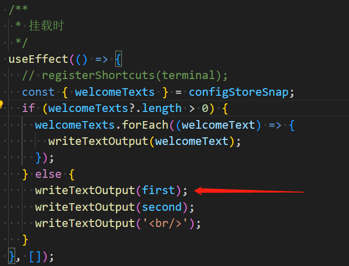
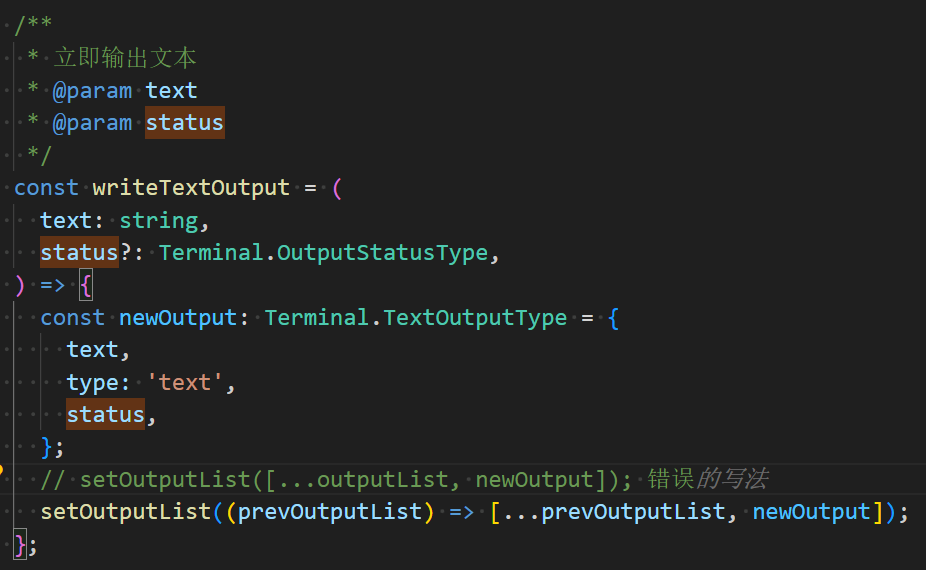
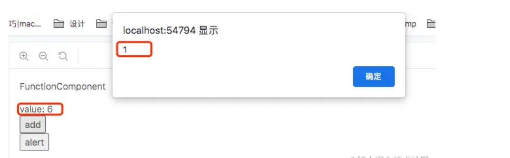
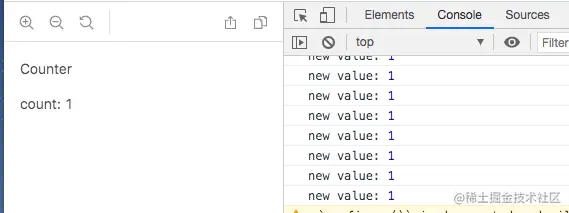

# 记录与解决问题

## 为什么使用className设置元素的class

React 不使用 class 并不是技术问题，而是哲学问题。

React 一开始的理念就是与浏览器的` DOM API `保持一致而不是 HTML，因为这样会和元素的创建更为接近。

在DOM元素上设置 class 需要使用 className 这个 API：

```js
const arr = document.createElement("div")
arr.className = "hello" 
```

但是随着React的更新，现在设置元素的类名也允许使用`class`了，但是在`class`与`className`一起使用时，`className	`的优先级会更高


## 匹配多次重新渲染中的state

```jsx
import { useState } from 'react';

export default function App() {
  const [reverse, setReverse] = useState(false);
  let checkbox = (
    <label>
      <input
        type="checkbox"
        checked={reverse}
        onChange={e => setReverse(e.target.checked)}
      />
      调换顺序
    </label>
  );
  if (reverse) {
    return (
      <>
        <Field label="姓氏" /> 
        <Field label="名字" />
        {checkbox}
      </>
    );
  } else {
    return (
      <>
        <Field label="名字" /> 
        <Field label="姓氏" />
        {checkbox}
      </>
    );    
  }
}

function Field({ label }) {
  const [text, setText] = useState('');
  return (
    <label>
      {label}：
      <input
        type="text"
        value={text}
        placeholder={label}
        onChange={e => setText(e.target.value)}
      />
    </label>
  );
}

```

这里有一个表格，点击复选框时，将两个input框交换位置，但是现在React不知道两个组件在重新渲染之后的state应该怎么分配（从渲染树的角度来看）

因此为组件设置一个key就好了

```jsx
      <>
        <Field label="姓氏" key="firstName"/> 
        <Field label="名字" key="lastName"/>
        {checkbox}
      </>
```


## Each child in a list should have a unique “key” prop

该异常意思很明确，就是没有为每一个遍历的元素添加一个key

在一次渲染中，我写了三层条件判断


其中第一种情况：


这种情况下，还存在一个map进行遍历渲染，这里面这层的key我们就不能再是赋予index，会重复！

第二种情况：


同样的，一开始在最外层我忘记赋予key了，只是给与了一个空标签`<></>`，导致了这个异常的出现，其中里面也存在一层map，也是不能使用index赋予key，会重复


##同一快照下多次setState

出现了，react官方文档的举例的一个Bug！！！

需求是：在组件挂载后，渲染出三句话（写死的）



注意这里连续调用了三次`writeTextOutput`函数，再看这个函数的实现！



可以看到这里有一个对state变量的修改，根据react官网说法，当多次调用对state变量的修改函数时，React会将这些更新批量处理，那么相当于这三次修改都处于一开始为空的state快照中

本质就是：

```jsx
setOutputList([...[], newOutput1]);
setOutputList([...[], newOutput2]);
setOutputList([...[], newOutput3]);
```

你只是调用了三次同一快照的函数罢了，因此解决办法就是传入更新函数基于最新状态去更新state


## 闭包问题（闭包陷阱）

今天在写代码过程中发现，terminal暴露的函数中引用了某一个state变量，但是函数实际运行过程中发现这个state变量打印的值永远是初始值，调试工具中该值是实际被改变了的

这是因为在react中，闭包是常见的，因为react的组件都是函数，我们在函数里面写函数，这不就是闭包吗，而如果没有处理措施，那么闭包中引用的值将永远都是该函数创建时后引用的初始值！！

### 什么是闭包陷阱

```jsx
const FunctionComponent = () => {
  const [value, setValue] = useState(1)
  const log = () => {
    setTimeout(() => {
      alert(value)
    }, 1000);
  }
  return (
    <div>
      <p>FunctionComponent</p>
      <div>value: {value}</div>
      <button onClick={() => setValue(value + 1)}>add</button>
      <br/>
      <button onClick={log}>alert</button>
    </div>
  )
}
```

如上组件中我们定义了一个state，并且提供一个按钮可以增加他的值并将其展示在页面中，同时还有一个按钮用于延时展示state的值

假设我们在1s内点击6次，出现下面的结果



**log 方法内的 value 和点击动作触发那一刻的 value 相同，但是value 的后续变化不会对 log 方法内的 value 造成影响**。这种现象被称为“闭包陷阱”或者被叫做“Capture Value” ：函数式组件每次render 都会生产一个新的 log 函数，这个新的 log 函数会产生一个在当前这个阶段 value 值的闭包。

- 完整过程：

1. 初始次渲染，生成一个 log 函数（value = 1）
2. value 为 1 时，点击 alert 按钮执行 log 函数（value = 1）
3. 点击按钮增加 value，比如 value 增加到 6，组件 render ，生成一个新的 log 函数（value = 6）
4. 计时器触发，log 函数（value = 1）弹出闭包内的 value 为 1


### 解决办法

#### useRef保存最新引用

```jsx
  const countRef = useRef(value)

  useEffect(() => {
    countRef.current = value
  }, [value])

  const log = useCallback(
    () => {
      setTimeout(() => {
        alert(countRef.current)
      }, 1000);
    },
    [value],
  )

```

还是一样的例子，**useRef** 每次 render 时都会返回**同一个引用类型的对象**，使用`useEffect`获取最新值赋予给它，我们设置值和读取值都在这个对象上处理，这样就能获取到最新的 value 值了。


#### 使用状态更新函数

假设现在我们要开一个每秒自增的计数器，我们一般会写出下面这样的代码：

```jsx
const Counter = () => {
  const [value, setValue] = useState(0)

  useEffect(() => {
    const timer = setInterval(() => {
      console.log('new value:', value+1)
      setValue(value + 1)
    }, 1000);
    return () => {
      clearInterval(timer)
    }
  }, [])

  return (
    <div>
      <p>Counter</p>
      <div>count: {value}</div>
    </div>
  )
}
```

上面的代码中，我们在 `useEffect` 中不断更新 value 的值，但是结合我们之前的闭包陷阱问题来分析，我们可以发现定时器的value值永远都会是 0，这就导致每次设置的 value 值都是 1，下图是运行的结果。



“闭包陷阱” 最大的问题就是在函数数内无法获取的最新的 state 的值，那 React 提供了哪些方法来解决呢？

1. useRef 
2. 使用状态更新函数

```jsx
const [value, setValue] = useState(0)

  useEffect(() => {
    const timer = setInterval(() => {
      // 回调函数的最新值
      setValue(value => value + 1)
    }, 1000);
    return () => {
      clearInterval(timer)
    }
  }, [])
```


### 与hook依赖

**useEffect**、**useLayoutEffect**、**useCallback**、**useMemo** 的第二个参数为依赖数组，依·赖数组中任意一个依赖变化（浅比较）会有如下效果：

1. **useEffect**、**useLayoutEffect** 内部的副作用函数会执行，并且副作用函数可以获取到当前所有依赖的最新值。
2. **useCallback**、**useMemo** 会返回新的函数或对象，并缺内部的函数也能获取到当前所有依赖的最新值。

利用这个机制理论可以解决“闭包陷阱”，但是在某种情况下不适用：

```jsx
const Counter = () => {
  const [value, setValue] = useState(0)

  useEffect(() => {
    const timer = setInterval(() => {
      console.log('tick:', value+1)
      setValue(value + 1)
    }, 1000);
    return () => {
    	console.log('clear')
      clearInterval(timer)
    }
  - }, [])
  + }, [value])

  return (
    <div>
      <p>Counter</p>
      <div>count: {value}</div>
    </div>
  )
}
```

上面的代码我们把 value 作为依赖项加入到依赖数组，却是能够实现功能，但是每次都会经历 `clearInterval -> setValue ->clearInterval `的循环。这就**造成了不必要的性能消耗**。还有一种极端的情况，如果我们没有返回取消定时器的函数，**就会不断增加新的定时器**。


[再学 React Hooks (一）：闭包陷阱 - 掘金 (juejin.cn)](https://juejin.cn/post/6972893133243695141#heading-3)

[javascript - 详解 React 中的闭包问题 - zidan blog - SegmentFault 思否](https://segmentfault.com/a/1190000044152201)


## 自定义hook是独立的

今天在项目中在两个地方使用到了同一个自定义hook，我希望的是这两个自定义hook的内容是同步的，但是并不是这样的，每一个自定义hook都拥有自己独立的state和函数鸭鸭！！


## 为什么一个ignore变量就可以避免竞争问题

首先要知道什么是竞争问题：

```jsx
  useEffect(() => {
    fetchResults(query, page).then(json => {
      setResults(json);
    });
  }, [query, page]);
```

如上所示，这段代码使用`useEffect`去同步发送请求，例如query是一个会被频繁输入的state，例如输入hello，那么这里一共会发送5次请求，包括query的值为h、he、hel、hell、hello的请求，但是请求是异步的，我们无法保证异步请求的结果到达顺序，假设hell的请求在hello的请求到来之后回来了，那么你可能会得到非预期的Results因为它的setResults是最后才调用的！！

```jsx
  useEffect(() => {
    let ignore = false;
    fetchResults(query, page).then(json => {
      if (!ignore) {
        setResults(json);
      }
    });
    return () => {
      ignore = true;
    };
  }, [query, page]);
```

要解决这种问题很简单，在闭包内定义一个局部变量就好了

因为每当query的值改变时useEffect被执行，那么定义的局部变量也会被重新定义赋值为初始值，而清理函数会将之前执行的那次useEffect的局部变量设置为`true`，那么即使这一次执行的useEffect的请求响应回来了，那么也不会执行`setResults`进而不会导致错误的Result被记录


# 补充学习React相关

## Suspense与组件懒加载

`lazy` 能够让你在组件第一次被渲染之前延迟加载组件的代码。

```jsx
const SomeComponent = lazy(load)
```

在组件外部调用 `lazy`，以声明一个懒加载的 React 组件:

```jsx
import { lazy } from 'react';

const MarkdownPreview = lazy(() => import('./MarkdownPreview.js'));
```

- 参数：
  - `load`: 一个返回 [Promise](https://developer.mozilla.org/zh-CN/docs/Web/JavaScript/Reference/Global_Objects/Promise) 或另一个 **thenable**（具有 `then` 方法的类 Promise 对象）的函数。React 不会在你尝试首次渲染返回的组件之前调用 `load` 函数。在 React 首次调用 `load` 后，它将等待其解析，然后将解析值的 `.default` 渲染为 React 组件。返回的 Promise 和 Promise 的解析值都将被缓存，因此 React 不会多次调用 `load` 函数。如果 Promise 被拒绝，则 React 将抛出拒绝原因给最近的错误边界处理。
- 返回值：

`lazy` 返回一个 React 组件，你可以在 fiber 树中渲染。当懒加载组件的代码仍在加载时，尝试渲染它将会处于 *暂停* 状态。使用 [``](https://react.docschina.org/reference/react/Suspense) 可以在其加载时显示一个正在加载的提示。


### 结合Suspense实现懒加载组件

通常，你可以使用静态 [`import`](https://developer.mozilla.org/zh-CN/docs/Web/JavaScript/Reference/Statements/import) 声明来导入组件：

```jsx
import MarkdownPreview from './MarkdownPreview.js';
```

如果想在组件第一次渲染前延迟加载这个组件的代码，请替换成以下导入方式：

```jsx
import { lazy } from 'react';

const MarkdownPreview = lazy(() => import('./MarkdownPreview.js'));
```

此代码依赖于 [动态 `import()`](https://developer.mozilla.org/zh-CN/docs/Web/JavaScript/Reference/Operators/import)，因此可能需要你的打包工具或框架提供支持。使用这种模式**要求导入的懒加载组件必须作为 `default` 导出**。

现在你的组件代码可以按需加载，同时你需要指定在它正在加载时应该显示什么。你可以通过将懒加载组件或其任何父级包装到 [``](https://react.docschina.org/reference/react/Suspense) 边界中来实现：

```jsx
<Suspense fallback={<Loading />}>
  <h2>Preview</h2>
  <MarkdownPreview />
 </Suspense>
```


### 永远不要将React.lazy放到组件内部


如上图所示，我将`React.lazy`方法放到了组件内部执行，导致了页面出现频繁闪动！！！

这是因为在组件内部执行该方法会导致lazy组件状态重置


## useMemo

`useMemo` 是一个 React Hook，它在每次重新渲染的时候能够缓存计算的结果。

```jsx
const cachedValue = useMemo(calculateValue, dependencies)
```

在组件的顶层调用 `useMemo` 来缓存每次重新渲染都需要计算的结果。

```jsx
import { useMemo } from 'react';

function TodoList({ todos, tab }) {
  const visibleTodos = useMemo(
    () => filterTodos(todos, tab),
    [todos, tab]
  );
  // ...
}

```

- 参数：
  - `calculateValue`：要**缓存计算值的函数**。它应该是一个没有任何参数的纯函数，并且可以返回任意类型。React 将会在首次渲染时调用该函数；在之后的渲染中，如果 `dependencies` 没有发生变化，React 将直接返回相同值。否则，将会再次调用 `calculateValue` 并返回最新结果，然后缓存该结果以便下次重复使用。
  - `dependencies`：所有在 `calculateValue` 函数中使用的响应式变量组成的数组。**响应式变量包括 props、state 和所有你直接在组件中定义的变量和函数**。如果你在代码检查工具中 [配置了 React](https://zh-hans.react.dev/learn/editor-setup#linting)，它将会确保每一个响应式数据都被正确地定义为依赖项。依赖项数组的长度必须是固定的并且必须写成 `[dep1, dep2, dep3]` 这种形式。React 使用 [`Object.is`](https://developer.mozilla.org/zh-CN/docs/Web/JavaScript/Reference/Global_Objects/Object/is) 将每个依赖项与其之前的值进行比较。

在初次渲染时，`useMemo` 返回**不带参数**调用 `calculateValue` 的结果。

**在接下来的渲染中，如果依赖项没有发生改变，它将返回上次缓存的值；否则将再次调用 `calculateValue`，并返回最新结果**。

- 注意
  - `useMemo` 是一个 React Hook，所以你只能 **在组件的顶层** 或者自定义 Hook 中调用它。你不能在循环语句或条件语句中调用它。如有需要，将其提取为一个新组件并使用 state。

> tips：
>
> 这种缓存返回值的方式也叫做 [记忆化（memoization）](https://en.wikipedia.org/wiki/Memoization)，这也是该 Hook 叫做 `useMemo` 的原因。


### 用法

#### 跳过代价昂贵的重新计算

在组件顶层调用 `useMemo` 以在重新渲染之间缓存计算结果：

```jsx
import { useMemo } from 'react';

function TodoList({ todos, tab, theme }) {
  const visibleTodos = useMemo(() => filterTodos(todos, tab), [todos, tab]);
  // ...
}
```

你需要给 `useMemo` 传递两样东西：

1. 一个没有任何参数的 calculation 函数，像这样 `() =>`，并且返回任何你想要的计算结果。
2. 一个由包含在你的组件中并在 calculation 中使用的所有值组成的 依赖列表。

在初次渲染时，你从 `useMemo` 得到的 值 将会是你的 calculation 函数执行的结果。

在随后的每一次渲染中，React 将会比较前后两次渲染中的 所有依赖项 是否相同。如果通过 [`Object.is`](https://developer.mozilla.org/zh-CN/docs/Web/JavaScript/Reference/Global_Objects/Object/is) 比较所有依赖项都没有发生变化，那么 `useMemo` 将会返回之前已经计算过的那个值。否则，React 将会重新执行 calculation 函数并且返回一个新的值。

换言之，`useMemo` 在多次重新渲染中缓存了 calculation 函数计算的结果直到依赖项的值发生变化。

如下例子：

默认情况下，React 会在每次重新渲染时重新运行整个组件。例如，如果 `TodoList` 更新了 state 或从父组件接收到新的 props，`filterTodos` 函数将会重新运行：

如果计算速度很快，这将不会产生问题。但是，当正在过滤转换一个大型数组，或者进行一些昂贵的计算，而数据没有改变，那么可能希望跳过这些重复计算。如果 `todos` 与 `tab` 都与上次渲染时相同，那么像之前那样将计算函数包装在 `useMemo` 中，便可以重用已经计算过的 `visibleTodos`。

这种缓存行为叫做 [记忆化](https://en.wikipedia.org/wiki/Memoization)。

> tips：
>
> **你应该仅仅把 useMemo 作为性能优化的手段**。如果没有它，你的代码就不能正常工作，那么请先找到潜在的问题并修复它。然后再添加 `useMemo` 以提高性能。
>
> 使用 `useMemo` 进行优化仅在少数情况下有价值：
>
> - 你在 `useMemo` 中进行的计算明显很慢，而且它的依赖关系很少改变。
> - 将计算结果作为 props 传递给包裹在 [`memo`](https://zh-hans.react.dev/reference/react/memo) 中的组件。当计算结果没有改变时，你会想跳过重新渲染。记忆化让组件仅在依赖项不同时才重新渲染。
> - 你传递的值稍后用作某些 Hook 的依赖项。例如，也许另一个 `useMemo` 计算值依赖它，或者 [`useEffect`](https://zh-hans.react.dev/reference/react/useEffect) 依赖这个值。

下面是一个例子：

```jsx
// App.js
import { useState } from 'react';
import { createTodos } from './utils.js';
import TodoList from './TodoList.js';

const todos = createTodos();

export default function App() {
  const [tab, setTab] = useState('all');
  const [isDark, setIsDark] = useState(false);
  return (
    <>
      <button onClick={() => setTab('all')}>
        All
      </button>
      <button onClick={() => setTab('active')}>
        Active
      </button>
      <button onClick={() => setTab('completed')}>
        Completed
      </button>
      <br />
      <label>
        <input
          type="checkbox"
          checked={isDark}
          onChange={e => setIsDark(e.target.checked)}
        />
        Dark mode
      </label>
      <hr />
      <TodoList
        todos={todos}
        tab={tab}
        theme={isDark ? 'dark' : 'light'}
      />
    </>
  );
}
```

```jsx
// TodoList.js
import { useMemo } from 'react';
import { filterTodos } from './utils.js'

export default function TodoList({ todos, theme, tab }) {
  // const visibleTodos = filterTodos(todos, tab);
  const visibleTodos = useMemo(
    () => filterTodos(todos, tab),
    [todos, tab]
  );
  return (
    <div className={theme}>
      <p><b>Note: <code>filterTodos</code> is artificially slowed down!</b></p>
      <ul>
        {visibleTodos.map(todo => (
          <li key={todo.id}>
            {todo.completed ?
              <s>{todo.text}</s> :
              todo.text
            }
          </li>
        ))}
      </ul>
    </div>
  );
}
```

```jsx
// Utils.js
export function createTodos() {
  const todos = [];
  for (let i = 0; i < 50; i++) {
    todos.push({
      id: i,
      text: "Todo " + (i + 1),
      completed: Math.random() > 0.5
    });
  }
  return todos;
}

export function filterTodos(todos, tab) {
  console.log('[ARTIFICIALLY SLOW] Filtering ' + todos.length + ' todos for "' + tab + '" tab.');
  let startTime = performance.now();
  while (performance.now() - startTime < 500) {
    // 在 500 毫秒内不执行任何操作以模拟极慢的代码
  }

  return todos.filter(todo => {
    if (tab === 'all') {
      return true;
    } else if (tab === 'active') {
      return !todo.completed;
    } else if (tab === 'completed') {
      return todo.completed;
    }
  });
}
```

如上例子中，`TodoList`组件会在传入的props被修改时重新渲染，但是我们发现，每次重新渲染都会去重新计算得到新的TodoList渲染数据，但是`theme`改变时我们无需这样做！！因此使用`useMemo`是正确的，因为只有在TodoList的数据真正改变时我们才去计算


#### 跳过组件的重新渲染

在某些情况下，`useMemo` 还可以帮助你优化重新渲染子组件的性能。为了说明这一点，假设这个 `TodoList` 组件将 `visibleTodos` 作为 props 传递给子 `List` 组件：

```jsx
export default function TodoList({ todos, tab, theme }) {
  // 每当主题发生变化时，这将是一个不同的数组……
  const visibleTodos = filterTodos(todos, tab);
  return (
    <div className={theme}>
      {/* ... 所以List的props永远不会一样，每次都会重新渲染 */}
      <List items={visibleTodos} />
    </div>
  );
}
```

**默认情况下，当一个组件重新渲染时，React 会递归地重新渲染它的所有子组件**。这就是为什么当 `TodoList` 使用不同的 `theme` 重新渲染时，`List` 组件 **也会** 重新渲染。这对于不需要太多计算来重新渲染的组件来说很好。但是如果你已经确认重新渲染很慢，你可以通过将它包装在 [`memo`](https://zh-hans.react.dev/reference/react/memo) 中，这样**当它的 props 跟上一次渲染相同的时候它就会跳过本次渲染：**

```jsx
import { memo } from 'react';

const List = memo(function List({ items }) {
  // ...
});
```

**在上面的示例中，filterTodos 函数总是创建一个不同数组**，类似于 `{}` 总是创建一个新对象的方式。通常，这不是问题，但这意味着 `List` 属性永远不会相同，并且你的 [`memo`](https://zh-hans.react.dev/reference/react/memo) 优化将不起作用。这就是 `useMemo` 派上用场的地方：

```jsx
export default function TodoList({ todos, tab, theme }) {
  // 告诉 React 在重新渲染之间缓存你的计算结果...
  const visibleTodos = useMemo(
    () => filterTodos(todos, tab),
    [todos, tab] // ...所以只要这些依赖项不变...
  );
  return (
    <div className={theme}>
      {/* ... List 也就会接受到相同的 props 并且会跳过重新渲染 */}
      <List items={visibleTodos} />
    </div>
  );
}
```

**通过将 visibleTodos 的计算函数包裹在 useMemo 中，你可以确保它在重新渲染之间具有相同值**，直到依赖项发生变化。

> useMemo与JSX节点：
>
> 你可以将 `<List />` JSX 节点本身包裹在 `useMemo` 中，而不是将 `List` 包裹在 [`memo`](https://zh-hans.react.dev/reference/react/memo) 中：
>
> ```jsx
> export default function TodoList({ todos, tab, theme }) {
>   const visibleTodos = useMemo(() => filterTodos(todos, tab), [todos, tab]);
>
>   const children = useMemo(() => <List items={visibleTodos} />, [visibleTodos]);
>   return (
>     <div className={theme}>
>       {children}
>     </div>
>   );
> }
> ```
>
> 他们的行为表现是一致的。如果 `visibleTodos` 没有改变，`List` 将不会重新渲染。
>
> 手动将 JSX 节点包裹到 `useMemo` 中并不方便，比如你**不能在条件语句中这样做**。
>
> 因此还是**推荐**使用 [`memo`](https://zh-hans.react.dev/reference/react/memo) 包装组件而不是使用 `useMemo` 包装 JSX 节点。


#### 记忆其他Hook的依赖

假设你有一个计算函数依赖于直接在组件主体中创建的==对象（强调是对象，如果是普通变量重新渲染之后的值并不会变）==：

```jsx
function Dropdown({ allItems, text }) {
  const searchOptions = { matchMode: 'whole-word', text };

  const visibleItems = useMemo(() => {
    return searchItems(allItems, searchOptions);
  }, [allItems, searchOptions]); // 🚩 提醒：依赖于在组件主体中创建的对象
  // ...
```

依赖这样的一个变量会破坏记忆化的功能，因为只要组件重新渲染，组件主体内所有的代码都会重新运行计算，那么searchOptions的值自然每次都不同！！！那么依赖于该变量的visibleItems自然每次都需要重新计算searchItems了

要解决此问题，你可以在将其作为依赖项传递之前记忆 `searchOptions` 对象 **本身**：

```jsx
function Dropdown({ allItems, text }) {
  const searchOptions = useMemo(() => {
    return { matchMode: 'whole-word', text };
  }, [text]); // ✅ 只有当 text 改变时才会发生改变

  const visibleItems = useMemo(() => {
    return searchItems(allItems, searchOptions);
  }, [allItems, searchOptions]); // ✅ 只有当 allItems 或 serachOptions 改变时才会发生改变
  // ...
```

在上面的例子中，如果 `text` 没有改变，`searchOptions` 对象也不会改变。然而，更好的解决方法是将 `searchOptions` 对象声明移到 `useMemo` 计算函数的 **内部**：

```jsx
function Dropdown({ allItems, text }) {
  const visibleItems = useMemo(() => {
    const searchOptions = { matchMode: 'whole-word', text };
    return searchItems(allItems, searchOptions);
  }, [allItems, text]); // ✅ 只有当 allItems 或者 text 改变的时候才会重新计算
  // ...
```


#### 记忆一个函数

假设 `Form` 组件被包裹在 [`memo`](https://zh-hans.react.dev/reference/react/memo) 中，你想将一个函数作为 props 传递给它：

```jsx
export default function ProductPage({ productId, referrer }) {
  function handleSubmit(orderDetails) {
    post('/product/' + productId + '/buy', {
      referrer,
      orderDetails
    });
  }

  return <Form onSubmit={handleSubmit} />;
}
```

正如 `{}` 每次都会创建不同的对象一样，像 `function() {}` 这样的函数声明和像 `() => {}` 这样的表达式在每次重新渲染时都会产生一个 **不同** 的函数。就其本身而言，创建一个新函数不是问题。这不是可以避免的事情！但是，如果 `Form` 组件被记忆了，大概你想在没有 props 改变时跳过它的重新渲染。**总是** 不同的 props 会破坏你的记忆化。

因此，我们需要对这个函数记忆化处理

要使用 `useMemo` 记忆函数，你的计算函数必须返回另一个函数：

```jsx
export default function Page({ productId, referrer }) {
  const handleSubmit = useMemo(() => {
    return (orderDetails) => {
      post('/product/' + productId + '/buy', {
        referrer,
        orderDetails
      });
    };
  }, [productId, referrer]);

  return <Form onSubmit={handleSubmit} />;
}
```

实际上，React提供了另外一个Hook用于记忆函数，**将你的函数包装到 useCallback 而不是 useMemo** 中，以避免编写额外的嵌套函数：

```jsx
export default function Page({ productId, referrer }) {
  const handleSubmit = useCallback((orderDetails) => {
    post('/product/' + productId + '/buy', {
      referrer,
      orderDetails
    });
  }, [productId, referrer]);
  return <Form onSubmit={handleSubmit} />;
}
```

上面两个例子是完全等价的。`useCallback` 的唯一好处是它可以让你避免在内部编写额外的嵌套函数。它没有做任何其他事情。[阅读更多关于 `useCallback` 的内容](https://zh-hans.react.dev/reference/react/useCallback)。


## useCallBack

`useCallback` 是一个允许你在多次渲染中缓存函数的 React Hook。

```jsx
const cachedFn = useCallback(fn, dependencies)
```

在组件顶层调用 `useCallback` 以便在多次渲染中缓存函数：

```jsx
import { useCallback } from 'react';

export default function ProductPage({ productId, referrer, theme }) {
  const handleSubmit = useCallback((orderDetails) => {
    post('/product/' + productId + '/buy', {
      referrer,
      orderDetails,
    });
  }, [productId, referrer]);
```

- 参数：
  - `fn`：想要缓存的函数。此函数可以接受任何参数并且返回任何值。在初次渲染时，React 将把函数返回给你（而不是调用它！）。当进行下一次渲染时，如果 `dependencies` 相比于上一次渲染时没有改变，那么 React 将会返回相同的函数。否则，React 将返回在最新一次渲染中传入的函数，并且将其缓存以便之后使用。**React 不会调用此函数，而是返回此函数**。你可以自己决定何时调用以及是否调用。
  - `dependencies`：有关是否更新 `fn` 的所有响应式值的一个列表。响应式值包括 props、state，和所有在你组件内部直接声明的变量和函数。如果你的代码检查工具 [配置了 React](https://zh-hans.react.dev/learn/editor-setup#linting)，那么它将校验每一个正确指定为依赖的响应式值。依赖列表必须具有确切数量的项，并且必须像 `[dep1, dep2, dep3]` 这样编写。React 使用 [`Object.is`](https://developer.mozilla.org/zh-CN/docs/Web/JavaScript/Reference/Global_Objects/Object/is) 比较每一个依赖和它的之前的值。
- 返回值

在初次渲染时，`useCallback` 返回你已经传入的 `fn` 函数

在之后的渲染中, 如果依赖没有改变，`useCallback` 返回上一次渲染中缓存的 `fn` 函数；否则返回这一次渲染传入的 `fn`。

- 注意：
  - `useCallback` 是一个 Hook，所以应该在 **组件的顶层** 或自定义 Hook 中调用。你不应在循环或者条件语句中调用它。如果你需要这样做，请新建一个组件，并将 state 移入其中。


### 用法

#### 跳过组件的重新渲染

你优化渲染性能的时候，有时需要缓存传递给子组件的函数

```jsx
import { useCallback } from 'react';

function ProductPage({ productId, referrer, theme }) {
  const handleSubmit = useCallback((orderDetails) => {
    post('/product/' + productId + '/buy', {
      referrer,
      orderDetails,
    });
  }, [productId, referrer]);

  // ...
```

你需要传递两个参数给 `useCallback`：

1. 在多次渲染中需要缓存的函数
2. 函数内部需要使用到的所有组件内部值的 依赖列表。

初次渲染时，在 `useCallback` 处接收的 返回函数 将会是已经传入的函数。

在之后的渲染中，React 将会使用 [`Object.is`](https://developer.mozilla.org/zh-CN/docs/Web/JavaScript/Reference/Global_Objects/Object/is) 把 当前的依赖 和已传入之前的依赖进行比较。如果没有任何依赖改变，`useCallback` 将会返回与之前一样的函数。否则 `useCallback` 将返回 **此次** 渲染中传递的函数。

简而言之，`useCallback` 在多次渲染中缓存一个函数，直至这个函数的依赖发生改变。

如下是一个例子：

```jsx
function ProductPage({ productId, referrer, theme }) {
  // ...
  return (
    <div className={theme}>
      <ShippingForm onSubmit={handleSubmit} />
    </div>
  );
```

**默认情况下，当一个组件重新渲染时， React 将递归渲染它的所有子组件**，因此每当因 `theme` 更改时而 `ProductPage` 组件重新渲染时，`ShippingForm` 组件也会重新渲染。这对于不需要大量计算去重新渲染的组件来说影响很小。但如果你发现某次重新渲染很慢，你可以将 `ShippingForm` 组件包裹在 [`memo`](https://zh-hans.react.dev/reference/react/memo) 中。如果 props 和上一次渲染时相同，那么 `ShippingForm` 组件将跳过重新渲染。

**当代码像上面一样改变后，如果 props 与上一次渲染时相同，ShippingForm 将跳过重新渲染**。这时缓存函数就变得很重要。假设定义了 `handleSubmit` 而没有定义 `useCallback`：

```jsx
function ProductPage({ productId, referrer, theme }) {
  // 每当 theme 改变时，都会生成一个不同的函数
  function handleSubmit(orderDetails) {
    post('/product/' + productId + '/buy', {
      referrer,
      orderDetails,
    });
  }
  
  return (
    <div className={theme}>
      {/* 这将导致 ShippingForm props 永远都不会是相同的，并且每次它都会重新渲染 */}
      <ShippingForm onSubmit={handleSubmit} />
    </div>
  );
}
```

与字面量对象 `{}` 总是会创建新对象类似，**在 JavaScript 中，function () {} 或者 () => {} 总是会生成不同的函数**。正常情况下，这不会有问题，但是这意味着 `ShippingForm` props 将永远不会是相同的，并且 [`memo`](https://zh-hans.react.dev/reference/react/memo) 对性能的优化永远不会生效。而这就是 `useCallback` 起作用的地方：

```jsx
function ProductPage({ productId, referrer, theme }) {
  // 在多次渲染中缓存函数
  const handleSubmit = useCallback((orderDetails) => {
    post('/product/' + productId + '/buy', {
      referrer,
      orderDetails,
    });
  }, [productId, referrer]); // 只要这些依赖没有改变

  return (
    <div className={theme}>
      {/* ShippingForm 就会收到同样的 props 并且跳过重新渲染 */}
      <ShippingForm onSubmit={handleSubmit} />
    </div>
  );
}
```

**将 handleSubmit 传递给 useCallback 就可以确保它在多次重新渲染之间是相同的函数**，直到依赖发生改变。

> tips：
>
> **useCallback 只应作用于性能优化**。如果代码在没有它的情况下无法运行，请找到根本问题并首先修复它，然后再使用 `useCallback`。

> `useMemo`VS`useCallBack`
>
> 区别在于你需要缓存 **什么**:
>
> - **useMemo 缓存函数调用的结果**。在这里，它缓存了调用 `computeRequirements(product)` 的结果。除非 `product` 发生改变，否则它将不会发生变化。这让你向下传递 `requirements` 时而无需不必要地重新渲染 `ShippingForm`。必要时，React 将会调用传入的函数重新计算结果。
> - **useCallback 缓存函数本身**。不像 `useMemo`，它不会调用你传入的函数。相反，它缓存此函数。从而除非 `productId` 或 `referrer` 发生改变，`handleSubmit` 自己将不会发生改变。这让你向下传递 `handleSubmit` 函数而无需不必要地重新渲染 `ShippingForm`。直至用户提交表单，你的代码都将不会运行。
>
> 实际上`useCallBack`就是`useMemo`的一个应用，你可以这么理解：
>
> ```jsx
> // 在 React 内部的简化实现
> function useCallback(fn, dependencies) {
>   return useMemo(() => fn, dependencies);
> }
> ```


#### 在记忆化回调中更新state

有时，你可能在记忆化回调中基于之前的 state 来更新 state。

下面的 `handleAddTodo` 函数将 `todos` 指定为依赖项，因为它会从中计算下一个 todos：

```jsx
function TodoList() {

  const [todos, setTodos] = useState([]);
  const handleAddTodo = useCallback((text) => {
    const newTodo = { id: nextId++, text };
    setTodos([...todos, newTodo]);
  }, [todos]);

  // ...
```

我们期望记忆化函数具有尽可能少的依赖，当你读取 state 只是为了计算下一个 state 时，你可以通过传递 [updater function](https://zh-hans.react.dev/reference/react/useState#updating-state-based-on-the-previous-state) 以移除该依赖：

```jsx
function TodoList() {

  const [todos, setTodos] = useState([]);
  const handleAddTodo = useCallback((text) => {
    const newTodo = { id: nextId++, text };
    setTodos(todos => [...todos, newTodo]);
  }, []); // ✅ 不需要 todos 依赖项

  // ...
```

在这里，并不是将 `todos` 作为依赖项并在内部读取它，而是传递一个关于 **如何** 更新 state 的指示器 (`todos => [...todos, newTodo]`) 给 React。[阅读更多有关 updater function 的内容](https://zh-hans.react.dev/reference/react/useState#updating-state-based-on-the-previous-state)。


#### 防止频繁触发Effect

有时，你想要在 [Effect](https://zh-hans.react.dev/learn/synchronizing-with-effects) 内部调用函数：

```jsx
function ChatRoom({ roomId }) {
  const [message, setMessage] = useState('');

  function createOptions() {
    return {
      serverUrl: 'https://localhost:1234',
      roomId: roomId
    };
  }

  useEffect(() => {
    const options = createOptions();
    const connection = createConnection();
    connection.connect();
    // ...
```

这会产生一个问题，[每一个响应值都必须声明为 Effect 的依赖](https://zh-hans.react.dev/learn/lifecycle-of-reactive-effects#react-verifies-that-you-specified-every-reactive-value-as-a-dependency)。但是如果将 `createOptions` 声明为依赖，它会导致 Effect 不断重新连接到聊天室(因为每次重新渲染`createOptions`都是一个新函数，因此会导致重新执行`Effect`)：

```jsx
  useEffect(() => {
    const options = createOptions();
    const connection = createConnection();
    connection.connect();
    return () => connection.disconnect();
  }, [createOptions]); // 🔴 问题：这个依赖在每一次渲染中都会发生改变
  // ...
```

我们可以将要调用的函数包裹在 `useCallback` 中：

```jsx
function ChatRoom({ roomId }) {
  const [message, setMessage] = useState('');

  const createOptions = useCallback(() => {
    return {
      serverUrl: 'https://localhost:1234',
      roomId: roomId
    };
  }, [roomId]); // ✅ 仅当 roomId 更改时更改

  useEffect(() => {
    const options = createOptions();
    const connection = createConnection();
    connection.connect();
    return () => connection.disconnect();
  }, [createOptions]); // ✅ 仅当 createOptions 更改时更改
  // ...
```

这将确保如果 `roomId` 相同，`createOptions` 在多次渲染中会是同一个函数。**但是，最好消除对函数依赖项的需求**。将你的函数移入 Effect **内部**：

```jsx
function ChatRoom({ roomId }) {
  const [message, setMessage] = useState('');

  useEffect(() => {
    function createOptions() { // ✅ 无需使用回调或函数依赖！
      return {
        serverUrl: 'https://localhost:1234',
        roomId: roomId
      };
    }

    const options = createOptions();
    const connection = createConnection();
    connection.connect();
    return () => connection.disconnect();
  }, [roomId]); // ✅ 仅当 roomId 更改时更改
  // ...
```


#### 优化自定义Hook

```jsx
如果你正在编写一个 自定义 Hook，建议将它返回的任何函数包裹在 useCallback 中：

function useRouter() {
  const { dispatch } = useContext(RouterStateContext);

  const navigate = useCallback((url) => {
    dispatch({ type: 'navigate', url });
  }, [dispatch]);

  const goBack = useCallback(() => {
    dispatch({ type: 'back' });
  }, [dispatch]);

  return {
    navigate,
    goBack,
  };
}
```


## state存储前一次渲染的信息

通常情况下，你会在事件处理函数中更新状态

但有时候，我们希望在响应渲染时调整状态——例如，当 props 改变时，你可能希望改变状态变量。

我们的做法通常如下：

- **如果你需要的值可以完全从当前 props 或其他 state 中计算出来，那么 完全可以移除那些多余的状态**。如果你担心重新计算的频率过高，可以使用 [`useMemo` Hook](https://zh-hans.react.dev/reference/react/useMemo) 来帮助优化。
- 如果你想重置整个组件树的状态，[可以向组件传递一个不同的 `key`](https://zh-hans.react.dev/reference/react/useState#resetting-state-with-a-key)。
- 如果可以的话，在事件处理函数中更新所有相关状态。

如果上述方法都无法适用你的情况的话，我们还可以在组件渲染时调用`set`函数来基于已经渲染的值更新状态

这里是一个例子。这个 `CountLabel` 组件显示传递给它的 `count` props：

```jsx
export default function CountLabel({ count }) {
  return <h1>{count}</h1>
}
```

需求：你想显示计数器自上一次更改以来的情况

我们需要跟踪它的先前值，因此需要添加一个`prevCount`state变量来跟踪它，再添加另一个状态变量 `trend` 来保存计数是否增加或减少，比较 `prevCount` 和 `count`，如果它们不相等，则更新 `prevCount` 和 `trend`。现在你既可以显示当前的 `count` props，也可以显示 **自上次渲染以来它如何改变**。

```jsx
import { useState } from 'react';

export default function CountLabel({ count }) {
  const [prevCount, setPrevCount] = useState(count);
  const [trend, setTrend] = useState(null);
  if (prevCount !== count) {
    setPrevCount(count);
    setTrend(count > prevCount ? 'increasing' : 'decreasing');
  }
  return (
    <>
      <h1>{count}</h1>
      {trend && <p>The count is {trend}</p>}
    </>
  );
}

```

**注意**：

- 在渲染期间调用`set`函数，他必须位于条件语句中，否则会陷入渲染死循环！
- 此外，你只能像上面这样更新当前渲染组件的state，而不能调用另一个组件的`set`函数

这种做法可能难以理解，最好避免使用，但是它在Effect中更新state要好

**执行过程**：当你在渲染期间调用 `set` 函数时，React 将在你的组件使用 `return` 语句退出后立即重新渲染该组件，**并在渲染子组件前进行**。这样，子组件就不需要进行两次渲染。你的组件函数的其余部分仍会执行（然后结果将被丢弃）。

如果你的条件判断在所有 Hook 调用的下方，可以提前添加一个 `return;` 以便更早地重新开始渲染。


