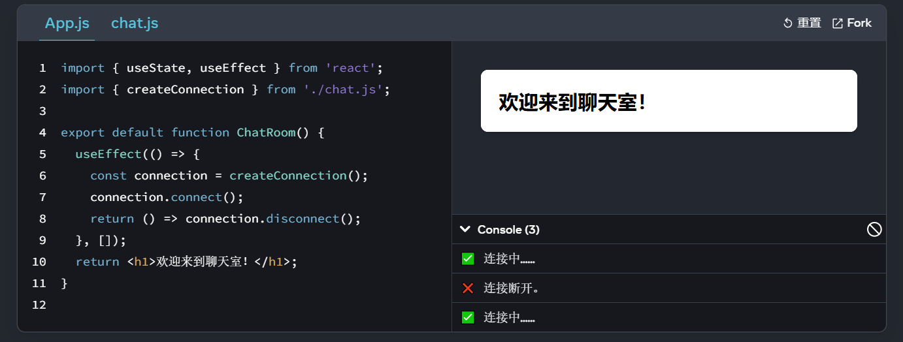

# 脱围机制

有些组件可能需要控制和同步 React 之外的系统。例如，你可能需要使用浏览器 API 聚焦输入框，或者在没有 React 的情况下实现视频播放器，或者连接并监听远程服务器的消息。在本章中，你将学习到一些脱围机制，让你可以“走出” React 并连接到外部系统。大多数应用逻辑和数据流不应该依赖这些功能。


## 使用ref引用值

### 概述

如果你希望组件"记住"某些信息，但是又不想让这些信息修改时触发渲染，你可以使用`ref`：

使用Hook `useRef`进行声明变量即可

```jsx
import {useRef} from 'react'

// 参数是唯一的，代表你想要的变量初始值
const ref = useRef(0);

// useRef返回这样一个对象
{ 
  current: 0 // 你向 useRef 传入的值
}
```

与 state 一样，ref 在重新渲染之间由 React 保留。但是，**设置 state 会重新渲染组件，而更改 ref 不会**！你可以通过 `ref.current` 属性访问该 ref 的当前值（**可读可改**）。

如下例子：

```jsx
import { useRef } from 'react';

export default function Counter() {
  let ref = useRef(0);
  console.log('渲染了')
  function handleClick() {
    ref.current = ref.current + 1;
    alert('你点击了 ' + ref.current + ' 次!');
  }

  return (
    <button onClick={handleClick}>
      点我！
    </button>
  );
}
```

运行代码可以发现在点击了按钮之后并不会打印 渲染了

这里的 ref 指向一个数字，但是，像 [state](https://zh-hans.react.dev/learn/state-a-components-memory) 一样，你可以让它**指向任何东西**：字符串、对象，甚至是函数。与 state 不同的是，**ref 是一个普通的 JavaScript 对象**，具有可以被读取和修改的 `current` 属性。

在官网中有一个秒表例子，可具体参考：[使用 ref 引用值 – React 中文文档](https://zh-hans.react.dev/learn/referencing-values-with-refs)


###ref VS state

我们建议你使用 state。ref 是一种“脱围机制”，你并不会经常用到它。 以下是 state 和 ref 的对比：

| ref                                                         | state                                                        |
| ----------------------------------------------------------- | ------------------------------------------------------------ |
| `useRef(initialValue)`返回 `{ current: initialValue }`      | `useState(initialValue)` 返回 state 变量的当前值和一个 state 设置函数 ( `[value, setValue]`) |
| 更改时**不会**触发重新渲染                                  | 更改时**触发**重新渲染。                                     |
| **可变** —— 你可以在渲染过程之外修改和更新 `current` 的值。 | “不可变” —— **你必须使用 state 设置函数**来修改 state 变量，从而排队重新渲染。 |
| 你**不应在渲染期间读取（或写入）** `current` 值。           | 你可以**随时读取** state。但是，每次渲染都有自己不变的 state [快照](https://zh-hans.react.dev/learn/state-as-a-snapshot)。 |

下面这个例子可以看到：

```jsx
import { useState } from 'react';

export default function Counter() {
  const [count, setCount] = useState(0);

  function handleClick() {
    setCount(count + 1);
  }

  console.log('渲染了')
  
  return (
    <button onClick={handleClick}>
      你点击了 {count} 次
    </button>
  );
}

```

```jsx
import { useRef } from 'react';

export default function Counter() {
  let countRef = useRef(0);

  function handleClick() {
    // 这样并未重新渲染组件！
    countRef.current = countRef.current + 1;
  }

  return (
    <button onClick={handleClick}>
      你点击了 {countRef.current} 次
    </button>
  );
}

```

可以看到两个例子分别使用了`state`和`ref`存储我们需要用于渲染的变量count，但是运行代码发现使用`ref`的例子中，并不能正常运行，因为它完全没有触发组件的重新渲染

这就是为什么在渲染期间读取 `ref.current` 会导致代码不可靠的原因。如果需要，请改用 state

需要强调的是：

React state 的限制不适用于 ref。例如，state 就像 [每次渲染的快照](https://zh-hans.react.dev/learn/state-as-a-snapshot)，并且 [不会同步更新](https://zh-hans.react.dev/learn/queueing-a-series-of-state-updates)/"立即更新"。但是当你改变 **ref 的 current 值**时，它会**立即改变**：

```jsx
ref.current = 5;
console.log(ref.current); // 5
```

这是因为`ref`本身就是一个普通的JavaScript对象

> ref原理：
>
> 实际上，我们可以想象`useRef`是由`useState`实现的
>
> ```jsx
> // React 内部
> function useRef(initialValue) {
>   const [ref, unused] = useState({ current: initialValue });
>   return ref;
> }
> ```
>
> 在触发初次渲染后，useRef直接返回`{ current: initialValue }`，并且没有使用和返回state设置函数，因为我们的ref不需要触发渲染，而state设置函数的作用就是为了触发渲染


### 应用

- 常见应用：
  - 存储定时器id
  - 存储DOM元素
  - 有时候，在一些异步操作中，state存储的快照不能满足我们实时的需求，ref可能是一种选择
  - 以及其他不影响组件渲染输出的对象
- 原则：
  - **将ref视为脱围机制**：当我们使用到外部系统或浏览器API时，ref是有用的
  - **不要在渲染过程中对`ref.current`进行读写**！如果渲染过程中需要某些信息，请使用 [state](https://zh-hans.react.dev/learn/state-a-components-memory) 代替。由于 React 不知道 `ref.current` 何时发生变化，即使在渲染时读取它也会使组件的行为难以预测。（唯一的例外是像 `if (!ref.current) ref.current = new Thing()` 这样的代码，它只在第一次渲染期间设置一次 ref。）


### ref和DOM

ref常见的用法是访问DOM元素（用法类似`vue`的ref模板引用）

当你将 ref 传递给 JSX 中的 `ref` 属性时，比如 `<div ref={myRef}>`，React 会将相应的 DOM 元素放入 `myRef.current` 中。当元素从 DOM 中删除时，React 会将 `myRef.current` 更新为 `null`。你可以在 [使用 ref 操作 DOM](https://zh-hans.react.dev/learn/manipulating-the-dom-with-refs) 中阅读更多相关信息。


### 思考ref变量与组件里的普通变量的区别

看这个例子：

```jsx
import { useState } from 'react';

export default function Chat() {
  const [text, setText] = useState('');
  const [isSending, setIsSending] = useState(false);
  let timeoutID = null;

  function handleSend() {
    setIsSending(true);
    timeoutID = setTimeout(() => {
      alert('已发送！');
      setIsSending(false);
    }, 3000);
  }

  function handleUndo() {
    setIsSending(false);
    clearTimeout(timeoutID);
  }

  return (
    <>
      <input
        disabled={isSending}
        value={text}
        onChange={e => setText(e.target.value)}
      />
      <button
        disabled={isSending}
        onClick={handleSend}>
        {isSending ? '发送中……' : '发送'}
      </button>
      {isSending &&
        <button onClick={handleUndo}>
          撤销
        </button>
      }
    </>
  );
}

```

这个例子中，我们希望的功能是在用户点击发送之后在延迟3s后alert出 已发送 ，同时在3s内会显示一个 撤销 按钮，如果用户点击撤销，那么即可取消定时器

在这个需求中，我们需要使用一个变量来存储定时器ID，以便进行存储

如上代码的做法是使用了一个普通变量进行存储，实际效果并没有如预期

而是在用户点击了撤销按钮后，仍然alert 已发送

原因：

- 普通变量并不会在每一次React组件的渲染中存活
- 在代码中，当我们点击了撤销按钮，使用了state的设置函数，触发了React的渲染，因此普通变量的值也就不存在了/没有存储到想要的内容了

正确做法还是选择使用ref，因为**ref也是一个特殊的state可以在渲染中存活下来，却不会触发渲染**


## 使用ref操作DOM

 React 会自动处理更新 [DOM](https://developer.mozilla.org/docs/Web/API/Document_Object_Model/Introduction) 以匹配你的渲染输出，因此你在组件中通常不需要操作 DOM。但是，有时你可能需要访问由 React 管理的 DOM 元素 —— 例如，让一个节点获得焦点、滚动到它或测量它的尺寸和位置。在 React 中没有内置的方法来做这些事情，所以你需要一个指向 DOM 节点的 **ref** 来实现


### 获取指定节点的ref

用法上与vue的ref模板引用类似的

要访问由 React 管理的 DOM 节点，首先，引入 `useRef` Hook：

```jsx
import { useRef } from 'react';
```

然后，在你的组件中使用它声明一个 ref：

```jsx
const myRef = useRef(null);
```

最后，将 ref 作为 `ref` 属性值传递给想要获取的 DOM 节点的 JSX 标签：

```jsx
<div ref={myRef}>
```

这样我们的`myRef.current`中就存储了该节点的引用了

```jsx
// 你可以使用任意浏览器 API，例如：
myRef.current.scrollIntoView();
```

具体DOM操作例子可以查看[使用 ref 操作 DOM – React 中文文档](https://zh-hans.react.dev/learn/manipulating-the-dom-with-refs)


### 列表数据绑定ref

有时候，在一个列表数据中，我们需要为其每一项都绑定ref，像这么做是不行的

```jsx
<ul>
  {items.map((item) => {
    // 行不通！
    const ref = useRef(null);
    return <li ref={ref} />;
  })}
</ul>
```

这是因为 **Hook 只能在组件的顶层被调用**。不能在循环语句、条件语句或 `map()` 函数中调用 `useRef` 。

- 解决方案：
  - 使用ref引用其父元素，再使用DOM方法`querySelectorAll`来寻找其子节点，但是如果DOM结构变化，可能会失效或报错。
  - 将函数传递给ref属性，这叫`ref回调`，当需要设置 ref 时，React 将传入 DOM 节点来调用你的 ref 回调，并在需要清除它时传入 `null` 。这使你可以维护自己的数组或 [Map](https://developer.mozilla.org/zh-CN/docs/Web/JavaScript/Reference/Global_Objects/Map)，并通过其索引或某种类型的 ID 访问任何 ref。

示例：

```jsx
import { useRef } from 'react';

export default function CatFriends() {
  const itemsRef = useRef(null);

  function scrollToId(itemId) {
    const map = getMap();
    const node = map.get(itemId);
    node.scrollIntoView({
      behavior: 'smooth',
      block: 'nearest',
      inline: 'center'
    });
  }

  function getMap() {
    if (!itemsRef.current) {
      // 首次运行时初始化 Map。
      itemsRef.current = new Map();
    }
    return itemsRef.current;
  }

  return (
    <>
      <nav>
        <button onClick={() => scrollToId(0)}>
          Tom
        </button>
        <button onClick={() => scrollToId(5)}>
          Maru
        </button>
        <button onClick={() => scrollToId(9)}>
          Jellylorum
        </button>
      </nav>
      <div>
        <ul>
          {catList.map(cat => (
            <li
              key={cat.id}
              ref={(node) => {
                const map = getMap();
                if (node) {
                  map.set(cat.id, node);
                } else {
                  map.delete(cat.id);
                }
              }}
            >
              
            </li>
          ))}
        </ul>
      </div>
    </>
  );
}

const catList = [];
for (let i = 0; i < 10; i++) {
  catList.push({
    id: i,
    imageUrl: 'https://placekitten.com/250/200?image=' + i
  });
}

```

在这个例子中，`itemsRef`保存的不是单个DOM节点，而是包含列表项ID和DOM节点的Map，每个列表项上的ref回调会更新Map，这使你可以之后从 Map 读取单个 DOM 节点。


### 访问组件的DOM节点

当我们将ref放在一个组件上时，此时绑定得到的ref变量值为`null`！！！

发生这种情况是因为默认情况下，R**eact 不允许组件访问其他组件的 DOM 节点**。甚至自己的子组件也不行！这是故意的。Refs 是一种脱围机制，应该谨慎使用。手动操作 **另一个** 组件的 DOM 节点会使你的代码更加脆弱。

如果想要这么做，需要遵循如下步骤：

1. 组件允许自己的ref被访问（使用`forwardRef`API）

   ```jsx
   const MyInput = forwardRef((props, ref) => {
     return <input {...props} ref={ref} />;
   });
   ```

2. 外部组件使用ref属性绑定ref变量

它是这样工作的:

1. `<MyInput ref={inputRef} />` 告诉 React 将对应的 DOM 节点放入 `inputRef.current` 中。但是，这取决于 `MyInput` 组件是否允许这种行为， 默认情况下是不允许的。
2. `MyInput` 组件是使用 `forwardRef` 声明的。 **这让从上面接收的 inputRef 作为第二个参数 ref 传入组件**，第一个参数是 `props` 。
3. `MyInput` 组件将自己接收到的 `ref` 传递给它内部的 `<input>`。

```jsx
import { forwardRef, useRef } from 'react';

const MyInput = forwardRef((props, ref) => {
  return <input {...props} ref={ref} />;
});

export default function Form() {
  const inputRef = useRef(null);

  function handleClick() {
    inputRef.current.focus();
  }

  return (
    <>
      <MyInput ref={inputRef} />
      <button onClick={handleClick}>
        聚焦输入框
      </button>
    </>
  );
}

```

在设计系统中，将低级组件（如按钮、输入框等）的 ref 转发到它们的 DOM 节点是一种常见模式。另一方面，像表单、列表或页面段落这样的高级组件通常不会暴露它们的 DOM 节点，以避免对 DOM 结构的意外依赖。

> 限制组件暴露的内容：
>
> 在上面的例子中，`MyInput` 暴露了原始的 DOM 元素 input。这让父组件可以对其调用`focus()`。然而，这也让父组件能够做其他事情 —— 例如，改变其 CSS 样式
>
> 在一些不常见的情况下，你可能希望限制暴露的功能。你可以用 `useImperativeHandle` 做到这一点：
>
> ```jsx
> import {
>   forwardRef, 
>   useRef, 
>   useImperativeHandle
> } from 'react';
>
> const MyInput = forwardRef((props, ref) => {
>   const realInputRef = useRef(null);
>   useImperativeHandle(ref, () => ({
>     // 只暴露 focus，没有别的
>     focus() {
>       realInputRef.current.focus();
>     },
>   }));
>   return <input {...props} ref={realInputRef} />;
> });
>
> export default function Form() {
>   const inputRef = useRef(null);
>
>   function handleClick() {
>     inputRef.current.focus();
>   }
>
>   return (
>     <>
>       <MyInput ref={inputRef} />
>       <button onClick={handleClick}>
>         聚焦输入框
>       </button>
>     </>
>   );
> }
>
> ```
>
> 这里，`MyInput` 中的 `realInputRef` 保存了实际的 input DOM 节点。 但是，`useImperativeHandle` 指示 React 将你自己指定的对象作为父组件的 ref 值。 所以 `Form` 组件内的 `inputRef.current` 将只有 `focus` 方法


##  使用Effect同步

有些组件需要与外部系统同步。例如，你可能希望根据 React state 控制非 React 组件、设置服务器连接或在组件出现在屏幕上时发送分析日志。**Effects 会在渲染后运行一些代码**，以便可以将组件与 React 之外的某些系统同步。


### 什么是Effect，它与事件（event）有何不同

在谈到 Effect 之前，你需要熟悉 React 组件中的两种逻辑类型：

- **渲染逻辑代码**（在 [描述 UI](https://zh-hans.react.dev/learn/describing-the-ui) 中有介绍）位于组件的顶层。你将在这里接收 props 和 state，并对它们进行转换，最终返回你想在屏幕上看到的 JSX。[渲染的代码必须是纯粹的](https://zh-hans.react.dev/learn/keeping-components-pure)——就像数学公式一样，它只应该“计算”结果，而不做其他任何事情。
- **事件处理程序**（在 [添加交互性](https://zh-hans.react.dev/learn/adding-interactivity) 中介绍）是嵌套在组件内部的函数，而不仅仅是计算函数。事件处理程序可能会更新输入字段、提交 HTTP POST 请求以购买产品，或者将用户导航到另一个屏幕。事件处理程序包含由特定用户操作（例如按钮点击或键入）引起的“副作用”（它们改变了程序的状态）（事件处理函数不会在渲染时执行因此包含副作用也无妨）。

有时这还不够。考虑一个 `ChatRoom` 组件，它在屏幕上可见时必须连接到聊天服务器。连接到服务器不是一个纯计算（它包含副作用），因此它不能在渲染过程中发生。然而，并没有一个特定的事件（比如点击）导致 `ChatRoom` 被显示。

**Effect 允许你指定由渲染本身，而不是特定事件引起的副作用**。在聊天中发送消息是一个“事件”，因为它直接由用户点击特定按钮引起。然而，建立服务器连接是 Effect，因为它应该发生无论哪种交互导致组件出现。Effect 在屏幕更新后的 [提交阶段](https://zh-hans.react.dev/learn/render-and-commit) 运行。这是一个很好的时机，可以将 React 组件与某个外部系统（如网络或第三方库）同步。

> 注意：
>
> 在本文和后续文本中，`Effect` 在 React 中是专有定义——由渲染引起的副作用。为了指代更广泛的编程概念，也可以将其称为“副作用（side effect）”。
>
> 你可能不需要Effect：
>
> **不要随意在你的组件中使用 Effect**。记住，Effect 通常用于暂时“跳出” React 代码并与一些 **外部** 系统进行同步。这包括浏览器 API、第三方小部件，以及网络等等。如果你想用 Effect 仅根据其他状态调整某些状态，那么 [你可能不需要 Effect](https://zh-hans.react.dev/learn/you-might-not-need-an-effect)。


### 如何编写Effect

编写 Effect 需要遵循以下三个规则：

1. **声明 Effect**。默认情况下，Effect 会在每次 [commit](https://zh-hans.react.dev/learn/render-and-commit) （**渲染**）后都会执行。
2. **指定 Effect 依赖**。大多数 Effect 应该按需执行，而不是在每次渲染后都执行。例如，淡入动画应该只在组件出现时触发。连接和断开服务器的操作只应在组件出现和消失时，或者切换聊天室时执行。文章将介绍如何通过指定依赖来控制如何按需执行。
3. **必要时添加清理（cleanup）函数**。有时 Effect 需要指定如何停止、撤销，或者清除它的效果。例如，“连接”操作需要“断连”，“订阅”需要“退订”，“获取”既需要“取消”也需要“忽略”。你将学习如何使用 **清理函数** 来做到这一切。

以下是具体步骤：


#### 声明Effect

首先在 React 中引入 [`useEffect` Hook](https://zh-hans.react.dev/reference/react/useEffect)：

```js
import { useEffect } from 'react';
```

然后，在组件顶部调用它，并传入在每次渲染时都需要执行的代码：

```js
function MyComponent() {

  useEffect(() => {

    // 每次渲染后都会执行此处的代码

  });

  return <div />;

}
```

每当你的组件渲染时，React 将更新屏幕，然后运行 `useEffect` 中的代码。换句话说，**useEffect 会把这段代码放到屏幕更新渲染之后执行**。

让我们看看如何使用 Effect 与外部系统同步。考虑一个 `<VideoPlayer>` React 组件。通过传递布尔类型的 `isPlaying` prop 以控制是播放还是暂停：

```js
<VideoPlayer isPlaying={isPlaying} />;
```

自定义的 `VideoPlayer` 组件渲染了内置的 [`video`](https://developer.mozilla.org/zh-CN/docs/Web/HTML/Element/video) 标签：

```js
function VideoPlayer({ src, isPlaying }) {

  // TODO：使用 isPlaying 做一些事情

  return <video src={src} />;

}
```

但是，浏览器的 `<video>` 标签没有 `isPlaying` 属性。控制它的唯一方式是在 DOM 元素上调用 [`play()`](https://developer.mozilla.org/zh-CN/docs/Web/API/HTMLMediaElement/play) 和 [`pause()`](https://developer.mozilla.org/zh-CN/docs/Web/API/HTMLMediaElement/pause) 方法。因此，**你需要将 isPlaying prop 的值与 play() 和 pause() 等函数的调用进行同步，该属性用于告知当前视频是否应该播放**。

首先要获取 `<video>`  DOM 节点的 [对象引用](https://zh-hans.react.dev/learn/manipulating-the-dom-with-refs)。

你可能会尝试在渲染期间调用 `play()` 或 `pause()`，但这种做法是错的：

```jsx
import { useState, useRef, useEffect } from 'react';

function VideoPlayer({ src, isPlaying }) {
  const ref = useRef(null);

  if (isPlaying) {
    ref.current.play();  // 渲染期间不能调用 `play()`。 
  } else {
    ref.current.pause(); // 同样，调用 `pause()` 也不行。
  }

  return <video ref={ref} src={src} loop playsInline />;
}

export default function App() {
  const [isPlaying, setIsPlaying] = useState(false);
  return (
    <>
      <button onClick={() => setIsPlaying(!isPlaying)}>
        {isPlaying ? '暂停' : '播放'}
      </button>
      <VideoPlayer
        isPlaying={isPlaying}
        src="https://interactive-examples.mdn.mozilla.net/media/cc0-videos/flower.mp4"
      />
    </>
  );
}
```

这段代码之所以不正确，是因为它试图在渲染期间对 DOM 节点进行操作。在 React 中，[JSX 的渲染必须是纯粹操作](https://zh-hans.react.dev/learn/keeping-components-pure)，不应该包含任何像修改 DOM 的副作用。

而且，当第一次调用 `VideoPlayer` 时，对应的 DOM 节点甚至还不存在！如果连 DOM 节点都没有，那么如何调用 `play()` 或 `pause()` 方法呢！在返回 JSX 之前，React 不知道要创建什么 DOM。

解决办法是 **使用 useEffect 包裹副作用，把它分离到渲染逻辑的计算过程之外**：

```jsx
import { useEffect, useRef } from 'react';

function VideoPlayer({ src, isPlaying }) {
  const ref = useRef(null);

  useEffect(() => {
    if (isPlaying) {
      ref.current.play();
    } else {
      ref.current.pause();
    }
  });

  return <video ref={ref} src={src} loop playsInline />;
}
```

当 `VideoPlayer` 组件渲染时（无论是否为首次渲染），都会发生以下事情。首先，React 会刷新屏幕，确保 `<video>` 元素已经正确地出现在 DOM 中；然后，React 将运行 Effect；最后，Effect 将根据 `isPlaying` 的值调用 `play()` 或 `pause()`。

> 陷阱：
>
> > 
>
> 一般来说，Effect 会在  **每次** 渲染后执行，**而以下代码会陷入死循环中**：
>
> ```js
> const [count, setCount] = useState(0);
>
> useEffect(() => {
>
>   setCount(count + 1);
>
> });
> ```
>
> 每次渲染结束都会执行 Effect；而更新 state 会触发重新渲染。但是新一轮渲染时又会再次执行 Effect，然后 Effect 再次更新 state……如此周而复始，从而陷入死循环。
>
> Effect 通常应该使组件与 **外部** 系统保持同步。如果没有外部系统，你只想根据其他状态调整一些状态，那么 [你也许不需要 Effect](https://zh-hans.react.dev/learn/you-might-not-need-an-effect)。


#### 指定Effect依赖

一般来说，Effect 会在 **每次** 渲染时执行。**但更多时候，并不需要每次渲染的时候都执行 Effect**。

- 有时这会拖慢运行速度。因为与外部系统的同步操作总是有一定时耗，在非必要时可能希望跳过它。例如，没有人会希望每次用键盘打字时都重新连接聊天服务器。
- 有时这会导致程序逻辑错误。例如，组件的淡入动画只需要在第一轮渲染出现时播放一次，而不是每次触发新一轮渲染后都播放。

例如上面的播放器例子，我们并不需要在每次渲染都执行Effect

假设页面中还存在一个input的state，那么这样会导致我们在输入一个字符就会执行一次Effect

因此，我们需要指定在什么state导致渲染时才执行Effect

```jsx
  useEffect(() => {
    if (isPlaying) { // isPlaying 在此处使用……
      // ...
    } else {
      // ...
    }
  }, [isPlaying]); // ……所以它必须在此处声明！
```

依赖数组可以包含多个依赖项。**当指定的所有依赖项在上一次渲染期间的值与当前值完全相同时，React 会跳过重新运行该 Effect**。React 使用 [`Object.is`](https://developer.mozilla.org/zh-CN/docs/Web/JavaScript/Reference/Global_Objects/Object/is) 比较依赖项的值。

> ==注意：==
>
> 没有依赖数组作为第二个参数，与依赖数组位空数组 `[]` 的行为是不一致的：
>
> ```jsx
> useEffect(() => {
>   // 这里的代码会在每次渲染后执行
> });
>
> useEffect(() => {
>   // 这里的代码只会在组件挂载后执行
> }, []);
>
> useEffect(() => {
>   //这里的代码只会在每次渲染后，并且 a 或 b 的值与上次渲染不一致时执行
> }, [a, b]);
> ```
>
> 


> 为什么依赖数组中可以省略ref？
>
> 下面的 Effect 同时使用了 `ref` 与 `isPlaying` prop，但是只有 `isPlaying` 被声明为了依赖项：
>
> ```js
> function VideoPlayer({ src, isPlaying }) {
>
>   const ref = useRef(null);
>
>   useEffect(() => {
>
>     if (isPlaying) {
>
>       ref.current.play();
>
>     } else {
>
>       ref.current.pause();
>
>     }
>
>   }, [isPlaying]);
> ```
>
> 这是因为 `ref` 具有 **稳定** 的标识：React 保证 [每轮渲染中调用 `useRef` 所产生的引用对象时，获取到的对象引用总是相同的](https://zh-hans.react.dev/reference/react/useRef#returns)，**即获取到的对象引用永远不会改变，所以它不会导致重新运行 Effec**t。因此，依赖数组中是否包含它并不重要。当然也可以包括它，这样也可以：
>
> ```js
> function VideoPlayer({ src, isPlaying }) {
>
>   const ref = useRef(null);
>
>   useEffect(() => {
>
>     if (isPlaying) {
>
>       ref.current.play();
>
>     } else {
>
>       ref.current.pause();
>
>     }
>
>   }, [isPlaying, ref]);
> ```
>
> `useState` 返回的 [`set` 函数](https://zh-hans.react.dev/reference/react/useState#setstate) 也有稳定的标识符，所以也可以把它从依赖数组中忽略掉。如果在忽略某个依赖项时 linter 不会报错，那么这么做就是安全的。
>
> 但是，仅在 linter 可以“看到”对象稳定时，忽略稳定依赖项的规则才会起作用。例如，如果 `ref` 是从父组件传递的，则必须在依赖项数组中指定它。这样做是合适的，因为无法确定父组件是否始终是传递相同的 ref，或者可能是有条件地传递几个 ref 之一。因此，你的 Effect 将取决于传递的是哪个 ref。


#### 按需添加clean函数

考虑一个不同的例子。你正在编写一个 `ChatRoom` 组件，该组件出现时需要连接到聊天服务器。现在为你提供了 `createConnection()` API，该 API 返回一个包含 `connect()` 与 `disconnection()` 方法的对象。考虑当组件展示给用户时，应该如何保持连接？

从编写 Effect 逻辑开始：

```js
useEffect(() => {

  const connection = createConnection();

  connection.connect();

});
```

每次重新渲染后连接到聊天室会很慢，因此可以添加依赖数组：

```js
useEffect(() => {

  const connection = createConnection();

  connection.connect();

}, []);
```

**在这个例子中，Effect 中的代码没有使用任何 props 或 state，此时指定依赖数组为空数组 []。这告诉 React 仅在组件“挂载”时运行此代码，即首次出现在屏幕上这一阶段**。


实际运行会发现，实际连接会进行两次，这是由于React的严格模式的原因，因此我们也能够知道这段代码是存在问题的：

想象 `ChatRoom` 组件是一个大规模的 App 中许多界面中的一部分。用户切换到含有 `ChatRoom` 组件的页面上时，该组件被挂载，并调用 `connection.connect()` 方法连接服务器。然后想象用户此时突然导航到另一个页面，比如切换到“设置”页面。这时，`ChatRoom` 组件就被卸载了。接下来，用户在“设置”页面忙完后，单击“返回”，回到上一个页面，并再次挂载 `ChatRoom`。这将建立第二次连接，但是，第一次时创建的连接从未被销毁！当用户在应用程序中不断切换界面再返回时，与服务器的连接会不断堆积。

为了解决这个问题，可以在 Effect 中返回一个 **清理（cleanup）** 函数。

```js
  useEffect(() => {

    const connection = createConnection();

    connection.connect();

    return () => {

      connection.disconnect();

    };

  }, []);
```

**每次重新执行 Effect 之前，React 都会调用清理函数；组件被卸载时，也会调用清理函数**。让我们看看执行清理函数会做些什么：



此时的运行结果才是正确的

**在生产环境下，"✅ 连接中……" 只会被打印一次**。也就是说仅在开发环境下才会重复挂载组件，以帮助你找到需要清理的 Effect。你可以选择关闭 [严格模式](https://zh-hans.react.dev/reference/react/StrictMode) 来关闭开发环境下特有的行为，但我们建议保留它。这可以帮助发现许多上面这样的错误。


### 控制非React组件

有时需要添加不是使用 React 编写的 UI 小部件。例如，假设你要向页面添加地图组件，并且它有一个 `setZoomLevel()` 方法，你希望调整缩放级别（zoom level）并与 React 代码中的 `zoomLevel` state 变量保持同步。Effect 看起来应该与下面类似：

```js
useEffect(() => {

  const map = mapRef.current;

  map.setZoomLevel(zoomLevel);

}, [zoomLevel]);
```

请注意，在这种情况下不需要清理。在开发环境中，React 会调用 Effect 两次，但这两次挂载时依赖项 `zoomLevel` 都是相同的，所以会跳过执行第二次挂载时的 Effect。开发环境中它可能会稍微慢一些，但这问题不大，因为它在生产中不会进行不必要的重复挂载。

某些 API 可能不允许连续调用两次。例如，内置的 [``](https://developer.mozilla.org/zh-CN/docs/Web/API/HTMLDialogElement) 元素的 [`showModal`](https://developer.mozilla.org/zh-CN/docs/Web/API/HTMLDialogElement/showModal) 方法在连续调用两次时会抛出异常，此时实现清理函数并使其关闭对话框：

```js
useEffect(() => {

  const dialog = dialogRef.current;

  dialog.showModal();

  return () => dialog.close();

}, []);
```

在开发环境中，Effect 将调用 `showModal()`，然后立即调用 `close()`，然后再次调用 `showModal()`。这与调用只一次 `showModal()` 的效果相同。也正如在生产环境中看到的那样。


### 订阅事件

如果 Effect 订阅了某些事件，清理函数应该退订这些事件：

```js
useEffect(() => {

  function handleScroll(e) {

    console.log(window.scrollX, window.scrollY);

  }

  window.addEventListener('scroll', handleScroll);

  return () => window.removeEventListener('scroll', handleScroll);

}, []);
```

在开发环境中，Effect 会调用 `addEventListener()`，然后立即调用 `removeEventListener()`，然后再调用相同的 `addEventListener()`，这与只订阅一次事件的 Effect 等效；这也与用户在生产环境中只调用一次 `addEventListener()` 具有相同的感知效果。


### 触发动画

如果 Effect 对某些内容加入了动画，清理函数应将动画重置：

```js
useEffect(() => {

  const node = ref.current;

  node.style.opacity = 1; // 触发动画

  return () => {

    node.style.opacity = 0; // 重置为初始值

  };

}, []);
```

在开发环境中，透明度由 `1` 变为 `0`，再变为 `1`。这与在生产环境中，直接将其设置为 `1` 具有相同的感知效果，如果你使用支持过渡的第三方动画库，你的清理函数应将时间轴重置为其初始状态。


### 请求数据

如果 Effect 将会获取数据，清理函数应该要么 [中止该数据获取操作](https://developer.mozilla.org/zh-CN/docs/Web/API/AbortController)，要么忽略其结果：

```js
useEffect(() => {

  let ignore = false;

  async function startFetching() {

    const json = await fetchTodos(userId);

    if (!ignore) {

      setTodos(json);

    }

  }

  startFetching();

  return () => {

    ignore = true;

  };

}, [userId]);
```

我们无法撤消已经发生的网络请求，但是清理函数应当确保获取数据的过程以及获取到的结果不会继续影响程序运行。如果 `userId` 从 `'Alice'` 变为 `'Bob'`，那么请确保 `'Alice'` 响应数据被忽略，即使它在 `'Bob'` 之后到达。

**在开发环境中，浏览器调试工具的“网络”选项卡中会出现两个 fetch 请求**。这是正常的。使用上述方法，第一个 Effect 将立即被清理，而 `ignore` 将被设置为 `true`。因此，即使有额外的请求，由于有 `if (!ignore)` 判断检查，也不会影响程序状态。


### 发送分析报告

考虑在访问页面时发送日志分析：

```js
useEffect(() => {

  logVisit(url); // 发送 POST 请求

}, [url]);
```

在开发环境中，`logVisit` 会为每个 URL 发送两次请求，所以你可能会想尝试解决这个问题。**不过我们建议不必修改此处代码**，与前面的示例一样，从用户的角度来看，运行一次和运行两次之间不会 **感知** 到行为差异。从实际的角度来看，`logVisit` 不应该在开发环境中做任何影响生产事情。由于每次保存代码文件时都会重新挂载组件，因此在开发环境中会额外记录访问次数。

**在生产环境中，不会产生有重复的访问日志**。

为了调试发送的分析事件，可以将应用部署到一个运行在生产模式下的暂存环境，或者暂时取消 [严格模式](https://zh-hans.react.dev/reference/react/StrictMode) 及其仅在开发环境中重新加载检查；还可以从路由变更事件处理程序中发送分析数据，而不是从 Effect 中发送。为了更精确的分析，可以使用 [Intersection Observer](https://developer.mozilla.org/zh-CN/docs/Web/API/Intersection_Observer_API) 来跟踪哪些组件位于视口中以及它们保持可见的时间。


### 初始化应用无需Effect的情形

某些逻辑应该只在应用程序启动时运行一次。比如，验证登陆状态和加载本地程序数据。你可以将其放在组件之外：

```js
if (typeof window !== 'undefined') { // 检查是否在浏览器中运行

  checkAuthToken();

  loadDataFromLocalStorage();

}


function App() {

  // ……

}
```

这保证了这种逻辑在浏览器加载页面后只运行一次。


### 不要在Effect中执行购买商品一类操作

有时，即使编写了一个清理函数，也不能避免执行两次 Effect。例如，Effect 包含会发送 POST 请求以执行购买操作：

```js
useEffect(() => {

  // 🔴 错误：此处的 Effect 会在开发环境中执行两次，这在代码中是有问题的。

  fetch('/api/buy', { method: 'POST' });

}, []);
```

一方面，开发环境下，Effect 会执行两次，这意味着购买操作执行了两次，但是这并非是预期的结果，所以不应该把这个业务逻辑放在 Effect 中。另一方面，如果用户转到另一个页面，然后按“后退”按钮回到了这个界面，该怎么办？Effect 会随着组件再次挂载而再次执行。所以，当用户重新访问某个页面时，不应当执行购买操作；当只有用户点击“购买”按钮时，才执行购买操作。

因此，“购买”的操作不应由组件的挂载、渲染引起的；它是由特定的交互作用引起的，它应该只在用户按下按钮时运行。因此，**它不应该写在 Effect 中，应当把 /api/buy 请求操作移动到购买按钮事件处理程序中**：

```js
  function handleClick() {

    // ✅ 购买商品应当在事件中执行，因为这是由特定的操作引起的。

    fetch('/api/buy', { method: 'POST' });

  }
```

**这个例子说明如果重新挂载破坏了应用程序的逻辑，则通常含有未被发现的错误**。从用户的角度来看，访问一个页面不应该与访问它、点击链接然后按下返回键再次查看页面有什么不同。React 通过在开发环境中重复挂载组件以验证组件是否遵守此原则。


> ==每一轮渲染都有自己的Effect==
>
> 你可以将 `useEffect` 认为其将一段行为“附加”到渲染输出。考虑这种情况：
>
> ```js
> export default function ChatRoom({ roomId }) {
>
>   useEffect(() => {
>
>     const connection = createConnection(roomId);
>
>     connection.connect();
>
>     return () => connection.disconnect();
>
>   }, [roomId]);
>
>
>
>   return <h1>欢迎来到 {roomId}！</h1>;
>
> }
> ```
>
> 让我们看看当用户在应用程序中切换页面时到底发生了什么。
>
> - 初始渲染 
>
> 用户访问 `<ChatRoom roomId="general" />`，在这里让我们 [假设](https://zh-hans.react.dev/learn/state-as-a-snapshot#rendering-takes-a-snapshot-in-time) `roomId` 的值为 `'general'` ：
>
> ```js
>   // 首次渲染时的 JSX（roomId 为 "general"）
>
>   return <h1>欢迎来到 general！</h1>;
> ```
>
> **Effect 也是渲染输出的一部分**。首次渲染的 Effect 变为：
>
> ```js
>   //首先渲染时的 Effect（roomId 为 "general"）
>
>   () => {
>
>     const connection = createConnection('general');
>
>     connection.connect();
>
>     return () => connection.disconnect();
>
>   },
>
>   // 首次渲染时的依赖项（roomId 为 "general"）
>
>   ['general']
> ```
>
> React 将会执行用于连接到 `'general'` 聊天室的 Effect。
>
> - 依赖项相同时的重新渲染 
>
> 让我们探讨下 `<ChatRoom roomId="general" />` 的重复渲染。JSX 的输出结果仍然相同：
>
> ```js
>   // 第二次渲染时的 JSX（roomId 为 "general"）
>
>   return <h1>Welcome to general!</h1>;
> ```
>
> React 看到渲染输出没有改变，所以它不会更新 DOM 。
>
> 第二次渲染的 Effect 如下所示：
>
> ```js
>   // 第二次渲染时的 Effect（roomId 为 "general"）
>
>   () => {
>
>     const connection = createConnection('general');
>
>     connection.connect();
>
>     return () => connection.disconnect();
>
>   },
>
>   // 第二次渲染时的依赖项（roomId 为 "general"）
>
>   ['general']
> ```
>
> React 将第二次渲染时的 `['general']` 与第一次渲染时的 `['general']` 进行比较。**因为所有的依赖项都是相同的，React 会忽略第二次渲染时的 Effect**。所以此时 Effect 不会被调用。
>
> - 依赖项不同时的重新渲染 
>
> 接下来，用户开始访问 `<ChatRoom roomId="travel" />`。注意这里 `roomId` 的属性值改为了 `'travel'`，返回的是不同的 JSX 输出结果：
>
> ```js
>   // 第三次渲染时的 JSX（roomId 为 "travel"）
>
>   return <h1>欢迎来到 travel！</h1>;
> ```
>
> 这时的 React 会更新 DOM ，将 `"欢迎来到 general"` 更新为 `"欢迎来到 travel"`。
>
> 第三次渲染的 Effect 如下所示：
>
> ```js
>   // 第三次渲染时的 Effect（roomId 为 "travel"）
>
>   () => {
>
>     const connection = createConnection('travel');
>
>     connection.connect();
>
>     return () => connection.disconnect();
>
>   },
>
>   // 第三次渲染时的依赖项（roomId 为 "travel"）
>
>   ['travel']
> ```
>
> React 将第三次渲染时的 `['travel']` 与第二次渲染时的 `['general']` 相互比较。会发现依赖项不同：`Object.is('travel', 'general')` 为 `false`：所以这次的 Effect 不能跳过。
>
> **在 React 执行第三次渲染的 Effect 之前，它需要清理最近渲染的 Effect**。第二次渲染的 Effect 被跳过了。所以 React 需要清理第一次渲染时的 Effect。如果你回看第一次渲染的 Effect，你可以看到第一次渲染时的清理函数需要执行的内容，是在 `createConnection('general')` 所创建的连接上调用 `disconnect()`。也就是从 `'general'` 聊天室断开连接。
>
> 之后，React 执行第三次渲染的 Effect。它连接到 `'travel'` 聊天室。
>
> * 组件卸载 
>
> 最后，假设用户离开了当前页面，`ChatRoom` 组件**将被卸载时，React 会执行最近的 Effect 的清理函数**，也就是第三次渲染时 Effect 的清理函数。第三次渲染后再清理时，清理函数破坏了 `createConnection('travel')` 方法创建的连接。因此，该应用程序与 `travel` 房间断开了连接。


## 使用自定义Hook复用逻辑

React 有一些内置 Hook，例如 `useState`，`useContext` 和 `useEffect`。有时你需要一个用途更特殊的 Hook：例如获取数据，记录用户是否在线或者连接聊天室。虽然 React 中可能没有这些 Hook，但是你可以根据应用需求创建自己的 Hook。

### 自定义 Hook：组件间共享逻辑

假设你正在开发一款重度依赖网络的应用（和大多数应用一样）。当用户使用应用时网络意外断开，你需要提醒他。你会怎么处理呢？看上去组件需要两个东西：

1. 一个追踪网络是否在线的 state。
2. 一个订阅全局 [`online`](https://developer.mozilla.org/zh-CN/docs/Web/API/Window/online_event) 和 [`offline`](https://developer.mozilla.org/zh-CN/docs/Web/API/Window/offline_event) 事件并更新上述 state 的 Effect。

这会让组件与网络状态保持 [同步](https://zh-hans.react.dev/learn/synchronizing-with-effects)。你也许可以像这样开始

```jsx
import { useState, useEffect } from 'react';

export default function StatusBar() {
  const [isOnline, setIsOnline] = useState(true);
  useEffect(() => {
    function handleOnline() {
      setIsOnline(true);
    }
    function handleOffline() {
      setIsOnline(false);
    }
    window.addEventListener('online', handleOnline);
    window.addEventListener('offline', handleOffline);
    return () => {
      window.removeEventListener('online', handleOnline);
      window.removeEventListener('offline', handleOffline);
    };
  }, []);

  return <h1>{isOnline ? '✅ Online' : '❌ Disconnected'}</h1>;
}

```

假设现在你想在另一个不同的组件里 **也** 使用同样的逻辑。你希望实现一个保存按钮，每当网络断开这个按钮就会不可用并且显示“Reconnecting…”而不是“Save progress”。

你可以从复制粘贴 `isOnline` state 和 Effect 到 `SaveButton` 组件开始：

```jsx
import { useState, useEffect } from 'react';

export default function SaveButton() {
  const [isOnline, setIsOnline] = useState(true);
  useEffect(() => {
    function handleOnline() {
      setIsOnline(true);
    }
    function handleOffline() {
      setIsOnline(false);
    }
    window.addEventListener('online', handleOnline);
    window.addEventListener('offline', handleOffline);
    return () => {
      window.removeEventListener('online', handleOnline);
      window.removeEventListener('offline', handleOffline);
    };
  }, []);

  function handleSaveClick() {
    console.log('✅ Progress saved');
  }

  return (
    <button disabled={!isOnline} onClick={handleSaveClick}>
      {isOnline ? 'Save progress' : 'Reconnecting...'}
    </button>
  );
}

```

这两个组件都能很好地工作，但不幸的是他们的逻辑重复了。他们看上去有不同的 **视觉外观**，但你依然想复用他们的逻辑。


### 从组件中提取自定义Hook

假设有一个内置 Hook `useOnlineStatus`，它与 [`useState`](https://zh-hans.react.dev/reference/react/useState) 和 [`useEffect`](https://zh-hans.react.dev/reference/react/useEffect) 相似。那么你就可以简化这两个组件并移除他们之间的重复部分：

```jsx
function StatusBar() {
  const isOnline = useOnlineStatus();
  return <h1>{isOnline ? '✅ Online' : '❌ Disconnected'}</h1>;
}

function SaveButton() {
  const isOnline = useOnlineStatus();

  function handleSaveClick() {
    console.log('✅ Progress saved');
  }

  return (
    <button disabled={!isOnline} onClick={handleSaveClick}>
      {isOnline ? 'Save progress' : 'Reconnecting...'}
    </button>
  );
}
```


尽管目前还没有这样的内置 Hook，但是你可以自己写。声明一个 `useOnlineStatus` 函数，并把组件里早前写的所有重复代码移入该函数：

```jsx
function useOnlineStatus() {
  const [isOnline, setIsOnline] = useState(true);
  useEffect(() => {
    function handleOnline() {
      setIsOnline(true);
    }
    function handleOffline() {
      setIsOnline(false);
    }
    window.addEventListener('online', handleOnline);
    window.addEventListener('offline', handleOffline);
    return () => {
      window.removeEventListener('online', handleOnline);
      window.removeEventListener('offline', handleOffline);
    };
  }, []);
  return isOnline;
}
```

在函数结尾处返回 `isOnline`。这可以让组件读取到该值：

这样在需要使用到该Hook的地方直接导入使用即可

```jsx
import { useOnlineStatus } from './useOnlineStatus.js';

function StatusBar() {
  const isOnline = useOnlineStatus();
  return <h1>{isOnline ? '✅ Online' : '❌ Disconnected'}</h1>;
}

function SaveButton() {
  const isOnline = useOnlineStatus();

  function handleSaveClick() {
    console.log('✅ Progress saved');
  }

  return (
    <button disabled={!isOnline} onClick={handleSaveClick}>
      {isOnline ? 'Save progress' : 'Reconnecting...'}
    </button>
  );
}

export default function App() {
  return (
    <>
      <SaveButton />
      <StatusBar />
    </>
  );
}
```

现在组件里没有那么多的重复逻辑了。**更重要的是，组件内部的代码描述的是想要做什么（使用在线状态！），而不是怎么做（通过订阅浏览器事件完成）**。

当提取逻辑到自定义 Hook 时，你可以隐藏如何处理外部系统或者浏览器 API 这些乱七八糟的细节。组件内部的代码表达的是目标而不是具体实现。


### Hook的名称必须永远以`use`开头

React 应用是由组件构成，而组件由内置或自定义 Hook 构成。可能你经常使用别人写的自定义 Hook，但偶尔也要自己写！

你必须遵循以下这些命名公约：

1. **React 组件名称必须以大写字母开头**，比如 `StatusBar` 和 `SaveButton`。React 组件还需要返回一些 React 能够显示的内容，比如一段 JSX。
2. **Hook 的名称必须以 use 开头，然后紧跟一个大写字母**，就像内置的 [`useState`](https://zh-hans.react.dev/reference/react/useState) 或者本文早前的自定义 `useOnlineStatus` 一样。Hook 可以返回任意值。

这个公约保证你始终能一眼识别出组件并且知道它的 state，Effect 以及其他的 React 特性可能“隐藏”在哪里。例如如果你在组件内部看见 `getColor()` 函数调用，就可以确定它里面不可能包含 React state，因为它的名称没有以 `use` 开头。但是像 `useOnlineStatus()` 这样的函数调用就很可能包含对内部其他 Hook 的调用！

> tips：
>
> 如果你为 [React 配置了](https://zh-hans.react.dev/learn/editor-setup#linting) 代码检查工具，它会强制执行这个命名公约。现在滑动到上面的 sandbox，并将 `useOnlineStatus` 重命名为 `getOnlineStatus`。注意此时代码检查工具将不会再允许你在其内部调用 `useState` 或者 `useEffect`。只有 Hook 和组件可以调用其他 Hook！

> 渲染期间调用的所有函数都应该以 use 前缀开头么？ 
>
> 不。没有 **调用** Hook 的函数不需要 **变成** Hook。
>
> 如果你创建的函数没有调用任何 Hook 方法，在命名时应避免使用 `use` 前缀，把它当成一个常规函数去命名。如下案例中的 `useSorted` 函数就没有调用任何 Hook 方法，所以更推荐用 `getSorted` 来命名：
>
> ```js
> // 🔴 Avoid: 没有调用其他Hook的Hook
>
> function useSorted(items) {
>
>   return items.slice().sort();
>
> }
>
>
>
> // ✅ Good: 没有使用Hook的常规函数
>
> function getSorted(items) {
>
>   return items.slice().sort();
>
> }
> ```
>
> 这保证你的代码可以在包含条件语句在内的任何地方调用这个常规函数：
>
> ```js
> function List({ items, shouldSort }) {
>
>   let displayedItems = items;
>
>   if (shouldSort) {
>
>     // ✅ 在条件分支里调用getSorted()是没问题的，因为它不是Hook
>
>     displayedItems = getSorted(items);
>
>   }
>
>   // ...
>
> }
> ```
>
> 哪怕内部只使用了一个 Hook，你也应该给这个函数加 `use` 前缀（让它成为一个 Hook）：
>
> ```js
> // ✅ Good: 一个使用了其他Hook的Hook
>
> function useAuth() {
>
>   return useContext(Auth);
>
> }
> ```
>
> 技术上 React 对此并不强制要求。原则上你可以写出不调用其他 Hook 的 Hook。但这常常会难以理解且受限，所以最好避免这种方式。但是它在极少数场景下可能是有益的。例如函数目前也许并没有使用任何 Hook，但是你计划未来在该函数内部添加一些 Hook 调用。那么使用 `use` 前缀命名就很有意义：
>
> ```js
> // ✅ Good: 之后可能使用其他Hook的Hook
>
> function useAuth() {
>
>   // TODO: 当认证功能实现以后，替换这一行：
>
>   // 返回 useContext(Auth)；
>
>   return TEST_USER;
>
> }
> ```
>
> 接下来组件就不能在条件语句里调用这个函数。当你在内部实际添加了 Hook 调用时，这一点将变得很重要。如果你（现在或者之后）没有计划在内部使用 Hook，请不要让它变成 Hook。


### 自定义 Hook 共享的是状态逻辑，而不是状态本身 

之前的例子里，当你开启或关闭网络时，两个组件一起更新了。但是两个组件共享 state 变量 `isOnline` 这种想法是错的。看这段代码：

```js
function StatusBar() {

  const isOnline = useOnlineStatus();

  // ...

}


function SaveButton() {

  const isOnline = useOnlineStatus();

  // ...

}
```

它的工作方式和你之前提取的重复代码一模一样：

```js
function StatusBar() {

  const [isOnline, setIsOnline] = useState(true);

  useEffect(() => {

    // ...

  }, []);

  // ...

}


function SaveButton() {

  const [isOnline, setIsOnline] = useState(true);

  useEffect(() => {

    // ...

  }, []);

  // ...

}
```

**这是完全独立的两个 state 变量和 Effect**！只是碰巧同一时间值一样，因为你使用了相同的外部值同步两个组件（无论网络是否开启）。

例如一个表单存在两个相同的input

```jsx
import { useState } from 'react';

export default function Form() {
  const [firstName, setFirstName] = useState('Mary');
  const [lastName, setLastName] = useState('Poppins');

  function handleFirstNameChange(e) {
    setFirstName(e.target.value);
  }

  function handleLastNameChange(e) {
    setLastName(e.target.value);
  }

  return (
    <>
      <label>
        First name:
        <input value={firstName} onChange={handleFirstNameChange} />
      </label>
      <label>
        Last name:
        <input value={lastName} onChange={handleLastNameChange} />
      </label>
      <p><b>Good morning, {firstName} {lastName}.</b></p>
    </>
  );
}

```

每个表单域都有一部分重复的逻辑：

1. 都有一个 state（`firstName` 和 `lastName`）。
2. 都有 change 事件的处理函数（`handleFirstNameChange` 和 `handleLastNameChange`）。
3. 都有为输入框指定 `value` 和 `onChange` 属性的 JSX。

你可以提取重复的逻辑到自定义 Hook `useFormInput`：

```jsx
import { useState } from 'react';

export function useFormInput(initialValue) {
  const [value, setValue] = useState(initialValue);

  function handleChange(e) {
    setValue(e.target.value);
  }

  const inputProps = {
    value: value,
    onChange: handleChange
  };

  return inputProps;
}
// 使用该hook
import { useFormInput } from './useFormInput.js';

export default function Form() {
  const firstNameProps = useFormInput('Mary');
  const lastNameProps = useFormInput('Poppins');

  return (
    <>
      <label>
        First name:
        <input {...firstNameProps} />
      </label>
      <label>
        Last name:
        <input {...lastNameProps} />
      </label>
      <p><b>Good morning, {firstNameProps.value} {lastNameProps.value}.</b></p>
    </>
  );
}

```

**自定义 Hook 共享的只是状态逻辑而不是状态本身。对 Hook 的每个调用完全独立于对同一个 Hook 的其他调用**。这就是上面两个 sandbox 结果完全相同的原因。如果愿意，你可以划上去进行比较。提取自定义 Hook 前后组件的行为是一致的。

当你需要在多个组件之间共享 state 本身时，需要 [将变量提升并传递下去](https://react.docschina.org/learn/sharing-state-between-components)。


### 在Hook之间传递响应值

每当组件重新渲染，自定义 Hook 中的代码就会重新运行。这就是组件和自定义 Hook 都 [需要是纯函数](https://react.docschina.org/learn/keeping-components-pure) 的原因。我们应该把自定义 Hook 的代码看作组件主体的一部分。

由于自定义 Hook 会随着组件一起重新渲染，所以组件可以一直接收到最新的 props 和 state

例如，由如下这样的Hook

```jsx
export function useChatRoom({ serverUrl, roomId }) {
  useEffect(() => {
    const options = {
      serverUrl: serverUrl,
      roomId: roomId
    };
    const connection = createConnection(options);
    connection.connect();
    connection.on('message', (msg) => {
      showNotification('New message: ' + msg);
    });
    return () => connection.disconnect();
  }, [roomId, serverUrl]);
}
```

使用该Hook

```jsx
export default function ChatRoom({ roomId }) {
  const [serverUrl, setServerUrl] = useState('https://localhost:1234');

  useChatRoom({
    roomId: roomId,
    serverUrl: serverUrl
  });

  return (
    <>
      <label>
        Server URL:
        <input value={serverUrl} onChange={e => setServerUrl(e.target.value)} />
      </label>
      <h1>Welcome to the {roomId} room!</h1>
    </>
  );
}
```

注意逻辑 **仍然响应** props 和 state 的变化

每次 `ChatRoom` 组件重新渲染，它就会传最新的 `roomId` 和 `serverUrl` 到你的 Hook


### 把事件处理函数传递到自定义Hook中（实验性）

看下面这个例子我们可以理解`useEffectEvent`的作用：

```jsx
/// app.js
import { useCounter } from './useCounter.js';
import { useInterval } from './useInterval.js';

export default function Counter() {
  const count = useCounter(1000);

  useInterval(() => {
    const randomColor = `hsla(${Math.random() * 360}, 100%, 50%, 0.2)`;
    document.body.style.backgroundColor = randomColor;
  }, 2000);

  return <h1>Seconds passed: {count}</h1>;
}

// useCounter.js
import { useState } from 'react';
import { useInterval } from './useInterval.js';

export function useCounter(delay) {
  const [count, setCount] = useState(0);
  useInterval(() => {
    setCount(c => c + 1);
  }, delay);
  return count;
}

// useInterval.js
import { useEffect } from 'react';
import { experimental_useEffectEvent as useEffectEvent } from 'react';

export function useInterval(onTick, delay) {
  useEffect(() => {
    console.log('✅ Setting up an interval with delay ', delay)
    const id = setInterval(onTick, delay);
    return () => {
      console.log('❌ Clearing an interval with delay ', delay)
      clearInterval(id);
    };
  }, [onTick, delay]);
}
```

如上我们自定义了两个Hook，一个用于设置一个定时器，一个用于每秒递增count变量且使用了定时器Hook，在顶层组件app中也使用了定时器Hook用于定时设置背景颜色

值得注意的是：`useInterval`Hook中的useEffect依赖传入的一个回调函数

观察打印内容，我们不难发现，每过一秒，就会导致useEffect的同步行为，这是因为在useCounter中使用useInterval传入的回调函数更新了state变量导致了页面重新渲染进而导致useEffect同步行为的发生

因此我们需要从 Effect 的依赖项中删掉 `onTick`。每次组件重新渲染时，Effect 将不会重新同步

并且使用到这个实验性的钩子`useEffectEvent`

最终代码：

```js
import { useEffect } from 'react';
import { experimental_useEffectEvent as useEffectEvent } from 'react';

export function useInterval(callback, delay) {
  const onTick = useEffectEvent(callback);
  useEffect(() => {
    const id = setInterval(onTick, delay);
    return () => clearInterval(id);
  }, [delay]);
}

```


### 什么时候使用自定义Hook

你没必要对每段重复的代码都提取自定义 Hook。一些重复是好的。例如像早前提取的包裹单个 `useState` 调用的 `useFormInput` Hook 就是没有必要的。

但是每当你写 Effect 时，考虑一下把它包裹在自定义 Hook 是否更清晰。[你不应该经常使用 Effect](https://react.docschina.org/learn/you-might-not-need-an-effect)，所以如果你正在写 Effect 就意味着你需要“走出 React”和某些外部系统同步，或者需要做一些 React 中没有对应内置 API 的事。把 Effect 包裹进自定义 Hook 可以准确表达你的目标以及数据在里面是如何流动的。

例如，假设 `ShippingForm` 组件展示两个下拉菜单：一个显示城市列表，另一个显示选中城市的区域列表。你可能一开始会像这样写代码去分别请求两个列表数据

```jsx
function ShippingForm({ country }) {
  const [cities, setCities] = useState(null);
  // 这个 Effect 拉取一个国家的城市数据
  useEffect(() => {
    let ignore = false;
    fetch(`/api/cities?country=${country}`)
      .then(response => response.json())
      .then(json => {
        if (!ignore) {
          setCities(json);
        }
      });
    return () => {
      ignore = true;
    };
  }, [country]);

  const [city, setCity] = useState(null);
  const [areas, setAreas] = useState(null);
  // 这个 Effect 拉取选中城市的区域列表
  useEffect(() => {
    if (city) {
      let ignore = false;
      fetch(`/api/areas?city=${city}`)
        .then(response => response.json())
        .then(json => {
          if (!ignore) {
            setAreas(json);
          }
        });
      return () => {
        ignore = true;
      };
    }
  }, [city]);
```

尽管这部分代码是重复的，但是 [把这些 Effect 各自分开是正确的](https://react.docschina.org/learn/removing-effect-dependencies#is-your-effect-doing-several-unrelated-things)。他们同步两件不同的事情，所以不应该把他们合并到同一个 Effect。而是提取其中的通用逻辑到你自己的 `useData` Hook 来简化上面的 `ShippingForm` 组件：

```jsx
function useData(url) {
  const [data, setData] = useState(null);
  useEffect(() => {
    if (url) {
      let ignore = false;
      fetch(url)
        .then(response => response.json())
        .then(json => {
          if (!ignore) {
            setData(json);
          }
        });
      return () => {
        ignore = true;
      };
    }
  }, [url]);
  return data;
}
```

现在你可以在 `ShippingForm` 组件中调用 `useData` 替换两个 Effect：

```jsx
function ShippingForm({ country }) {

  const cities = useData(`/api/cities?country=${country}`);

  const [city, setCity] = useState(null);

  const areas = useData(city ? `/api/areas?city=${city}` : null);

  // ...
    
```

提取自定义 Hook 让数据流清晰。输入 `url`，就会输出 `data`。通过把 Effect “隐藏”在 `useData` 内部，你也可以防止一些正在处理 `ShippingForm` 组件的人向里面添加 [不必要的依赖](https://react.docschina.org/learn/removing-effect-dependencies)。随着时间的推移，应用中大部分 Effect 都会存在于自定义 Hook 内部。

**好的自定义 Hook 通过限制功能使代码调用更具声明性**。例如 `useChatRoom(options)` 只能连接聊天室，而 `useImpressionLog(eventName, extraData)` 只能向分析系统发送展示日志。如果你的自定义 Hook API 没有约束用例且非常抽象，那么在长期的运行中，它引入的问题可能比解决的问题更多。


### 自定义 Hook 帮助你迁移到更好的模式 

Effect 是一个 [脱围机制](https://react.docschina.org/learn/escape-hatches)：当需要“走出 React”且用例没有更好的内置解决方案时你可以使用他们。随着时间的推移，React 团队的目标是通过给更具体的问题提供更具体的解决方案来最小化应用中的 Effect 数量。把你的 Effect 包裹进自定义 Hook，当这些解决方案可用时升级代码会更加容易。

在前面的例子中，我们建立了一个关于网络状态的Hook，但并不是最好的解决方案，因为存在边界用例：例如当组件加载时`isOnline`已经为true但是如果在监听器注册之前网络已经离线，那么这就是错误的，可以使用浏览器 [`navigator.onLine`](https://developer.mozilla.org/en-US/docs/Web/API/Navigator/onLine) API 来检查

幸运的是，React 18 包含了一个叫做 [`useSyncExternalStore`](https://react.docschina.org/reference/react/useSyncExternalStore) 的专用 API，它可以解决你所有这些问题。这里展示了如何利用这个新 API 来重写你的 `useOnlineStatus` Hook：

```jsx
import { useSyncExternalStore } from 'react';

function subscribe(callback) {
  window.addEventListener('online', callback);
  window.addEventListener('offline', callback);
  return () => {
    window.removeEventListener('online', callback);
    window.removeEventListener('offline', callback);
  };
}

export function useOnlineStatus() {
  return useSyncExternalStore(
    subscribe,
    () => navigator.onLine, // 如何在客户端获取值
    () => true // 如何在服务端获取值
  );
}

```

而这里我们需要学习到的重点在于：**你不需要修改任何组件** 就能完成这次改进

这是把 Effect 包裹进自定义 Hook 有益的另一个原因：

1. 你让进出 Effect 的数据流非常清晰。
2. 你让组件专注于目标，而不是 Effect 的准确实现。
3. 当 React 增加新特性时，你可以在不修改任何组件的情况下移除这些 Effect。

和 [设计系统](https://uxdesign.cc/everything-you-need-to-know-about-design-systems-54b109851969) 相似，你可能会发现从应用的组件中提取通用逻辑到自定义 Hook 是非常有帮助的。这会让你的组件代码专注于目标，并且避免经常写原始 Effect。许多很棒的自定义 Hook 是由 React 社区维护的。