# Typescript基本概念

## Typescript是什么

- **Typescript**简称Ts，是JavaScript的**超集**，即对JS的扩展

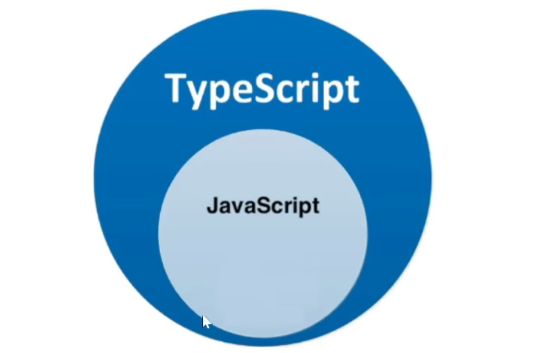

- TS是微软开发的开源编程语言，可以在任何运行JS的地方运行

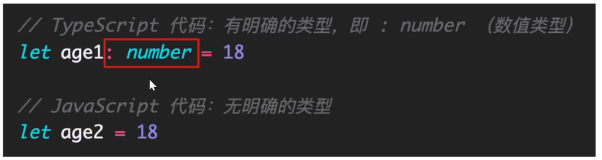

> 补充知识：
>
> JS：解释型、弱类型、动态语言
>
> Java：编译型、强类型、静态语言
>
> - 解释型：我们写的代码无需进行编译，直接通过一个解释器**一边解释一边运行**
> - 编译型：为了代码可以给机器识别需要编译器将代码**全部**转换为机器可以识别的代码后再执行
> - 弱类型：声明变量时无需指定类型
> - 强类型：声明变量时必须指定类型
> - 动态语言：在代码执行过程中可以动态添加对象的属性
> - 静态语言：不允许在代码执行过程中随意添加属性
>
> 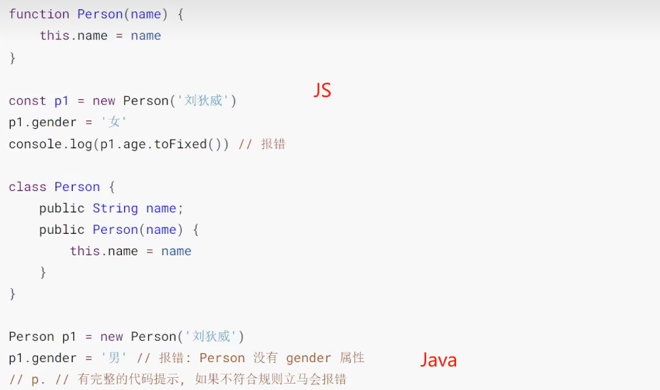
>
> 结论：JS灵活高效但是没有提示易出错，Java则相反


## 为什么需要Typescript

- 背景：JS 的类型系统存在“先天缺陷”弱类型，JS 代码中绝大部分错误都是类型错误（Uncaught TypeError）
  - 开发的时候，定义的变量本应该就有类型
- 这些经常出现的错误，导致了在使用 JS 进行项目开发时，增加了找 Bug、改 Bug 的时间，严重影响开发效率

为什么会这样？

* 从编程语言的动静来区分，TypeScript 属于静态类型的编程语言，JavaScript 属于动态类型的编程语言
  * 静态类型：编译期做类型检查
  * 动态类型：执行期做类型检查
* 代码编译和代码执行的顺序：1 编译 2 执行
* 对于 JS 来说：需要等到代码真正去执行的时候才能发现错误（晚）
* 对于 TS 来说：在代码编译的时候（代码执行前）就可以发现错误（早）
* 并且，配合 VSCode 等开发工具，TS 可以提前到在编写代码的同时就发现代码中的错误，减少找 Bug、改 Bug 时间
* 对比：
  * 使用 JS：
    1. 在 VSCode 里面写代码
    * 在浏览器中运行代码 --> 运行时，才会发现错误【晚】
  * 使用 TS：
    * 在 VSCode 里面写代码 --> 写代码的同时，就会发现错误【早】
* Vue 3 源码使用 TS 重写、Angular 默认支持 TS、React 与 TS 完美配合，TypeScript 已成为大中型前端 项
  目的首选编程语言
* 目前，前端最新的开发技术栈：
  * React： TS + Hooks
  * Vue： TS + Vue3

**注意**： Vue2 对 TS 的支持不好~

目的首选编程语言


## 安装编译TS的工具包

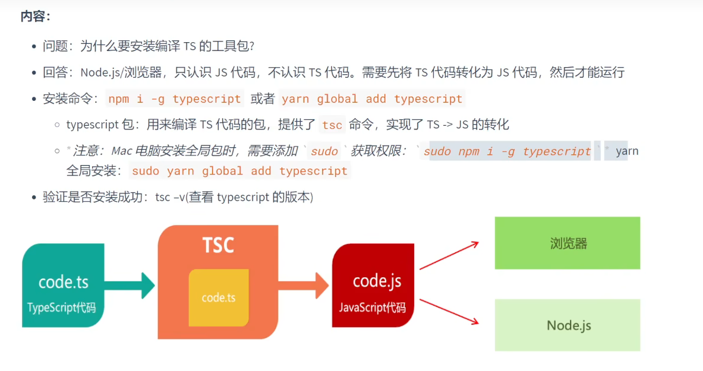

## 编译并运行TS代码

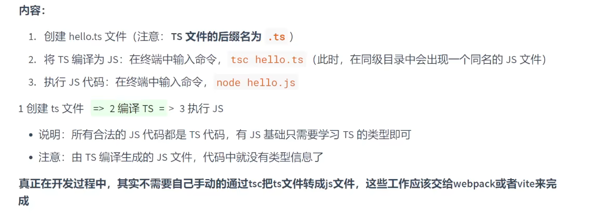


# Typescript基础

## 类型注解

- TypeScript 是 JS 的超集，TS 提供了 JS 的所有功能，并且额外的增加了：类型系统
  - 所有的 JS 代码都是 TS 代码
  - JS 有类型（比如，number/string 等），但是 JS 不会检查变量的类型是否发生变化，而 **TS 会检查**

TypeScript 类型系统的主要优势：可以显示标记出代码中的意外行为，从而降低了发生错误的可能
性

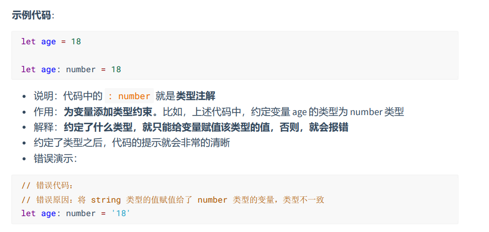

当然，类型注解可以省略，此时TS会根据你赋予变量的值自动推断类型添加类型注解

总结：

- 添加类型后将来不能赋予其他类型给该变量
- 在变量后.可以看到所有相关属性和方法


## TS类型

### 概述

TS中常用基础类型分为如下两类：

- JS已有类型
  - 原始类型，简单类型(number/string/boolean/null/undefined)
  - 复杂数据类型（数组、对象、函数等等）
- TS新增类型
  - 联合类型
  - 自定义类型（类型别名）
  - 接口
  - 元组
  - 字面量类型
  - 枚举
  - void
  - ..... 


### 原始数据类型

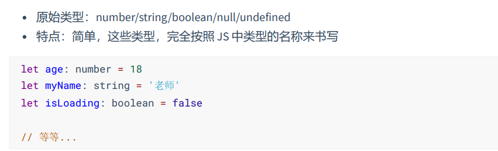


### 数组类型

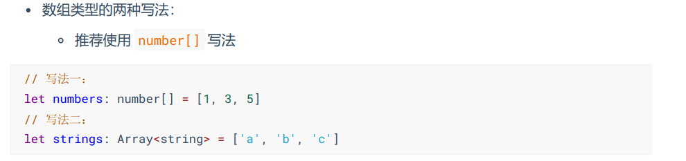


### 联合类型

当数组中的内容需要既有数字又有字符串时，可以使用联合类型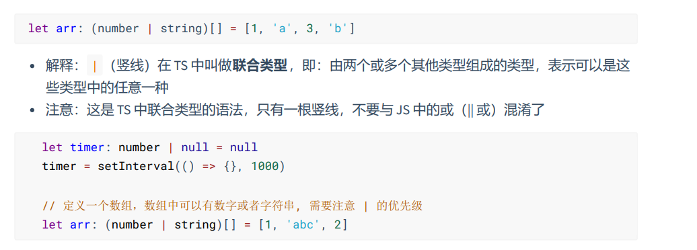


### 类型别名

即类似其他语言中的宏定义的概念

因为在编写类型注解时，可能很多变量都使用的同一个类型，我们希望进行封装复用

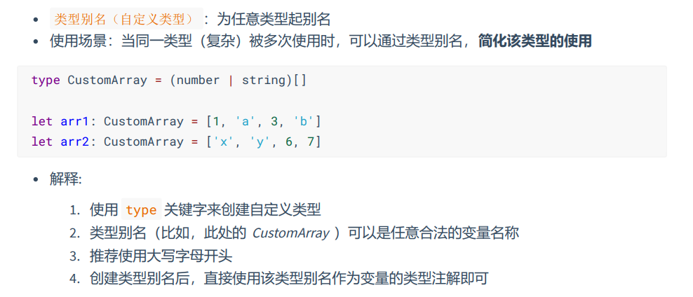

推荐命名为**大写字母开头**


### 函数类型

这里的函数类型实际需要进行约束的是**函数的参数类型与返回值的类型**

- 为函数指定类型的两种方式：
  - 同时指定参数与返回值类型
  - 只指定参数类型(TS会自动推断返回值类型)

```ts
  function add(a:number,b:number):number {
    return a+b
  } 
  const sub = function(a:number,b:number):number {
    return a-b
  }
  const mul = (a:number,b:number):number => {
    return a*b
  }
```

这里也可以使用类型别名进行复用

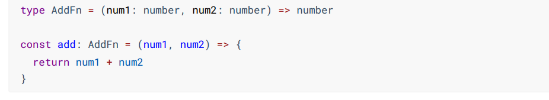

注意：

**这种类型别名的复用只适用于函数表达式形式**

**使用TS的箭头函数时即使只有一个参数也需要小括号**


#### void类型

在TS中，如果函数没有返回值，那么函数的返回值类型为void，而在JS中如果函数没有返回值，那么默认返回一个undefined

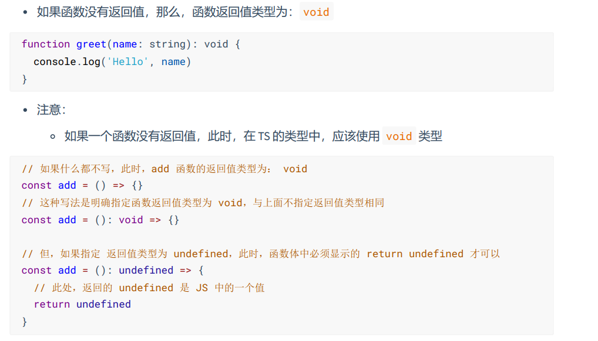


#### 可选参数

- 函数的参数可以不传也可以传
- 使用?即可

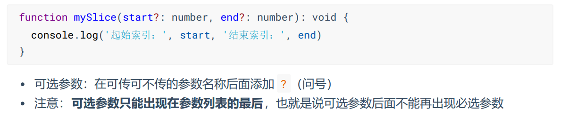


### 对象类型

#### 基本使用

TS的对象类型就是在描述对象的结构(拥有什么类型的属性与方法)

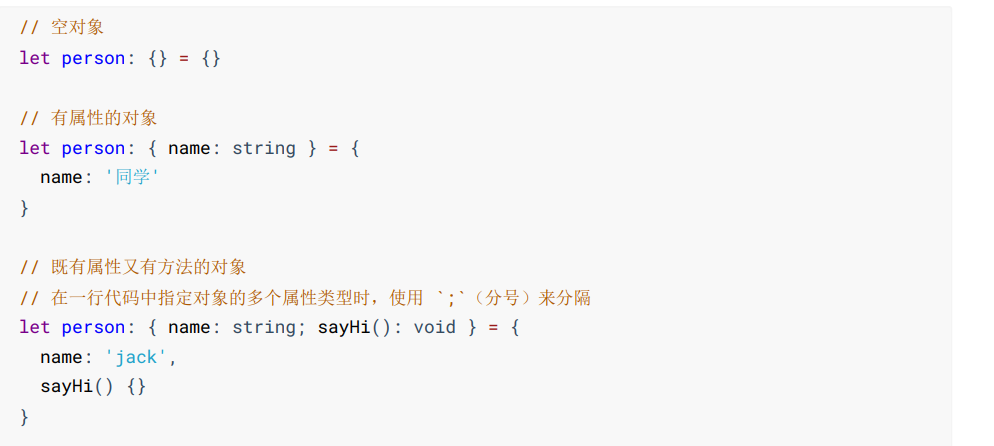

```ts
{
  type Student = {
    uname:string
    gender:number
    grade:number
    height:number
    study:()=>void//两种写法都可以
    play():void
  }
  const stu1:Student = {
    uname:'zs',
    gender:0,
    grade:99.5,
    height:178,
    study:function() {
      console.log(this.uname+'开始学习啦'); 
    },
    play:()=>{
      console.log('开始玩游戏啦');
    }
  }
  stu1.play()
  stu1.study()
}
```

解释:

1. 使用 {} 来描述对象结构
2. 属性采用 属性名: 类型 的形式
3. 方法采用 方法名(): 返回值类型 的形式 或 方法名: 箭头函数


#### 对象可选属性

- 对象的属性/方法也可以是可选的
- 可选属性的语法：在对应属性名后加上?

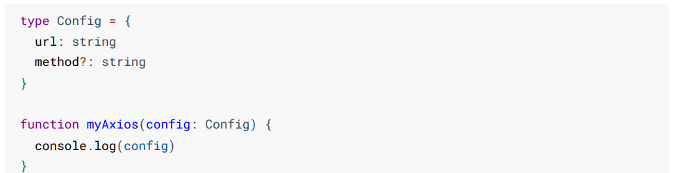


#### 对象类型别名

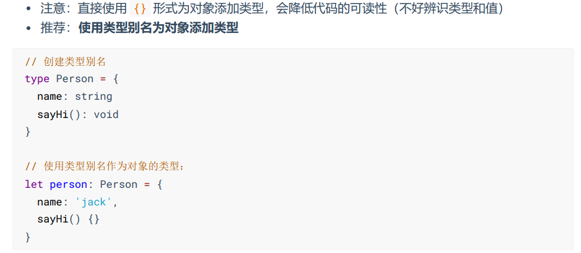


### 接口类型

#### 基本使用

当一个对象类型被多次使用时，可以使用关键字``interface``描述对象类型

- 要点
  - 接口名称推荐使用``I``开头

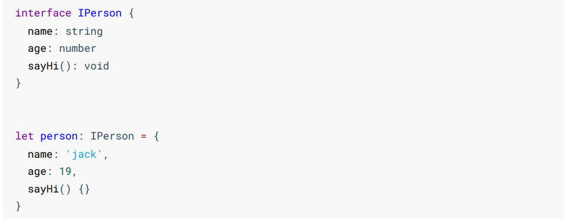


#### interface VS type

- 相同点
  - 都可以为对象绑定类型
- 不同点
  - 接口只能为对象指定类型
  - 类型别名type可以为任意类型指定别名
- 推荐：能使用type就用type

```ts
interface IPerson {
    name: string
    age: number
    sayHi(): void
    }
// 为对象类型创建类型别名
type IPerson = {
    name: string
    age: number
    sayHi(): void
}
// 为联合类型创建类型别名
type NumStr = number | string
```


#### 接口继承

如果两个接口之间有相同的属性或方法，可以将公共的属性或方法抽离出来，通过继承来实现复用

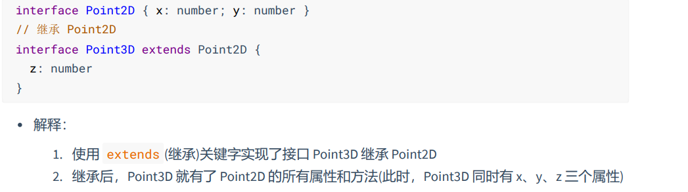

> type实现继承
>
> ```ts
>   type Person = {
>     uname:string
>     age:number
>     gender:number
>     sayHi():void
>   }
>
>   type Student = {
>     score:number
>   } & Person
> ```
>
> 


### 元组

- 元组类型是另一种类型的数组，它确切地知道包含多少个元素，以及特定索引对应的类型(主要用于限制元素个数)

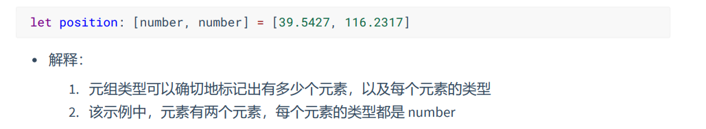


### 类型推断

- 在我们没有写类型注解时，TS会自动进行类型推断
- 发生类型推论的 2 种常见场景:
  1. 声明变量并初始化时
  2. 决定函数返回值时

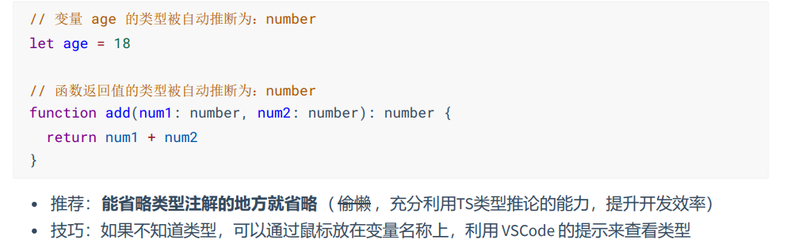


### 字面量类型

首先需要理解字面量的概念

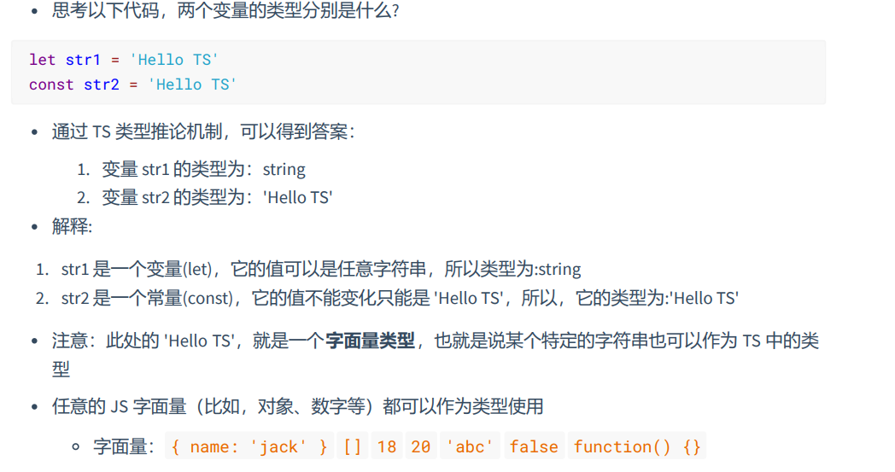

诸如：10 20 'abc' [] {} /^$/ 都是字面量

这些字面量作为类型使用即是字面量类型

```ts
  type Direction = 'w' | 'd' | 's' | 'a'
  function changeDirection(d:Direction) {
    console.log(d);
  }
  changeDirection('w')
```

- 如上代码可以约束函数参数只能是w  d  s  a中的一个
- 优势：相比于 string 类型，使用字面量类型更加精确、严谨


### 枚举类型

#### 基本使用

- 枚举的功能类似于字面量类型+联合类型组合的功能，也可以表示一组明确的可选值
- 枚举：定义一组命名常量。它描述一个值，该值可以是这些命名常量中的一个

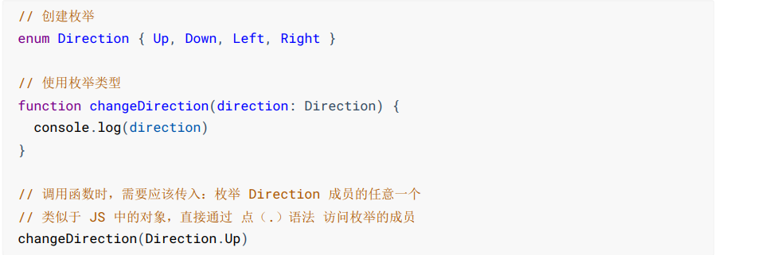

- 要点
  - 使用``enum``定义枚举
  - 约定枚举名称以**大写开头**


#### 数字枚举

枚举的值也可以进行赋值

如果只对其中一个枚举赋值那么在该枚举往后的枚举依次递增(仅限数字)

默认枚举成员的值的从0往后递增


#### 字符串枚举

- 即枚举成员的值是字符串
- 注意：字符串枚举没有自增长行为，因此，字符串枚举的每个成员必须有初始值

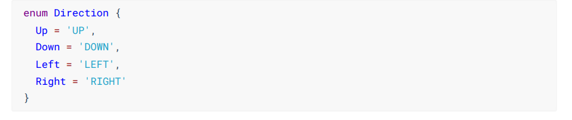


#### 原理

- 枚举是 TS 为数不多的非 JavaScript 类型级扩展(不仅仅是类型)的特性之一
- 因为：其他类型仅仅被当做类型，而枚举不仅用作类型，还提供值(枚举成员都是有值的)
- 也就是说，其他的类型会在编译为 JS 代码时自动移除。但是，**枚举类型会被编译为 JS 代码**

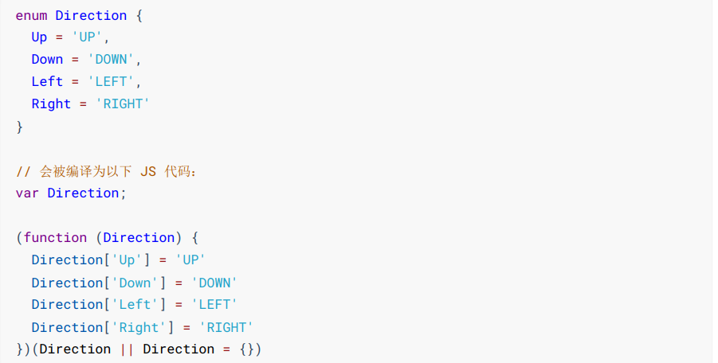

可以看出本质上，枚举就是一个对象

- 扩展，枚举可以通过键得到值也可以通过值得到键
- 一般情况下，推荐使**用字面量类型+联合类型组合**的方式，因为相比枚举，这种方式更加直观、简洁、高效


### any类型

- 原则上不推荐使用any，因为使用any会使得变量失去TS类型的特点
- 因为当值的类型为 any 时，可以对该值进行任意操作，并且不会有代码提示
- 尽可能的避免使用 any 类型，除非临时使用 any 来“避免”书写很长、很复杂的类型
- 其他隐式具有 any 类型的情况
  1. 声明变量不提供类型也不提供默认值
  2. 函数参数不加类型
- 注意：因为不推荐使用 any，所以，这两种情况下都应该提供类型


### 类型断言

有时候TS推断得到的类型可能较为宽泛，但是你是明确该变量的类型的，此时可以使用类型断言指定具体的类型

```ts
const aLink = document.getElementById('link')
```

- 注意：该方法返回值的类型是 HTMLElement，该类型只包含所有标签公共的属性或方法，不包含 a
  标签特有的 href 等属性

使用类型断言：

```ts
const aLink = document.getElementById('link') as HTMLAnchorElement
```

解释:

1. 使用 ``as``关键字实现类型断言
2. 关键字 as 后面的类型是一个更加具体的类型（HTMLAnchorElement 是 HTMLElement 的子类
型）
3. 通过类型断言，aLink 的类型变得更加具体，这样就可以访问 a 标签特有的属性或方法了

- 另一种语法，使用 <> 语法，这种语法形式不常用知道即可

```ts
// 该语法，知道即可：
const aLink = <HTMLAnchorElement>document.getElementById('link')
```


## TypeScript泛型

### 基本介绍

- **泛型是可以在保证类型安全前提下，让函数等与多种类型一起工作，从而实现复用**，常用于：函
  数、接口、class 中
- 需求：创建一个 id 函数，传入什么数据就返回该数据本身(也就是说，参数和返回值类型相同)

```ts
function id(value: number): number { return value }
```

- 比如，id(10) 调用以上函数就会直接返回 10 本身。但是，该函数只接收数值类型，无法用于其他类
  型
- 为了能让函数能够接受任意类型，可以将参数类型修改为 any。但是，这样就失去了 TS 的类型保
  护，类型不安全

此时就可以使用泛型实现函数与多种类型一起工作


### 泛型函数

```ts
function id<Type>(value: Type): Type { return value }
function id<T>(value: T): T { return value }
```

- 解释
  - 语法：在函数名称的后面添加 <> (尖括号)，尖括号中添加类型变量，比如此处的 Type
  - 类型变量 Type，是一种特殊类型的变量，它处理类型而不是值
  - 该类型变量相当于一个类型容器，能够捕获用户提供的类型(具体是什么类型由用户调用该函
    数时指定)
  - 因为 Type 是类型，因此可以将其作为函数参数和返回值的类型，表示参数和返回值具有相同
    的类型
  - 类型变量 Type，可以是任意合法的变量名称

```ts
const num = id<number>(10)
const str = id<string>('a')
```

- 解释：
  1. 语法：在函数名称的后面添加 <> (尖括号)，尖括号中指定具体的类型，比如，此处的
  number
  2. 当传入类型 number 后，这个类型就会被函数声明时指定的类型变量 Type 捕获到
  3. 此时，Type 的类型就是 number，所以，函数 id 参数和返回值的类型也都是 number
- 同样，如果传入类型 string，函数 id 参数和返回值的类型就都是 string


### 简化泛型函数调用

```ts
// 省略 <number> 调用函数
let num = id(10)
let str = id('a')
```

解释:

1. 在调用泛型函数时，可以省略 <类型> 来简化泛型函数的调用
2. 此时，TS 内部会采用一种叫做类型参数推断的机制，来根据传入的实参自动推断出类型变量
Type 的类型
3. 比如，传入实参 10，TS 会自动推断出变量 num 的类型 number，并作为 Type 的类型

- 推荐：使用这种简化的方式调用泛型函数，使代码更短，更易于阅读
- 说明：当编译器无法推断类型或者推断的类型不准确时，就需要显式地传入类型参数


### 泛型约束

- 默认情况下，在函数内部，泛型函数的类型变量 Type 可以代表多个类型，这导致无法访问任何属性

```ts
function id<Type>(value: Type): Type {
    console.log(value.length)
    return value
}
id('a')
```

解释：Type 可以代表任意类型，无法保证一定存在 length 属性，比如 number 类型就没有 length

 此时，就需要为泛型添加约束来 收缩类型 (缩窄类型取值范围)

添加泛型约束收缩类型，主要有以下两种方式：

1.  指定更加具体的类型 
2.  添加约束


#### 类型收缩

即在函数内判断当前参数是什么类型后再.方法就有提示了

```ts
  function getValue<Type>(val:Type) {
    if(typeof val === 'string') {
      return val.length
    }else if(typeof val === 'number') {
      return val.toFixed()
    }
    return val
  }
```


#### 指定更加具体的类型

比如，将类型修改为 Type[] (Type 类型的数组)，因为只要是数组就一定存在 length 属性，因此就可以
访问了

```ts
function id<Type>(value: Type[]): Type[] {
    console.log(value.length)
    return value
}
```


#### 泛型约束

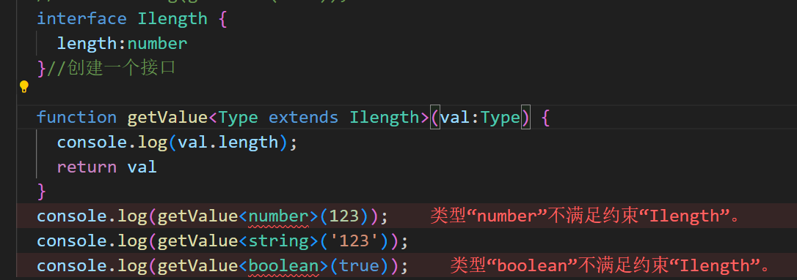

- Type extends ILength 添加泛型约束


- 解释：**表示传入的 类型 必须满足 ILength 接口的要求才行，也就是得有一个 number 类型的 length 属性**
- 注意:传入的实参(比如，数组)只要有 length 属性即可（类型兼容性)


### 多个类型变量

泛型的**类型变量可以有多个**，并且**类型变量之间可以互相约束**(例如第二个类型变量需要受到第一个类型变量的约束)

例如：创建一个函数获取对象中属性的值

```ts
function getProp<Type, Key extends keyof Type>(obj: Type, key: Key) {
    return obj[key]
}
let person = { name: 'jack', age: 18 }
getProp(person, 'name')

```

- 解释：
  - 添加了第二个类型变量 Key，两个类型变量之间使用 , 逗号分隔。
  - keyof 关键字接收一个对象类型，生成其键名称(字面量类型)的联合类型。
  - 以keyof得到的返回值使用关键字extends约束泛型Key
  - 本示例中 keyof Type 实际上获取的是 person 对象所有键的联合类型，也就是： 'name'
    | 'age'
  - 类型变量 Key 受 Type 约束，可以理解为：Key 只能是 Type 所有键中的任意一个，或者说只
    能访问对象中存在的属性

```ts
// Type extends object 表示： Type 应该是一个对象类型，如果不是 对象 类型，就会报错
// 如果要用到 对象 类型，应该用 object ，而不是 Object
function getProperty<Type extends object, Key extends keyof Type>(obj: Type, key: Key)
{
    return obj[key]
}
```


### 泛型接口

即配合泛型使用的接口

```ts
  interface IStudent<T> {
    name: string,
    id:T
  }
  const s1:IStudent<number> = {
    id:1,
    name:'zs'
  }
  const s2:IStudent<string> = {
    id:'1',
    name:'zs'
  }
```

- 解释：
  1. 在接口名称的后面添加 <类型变量> ，那么，这个接口就变成了泛型接口。
  2. 接口的类型变量，对接口中所有其他成员可见，也就是接口中所有成员都可以使用类型变
  量。
  3. 使用泛型接口时，需要显式指定具体的类型(比如，此处的 IStudent<string>)。

> JS中的泛型接口
>
> 其实JS中的数组在TS中就是一个泛型接口
>
> 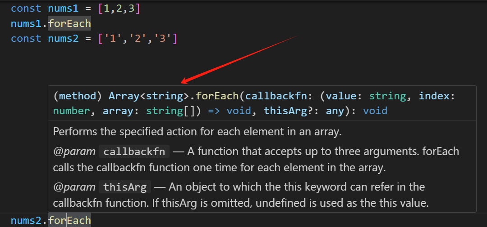


# TypeScript与Vue

> 参考链接：https://vuejs.org/guide/typescript/composition-api.html
>
> vue3配合ts中，还需要额外安装一个vscode插件：Typescript Vue Plugin

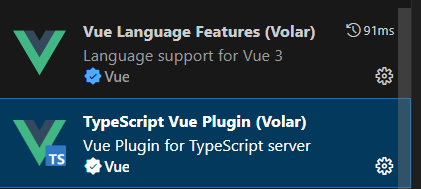

## defineProps与Typescript

- defineProps配合vue默认语法进行类型校验（运行时声明）

```ts
const props = defineProps({
  gift:{
    type:String,
    required:true,
    default:'奔驰'
  }
})
```

- 通过泛型参数来定义 props 的类型通常更直接（基于类型的声明）
  - ==注意：使用TS时参数的类型是小写的不是Vue本身自己大写的了，即应是string而不是String==

```ts
const props = defineProps<{
  gift:string
}>()

const props = defineProps<{
  gift?:string
}>()//可变参数

interface IProps {
  gift?:string
}//我们也可以将 props 的类型移入一个单独的接口中，更简洁

const props = defineProps<IProps>()

//这同样适用于 Props 从另一个源文件中导入的情况
<script setup lang="ts">
    import type { Props } from './foo'

    const props = defineProps<Props>()
</script>

```

不难发现使用基于类型的生命后会失去对默认值声明的能力，这可以通过 `withDefaults` 编译器宏解决：

```ts
interface IProps {
  gift?:string
}
//默认值设定
const props = withDefaults(defineProps<IProps>(),{
  gift:'奔驰'
})
```


## defineEmits与TypeScript

- defineEmits配合vue默认语法进行类型校验（运行时声明）

```ts
const emits = defineEmits(['reGift'])
//基于选项
const emits = defineEmits({
  reGift: (gift: string) => {
    // 返回 `true` 或 `false`
    // 表明验证通过或失败
    return true
  }
})

emits('reGift','孙子')
```

- 基于类型声明

```ts
// 基于类型
const emits = defineEmits<{
  (e: 'reGift', gift: string): void
}>()

// 3.3+: 可选的、更简洁的语法
const emits = defineEmits<{
  reGift: [gift: string]
}>()
```


## ref与TypeScript

```ts
<script setup lang="ts">
    import { ref } from 'vue';

    const msg = ref<number>(123)

    type Todo = {
      id:number,
      event:string,
      done:boolean
    }

    const todoList = ref<Todo[]>([{
      id:1,
      event:'吃饭',
      done:false
    }])

    const todoItem:Todo = todoList.value[0]
</script>

```

如果你指定了一个泛型参数但没有给出初始值，那么最后得到的就将是一个包含 `undefined` 的联合类型：

```ts
// 推导得到的类型：Ref<number | undefined>
const n = ref<number>()
```

## 为 reactive()标注类型

`reactive()` 也会隐式地从它的参数中推导类型：

```ts
import { reactive } from 'vue'

// 推导得到的类型：{ title: string }
const book = reactive({ title: 'Vue 3 指引' })
```
```ts
要显式地标注一个 `reactive` 变量的类型，我们可以使用接口：
import { reactive } from 'vue'

interface Book {
  title: string
  year?: number
}

const book: Book = reactive({ title: 'Vue 3 指引' })
```
> TIP
>
> 不推荐使用 `reactive()` 的泛型参数，因为处理了深层次 ref 解包的返回值与泛型参数的类型不同。


## computed与TypeScript

```ts
type Todo = {
  id:number,
  event:string,
  done:boolean
}

const todoList = ref<Todo[]>([{
  id:1,
  event:'吃饭',
  done:false
},
{
  id:2,
  event:'碎觉',
  done:false
},
])

const leftCount = computed<number>(()=>todoList.value.filter(item=>!item.done).length)
console.log(leftCount.value);

```


## 事件处理与TypeScript

在处理原生 DOM 事件时，应该为我们传递给事件处理函数的参数正确地标注类型。让我们看一下这个例子：

```vue
<script setup lang="ts">
function handleChange(event) {
  // `event` 隐式地标注为 `any` 类型
  console.log(event.target.value)
}
</script>

<template>
  <input type="text" @change="handleChange" />
</template>
```

没有类型标注时，这个 `event` 参数会隐式地标注为 `any` 类型。这也会在 `tsconfig.json` 中配置了 `"strict": true` 或 `"noImplicitAny": true` 时报出一个 TS 错误。因此，建议显式地为事件处理函数的参数标注类型。此外，你在访问 `event` 上的属性时可能需要使用==类型断言==：

```ts
const printPosition = (e:PointerEvent) => {
  console.log(e);//打印事件对象获取事件类型名
  console.log(e.pageX,e.pageY);
}
```


## 为模版引用ref标注类型

```ts
const myImgRef = ref<HTMLImageElement|null>(null)
const img = document.createElement('img')//创建元素得知元素类型
const hDelImg = () => {
  if(myImgRef.value) {
    myImgRef.value.src = ''
  }
}
```


# 补充知识

## 可选链操作符

- 该语法为JS语法也有

```ts
const hDelImg = () => {
  // console.log(myImgRef.value.src);//浏览器报错
  if(myImgRef.value) {
    console.log(myImgRef.value.src);
  }
  console.log(myImgRef.value && myImgRef.value.src);
  console.log(myImgRef.value?.src);
}
```

> [可选链运算符（?.） - JavaScript | MDN (mozilla.org)](https://developer.mozilla.org/zh-CN/docs/Web/JavaScript/Reference/Operators/Optional_chaining)


## 非空断言

对于那些可能为空的变量（即可能等于`undefined`或`null`），TypeScript 提供了非空断言，保证这些变量不会为空，写法是在变量名后面加上感叹号`!`

```ts
function f(x?:number|null) {
  validateNumber(x); // 自定义函数，确保 x 是数值
  console.log(x!.toFixed());
}

function validateNumber(e?:number|null) {
  if (typeof e !== 'number')
    throw new Error('Not a number');
}
```

上面示例中，函数`f()`的参数`x`的类型是`number|null`，即可能为空。如果为空，就不存在`x.toFixed()`方法，这样写会报错。但是，开发者可以确认，经过`validateNumber()`的前置检验，变量`x`肯定不会为空，这时就可以使用非空断言，为函数体内部的变量`x`加上后缀`!`，`x!.toFixed()`编译就不会报错了。

非空断言在实际编程中很有用，有时可以省去一些额外的判断。

```ts
const root = document.getElementById('root');

// 报错
root.addEventListener('click', e => {
  /* ... */
});
```

上面示例中，`getElementById()`有可能返回空值`null`，即变量`root`可能为空，这时对它调用`addEventListener()`方法就会报错，通不过编译。但是，开发者如果可以确认`root`元素肯定会在网页中存在，这时就可以使用非空断言。

```ts
const root = document.getElementById('root')!;
```

上面示例中，`getElementById()`方法加上后缀`!`，表示这个方法肯定返回非空结果。

不过，非空断言会造成安全隐患，只有在确定一个表达式的值不为空时才能使用。比较保险的做法还是手动检查一下是否为空。

```ts
const root = document.getElementById('root');

if (root === null) {
  throw new Error('Unable to find DOM element #root');
}

root.addEventListener('click', e => {
  /* ... */
});
```

上面示例中，如果`root`为空会抛错，比非空断言更保险一点。

非空断言还可以用于赋值断言。TypeScript 有一个编译设置，要求类的属性必须初始化（即有初始值），如果不对属性赋值就会报错。

```ts
class Point {
  x:number; // 报错
  y:number; // 报错

  constructor(x:number, y:number) {
    // ...
  }
}
```

上面示例中，属性`x`和`y`会报错，因为 TypeScript 认为它们没有初始化。

这时就可以使用非空断言，表示这两个属性肯定会有值，这样就不会报错了。

```ts
class Point {
  x!:number; // 正确
  y!:number; // 正确

  constructor(x:number, y:number) {
    // ...
  }
}
```

另外，非空断言只有在打开编译选项`strictNullChecks`时才有意义。如果不打开这个选项，编译器就不会检查某个变量是否可能为`undefined`或`null`。


## Axios与TypeScript

```ts
import axios from 'axios';

type channelsRes = {
  data: {
    channels:{
      id:number
      name:string
    }[]
  },
  msg:string
}

async function getChannelList() {
  const res = await axios.get<channelsRes>('https://geek.itheima.net/v1_0/channels')
  console.log(res.data.data.channels[0].name);
}
getChannelList()
```

为了使得我们在获取到res后有提示，我们可以对axios的返回结果进行泛型约束


## TypeScript模块

### 简介

**任何包含 import 或 export 语句的文件，就是一个模块（module）。相应地，如果文件不包含 export 语句，就是一个全局的脚本文件。**

模块本身就是一个作用域，不属于全局作用域，模块内部的变量、函数、类只在内部可见，对于模块外部是不可见的。暴露给外部的接口，必须用 export 命令声明；如果其他文件要使用模块的接口，必须用 import 命令来输入。

如果一个文件没有任何`import`或`export`语句，但是希望将其变为一个模块（即内部变量对外不可见），可以在脚本头部添加`export {}`

上面这行语句不产生任何实际作用，但会让当前文件被当作模块处理，所有它的代码都变成了内部代码。

而Ts的模块除了支持所有 ES 模块的语法，特别之处在于允许输出和输入类型。

```ts
export type Bool = true | false;
```

假定上面的模块文件为`a.ts`，另一个文件`b.ts`就可以使用 import 语句，输入这个类型。

```ts
import { Bool } from './a';
// 注意，加载文件，没有写脚本文件的后缀名。
// TypeScript 允许加载模块时，省略模块文件的后缀名，它会自动定位

let foo:Bool = true;
```


### import type 语句

import 在一条语句中，可以同时输入类型和正常接口。

```ts
// a.ts
export interface A {
  foo: string;
}

export let a = 123;

// b.ts
import { A, a } from './a';
```

上面示例中，文件`a.ts`的 export 语句输出了一个类型`A`和一个正常接口`a`，另一个文件`b.ts`则在同一条语句中输入了类型和正常接口。

这样很不利于区分类型和正常接口，容易造成混淆。为了解决这个问题，TypeScript 引入了两个解决方法。

1. 在`import`语句输入的类型前面加上`type`关键字

```ts
import { type A, a } from './a';
```

上面示例中，import 语句输入的类型`A`前面有`type`关键字，表示这是一个类型。

2. 使用 import type 语句，这个语句只用来输入类型，不用来输入正常接口。

```ts
// 正确
import type { A } from './a';
let b:A = 'hello';

// 报错
import type { a } from './a';
let b = a;
```

上面示例中，import type 输入类型`A`是正确的，可以把`A`当作类型使用。但是，输入正常接口`a`，并把`a`当作一个值使用，就会报错。这就是说，看到`import type`，你就知道它输入的肯定是类型。

当然，对于默认导出的类型也可以导入

```ts
import type DefaultType from 'moduleA';
```

import type 在一个名称空间下，输入所有类型的写法如下。

```ts
import type * as TypeNS from 'moduleA';
```

以此类推，`export`语句也有两种方法表示输出的是类型

```ts
type A = 'a';
type B = 'b';

// 方法一
export {type A, type B};

// 方法二
export type {A, B};
```

上面示例中，方法一是使用`type`关键字作为前缀，表示输出的是类型；方法二是使用 export type 语句，表示整行输出的都是类型。


### CommandJs模块

CommonJS 是 Node.js 的专用模块格式，与 ES 模块格式不兼容。（想起来了吧，在学习nodejs时引入文件都是使用的`require`


#### import = 语句

TypeScript 使用`import =`语句输入 CommonJS 模块。

```ts
import fs = require('fs');
const code = fs.readFileSync('hello.ts', 'utf8');
```

上面示例中，使用`import =`语句和`require()`命令输入了一个 CommonJS 模块。模块本身的用法跟 Node.js 是一样的。

除了使用`import =`语句，TypeScript 还允许使用`import * as [接口名] from "模块文件"`输入 CommonJS 模块。

```ts
import * as fs from 'fs';
// 等同于
import fs = require('fs');
```


#### export = 语句

TypeScript 使用`export =`语句，输出 CommonJS 模块的对象，等同于 CommonJS 的`module.exports`对象。

```ts
let obj = { foo: 123 };

export = obj;
```

`export =`语句输出的对象，只能使用`import =`语句加载。

```ts
import obj = require('./a');

console.log(obj.foo); // 123
```


## namespace

namespace 是一种将相关代码组织在一起的方式，中文译为“命名空间”。

它出现在 ES 模块诞生之前，作为 TypeScript 自己的模块格式而发明的。但是，自从有了 ES 模块，**官方已经不推荐使用 namespace** 了。

### 基本用法

namespace 用来建立一个容器，内部的所有变量和函数，都必须在这个容器里面使用。

```ts
namespace Utils {
  function isString(value:any) {
    return typeof value === 'string';
  }

  // 正确
  isString('yes');
}

Utils.isString('no'); // 报错
```

上面示例中，命名空间`Utils`里面定义了一个函数`isString()`，它只能在`Utils`里面使用，如果用于外部就会报错。如果要在命名空间以外使用内部成员，就必须为该成员加上`export`前缀，表示对外输出该成员。

上面示例中，只要加上`export`前缀，就可以在命名空间外部使用内部成员。

实际上，在包含namespace的ts文件编译后，命名空间`Utils`（以上面这个例子为例）变成了JavaScript 的一个对象，凡是`export`的内部成员，都成了该对象的属性。

这就是说，namespace 会变成一个值，保留在编译后的代码中。这一点要小心，它不是纯的类型代码。

namespace 内部还可以使用`import`命令输入外部成员，相当于为外部成员起别名。当外部成员的名字比较长时，别名能够简化代码。

```ts
namespace Utils {
  export function isString(value:any) {
    return typeof value === 'string';
  }
}

namespace App {
  import isString = Utils.isString;

  isString('yes');
  // 等同于
  Utils.isString('yes');
}
```

`import`命令也可以在 namespace 外部，指定别名。

```ts
namespace Shapes {
  export namespace Polygons {
    export class Triangle {}
    export class Square {}
  }
}

import polygons = Shapes.Polygons;

// 等同于 new Shapes.Polygons.Square()
let sq = new polygons.Square();
```

上面示例中，`import`命令在命名空间`Shapes`的外部，指定`Shapes.Polygons`的别名为`polygons`。

namespace 可以嵌套。

```ts
namespace Utils {
  export namespace Messaging {
    export function log(msg:string) {
      console.log(msg);
    }
  }
}

Utils.Messaging.log('hello') // "hello"
```

上面示例中，命名空间`Utils`内部还有一个命名空间`Messaging`。注意，如果要在外部使用`Messaging`，必须在它前面加上`export`命令。

namespace 不仅可以包含实义代码，还可以包括类型代码。

```ts
namespace N {
  export interface MyInterface{}
  export class MyClass{}
}
```

上面代码中，命令空间`N`不仅对外输出类，还对外输出一个接口，它们都可以用作类型。

小总结：namespace 与模块的作用是一致的，都是把相关代码组织在一起，对外输出接口。区别是一个文件只能有一个模块，但可以有多个 namespace。**由于模块可以取代 namespace，而且是 JavaScript 的标准语法，还不需要编译转换，所以建议总是使用模块，替代 namespace。**

如果 namespace 代码放在一个单独的文件里，那么引入这个文件需要使用三斜杠的语法。

```ts
/// <reference path = "SomeFileName.ts" />
```


### namespace的输出

namespace 本身也可以使用`export`命令输出，供其他文件使用。

```ts
// shapes.ts
export namespace Shapes {
  export class Triangle {
    // ...
  }
  export class Square {
    // ...
  }
}
```

上面示例是一个文件`shapes.ts`，里面使用`export`命令，输出了一个命名空间`Shapes`。

其他脚本文件使用`import`命令，加载这个命名空间。

```ts
// 写法一
import { Shapes } from './shapes';
let t = new Shapes.Triangle();

// 写法二
import * as shapes from "./shapes";
let t = new shapes.Shapes.Triangle();
```

**不过，更好的方法还是建议使用模块，采用模块的输出和输入。**

```ts
// shapes.ts
export class Triangle {
  /* ... */
}
export class Square {
  /* ... */
}

// shapeConsumer.ts
import * as shapes from "./shapes";
let t = new shapes.Triangle();
```

上面示例中，使用模块的输出和输入，改写了前面的例子。


### namespace的合并

多个同名的 namespace 会自动合并，这一点跟 interface 一样。

```ts
namespace Animals {
  export class Cat {}
}
namespace Animals {
  export interface Legged {
    numberOfLegs: number;
  }
  export class Dog {}
}

// 等同于
namespace Animals {
  export interface Legged {
    numberOfLegs: number;
  }
  export class Cat {}
  export class Dog {}
}
```

这样做的目的是，如果同名的命名空间分布在不同的文件中，TypeScript 最终会将它们合并在一起。这样就比较方便扩展别人的代码。

合并命名空间时，命名空间中的非`export`的成员不会被合并，但是它们只能在各自的命名空间中使用。

```ts
namespace N {
  const a = 0;

  export function foo() {
    console.log(a);  // 正确
  }
}

namespace N {
  export function bar() {
    foo(); // 正确
    console.log(a);  // 报错
  }
}
```

上面示例中，变量`a`是第一个名称空间`N`的非对外成员，它只在第一个名称空间可用。

命名空间还可以跟同名函数合并，但是要求同名函数必须在命名空间之前声明。这样做是为了确保先创建出一个函数对象，然后同名的命名空间就相当于给这个函数对象添加额外的属性。

```ts
function f() {
  return f.version;
}

namespace f {
  export const version = '1.0';
}

f()   // '1.0'
f.version // '1.0'
```

上面示例中，函数`f()`与命名空间`f`合并，相当于命名空间为函数对象`f`添加属性。

命名空间也能与同名 class 合并，同样要求class 必须在命名空间之前声明，原因同上。

```ts
class C {
  foo = 1;
}

namespace C {
  export const bar = 2;
}

C.bar // 2
```

上面示例中，名称空间`C`为类`C`添加了一个静态属性`bar`。

命名空间还能与同名 Enum 合并。

```ts
enum E {
  A,
  B,
  C,
}

namespace E {
  export function foo() {
    console.log(E.C);
  }
}

E.foo() // 2
```

上面示例中，命名空间`E`为枚举`E`添加了一个`foo()`方法。

注意，Enum 成员与命名空间导出成员不允许同名。

```ts
enum E {
  A, // 报错
  B,
}

namespace E {
  export function A() {} // 报错
}
```

上面示例中，同名 Enum 与命名空间有同名成员，结果报错。


## declare关键字

### 简介

declare 关键字用来告诉编译器，某个类型是存在的，可以在当前文件中使用。

它的主要作用，就是**让当前文件可以使用其他文件声明的类型**。举例来说，自己的脚本使用外部库定义的函数，编译器会因为不知道外部函数的类型定义而报错，这时就可以在自己的脚本里面使用`declare`关键字，告诉编译器外部函数的类型。这样的话，编译单个脚本就不会因为使用了外部类型而报错。

declare 关键字可以描述以下类型。

- 变量（const、let、var 命令声明）
- type 或者 interface 命令声明的类型
- class
- enum
- 函数（function）
- 模块（module）
- 命名空间（namespace）

declare 关键字的**重要特点**是，它只是通知编译器某个类型是存在的，不用给出具体实现。比如，只描述函数的类型，不给出函数的实现，如果不使用`declare`，这是做不到的。

declare 只能用来描述已经存在的变量和数据结构，不能用来声明新的变量和数据结构。另外，所有 declare 语句都不会出现在编译后的文件里面。


### declare variable

declare 关键字可以给出外部变量的类型描述。

举例来说，当前脚本使用了其他脚本定义的全局变量`x`。

```ts
x = 123; // 报错
```

上面示例中，变量`x`是其他脚本定义的，当前脚本不知道它的类型，编译器就会报错。

这时使用 declare 命令给出它的类型，就不会报错了。

```ts
declare let x:number;
x = 1;
```

如果 declare 关键字没有给出变量的具体类型，那么变量类型就是`any`。

```ts
declare let x;
x = 1;
```

上面示例中，变量`x`的类型为`any`。

下面的例子是脚本使用浏览器全局对象`document`。

```ts
declare var document;
document.title = 'Hello';
```

上面示例中，declare 告诉编译器，变量`document`的类型是外部定义的（具体定义在 TypeScript 内置文件`lib.d.ts`）。

如果 TypeScript 没有找到`document`的外部定义，这里就会假定它的类型是`any`。

注意，declare 关键字只用来给出类型描述，是纯的类型代码，不允许设置变量的初始值，即不能涉及值。

```ts
// 报错
declare let x:number = 1;
```

上面示例中，declare 设置了变量的初始值，结果就报错了。


### declare function

declare 关键字可以给出外部函数的类型描述。

下面是一个例子。

```ts
declare function sayHello(
  name:string
):void;

sayHello('张三');
```

上面示例中，declare 命令给出了`sayHello()`的类型描述，表示这个函数是由外部文件定义的，因此这里可以直接使用该函数。

注意，这种单独的函数类型声明语句，只能用于`declare`命令后面。一方面，TypeScript 不支持单独的函数类型声明语句；另一方面，declare 关键字后面也不能带有函数的具体实现。

```ts
// 报错
function sayHello(
  name:string
):void;

let foo = 'bar';

function sayHello(name:string) {
  return '你好，' + name;
}
```

上面示例中，单独写函数的类型声明就会报错。


### declare class

declare 给出 class 类型描述的写法如下。

```ts
declare class Animal {
  constructor(name:string);
  eat():void;
  sleep():void;
}
```

下面是一个复杂一点的例子。

```ts
declare class C {
  // 静态成员
  public static s0():string;
  private static s1:string;

  // 属性
  public a:number;
  private b:number;

  // 构造函数
  constructor(arg:number);

  // 方法
  m(x:number, y:number):number;

  // 存取器
  get c():number;
  set c(value:number);

  // 索引签名
  [index:string]:any;
}
```

同样的，declare 后面不能给出 Class 的具体实现或初始值。


### declare module，declare namespace

如果想把变量、函数、类组织在一起，可以将 declare 与 module 或 namespace 一起使用。

```ts
declare namespace AnimalLib {
  class Animal {
    constructor(name:string);
    eat():void;
    sleep():void;
  }

  type Animals = 'Fish' | 'Dog';
}

// 或者
declare module AnimalLib {
  class Animal {
    constructor(name:string);
    eat(): void;
    sleep(): void;
  }

  type Animals = 'Fish' | 'Dog';
}
```

上面示例中，declare 关键字给出了 module 或 namespace 的类型描述。

==**declare module 和 declare namespace 里面，加不加 export 关键字都可以。**==

```ts
declare namespace Foo {
  export var a: boolean;
}

declare module 'io' {
  export function readFile(filename:string):string;
}
```

上面示例中，namespace 和 module 里面使用了 export 关键字。

下面的例子是当前脚本使用了`myLib`这个外部库，它有方法`makeGreeting()`和属性`numberOfGreetings`。

```ts
let result = myLib.makeGreeting('你好');
console.log('欢迎词：' + result);

let count = myLib.numberOfGreetings;
```

`myLib`的类型描述就可以这样写。

```ts
declare namespace myLib {
  function makeGreeting(s:string): string;
  let numberOfGreetings: number;
}
```

==**declare 关键字的另一个用途，是为外部模块添加属性和方法时，给出新增部分的类型描述。**==

```ts
import { Foo as Bar } from 'moduleA';

declare module 'moduleA' {
  interface Foo {
    custom: {
      prop1: string;
    }
  }
}
```

上面示例中，从模块`moduleA`导入了类型`Foo`，它是一个接口（interface），并将其重命名为`Bar`，然后用 declare 关键字为`Foo`增加一个属性`custom`。这里需要注意的是，虽然接口`Foo`改名为`Bar`，但是扩充类型时，还是扩充原始的接口`Foo`，因为同名 interface 会自动合并类型声明。

下面是另一个例子。一个项目有多个模块，可以在一个模块中，对另一个模块的接口进行类型扩展。

```ts
// a.ts
export interface A {
  x: number;
}

// b.ts
import { A } from './a';

declare module './a' {
  interface A {
    y: number;
  }
}

const a:A = { x: 0, y: 0 };
```

上面示例中，脚本`a.ts`定义了一个接口`A`，脚本`b.ts`为这个接口添加了属性`y`。`declare module './a' {}`表示对`a.ts`里面的模块，进行类型声明，而同名 interface 会自动合并，所以等同于扩展类型。

使用这种语法进行模块的类型扩展时，有两点需要注意：

（1）`declare module NAME`语法里面的模块名`NAME`，跟 import 和 export 的模块名规则是一样的，且必须跟当前文件加载该模块的语句写法（上例`import { A } from './a'`）保持一致。

（2）不能创建新的顶层类型。也就是说，只能对`a.ts`模块中已经存在的类型进行扩展，不允许增加新的顶层类型，比如新定义一个接口`B`。

（3）不能对默认的`default`接口进行扩展，只能对 export 命令输出的命名接口进行扩充。这是因为在进行类型扩展时，需要依赖输出的接口名。

==**某些第三方模块，原始作者没有提供接口类型，这时可以在自己的脚本顶部加上下面一行命令。**==

```ts
declare module "模块名";

// 例子
declare module "hot-new-module";
```

加上上面的命令以后，外部模块即使没有类型声明，也可以通过编译。但是，从该模块输入的所有接口都将为`any`类型。

declare module 描述的模块名可以使用通配符。

```ts
declare module 'my-plugin-*' {
  interface PluginOptions {
    enabled: boolean;
    priority: number;
  }

  function initialize(options: PluginOptions): void;
  export = initialize;
}
```

上面示例中，模块名`my-plugin-*`表示适配所有以`my-plugin-`开头的模块名（比如`my-plugin-logger`）。


## d.ts类型声明文件

### 简介

单独使用的模块，一般会同时提供一个单独的类型声明文件（declaration file），把本模块的外部接口的所有类型都写在这个文件里面，便于模块使用者了解接口，也便于编译器检查使用者的用法是否正确。

类型声明文件里面只有类型代码，没有具体的代码实现。它的文件名一般为`[模块名].d.ts`的形式，其中的`d`表示 declaration（声明）。

举例来说，有一个模块的代码如下。

```ts
const maxInterval = 12;

function getArrayLength(arr) {
  return arr.length;
}

module.exports = {
  getArrayLength,
  maxInterval,
};
```

它的类型声明文件可以写成下面这样。

```ts
export function getArrayLength(arr: any[]): number;
export const maxInterval: 12;
```

类型声明文件也可以使用`export =`命令，输出对外接口。下面是 moment 模块的类型声明文件的例子。

```ts
declare module 'moment' {
  function moment(): any;
  export = moment;
}
```

上面示例中，模块`moment`内部有一个函数`moment()`，而`export =`表示`module.exports`输出的就是这个函数。

除了使用`export =`，模块输出在类型声明文件中，也可以使用`export default`表示。

```ts
// 模块输出
module.exports = 3.142;

// 类型输出文件
// 写法一
declare const pi: number;
export default pi;

// 写法二
declare const pi: number;
export= pi;
```

上面示例中，模块输出的是一个整数，那么可以用`export default`或`export =`表示输出这个值。

下面是一个如何使用类型声明文件的简单例子。有一个类型声明文件`types.d.ts`。

```ts
// types.d.ts
export interface Character {
  catchphrase?: string;
  name: string;
}
```

然后，就可以在 TypeScript 脚本里面导入该文件声明的类型。

```ts
// index.ts
import { Character } from "./types";

export const character:Character = {
  catchphrase: "Yee-haw!",
  name: "Sandy Cheeks",
};
```

**类型声明文件也可以包括在项目的 tsconfig.json 文件里面，这样的话，编译器打包项目时，会自动将类型声明文件加入编译，而不必在每个脚本里面加载类型声明文件**。比如，moment 模块的类型声明文件是`moment.d.ts`，使用 moment 模块的项目可以将其加入项目的 tsconfig.json 文件。

```ts
{
  "compilerOptions": {},
  "files": [
    "src/index.ts",
    "typings/moment.d.ts"
  ]
}
```


### 类型声明文件的来源

类型声明文件主要有以下三种来源。

- TypeScript 编译器自动生成。
- TypeScript 内置类型文件。
- 外部模块的类型声明文件，需要自己安装。


#### 自动生成

只要使用编译选项`declaration`，编译器就会在编译时自动生成单独的类型声明文件。

下面是在`tsconfig.json`文件里面，打开这个选项。

```ts
{
  "compilerOptions": {
    "declaration": true
  }
}
```

你也可以在命令行打开这个选项。

```
$ tsc --declaration
```


#### 内置声明文件

安装 TypeScript 语言时，会同时安装一些内置的类型声明文件，主要是内置的全局对象（JavaScript 语言接口和运行环境 API）的类型声明。

这些内置声明文件位于 TypeScript 语言安装目录的`lib`文件夹内，数量大概有几十个，下面是其中一些主要文件。

- lib.d.ts
- lib.dom.d.ts
- lib.es2015.d.ts
- lib.es2016.d.ts
- lib.es2017.d.ts
- lib.es2018.d.ts
- lib.es2019.d.ts
- lib.es2020.d.ts
- lib.es5.d.ts
- lib.es6.d.ts

这些内置声明文件的文件名统一为“lib.[description].d.ts”的形式，其中`description`部分描述了文件内容。比如，`lib.dom.d.ts`这个文件就描述了 DOM 结构的类型。

如果开发者想了解全局对象的类型接口（比如 ES6 全局对象的类型），那么就可以去查看这些内置声明文件。

TypeScript 编译器会自动根据编译目标`target`的值，加载对应的内置声明文件，所以不需要特别的配置。但是，可以使用编译选项`lib`，指定加载哪些内置声明文件。

```ts
{
  "compilerOptions": {
    "lib": ["dom", "es2021"]
  }
}
```

上面示例中，`lib`选项指定加载`dom`和`es2021`这两个内置类型声明文件。

编译选项`noLib`会禁止加载任何内置声明文件。


#### 外部类型声明文件

如果项目中使用了外部的某个第三方代码库，那么就需要这个库的类型声明文件。

这时又分成三种情况。

（1）这个库自带了类型声明文件。

一般来说，如果这个库的源码包含了`[vendor].d.ts`文件，那么就自带了类型声明文件。其中的`vendor`表示这个库的名字，比如`moment`这个库就自带`moment.d.ts`。使用这个库可能需要单独加载它的类型声明文件。

（2）这个库没有自带，但是可以找到社区制作的类型声明文件。

第三方库如果没有提供类型声明文件，社区往往会提供。TypeScript 社区主要使用 [DefinitelyTyped 仓库](https://github.com/DefinitelyTyped/DefinitelyTyped)，各种类型声明文件都会提交到那里，已经包含了几千个第三方库。

这些声明文件都会作为一个单独的库，发布到 npm 的`@types`名称空间之下。比如，jQuery 的类型声明文件就发布成`@types/jquery`这个库，使用时安装这个库就可以了。

```ts
$ npm install @types/jquery --save-dev
```

执行上面的命令，`@types/jquery`这个库就安装到项目的`node_modules/@types/jquery`目录，里面的`index.d.ts`文件就是 jQuery 的类型声明文件。如果类型声明文件不是`index.d.ts`，那么就需要在`package.json`的`types`或`typings`字段，指定类型声明文件的文件名。

TypeScript 会自动加载`node_modules/@types`目录下的模块，但可以使用编译选项`typeRoots`改变这种行为。

```ts
{
  "compilerOptions": {
    "typeRoots": ["./typings", "./vendor/types"]
  }
}
```

上面示例表示，TypeScript 不再去`node_modules/@types`目录，而是去跟当前`tsconfig.json`同级的`typings`和`vendor/types`子目录，加载类型模块了。

默认情况下，TypeScript 会自动加载`typeRoots`目录里的所有模块，编译选项`types`可以指定加载哪些模块。

```ts
{
  "compilerOptions": {
    "types" : ["jquery"]
  }
}
```

上面设置中，`types`属性是一个数组，成员是所要加载的类型模块，要加载几个模块，这个数组就有几个成员，每个类型模块在`typeRoots`目录下都有一个自己的子目录。这样的话，TypeScript 就会自动去`jquery`子目录，加载 jQuery 的类型声明文件。

（3）找不到类型声明文件，需要自己写。

有时实在没有第三方库的类型声明文件，又很难完整给出该库的类型描述，这时你可以告诉 TypeScript 相关对象的类型是`any`。比如，使用 jQuery 的脚本可以写成下面这样。

```ts
declare var $:any

// 或者
declare type JQuery = any;
declare var $:JQuery;
```

上面代码表示，jQuery 的`$`对象是外部引入的，类型是`any`，也就是 TypeScript 不用对它进行类型检查。

也可以采用下面的写法，将整个外部模块的类型设为`any`。

```ts
declare module '模块名';
```

有了上面的命令，指定模块的所有接口都将视为`any`类型。


### d.ts里的declare关键字

类型声明文件只包含类型描述，不包含具体实现，所以非常适合使用 declare 语句来描述类型

类型声明文件里面，**变量的类型描述**必须使用`declare`命令，否则会报错，因为变量声明语句是值相关代码。

```ts
declare let foo:string;
```

interface 类型有没有`declare`都可以，因为 interface 是完全的类型代码。

```ts
interface Foo {} // 正确
declare interface Foo {} // 正确
```

类型声明文件里面，顶层可以使用`export`命令，也可以不用，除非使用者脚本会显式使用`export`命令输入类型。

```ts
export interface Data {
  version: string;
}
```

下面是类型声明文件的一些例子。先看 moment 模块的类型描述文件`moment.d.ts`。

```ts
declare module 'moment' {
  export interface Moment {
    format(format:string): string;

    add(
      amount: number,
      unit: 'days' | 'months' | 'years'
    ): Moment;

    subtract(
      amount:number,
      unit:'days' | 'months' | 'years'
    ): Moment;
  }

  function moment(
    input?: string | Date
  ): Moment;

  export default moment;
}
```

上面示例中，可以注意一下默认接口`moment()`的写法。

下面是 D3 库的类型声明文件`D3.d.ts`。

```ts
declare namespace D3 {
  export interface Selectors {
    select: {
      (selector: string): Selection;
      (element: EventTarget): Selection;
    };
  }

  export interface Event {
    x: number;
    y: number;
  }

  export interface Base extends Selectors {
    event: Event;
  }
}

declare var d3: D3.Base;
```


### 模块发布

当前模块如果包含自己的类型声明文件，可以在 package.json 文件里面添加一个`types`字段或`typings`字段，指明类型声明文件的位置。

```json
{
  "name": "awesome",
  "author": "Vandelay Industries",
  "version": "1.0.0",
  "main": "./lib/main.js",
  "types": "./lib/main.d.ts"
}
```

上面示例中，`types`字段给出了类型声明文件的位置。

注意，如果类型声明文件名为`index.d.ts`，且在项目的根目录中，那就不需要在`package.json`里面注明了。

有时，类型声明文件会单独发布成一个 npm 模块，这时用户就必须同时加载该模块。

```json
{
  "name": "browserify-typescript-extension",
  "author": "Vandelay Industries",
  "version": "1.0.0",
  "main": "./lib/main.js",
  "types": "./lib/main.d.ts",
  "dependencies": {
    "browserify": "latest",
    "@types/browserify": "latest",
    "typescript": "next"
  }
}
```

上面示例是一个模块的 package.json 文件，该模块需要 browserify 模块。由于后者的类型声明文件是一个单独的模块`@types/browserify`，所以还需要加载那个模块。


### 三斜杠命令

如果类型声明文件的内容非常多，可以拆分成多个文件，然后入口文件使用三斜杠命令，加载其他拆分后的文件。

举例来说，入口文件是`main.d.ts`，里面的接口定义在`interfaces.d.ts`，函数定义在`functions.d.ts`。那么，`main.d.ts`里面可以用三斜杠命令，加载后面两个文件。

```ts
/// <reference path="./interfaces.d.ts" />
/// <reference path="./functions.d.ts" />
```

三斜杠命令（`///`）是一个 TypeScript 编译器命令，用来指定编译器行为。它只能用在文件的头部，如果用在其他地方，会被当作普通的注释。另外，若一个文件中使用了三斜线命令，那么在三斜线命令之前只允许使用单行注释、多行注释和其他三斜线命令，否则三斜杠命令也会被当作普通的注释。

除了拆分类型声明文件，三斜杠命令也可以用于普通脚本加载类型声明文件。

三斜杠命令主要包含三个参数，代表三种不同的命令。

- path
- types
- lib

下面依次进行讲解。


#### `/// <reference path="" />`

`/// <reference path="" />`是最常见的三斜杠命令，告诉编译器在编译时需要包括的文件，常用来声明当前脚本依赖的类型文件。

```ts
/// <reference path="./lib.ts" />

let count = add(1, 2);
```

上面示例表示，当前脚本依赖于`./lib.ts`，里面是`add()`的定义。编译当前脚本时，还会同时编译`./lib.ts`。编译产物会有两个 JS 文件，一个当前脚本，另一个就是`./lib.js`。

下面的例子是当前脚本依赖于 Node.js 类型声明文件。

```ts
/// <reference path="node.d.ts"/>
import * as URL from "url";
let myUrl = URL.parse("https://www.typescriptlang.org");
```

编译器会在预处理阶段，找出所有三斜杠引用的文件，将其添加到编译列表中，然后一起编译。

`path`参数指定了所引入文件的路径。如果该路径是一个相对路径，则基于当前脚本的路径进行计算。

使用该命令时，有以下两个注意事项。

- `path`参数必须指向一个存在的文件，若文件不存在会报错。
- `path`参数不允许指向当前文件。

默认情况下，每个三斜杠命令引入的脚本，都会编译成单独的 JS 文件。如果希望编译后只产出一个合并文件，可以使用编译选项`outFile`。但是，`outFile`编译选项不支持合并 CommonJS 模块和 ES 模块，只有当编译参数`module`的值设为 None、System 或 AMD 时，才能编译成一个文件。

如果打开了编译参数`noResolve`，则忽略三斜杠指令。将其当作一般的注释，原样保留在编译产物中。


#### `/// <reference types="" />`

types 参数用来告诉编译器当前脚本依赖某个 DefinitelyTyped 类型库，通常安装在`node_modules/@types`目录。

types 参数的值是类型库的名称，也就是安装到`node_modules/@types`目录中的子目录的名字。

```ts
/// <reference types="node" />
```

上面示例中，这个三斜杠命令表示编译时添加 Node.js 的类型库，实际添加的脚本是`node_modules`目录里面的`@types/node/index.d.ts`。

可以看到，这个命令的作用类似于`import`命令。

注意，这个命令只在你自己手写类型声明文件（`.d.ts`文件）时，才有必要用到，也就是说，只应该用在`.d.ts`文件中，普通的`.ts`脚本文件不需要写这个命令。如果是普通的`.ts`脚本，可以使用`tsconfig.json`文件的`types`属性指定依赖的类型库。


#### `/// <reference lib="" />`

`/// <reference lib="..." />`命令允许脚本文件显式包含内置 lib 库，等同于在`tsconfig.json`文件里面使用`lib`属性指定 lib 库。

前文说过，安装 TypeScript 软件包时，会同时安装一些内置的类型声明文件，即内置的 lib 库。这些库文件位于 TypeScript 安装目录的`lib`文件夹中，它们描述了 JavaScript 语言和引擎的标准 API。

库文件并不是固定的，会随着 TypeScript 版本的升级而更新。库文件统一使用“lib.[description].d.ts”的命名方式，而`/// <reference lib="" />`里面的`lib`属性的值就是库文件名的`description`部分，比如`lib="es2015"`就表示加载库文件`lib.es2015.d.ts`。

```ts
/// <reference lib="es2017.string" />
```

上面示例中，`es2017.string`对应的库文件就是`lib.es2017.string.d.ts`。


# TypeScript类型声明文件

## 基本介绍

今天几乎所有的 JavaScript 应用都会引入许多第三方库来完成任务需求。
这些第三方库不管是否是用 TS 编写的，最终都要编译成 JS 代码，才能发布给开发者使用。

最终编译为JS代码，那么就会失去TS的类型保护，可是我们实际在使用中你会发现它们几乎都有相应的 TS 类型，这些类型是怎么来的呢?

即``类型声明文件``的作用

- 类型声明文件：用来为已存在的 JS 库提供类型信息

- TS 中有两种文件类型：

  1 .``ts ``文件 

  2 .``d.ts`` 文件

- ``.ts`` 文件:

  1. 既包含类型信息又可执行代码
  2. 可以被编译为 .js 文件，然后，执行代码
  - 用途：编写程序代码的地方
- ``.d.ts ``文件:

  - 只包含类型信息 的类型声明文件
  - 不会生成 .js 文件，仅用于提供类型信息,在.d.ts文件中不允许出现可执行的代码，只用于提
    供类型
  - 用途：为 JS 提供类型信息
- **总结**：**.ts 是 implementation (代码实现文件)；.d.ts 是 declaration(类型声明文件)**
  **如果要为 JS 库提供类型信息，要使用 .d.ts 文件**


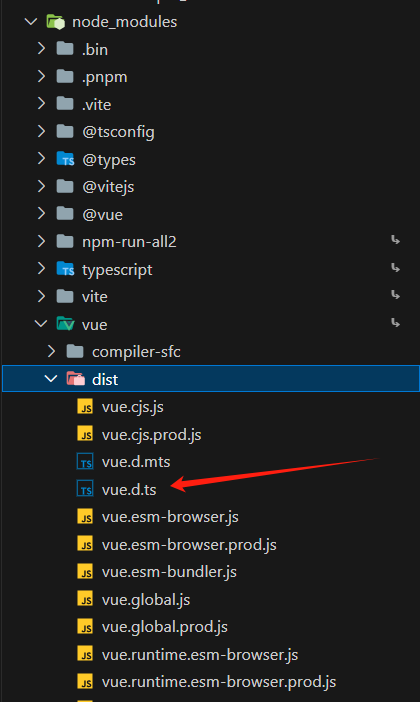


## 内置类型声明文件

- TS为JS运行时可用的所有标准化内置API都提供了声明文件
- 因此在使用类似数组这些内置数据结构时，数组所有方法都会有相应的代码提示以及类型信息:
- 比如，查看 forEach 方法的类型声明，在 VSCode 中会自动跳转到 lib.es5.d.ts 类型声明文件中
- 当然，像 window、document 等 BOM、DOM API 也都有相应的类型声明( lib.dom.d.ts)


## 第三方库类型声明文件

- 目前，几乎所有常用的第三方库都有相应的类型声明文件
- 第三方库的类型声明文件有两种存在形式:1 库自带类型声明文件 2 由 DefinitelyTyped 提供。

1. **库自带类型声明文件**：比如，axios

- 查看 node_modules/axios 目录

解释：这种情况下，正常导入该库，**TS 就会自动加载库自己的类型声明文件**，以提供该库的类型声明。
const strs = ['a', 'b', 'c']

2. **由 DefinitelyTyped 提供**(库本身未提供类型声明文件)

  + DefinitelyTyped 是一个 github 仓库，是开源者提供的用来提供高质量 TypeScript 类型声明
  + https://github.com/DefinitelyTyped/DefinitelyTyped/
  + 可以通过 npm/yarn 来下载该仓库提供的 TS 类型声明包，这些包的名称格式为: @types/*
  + 比如，@types/react、@types/lodash 等

  **说明**：在实际项目开发时，如果你使用的第三方库没有自带的声明文件，VSCode 会给出明确的提
  示

- 解释：当安装 @types/* 类型声明包后，TS 也会自动加载该类声明包，以提供该库的类型声明


## 自定义类型声明文件-共享数据

### 项目内共享类型

- 如果多个 .ts 文件中都用到同一个类型，此时可以创建 .d.ts 文件提供该类型，实现类型共享。
- 操作步骤
  - 创建自己的类型声明文件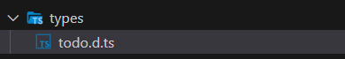

  - 创建需要共享的类型，并使用 export 导出(TS 中的类型也可以使用 import/export 实现模块化
    功能）。

    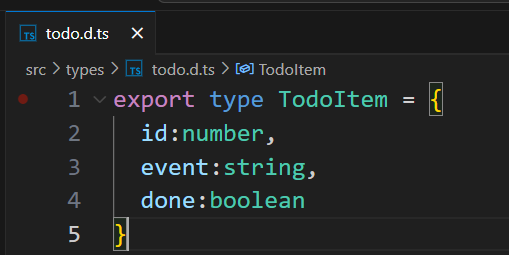

  - 在需要使用共享类型的 .ts 文件中，通过 import 导入即可**(.d.ts 后缀导入时，直接省略)**。


### 为已有 JS 文件提供类型声明

1. 在将 JS 项目迁移到 TS 项目时，为了让已有的 .js 文件有类型声明。
2. 成为库作者，创建库给其他人使用。

- 说明:TS 项目中也可以使用 .js 文件。
- **说明:在导入 .js 文件时，TS 会自动加载与 .js 同名的 .d.ts 文件，以提供类型声明。**
- **declare 关键字**:用于类型声明，为其他地方(比如，.js 文件)已存在的变量声明类型，而不是创建一
  个新的变量。

1.  对于 type、interface 等这些明确就是 TS 类型的(只能在 TS 中使用的)，可以省略 declare 关键字。

2. 对于 let、function 等具有双重含义(在 JS、TS 中都能用)，应该使用 declare 关键字，明确指
定此处用于类型声明。

例子如下：

```ts
//这是老js文件
let count = 10
let songName = '痴心绝对'
let position = {
x: 0,
y: 0
}
function add(x, y) {
return x + y
}
function changeDirection(direction) {
console.log(direction)
}
const fomartPoint = point => {
console.log('当前坐标：', point)
}
export { count, songName, position, add, changeDirection, fomartPoint }

```

定义与老js文件同名的.d.ts文件

```ts
declare let count:number
declare let songName: string
interface Position {
x: number,
y: number
}
declare let position: Position
declare function add (x :number, y: number) : number
type Direction = 'left' | 'right' | 'top' | 'bottom'
declare function changeDirection (direction: Direction): void
type FomartPoint = (point: Position) => void
declare const fomartPoint: FomartPoint
export {
count, songName, position, add, changeDirection, FomartPoint, fomartPoint
}

```


# 案例练习


