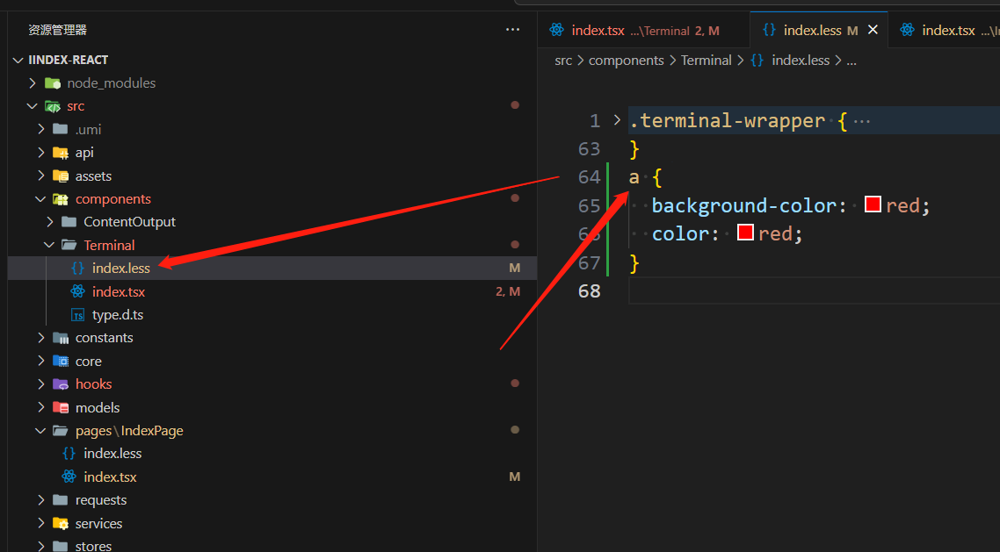
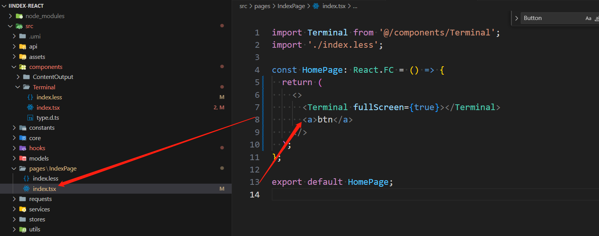
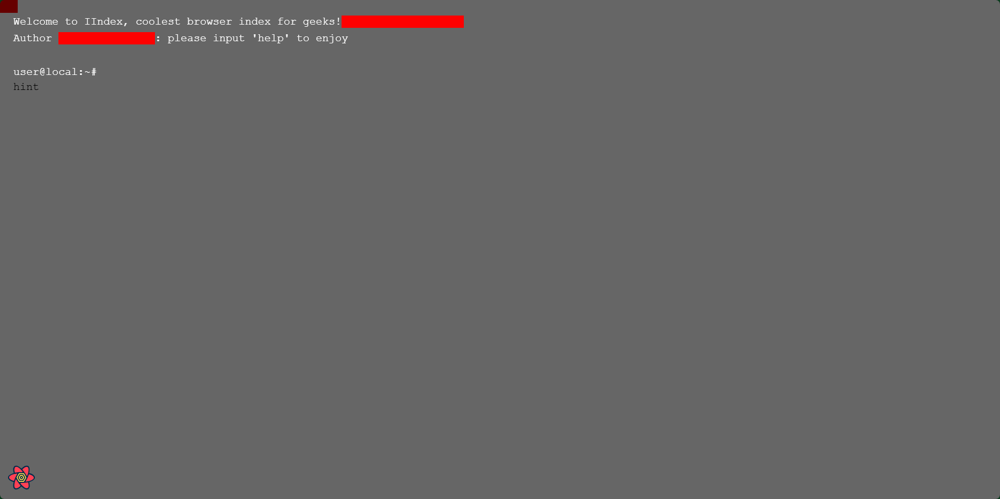

### **运行时配置**与**构建时配置**

- Umi中有这样两个概念：**运行时配置**与**构建时配置**
  - 区别：运行时配置和配置的区别是他跑在浏览器端，基于此，我们可以在这里写函数、jsx、import 浏览器端依赖等等，注意不要引入 node 依赖
  - 因此在**构建时配置**的`.umirc.ts`文件或者时`config/config.ts`文件中就不能写类似jsx这样的东西因为它不是跑在浏览器端
  - 而运行时配置代码需要写在`app.ts`中 


### 样式

一般在react项目中，我们会将css文件或其他css预处理器文件放到对应的组件文件目录下，然后在对应的jsx或tsx文件中引入即可例如，在 `src/pages/index.css` 文件按照以下代码声明 `.title` 类的样式为红色：

```css
.title {
  color: red;
}
```

然后在 `src/pages/index.tsx` 文件中引入即可生效。

```jsx
// src/pages/index.tsx
import './index.css';

export default function () {
  return <div className="title">Hello World</div>;
}
```

但是在umi中，这种引入方式的样式会在整个Umi项目中生效，即影响到全局样式！！！！

例如：



我在Terminal组件中修改了a标签的样式



但是却影响到了主页面的a标签！！！



解决办法：

在 `js` 文件中引入样式时，如果赋予他一个变量名，就可以将样式以 CSS Module 的形式引入。

```js
// src/pages/index.tsx
import styles from './index.css';

export default function () {
  return <div className={styles.title}>
    Hello World
  </div>;
}
```

上面的示例中，`index.css` 文件中声明的样式不会对全局样式造成影响，只会对从 `styles` 变量中使用的样式生效。

Umi默认是支持LESS的

同样的在引入样式时赋予一个变量名就好了