# 初始Vue3

- Vue3相比Vue2的**优势点**


- 使用TypeScript对代码重构了，因此Vue3更支持TypeScript
- Vue2使用的是defineProperty对数据进行劫持，而Vue3使用的是proxy
- Vue3主推组合式API，可以将模块相关代码放在同一个地方
- Vue3默认使用vite对项目进行构建，体验下来更快


## 基本语法

### 脚手架create-vue创建项目

- create-vue是Vue官方新的脚手架工具，底层切换到了vite(与webpack一样都是打包构建工具)，为开发提供极速响应


- 语法：
  1. 前提环境条件
     - 已安装16.0或更高版本的Node.js
  2. 创建一个Vue应用
     - ``npm create vue@latest``
     - 该指令会安装并执行create-vue


### 项目目录和关键文件

- 关键文件：
  1. vite.config.js项目的配置文件基于vite
  2. package.json核心依赖变为vue3.x和vite
  3. main.js入口文件使用createApp函数创建实例(实际是对new Vue操作进行了封装)
  4. app.vue根组件
     1. script与template顺序调整
     2. template不再要求唯一根元素
     3. 脚本script添加setup标识支持组合式API
  5. index.html提供id为app的挂载点


### setup选项

setup选项里面用于编写组合式api的语法内容

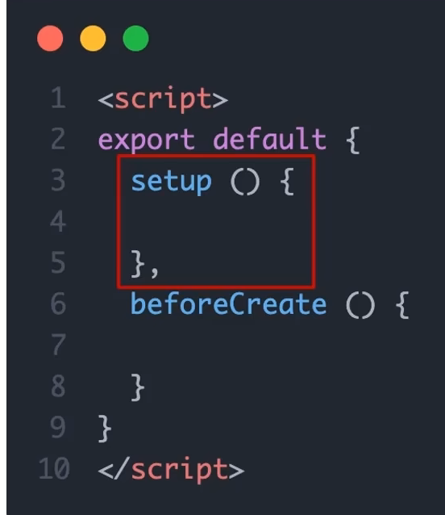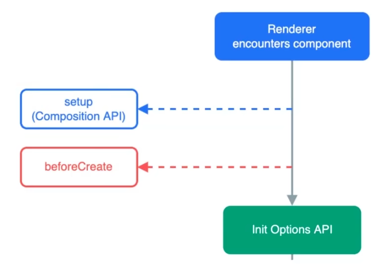

> 注意：这里因为setup在生命周期里面执行时机很早，因此此时vue实例尚未创建，此时在里面使用this是获取不到vue实例的


如果我们需要编写数据和方法即可直接在setup()函数内编写了，**注意需要return编写的内容**

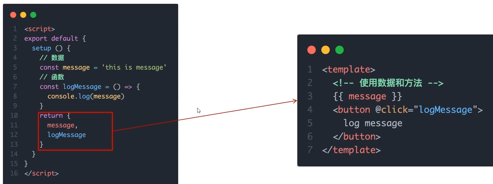

但是每次编写完数据和方法都要return非常麻烦，因此这里vue3提供了对应的语法糖``<script setup>``

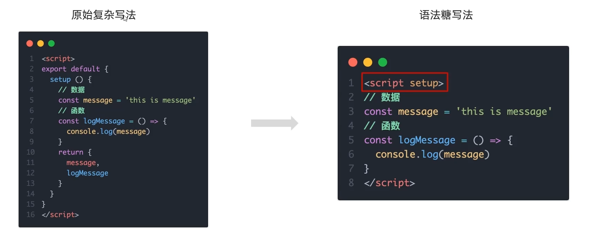

> 语法糖原理：
>
> 实际底层原理vue3还是帮你return了
>
> 


### Vue3-defineOptions

- 背景：在使用<script setup>之前我们可以很轻松地就定义props、emits、name等与setup函数平级的属性，但是使用<script setup>之后script的内容就被setup函数充满了，因此难以添加平级属性


### reactive与ref函数

* 在vue3中默认数据并不是响应式的，我们需要使用reactive或者是ref函数得到响应式对象数据

1. reactive

- 作用：接受**对象类型数据的参数传入**并返回一个**响应式的对象**
- 核心步骤：
  1. 从vue包中导入reactive函数
  2. 在<script setup>中执行reactive函数传入类型为对象的初始值，并使用变量接收


2. ref
   - 作用：接受**简单类型或者对象类型的数据**传入并返回一个**响应式对象**
   - 核心步骤：
     1. 导入ref函数
     2. 在<script setup>中执行ref函数并传入初始值，使用变量接受ref函数返回值

>实际开发中推荐使用ref函数获取响应式数据
>
>- ref参数类型支持更好但是在script中必须通过.value访问修改，因为ref函数将传入的内容封装为了一个对象
>- ref函数底层实现依赖于reactive(这一点可以在调试中得到，当ref函数参数为简单数据类型时，ref对象.value得到的就是该简单数据类型，而当ref函数参数为对象数据类型时，ref对象.value得到的是一个proxy对象即reactive函数的返回对象类型)


### 模板语法


#### 动态参数

今天在看Vue文档，发现原来在标签的参数名/事件名上也可以动态处理

```js
<!--
注意，参数表达式有一些约束，
参见下面“动态参数值的限制”与“动态参数语法的限制”章节的解释
-->
<a v-bind:[attributeName]="url"> ... </a>

<!-- 简写 -->
<a :[attributeName]="url"> ... </a>
```

这里的 `attributeName` 会作为一个 JavaScript 表达式被动态执行，计算得到的值会被用作最终的参数。举例来说，如果你的组件实例有一个数据属性 `attributeName`，其值为 `"href"`，那么这个绑定就等价于 `v-bind:href`。

相似地，你还可以将一个函数绑定到动态的事件名称上：

```js
<a v-on:[eventName]="doSomething"> ... </a>

<!-- 简写 -->
<a @[eventName]="doSomething"> ... </a>
```

在此示例中，当 `eventName` 的值是 `"focus"` 时，`v-on:[eventName]` 就等价于 `v-on:focus`。

> #### 动态参数值的限制
>
> 动态参数中表达式的值应当是一个字符串，或者是 `null`。特殊值 `null` 意为显式移除该绑定。其他非字符串的值会触发警告。
>
> #### 动态参数语法的限制
>
> 动态参数表达式因为某些字符的缘故有一些语法限制，比如空格和引号，在 HTML attribute 名称中都是不合法的。例如下面的示例：
>
> ```js
> <!-- 这会触发一个编译器警告 -->
> <a :['foo' + bar]="value"> ... </a>
> ```
>
> 如果你需要传入一个复杂的动态参数，我们推荐使用[计算属性](https://cn.vuejs.org/guide/essentials/computed.html)替换复杂的表达式


#### v-bind动态绑定多个值

如下即``field.config``是一个对象，那么对象中的每一个键值对都会传给子组件了

```js
const objectOfAttrs = {
  id: 'container',
  class: 'wrapper'
}
<MyComponent v-bind="objectOfAttrs"><MyComponent/>
// 相当于
<MyComponent v-bind:id="container" v-bind:class="wrapper"><MyComponent/>
```


### 计算属性

与vue2的计算属性概念一致

- 核心语法如下：
  1. 引入computed函数
  2. 调用函数computed，参数为一个回调函数

> 我们在这里定义了一个计算属性 `publishedBooksMessage`。`computed()` 方法期望接收一个 getter 函数，返回值为一个**计算属性 ref**。和其他一般的 ref 类似，你可以通过 `publishedBooksMessage.value` 访问计算结果。计算属性 ref 也会在模板template中自动解包，因此在模板表达式中引用时无需添加 `.value`。

> 计算属性缓存VS方法
>
> 与Vue2一样的，计算属性可以实现的也可以使用方法实现，虽然实现看到的结果一样，但是计算属性优化的点在于**计算属性值会基于其响应式依赖被缓存**。一个计算属性仅会在其响应式依赖更新时才重新计算

#### 可写计算属性

计算属性默认是可读的，某些情况下你也可以对计算属性进行重写

- 核心语法如下：

```javascript
const fullName = computed({
  // getter
  get() {//两个函数也可以简写为箭头函数
    return 计算表达式
  },
  // setter
  set(newValue) {//newValue是修改计算属性值所赋的值
  }
})
```

> 计算属性中不应该有副作用：比如异步请求/修改DOM，这些可以用watch实现
>
> 尽量避免直接修改计算属性的值：计算属性应该是只读的，特殊情况可以配置get set


### 类与样式绑定

#### 绑定HTML class

- 绑定对象

我们可以给 `:class` (`v-bind:class` 的缩写) 传递一个对象来动态切换 class：

```JavaScript
<script>
    import {ref} from 'vue'
    const isActive = ref(true)
	const hasError = ref(false)
</script>    

<div
  class="static"
  :class="{ active: isActive, 'text-danger': hasError }"
></div>
//结果<div class="static active"></div>
```

上面的语法表示 `active` 是否存在取决于数据属性 `isActive` 的[真假值](https://developer.mozilla.org/en-US/docs/Glossary/Truthy)，可以看到:class也可以与原生class共存

此外，也可以将:class的属性值绑定为一个对象

```javascript
<script setup>
  import { ref } from 'vue';
  const classObject = ref({
    active: true,
    'text-danger': false
  })
</script>

<template>
  <div
    class="static"
    :class="classObject"//这里
  >我是div</div>
</template>

<style scoped>
  .active {
    color: green;
  }
  .text-danger {
    color: red;
  }
</style>
```

> 事实上，我们不一定刚好需要渲染的class依赖的data就本身是一个对象，因此更好的做法是==**:class绑定为返回对象的计算属性**==
>
> ```javascript
> const isActive = ref(true)
> const error = ref(null)
>
> const classObject = computed(() => ({
>   active: isActive.value && !error.value,
>   'text-danger': error.value && error.value.type === 'fatal'
> }))
>
> <div :class="classObject"></div>
> ```

- 绑定数组


### watch函数

- 作用：侦听**一个或多个数据**的变化，数据变化时执行回调函数
- 同样拥有两个额外参数：1.immediate(立即执行) 2.deep(深度监听)
- 语法：
  1. 导入watch函数
  2. 执行watch函数传入要监听的响应式数据==(**ref对象**)==和回调函数
  3. 此外还可以监听多个数据

#### immediate与deep

- immediate：在监听器创建时立即触发回调，响应式数据变化后继续执行回调
- deep：当ref(复杂类型)时，监视内部数据的变化(复杂类型即对象)
- 语法：
  - 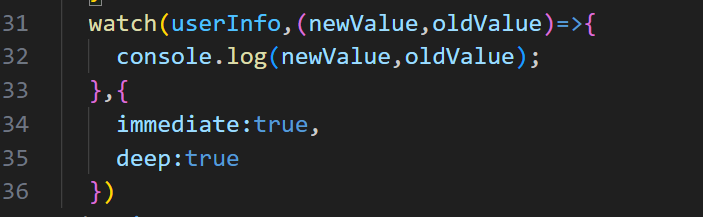


#### 精确侦听对象某个属性

- 语法：
- 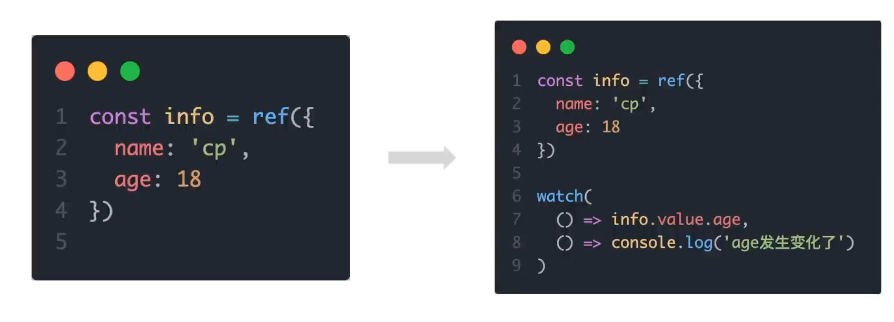


#### watch监听器的注意事项

在监听对象的某个属性时，你不能：

```js
const obj = reactive({ count: 0 })
const objWithRef = ref({
	count: 0
})

// 错误，因为 watch() 得到的参数是一个 number
watch(objWithRef.value.count, (count) => {
  console.log(`count is: ${count}`)
})

// 错误，因为 watch() 得到的参数是一个 number
watch(obj.count, (count) => {
  console.log(`count is: ${count}`)
})
```

```js
// 正确做法
watch(() => objWithRef.value.count, (count) => {
  console.log(`count is: ${count}`)
})

watch(() => obj.count, (count) => {
  console.log(`count is: ${count}`)
})
```


如果只是监听一个基本数据类型的响应式变化，你可以

```js
const count = ref(0)

// 别撒撒的
watch(count.value,()=>{})
// 正确做法
watch(count,()=>{})
watch(()=>count.value,()=>{})// 这样也有点撒
```


#### 深层监听器watch

直接给 `watch()` 传入一个响应式对象，会隐式地创建一个深层侦听器——该回调函数在所有嵌套的变更时都会被触发：

```js
const obj = reactive({ count: 0 })

watch(obj, (newValue, oldValue) => {
  // 在嵌套的属性变更时触发
  // 注意：`newValue` 此处和 `oldValue` 是相等的
  // 因为它们是同一个对象！
})

obj.count++
```

相比之下，一个返回响应式对象的 getter 函数，只有在返回不同的对象时（替换整个对象），才会触发回调：

```js
watch(
  () => obj,
  () => {
    // 仅当 state.someObject 被替换时触发
  }
)
// 你也可以给上面这个例子显式地加上 deep 选项，强制转成深层侦听器
```

> 谨慎使用
>
> 深度侦听需要遍历被侦听对象中的所有嵌套的属性，当用于大型数据结构时，开销很大。因此请只在必要时才使用它，并且要留意性能。


#### watch监听器的回调函数的触发时机

默认情况下，侦听器回调会在父组件更新 (如有) **之后**、所属组件的 DOM 更新**之前**被调用。这意味着如果你尝试在侦听器回调中访问所属组件的 DOM，那么 DOM 将处于**更新前**的状态。

解决办法：

如果想在侦听器回调中能访问被 Vue 更新**之后**的所属组件的 DOM，你需要指明 `flush: 'post'` 选项：

```js
watch(source, callback, {
  flush: 'post'
})
```


#### 停止监听器watch

一般情况下，我们都是使用同步语句创建一个watch，这样创建的watch会自动绑定到宿主组件实例上，并且会在宿主组件卸载时自动停止，因此无需关系watch的卸载

但是，如果用异步回调创建一个侦听器，那么它不会绑定到当前组件上，你必须手动停止它，以防内存泄漏

```js
import { watchEffect } from 'vue'

// 它会自动停止
watchEffect(() => {})

// ...这个则不会！
setTimeout(() => {
  watchEffect(() => {})
}, 100)
```

如何停止监听器

```js
const unwatch = watchEffect(() => {})

// ...当该侦听器不再需要时
unwatch()
```


#### watchEffect

watchEffect可以帮助我们简化代码

```js
const todoId = ref(1)
const data = ref(null)

watch(
  todoId,
  async () => {
    const response = await fetch(
      `https://jsonplaceholder.typicode.com/todos/${todoId.value}`
    )
    data.value = await response.json()
  },
  { immediate: true }
)
```

在上述代码中，我们写了两次todoId，这样很烦

我们可以用 [`watchEffect` 函数](https://cn.vuejs.org/api/reactivity-core.html#watcheffect) 来简化上面的代码。`watchEffect()` 允许我们自动跟踪回调的响应式依赖。上面的侦听器可以重写为：

```js
watchEffect(async () => {
  const response = await fetch(
    `https://jsonplaceholder.typicode.com/todos/${todoId.value}`
  )
  data.value = await response.json()
})
// 注意回调是立刻执行的，相当于watch加了immediate
```

在执行期间，它会自动追踪 `todoId.value` 作为依赖，即省略了传递watch的第一个参数

对于这种只有一个依赖项的例子来说，`watchEffect()` 的好处相对较小。但是对于有多个依赖项的侦听器来说，使用 `watchEffect()` 可以消除手动维护依赖列表的负担。此外，如果你需要侦听一个嵌套数据结构中的几个属性，`watchEffect()` 可能会比深度侦听器更有效，因为它将只跟踪回调中被使用到的属性，而不是递归地跟踪所有的属性。


### 组件

#### 组件名格式

Vue 支持将模板中使用 kebab-case 的标签解析为使用 PascalCase 注册的组件。这意味着一个以 `MyComponent` 为名注册的组件，在模板中可以通过 `<MyComponent>` 或 `<my-component>` 引用。

> 推荐使用`<MyComponent>`


#### 事件名细节

Vue官方推荐在父组件中使用`` kebab-case ``的形式来监听

```vue
<!-- MyComponent -->
<button @click="$emit('someEvent')">click me</button>
```

父组件可以通过 `v-on` (缩写为 `@`) 来监听事件：

```vue
<MyComponent @some-event="callback" />
```

> 与原生DOM事件不一样的是，组件触发的事件**没有冒泡机制**，你只能监听直接子组件触发的事件。平级组件或是跨越多层嵌套的组件间通信，应使用一个外部的事件总线，或是使用一个[全局状态管理方案](https://cn.vuejs.org/guide/scaling-up/state-management.html)。


#### 传递prop的细节

如果一个 prop 的名字很长，应使用 **camelCase** 形式，因为它们是合法的 JavaScript 标识符，可以直接在模板的表达式中使用，也可以避免在作为属性 key 名时必须加上引号。

```js
defineProps({
  greetingMessage: String
})
```

```vue
<span>{{ greetingMessage }}</span>
```

虽然理论上你也可以在向子组件传递 props 时使用 camelCase 形式 (使用 [DOM 内模板](https://cn.vuejs.org/guide/essentials/component-basics.html#in-dom-template-parsing-caveats)时例外)，但实际上为了和 HTML attribute 对齐，我们通常会将其写为 **kebab-case** 形式：

```vue
<MyComponent greeting-message="hello" />
```


#### 修改对象/数组类型的props

当对象或数组作为 props 被传入时，虽然子组件无法更改 props 绑定，但仍然**可以**更改对象或数组内部的值。

这是因为 JavaScript 的对象和数组是按**引用传递**，而对 Vue 来说，**禁止**这样的改动，虽然可能生效，但有很大的**性能损耗**，比较得不偿失。


#### prop校验

```js
defineProps({
  // 基础类型检查
  // （给出 `null` 和 `undefined` 值则会跳过任何类型检查）
  propA: Number,
  // 多种可能的类型
  propB: [String, Number],
  // 必传，且为 String 类型
  propC: {
    type: String,
    required: true
  },
  // Number 类型的默认值
  propD: {
    type: Number,
    default: 100
  },
  // 对象类型的默认值
  propE: {
    type: Object,
    // 对象或数组的默认值
    // 必须从一个工厂函数返回。
    // 该函数接收组件所接收到的原始 prop 作为参数。
    default(rawProps) {
      return { message: 'hello' }
    }
  },
  // 自定义类型校验函数
  // 在 3.4+ 中完整的 props 作为第二个参数传入
  propF: {
    validator(value, props) {
      // The value must match one of these strings
      return ['success', 'warning', 'danger'].includes(value)
    }
  },
  // 函数类型的默认值
  propG: {
    type: Function,
    // 不像对象或数组的默认，这不是一个
    // 工厂函数。这会是一个用来作为默认值的函数
    default() {
      return 'Default function'
    }
  }
})
```

> 注意：
>
> - 这里defineProps()宏内的参数**不可以访问**``<script setup>`` 中定义的其他变量，因为在编译时整个表达式都会被移到外部的函数中。
> - 另外，``type``也可以是自定义的类/构造函数，Vue会通过``instanceof``来检查类型是否匹配


#### 事件校验

```vue
<script setup>
const emit = defineEmits({
  // 没有校验
  click: null,

  // 校验 submit 事件
  submit: ({ email, password }) => {
    // 校验确保参数中包含email和password这两个键
    if (email && password) {
      return true
    } else {
      console.warn('Invalid submit event payload!')
      return false
    }
  }
})

function submitForm(email, password) {
  emit('submit', { email, password })
}
</script>
```


### 生命周期

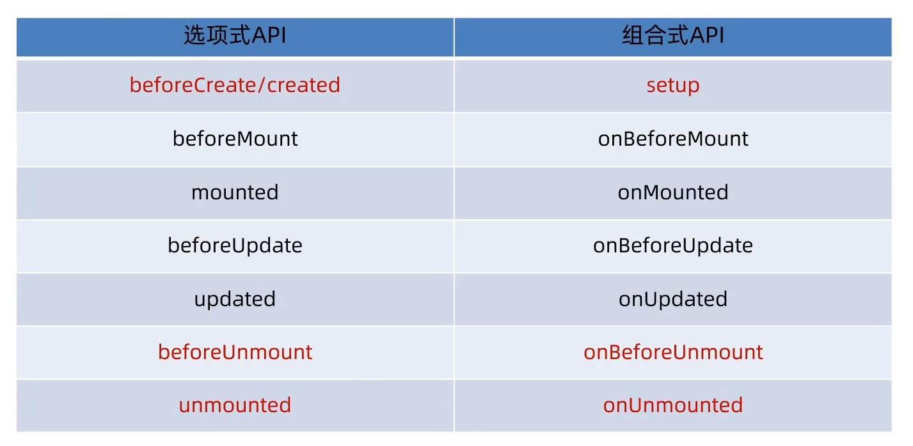

- 注意：原先的beforeDestory和destoryed被替换为了onBeforeUnmount和onUnmounted，
- 且原先需要写在beforeCreate/created中的内容现在直接写在setup里即可
- 语法：
  1. 导入对应函数
  2. 调用

> 写成函数的调用方式后，可以调用多次，并不会冲突，而是按照顺序依次执行
>
> 


### 父子通信

#### 双向绑定

##### 组合式API下的父传子

- 基本思想：
  1. 父组件给子组件绑定属性
  2. 子组件内部通过props选项接收
- 注意这里如果需要再script标签内使用父组件传入的参数的话需要接收defineProps的返回值，而在模板里可以直接使用


上图例子中因为传递的是静态属性因此不用使用v-bind即没有冒号，而如果传递变量才要冒号

> defineProps原理：就是编译阶段的一个标识，实际编译器解析时，遇到后会进行编译转换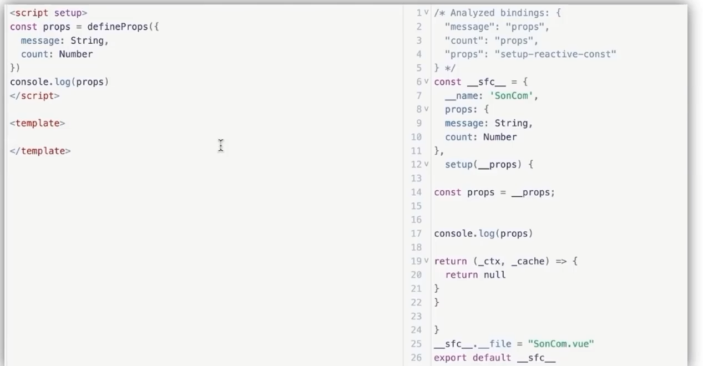

##### 组合式API下的子传父

- 基本思想：
  1. 父组件中给子组件标签通过@绑定事件
  2. 子组件中通过emit方法触发时间事件

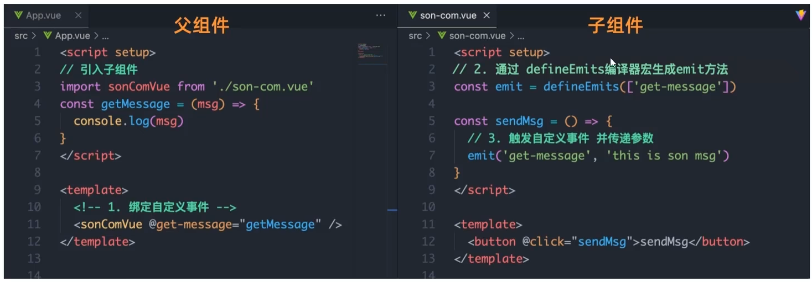

与vue2不同的是这里的emit定义的方法都需要使用defineEmits进行声明后再使用，此外这里没有this.$emit的原因也是setup没有this指针的原因


#### provide与inject

有时候我们会有跨层级组件传递的需求，例如爷爷组件向孙子组件传递消息

此时使用provide与inject可以很好地实现

- 语法：
  1. 顶层组件通过provide函数提供数据
  2. 底层组件通过inject函数获取数据


> 如果想实现底层组件修改顶层组件数据，那么可以通过顶层组件传递一个方法给底层组件来实现


### 模板引用

即获取DOM元素/组件对象，在Vue2中我们使用的是ref标识this.$refs获取

在Vue3则不是这样

- 语法：
  1. 使用ref函数生成一个ref对象
  2. 通过ref标识绑定ref对象到标签


> 需要注意的是获取模板引用的时机==一定要等待组件挂载完毕后==


#### defineExpose

实际上我们有时候会使用ref模板引用去获取组件对象，并且获取组件对象中的属性或方法

此时使用ref获取到组件对象后实际上是无法直接得到组件的属性/方法的

**需要再组件中将想要暴露的属性/方法进行暴露后才可以得到**


#### v-for中的ref

当在 `v-for` 中使用模板引用时，对应的 ref 中包含的值是一个数组，它将在元素被挂载后包含对应整个列表的所有元素

```vue
<script setup>
import { ref, onMounted } from 'vue'

const list = ref([
  /* ... */
])

const itemRefs = ref([])

onMounted(() => console.log(itemRefs.value))
</script>

<template>
  <ul>
    <li v-for="item in list" ref="itemRefs">
      {{ item }}
    </li>
  </ul>
</template>
```


#### 函数模板引用

ref可以绑定一个函数，会在每次组件更新时都被调用。该函数会收到元素引用作为其第一个参数

需要注意的是ref需要使用v-bind

```html
<input :ref="(el) => { /* 将 el 赋值给一个数据属性或 ref 变量 */ }">
```

注意我们这里需要使用动态的 `:ref` 绑定才能够传入一个函数。当绑定的元素被卸载时，函数也会被调用一次，此时的 `el` 参数会是 `null`。你当然也可以绑定一个组件方法而不是内联函数。


#### 组件与普通html标签的ref

组件上的ref拿到的是组件的实例（如果需要拿到DOM元素还需要结合``$el``），但是普通html标签的ref可以直接拿到DOM元素


### Vue3-defineModel

#### defineModel基本使用

从 Vue 3.4 开始，推荐的实现方式是使用 [`defineModel()`](https://cn.vuejs.org/api/sfc-script-setup.html#definemodel) 宏：

```vue
<!-- Child.vue -->
<script setup>
const model = defineModel()

function update() {
  model.value++
}
</script>

<template>
  <div>parent bound v-model is: {{ model }}</div>
</template>
```

父组件可以用 `v-model` 绑定一个值：

```vue
<!-- Parent.vue -->
<Child v-model="count" />
```

`defineModel()` 返回的值是一个 ref。它可以像其他 ref 一样被访问以及修改，不过它能起到在父组件和当前变量之间的双向绑定的作用：

- 它的 `.value` 和父组件的 `v-model` 的值同步；
- 当它被子组件变更了，会触发父组件绑定的值一起更新。

这意味着你也可以用 `v-model` 把这个 ref 绑定到一个原生 input 元素上，在提供相同的 `v-model` 用法的同时轻松包装原生 input 元素：

```vue
<script setup>
const model = defineModel()
</script>

<template>
  <input v-model="model" />
</template>
```

因为`defineModel` 声明了一个 prop，你可以通过给 `defineModel` 传递选项，来声明底层 prop 的选项：

```js
// 使 v-model 必填
const model = defineModel({ required: true })

// 提供一个默认值
const model = defineModel({ default: 0 })
```

> 底层机制：
>
> `defineModel` 是一个便利宏。编译器将其展开为以下内容：
>
> - 一个名为 `modelValue` 的 prop，本地 ref 的值与其同步；
> - 一个名为 `update:modelValue` 的事件，当本地 ref 的值发生变更时触发。

> 注意：
>
> 子组件使用defineModel设置默认值后，假如父组件在一开始没有为prop提供初始值，那么会导致父子组件不同步的情况
>
> 在下面的示例中，父组件的 `myRef` 是 undefined，而子组件的 `model` 是 1：
>
> ```js
> // 子组件：
> const model = defineModel({ default: 1 })
>
> // 父组件
> const myRef = ref()
> ```
>
> ```vue
> <Child v-model="myRef"></Child>
> ```


#### 多个v-model绑定

在Vue3.4之前，我们如果需要组件之间多个双向绑定的话，需要这么做

```vue
// 父组件为v-model传递一个参数
<MyComponent v-model:title="bookTitle" />
// 相当于
<MyComponent :title="bookTitle" @update:title="event => title = event.target.value"/>

// 子组件
<!-- MyComponent.vue -->
<script setup>
defineProps({
  title: {
    required: true
  }
})
defineEmits(['update:title'])
</script>

<template>
  <input
    type="text"
    :value="title"
    @input="$emit('update:title', $event.target.value)"
  />
</template>
```

但是在使用defineModel的情况下，我们可以这样做

```vue
<!-- MyComponent.vue -->
<script setup>
const title = defineModel('title')
// 如果需要额外的prop选项可以在model名称后面进行传递
const title = defineModel('title', { required: true })
</script>

<template>
  <input type="text" v-model="title" />
</template>
```

因此，多个v-model绑定即可这样做

```vue
// 父组件
<UserName
  v-model:first-name="first"
  v-model:last-name="last"
/>
// 子组件
<script setup>
const firstName = defineModel('firstName')
const lastName = defineModel('lastName')
</script>

<template>
  <input type="text" v-model="firstName" />
  <input type="text" v-model="lastName" />
</template>
```


#### 处理v-model修饰符

我们知道v-model有一些内置的修饰符，例如`.trim`，`.number` 和 `.lazy`

实际上Vue也支持自定义修饰符，在Vue3.4之前，我们这样做

```vue
<script setup>
const props = defineProps({
  modelValue: String,
  modelModifiers: { default: () => ({}) }// 接收所有修饰符
})

const emit = defineEmits(['update:modelValue'])

function emitValue(e) {
  let value = e.target.value
  // 在emit的同时判断修饰符并进行处理
  if (props.modelModifiers.capitalize) {
    value = value.charAt(0).toUpperCase() + value.slice(1)
  }
  emit('update:modelValue', value)
}
</script>

<template>
  <input type="text" :value="modelValue" @input="emitValue" />
</template>
```

在3.4之后，我们这样做

```vue
<script setup>
// 通过像这样解构 defineModel() 的返回值，可以在子组件中访问添加到组件 v-model 的修饰符
// 我们可以给 defineModel() 传入 get 和 set 这两个选项。这两个选项在从模型引用中读取或设置值时会接收到当前的值，并且它们都应该返回一个经过处理的新值
const [model, modifiers] = defineModel({
  set(value) {
    if (modifiers.capitalize) {
      return value.charAt(0).toUpperCase() + value.slice(1)
    }
    return value
  }
})
</script>

<template>
  <input type="text" v-model="model" />
</template>
```

> 带参数的v-model修饰符如下：
>
> ```vue
> <UserName
>   v-model:first-name.capitalize="first"
>   v-model:last-name.uppercase="last"
> />
> ```
>
> ```vue
> <script setup>
> const [firstName, firstNameModifiers] = defineModel('firstName')
> const [lastName, lastNameModifiers] = defineModel('lastName')
>
> console.log(firstNameModifiers) // { capitalize: true }
> console.log(lastNameModifiers) // { uppercase: true}
> </script>
> ```


### 异步组件

在大型项目中，我们可能需要拆分应用为更小的块，并仅在需要时再从服务器加载相关组件。Vue 提供了 [`defineAsyncComponent`](https://cn.vuejs.org/api/general.html#defineasynccomponent) 方法来实现此功能：

```JavaScript
import { defineAsyncComponent } from 'vue'

const AsyncComp = defineAsyncComponent(() => {
  return new Promise((resolve, reject) => {
    // ...从服务器获取组件
    resolve(/* 获取到的组件 */)
  })
})
// ... 像使用其他一般组件一样使用 `AsyncComp`
```

如你所见，`defineAsyncComponent` 方法接收一个返回 Promise 的加载函数。这个 Promise 的 `resolve` 回调方法应该在从服务器获得组件定义时调用。你也可以调用 `reject(reason)` 表明加载失败。

[ES 模块动态导入](https://developer.mozilla.org/en-US/docs/Web/JavaScript/Reference/Operators/import)也会返回一个 Promise，所以多数情况下我们会将它和 `defineAsyncComponent` 搭配使用。类似 Vite 和 Webpack 这样的构建工具也支持此语法 (并且会将它们作为打包时的代码分割点)，因此我们也可以用它来导入 Vue 单文件组件：

```JavaScript
import { defineAsyncComponent } from 'vue'

const AsyncComp = defineAsyncComponent(() =>
  import('./components/MyComponent.vue')
)
```

最后得到的 `AsyncComp` 是一个外层包装过的组件，仅在页面需要它渲染时才会调用加载内部实际组件的函数。它会将接收到的 props 和插槽传给内部组件，所以你可以使用这个异步的包装组件无缝地替换原始组件，同时实现延迟加载。

与普通组件一样，异步组件可以使用 `app.component()` [全局注册](https://cn.vuejs.org/guide/components/registration.html#global-registration)：

```JavaScript
app.component('MyComponent', defineAsyncComponent(() =>
  import('./components/MyComponent.vue')
))
```

也可以直接在父组件中直接定义它们：

```JavaScript
<script setup>
import { defineAsyncComponent } from 'vue'

const AdminPage = defineAsyncComponent(() =>
  import('./components/AdminPageComponent.vue')
)
</script>

<template>
  <AdminPage />
</template>
```

> 异步操作不可避免地会涉及到加载和错误状态，因此 `defineAsyncComponent()` 也支持在高级选项中处理这些状态：
>
> ```javascript
> const AsyncComp = defineAsyncComponent({
>   // 加载函数
>   loader: () => import('./Foo.vue'),
>
>   // 加载异步组件时使用的组件
>   loadingComponent: LoadingComponent,
>   // 展示加载组件前的延迟时间，默认为 200ms
>   delay: 200,
>
>   // 加载失败后展示的组件
>   errorComponent: ErrorComponent,
>   // 如果提供了一个 timeout 时间限制，并超时了
>   // 也会显示这里配置的报错组件，默认值是：Infinity
>   timeout: 3000
> })
> ```
>
> 如果提供了一个加载组件，它将在内部组件加载时先行显示。在加载组件显示之前有一个默认的 200ms 延迟——这是因为在网络状况较好时，加载完成得很快，加载组件和最终组件之间的替换太快可能产生闪烁，反而影响用户感受。
>
> 如果提供了一个报错组件，则它会在加载器函数返回的 Promise 抛错时被渲染。你还可以指定一个超时时间，在请求耗时超过指定时间时也会渲染报错组件。
>
> [如何优雅地使用Vue3的异步组件 - 掘金 (juejin.cn)](https://juejin.cn/post/7108593780638351397)


### 透传Attributes

#### Attributes继承

“透传 attribute”指的是传递给一个组件，却没有被该组件声明为 [props](https://cn.vuejs.org/guide/components/props.html) 或 [emits](https://cn.vuejs.org/guide/components/events.html#defining-custom-events) 的 attribute 或者 `v-on` 事件监听器。最常见的例子就是 `class`、`style` 和 `id`。

当一个组件以单个元素为根作渲染时，透传的 attribute 会自动被添加到根元素上。举例来说，假如我们有一个 `<MyButton>` 组件，它的模板长这样：

```vue
<!-- <MyButton> 的模板 -->
<button>click me</button>
// 假如button本身就有style或class的属性，那么父组件传递的透传参数将会与之合并
例如
<button class="btn">click me</button>
```

一个父组件使用了这个组件，并且传入了 `class`：

```vue
<MyButton class="large" />
```

最后渲染出的 DOM 结果是：

```vue
<button class="large">click me</button>
// 如果button本身就有btn类，那么透传的参数large进行合并
<button class="btn large">click me</button>
```

这里，`<MyButton>` 并没有将 `class` 声明为一个它所接受的 prop，所以 `class` 被视作透传 attribute，自动透传到了 `<MyButton>` 的根元素上


#### v-on监听器继承

同样的规则也适用于 `v-on` 事件监听器

```vue
<MyButton @click="onClick" />
```

`click` 监听器会被添加到 `<MyButton>` 的根元素，即那个原生的 `<button>` 元素之上。**当原生的 `<button>` 被点击，会触发父组件的 `onClick` 方法。同样的，如果原生 `button` 元素自身也通过 `v-on` 绑定了一个事件监听器，则这个监听器和从父组件继承的监听器都会被触发。**


#### 深层组件继承

有些情况下一个组件会在根节点上渲染另一个组件。例如，我们重构一下 `<MyButton>`，让它在根节点上渲染 `<BaseButton>`：

```vue
<!-- <MyButton/> 的模板，只是渲染另一个组件 -->
<BaseButton />
```

**此时 `<MyButton>` 接收的透传 attribute 会直接继续传给 `<BaseButton>`。**

> 注意：
>
> 透传的属性或监听函数，如果在中间组件的defineProps或defineEmits中定义了，那么则这些属性或监听函数不会再继续透传下去（即声明过的 props 和侦听函数被 `中间组件`“消费”了


#### 禁用Attributes继承

如果你**不想要**一个组件自动地继承 attribute，你可以在组件选项中设置 `inheritAttrs: false`。

从 3.3 开始你也可以直接在 `<script setup>` 中使用 [`defineOptions`](https://cn.vuejs.org/api/sfc-script-setup.html#defineoptions)：

```vue
<script setup>
defineOptions({
  inheritAttrs: false
})
// ...setup 逻辑
</script>
```

最常见的需要禁用 attribute 继承的场景就是 attribute 需要应用在根节点以外的其他元素上。通过设置 `inheritAttrs` 选项为 `false`，你可以完全控制透传进来的 attribute 被如何使用。

**这些透传进来的 attribute 可以在模板的表达式中直接用 `$attrs` 访问到（这个`$attrs`包含了除组件所声明的 `props` 和 `emits` 之外的所有其他 attribute，例如 `class`，`style`，`v-on` 监听器等等**）。**

例如：

有时候我们可能为了样式，需要在 `<button>` 元素外包装一层 `<div>`：

```vue
<div class="btn-wrapper">
  <button class="btn">click me</button>
</div>
```

我们想要所有像 `class` 和 `v-on` 监听器这样的透传 attribute 都应用在内部的 `<button>` 上而不是外层的 `<div>` 上。我们可以通过设定 `inheritAttrs: false` 和使用 `v-bind="$attrs"` 来实现：

```vue
<div class="btn-wrapper">
  <button class="btn" v-bind="$attrs">click me</button>
</div>

<script setup>
defineOptions({
  inheritAttrs: false
})
// ...setup 逻辑
</script>
```

小提示：[没有参数的 `v-bind`](https://cn.vuejs.org/guide/essentials/template-syntax.html#dynamically-binding-multiple-attributes) 会将一个对象的所有属性都作为 attribute 应用到目标元素上。

> 注意：
>
> - 和 props 有所不同，透传 attributes 在 JavaScript 中保留了它们原始的大小写，所以像 `foo-bar` 这样的一个 attribute 需要通过 `$attrs['foo-bar']` 来访问。
> - 像 `@click` 这样的一个 `v-on` 事件监听器将在此对象下被暴露为一个函数 `$attrs.onClick`。


#### 多根节点的Attributes继承

前面我们讨论的组件都是单根节点的，而和单根节点组件有所不同，有着多个根节点的组件没有自动 attribute 透传行为。如果 `$attrs` 没有被显式绑定，将会抛出一个运行时警告。

```vue
<CustomLayout id="custom-layout" @click="changeValue" />
```

如果 `<CustomLayout>` 有下面这样的多根节点模板，由于 Vue 不知道要将 attribute 透传到哪里，所以会抛出一个警告。

```vue
<header>...</header>
<main>...</main>
<footer>...</footer>
```

如果 `$attrs` 被显式绑定，则不会有警告：

```vue
<header>...</header>
<main v-bind="$attrs">...</main>
<footer>...</footer>
```


#### 在JavaScript中访问透传Attributes

前面我们已经知道在模板中访问透传的参数使用`$attrs`即可

如果需要，你可以在 `<script setup>` 中使用 `useAttrs()` API 来访问一个组件的所有透传 attribute：

```vue
<script setup>
import { useAttrs } from 'vue'

const attrs = useAttrs()
</script>
```

> 注意这里的attrs并非响应式的，你不能通过侦听器去监听它的变化。如果你需要响应性，可以使用 prop。或者你也可以使用 `onUpdated()` 使得在每次更新时结合最新的 `attrs` 执行副作用。


### 插槽

#### 作用域插槽应用实例

这里我们来看一个 `<FancyList>` 组件的例子。它会渲染一个列表，并同时会封装一些加载远端数据的逻辑、使用数据进行列表渲染、或者是像分页或无限滚动这样更进阶的功能。然而我们希望它能够保留足够的灵活性，将对单个列表元素内容和样式的控制权留给使用它的父组件。我们期望的用法可能是这样的：

```vue
<FancyList :api-url="url" :per-page="10">
  <template #item="{ body, username, likes }">
    <div class="item">
      <p>{{ body }}</p>
      <p>by {{ username }} | {{ likes }} likes</p>
    </div>
  </template>
</FancyList>
```

在 `<FancyList>` 之中，我们可以多次渲染 `<slot>` 并每次都提供不同的数据 (注意我们这里使用了 `v-bind` 来传递插槽的 props)：

```vue
// 子组件
<ul>
  <li v-for="item in items">
    <slot name="item" v-bind="item"></slot>
  </li>
</ul>
```


### 依赖注入

#### Prop逐级透传问题

通常情况下，当我们需要从父组件向子组件传递数据时，会使用 [props](https://cn.vuejs.org/guide/components/props.html)。想象一下这样的结构：有一些多层级嵌套的组件，形成了一颗巨大的组件树，而某个深层的子组件需要一个较远的祖先组件中的部分数据。在这种情况下，如果仅使用 props 则必须将其沿着组件链逐级传递下去，这会非常麻烦：


注意，虽然这里的 `<Footer>` 组件可能根本不关心这些 props，但为了使 `<DeepChild>` 能访问到它们，仍然需要定义并向下传递。如果组件链路非常长，可能会影响到更多这条路上的组件。这一问题被称为“prop 逐级透传”，显然是我们希望尽量避免的情况。


#### provide和inject

一个父组件相对于其所有的后代组件，会作为**依赖提供者（provide）**。任何后代的组件树，无论层级有多深，都可以**注入（inject）**由父组件提供给整条链路的依赖。


##### provide

要为组件后代提供数据，需要使用到 [`provide()`](https://cn.vuejs.org/api/composition-api-dependency-injection.html#provide) 函数：

```vue
<script setup>
import { provide } from 'vue'

provide(/* 注入名 */ 'message', /* 值 */ 'hello!')
</script>
```

`provide()` 函数接收两个参数。第一个参数被称为**注入名**，可以是一个**字符串**或是一个 `Symbol`。后代组件会用注入名来查找期望注入的值。一个组件可以多次调用 `provide()`，使用不同的注入名，注入不同的依赖值。

第二个参数是提供的值，值可以是任意类型，包括响应式的状态，比如一个 ref：

```js
import { ref, provide } from 'vue'

const count = ref(0)
provide('key', count)
```

提供的响应式状态使后代组件可以由此和提供者建立响应式的联系。

> 应用层provide
>
> 除了在一个组件中提供依赖，我们还可以在整个应用层面提供依赖：
>
> ```js
> import { createApp } from 'vue'
>
> const app = createApp({})
>
> app.provide(/* 注入名 */ 'message', /* 值 */ 'hello!')
> ```
>
> 在应用级别提供的数据在该应用内的所有组件中都可以注入。这在你编写[插件](https://cn.vuejs.org/guide/reusability/plugins.html)时会特别有用，因为插件一般都不会使用组件形式来提供值。

##### inject

要注入上层组件提供的数据，需使用 [`inject()`](https://cn.vuejs.org/api/composition-api-dependency-injection.html#inject) 函数：

```vue
<script setup>
import { inject } from 'vue'z

const message = inject('message')
</script>
```

如果提供的值是一个 ref，注入进来的会是该 ref 对象，而**不会**自动解包为其内部的值。这使得注入方组件能够通过 ref 对象保持了和供给方的响应性链接。


###### 默认inject

默认情况下，``inject``假设传入的注入名会被某个祖先链上的组件提供，如果该注入名的确没有任何组件提供，则抛出异常

如果在注入一个值时不要求必须有提供者，那么我们应该声明一个默认值，和 props 类似：

```js
// 如果没有祖先组件提供 "message"
// `value` 会是 "这是默认值"
const value = inject('message', '这是默认值')
```

> 在一些场景中，默认值可能需要通过调用一个函数或初始化一个类来取得。为了避免在用不到默认值的情况下进行不必要的计算或产生副作用，我们可以使用工厂函数来创建默认值：
>
> ```js
> const value = inject('key', () => new ExpensiveClass(), true)
> ```
>
> 第三个参数表示默认值应该被当作一个工厂函数。

###### 和响应式数据配合使用

当提供 / 注入响应式的数据时，**建议尽可能将任何对响应式状态的变更都保持在供给方组件中**。这样可以确保所提供状态的声明和变更操作都内聚在同一个组件内，使其更容易维护。

有的时候，我们可能需要在注入方组件中更改数据。在这种情况下，我们推荐在供给方组件内声明并提供一个更改数据的方法函数：

```vue
<!-- 在供给方组件内 -->
<script setup>
import { provide, ref } from 'vue'

const location = ref('North Pole')

function updateLocation() {
  location.value = 'South Pole'
}

provide('location', {
  location,
  updateLocation
})
</script>
```

```vue
<!-- 在注入方组件 -->
<script setup>
import { inject } from 'vue'

const { location, updateLocation } = inject('location')
</script>

<template>
  <button @click="updateLocation">{{ location }}</button>
</template>
```

> 如果你想确保提供的数据不能被注入方的组件更改，你可以使用 [`readonly()`](https://cn.vuejs.org/api/reactivity-core.html#readonly) 来包装提供的值。
>
> ```vue
> <script setup>
> import { ref, provide, readonly } from 'vue'
>
> const count = ref(0)
> provide('read-only-count', readonly(count))
> </script>
> ```


### 逻辑复用

#### 组合式函数

在 Vue 应用的概念中，“组合式函数”(Composables) 是一个利用 Vue 的组合式 API 来封装和复用**有状态逻辑**的函数。

理解"状态"：

- 为了在不同地方格式化时间，我们可能会抽取一个可复用的日期格式化函数。这个函数封装了**无状态的逻辑**，复用无状态逻辑的库有很多，比如你可能已经用过的 [lodash](https://lodash.com/) 或是 [date-fns](https://date-fns.org/)
- 相比之下，有状态逻辑负责管理会随时间而变化的状态。一个简单的例子是跟踪当前鼠标在页面中的位置。

如果我们要直接在组件中使用组合式 API 实现鼠标跟踪功能，它会是这样的：

```vue
<script setup>
import { ref, onMounted, onUnmounted } from 'vue'

const x = ref(0)
const y = ref(0)

function update(event) {
  x.value = event.pageX
  y.value = event.pageY
}

onMounted(() => window.addEventListener('mousemove', update))
onUnmounted(() => window.removeEventListener('mousemove', update))
</script>

<template>Mouse position is at: {{ x }}, {{ y }}</template>
```

但是，如果我们想在多个组件中复用这个相同的逻辑呢？我们可以把这个逻辑以一个组合式函数的形式提取到外部文件中：

```js
// mouse.js
import { ref, onMounted, onUnmounted } from 'vue'

// 按照惯例，组合式函数名以“use”开头
export function useMouse() {
  // 被组合式函数封装和管理的状态
  const x = ref(0)
  const y = ref(0)

  // 组合式函数可以随时更改其状态。
  function update(event) {
    x.value = event.pageX
    y.value = event.pageY
  }

  // 一个组合式函数也可以挂靠在所属组件的生命周期上
  // 来启动和卸载副作用
  onMounted(() => window.addEventListener('mousemove', update))
  onUnmounted(() => window.removeEventListener('mousemove', update))

  // 通过返回值暴露所管理的状态
  return { x, y }
}
```

下面是它在组件中使用的方式：

```vue
<script setup>
import { useMouse } from './mouse.js'

const { x, y } = useMouse()
</script>

<template>Mouse position is at: {{ x }}, {{ y }}</template>
```

> 如你所见，核心逻辑完全一致，我们做的只是把它移到一个外部函数中去，并返回需要暴露的状态。和在组件中一样，你也可以在组合式函数中使用所有的[组合式 API](https://cn.vuejs.org/api/#composition-api)。
>
> 此外，你还可以在一个组合式函数中嵌套多个组合式函数

##### 异步状态示例

`useMouse()` 组合式函数没有接收任何参数，因此让我们再来看一个需要接收一个参数的组合式函数示例。在做异步数据请求时，我们常常需要处理不同的状态：加载中、加载成功和加载失败。

```vue
<script setup>
import { ref } from 'vue'

const data = ref(null)
const error = ref(null)

fetch('...')
  .then((res) => res.json())
  .then((json) => (data.value = json))
  .catch((err) => (error.value = err))
</script>

<template>
  <div v-if="error">Oops! Error encountered: {{ error.message }}</div>
  <div v-else-if="data">
    Data loaded:
    <pre>{{ data }}</pre>
  </div>
  <div v-else>Loading...</div>
</template>
```

如果在每个需要获取数据的组件中都要重复这种模式，那就太繁琐了。让我们把它抽取成一个组合式函数：

```js
// fetch.js
import { ref } from 'vue'

export function useFetch(url) {
  const data = ref(null)
  const error = ref(null)

  fetch(url)
    .then((res) => res.json())
    .then((json) => (data.value = json))
    .catch((err) => (error.value = err))

  return { data, error }
}
```

现在我们在组件里只需要：

```vue
<script setup>
import { useFetch } from './fetch.js'

const { data, error } = useFetch('...')
</script>
```


#### 自定义指令

Vue中允许我们自定义类似v-bind、v-model类似的指令

一个自定义指令由一个包含类似组件生命周期钩子的对象来定义。钩子函数会接收到指令所绑定元素作为其参数。下面是一个自定义指令的例子，当一个 input 元素被 Vue 插入到 DOM 中后，它会被自动聚焦：

```vue
<script setup>
// 在模板中启用 v-focus
const vFocus = {
  mounted: (el) => el.focus()
}
</script>

<template>
  <input v-focus />
</template>
```

在 `<script setup>` 中，任何以 `v` 开头的驼峰式命名的变量都可以被用作一个自定义指令。在上面的例子中，`vFocus` 即可以在模板中以 `v-focus` 的形式使用。

将一个自定义指令全局注册到应用层级也是一种常见的做法：

```js
const app = createApp({})

// 使 v-focus 在所有组件中都可用
app.directive('focus', {
  /* ... */
})
```

> 只有当所需功能只能通过直接的 DOM 操作来实现时，才应该使用自定义指令。其他情况下应该尽可能地使用 `v-bind` 这样的内置指令来声明式地使用模板，这样更高效，也对服务端渲染更友好。


##### 指令钩子

前面我们提到自定义指令由一个包含类似组件生命周期钩子的对象来定义，有如下几种钩子：

```js
const myDirective = {
  // 在绑定元素的 attribute 前
  // 或事件监听器应用前调用
  created(el, binding, vnode, prevVnode) {
    // 下面会介绍各个参数的细节
  },
  // 在元素被插入到 DOM 前调用
  beforeMount(el, binding, vnode, prevVnode) {},
  // 在绑定元素的父组件
  // 及他自己的所有子节点都挂载完成后调用
  mounted(el, binding, vnode, prevVnode) {},
  // 绑定元素的父组件更新前调用
  beforeUpdate(el, binding, vnode, prevVnode) {},
  // 在绑定元素的父组件
  // 及他自己的所有子节点都更新后调用
  updated(el, binding, vnode, prevVnode) {},
  // 绑定元素的父组件卸载前调用
  beforeUnmount(el, binding, vnode, prevVnode) {},
  // 绑定元素的父组件卸载后调用
  unmounted(el, binding, vnode, prevVnode) {}
}
```


##### 钩子参数

指令的钩子会传递以下几种参数：

- `el`：指令绑定到的元素。这可以用于直接操作 DOM。
- `binding`：一个对象，包含以下属性。
  - `value`：传递给指令的值。例如在 `v-my-directive="1 + 1"` 中，值是 `2`。
  - `oldValue`：之前的值，仅在 `beforeUpdate` 和 `updated` 中可用。无论值是否更改，它都可用。
  - `arg`：传递给指令的参数 (如果有的话)。例如在 `v-my-directive:foo` 中，参数是 `"foo"`。
  - `modifiers`：一个包含修饰符的对象 (如果有的话)。例如在 `v-my-directive.foo.bar` 中，修饰符对象是 `{ foo: true, bar: true }`。
  - `instance`：使用该指令的组件实例。
  - `dir`：指令的定义对象。
- `vnode`：代表绑定元素的底层 VNode。
- `prevNode`：代表之前的渲染中指令所绑定元素的 VNode。仅在 `beforeUpdate` 和 `updated` 钩子中可用。

举例来说，像下面这样使用指令：

```vue
<div v-example:foo.bar="baz">
```

`binding` 参数会是一个这样的对象：

```js
{
  arg: 'foo',
  modifiers: { bar: true },
  value: /* `baz` 的值 */,
  oldValue: /* 上一次更新时 `baz` 的值 */
}
```

和内置指令类似，自定义指令的参数也可以是动态的。举例来说：

```vue
<div v-example:[arg]="value"></div>
```

这里指令的参数会基于组件的 `arg` 数据属性响应式地更新。

> Note
>
> 除了 `el` 外，其他参数都是只读的，不要更改它们。若你需要在不同的钩子间共享信息，推荐通过元素的 [dataset](https://developer.mozilla.org/en-US/docs/Web/API/HTMLElement/dataset) attribute 实现。


##### 简化形式

对于自定义指令来说，一个很常见的情况是仅仅需要在 `mounted` 和 `updated` 上实现相同的行为，除此之外并不需要其他钩子。这种情况下我们可以直接用一个函数来定义指令，如下所示：

```vue
<div v-color="color"></div>
```

```js
app.directive('color', (el, binding) => {
  // 这会在 `mounted` 和 `updated` 时都调用
  el.style.color = binding.value
})
```


##### 在组件上的自定义指令

**不推荐**在组件上使用


#### 插件

##### 基本介绍

注意：这里的所谓的"插件"并非我们在vscode中那些可以安装的插件，而是在Vue中的一个**概念**

**插件是一种能够为Vue添加全局功能的工具代码**

下面将介绍插件的具体使用以及应用场景

```js
// main.js/main.ts文件
import { createApp } from 'vue'
import myPlugin from './plugins/myPlugin'

const app = createApp({})

// 一般而言，插件都会编写在一个独立的JS/TS文件中，再导入到main.js/ts文件中使用
app.use(myPlugin, {
  /* 可选的选项 */
})
```

一个插件可以是一个拥有``install()``方法的对象，也可以直接是一个``install``函数。安装函数会接收到安装它的应用实例和传递给``app.use()``的额外选项作为参数：

```js
//myPlugin.js/ts

const myPlugin = {
  install(app, options) {
    // 配置此应用
  }
}
```

插件的主要应用场景如下：

1. 通过 [`app.component()`](https://cn.vuejs.org/api/application.html#app-component) 和 [`app.directive()`](https://cn.vuejs.org/api/application.html#app-directive) 注册一到多个全局组件或自定义指令。
2. 通过 [`app.provide()`](https://cn.vuejs.org/api/application.html#app-provide) 使一个资源[可被注入](https://cn.vuejs.org/guide/components/provide-inject.html)进整个应用。
3. 向 [`app.config.globalProperties`](https://cn.vuejs.org/api/application.html#app-config-globalproperties) 中添加一些全局实例属性或方法
4. 一个可能上述三种都包含了的功能库 (例如 [vue-router](https://github.com/vuejs/vue-router-next))。


##### 例子

这里是一个``i18n``国际化插件的例子

我们希望有一个翻译函数，这个函数接收一个以 `.` 作为分隔符的 `key` 字符串，用来在用户提供的翻译字典中查找对应语言的文本。期望的使用方式如下：

```vue
<h1>{{ $translate('greetings.hello') }}</h1>
```

这个函数应当能够在任意模板中被全局调用。这一点可以通过在插件中将它添加到 `app.config.globalProperties` 上来实现：

```js
// plugins/i18n.js
export default {
  install: (app, options) => {
    // 注入一个全局可用的 $translate() 方法
    app.config.globalProperties.$translate = (key) => {
      // 获取 `options` 对象的深层属性
      // 使用 `key` 作为索引
      return key.split('.').reduce((o, i) => {
        if (o) return o[i]
      }, options)
    }
  }
}
//我们的 $translate 函数会接收一个例如 greetings.hello 的字符串，在用户提供的翻译字典中查找，并返回翻译得到的值。
```

用于查找的翻译字典对象则应当在插件被安装时作为 `app.use()` 的额外参数被传入：

```js
import i18nPlugin from './plugins/i18n'

app.use(i18nPlugin, {
  greetings: {
    hello: 'Bonjour!'
  }
})
```

这样，我们一开始的表达式 `$translate('greetings.hello')` 就会在运行时被替换为 `Bonjour!` 了。


##### 插件中的Provide/Inject

在插件中我们可以使用Provide将接收到的``options``参数提供给整个应用，使得任何组件都可以使用该对象

根据前面的例子

```js
// plugins/i18n.js
export default {
  install: (app, options) => {
    app.provide('i18n', options)
  }
}
```

现在，插件用户就可以在他们的组件中以 `i18n` 为 key 注入并访问插件的选项对象了。

```js
<script setup>
import { inject } from 'vue'

const i18n = inject('i18n')

console.log(i18n.greetings.hello)
</script>
```


## Pinia

### 什么是Pinia

- Pinia是Vue的最新的**状态管理工具**，**是Vuex的替代品**


- 相比Vuex的优点：
  - 提供了更加简单的API(去掉了mutations，只留下state、actions、getters，其中actions可以直接修改state的数据)
  - 提供符合组合式风格的API(和Vue3新语法统一)
  - 去掉了modules的概念，每一个store都是应该独立模块
  - 对typescript友好


### 添加Pinia到Vue项目

实际开发项目时，关于Pinia的配置直接在Vue创建时即可选择Pinia进行添加

如果没有选择也可以按照官方文档进行配置

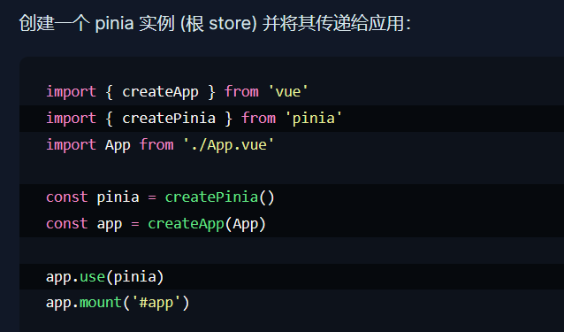


### Pinia基本使用

- 定义store仓库
  1. 在src目录新建store目录，之后在该目录store中即可创建自己任意模块的仓库了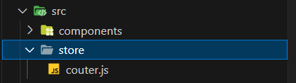
  2. 使用defineStore定义仓库( 你可以对 `defineStore()` 的返回值进行任意命名，但最好使用 store 的名字，同时以 `use` 开头且以 `Store` 结尾。(比如 `useUserStore`，`useCartStore`，`useProductStore`), 第一个参数是你的应用中 Store 的唯一 ID。)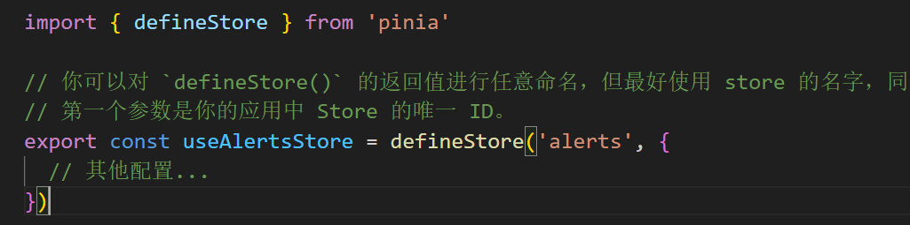
  3. 定义仓库内容(函数就是actions即可以直接在里面写异步内容)


- 使用Pinia仓库

1. 在任意组件中导入定义好的仓库(defineStore的返回值是函数)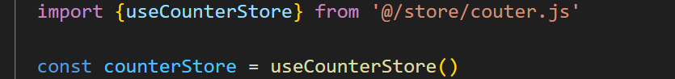
2. 在模板中随意使用即可


### 变更state的两种方式

**注意**，这里是**在选项式api**的前提下

除了用 `store.count++` 直接改变 store，你还可以调用 `$patch` 方法。它允许你用一个 `state` 的补丁对象在同一时间更改多个属性（这里的store即pinia实例，可以使用this替代）：

```js
store.$patch({
  count: store.count + 1,
  age: 120,
  name: 'DIO',
})
```

但是，这种语法本质上是重新创建变量再执行操作，因此，对于集合操作（例如，向数组中添加、移除一个元素或是做 `splice` 操作）都需要重新创建一个新的集合进行操作，导致变更真的很难实现或者很耗时

但`$patch` 方法也允许接收函数来组合这种难以用补丁对象实现的变更

```js
store.$patch((state) => {
  state.items.push({ name: 'shoes', quantity: 1 })
  state.hasChanged = true
})
```

> 两种变更 store 方法的主要区别是，`$patch()` 允许你将多个变更归入 devtools 的同一个条目中


### storeToRefs

对于一个仓库导入到组件中后，我们经过前面的学习知道可以直接 仓库名.属性/仓库名.方法() 使用到该仓库的内容，那么如果你觉得这样麻烦的话，我们也可以将其中的内容进行解构，这样便不需要使用点了

但是！！！

对于属性而言，我们不能直接这样


这破坏了响应式，相当于声明了两个变量进行初始化了而已

为了从 store 中提取属性时保持其响应性，你需要使用 `storeToRefs()`。它将为每一个响应式属性创建引用。当你只使用 store 的状态而不调用任何 action 时，它会非常有用。请注意，你可以直接从 store 中解构 action，因为它们也被绑定到 store 上：

```javascript
<script setup>
import { storeToRefs } from 'pinia'
const store = useCounterStore()
// `name` 和 `doubleCount` 是响应式的 ref
// 同时通过插件添加的属性也会被提取为 ref
// 并且会跳过所有的 action 或非响应式 (不是 ref 或 reactive) 的属性
const { name, doubleCount } = storeToRefs(store)
// 作为 action 的 increment 可以直接解构
const { increment } = store
</script>
```

==一句话：方法可以直接解构，属性需要使用storeToRefs()进行解构==


### pinia持久化存储

[参考官网Home | pinia-plugin-persistedstate (prazdevs.github.io)](https://prazdevs.github.io/pinia-plugin-persistedstate/zh/)

==注意：当本地拥有数据时，pinia内的数据会被本地数据覆盖==

- 使用步骤：

  1. 安装对应插件``npm i pinia-plugin-persistedstate``

  2. 将插件添加到 pinia 实例上

     ```javascript
     import { createPinia } from 'pinia'
     import piniaPluginPersistedstate from 'pinia-plugin-persistedstate'

     const pinia = createPinia()
     pinia.use(piniaPluginPersistedstate)
     ```
     3. 在创建store时，传入第三个参数一个对象(**默认整个store的数据都做持久化存储**)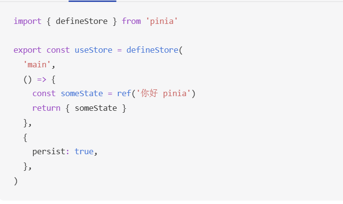

- 当然，我们如果不希望使用pinia的默认配置，也可以自己配置相应的配置项

- 例如：持久化存储的键名可以自定义，只需为persist对象传入以key为键的键值对即可

- 如果不想整个store都被持久化，那么可以传入paths为键的键值对


## 项目


### pnpm包管理器-创建项目

- pnpm的优势：比同类工具快2倍左右、节省磁盘空间
- 安装方式：``npm install -g pnpm``
- 创建项目：``pnpm create vue``

> 总结目前所学三种包管理器：
>
> 


### ESLint & prettier 配置代码风格

**环境同步：**

1. **安装了插件 ESlint，开启保存自动修复**
2. **禁用了插件 Prettier，并关闭保存自动格式化**

```jsx
// ESlint插件 + Vscode配置 实现自动格式化修复
"editor.codeActionsOnSave": {
    "source.fixAll": true
},
"editor.formatOnSave": false,
```

**配置文件 .eslintrc.cjs**

1. prettier 风格配置 [https://prettier.io](https://prettier.io/docs/en/options.html )
   1. 单引号
   2. 不使用分号
   3. 每行宽度至多80字符
   4. 不加对象|数组最后逗号
   5. 换行符号不限制（win mac 不一致）
2. vue组件名称多单词组成（忽略index.vue）
3. props解构（关闭）

```jsx
  rules: {
    'prettier/prettier': [
      'warn',
      {
        singleQuote: true, // 单引号
        semi: false, // 无分号
        printWidth: 80, // 每行宽度至多80字符
        trailingComma: 'none', // 不加对象|数组最后逗号
        endOfLine: 'auto' // 换行符号不限制（win mac 不一致）
      }
    ],
    'vue/multi-word-component-names': [
      'warn',
      {
        ignores: ['index'] // vue组件名称多单词组成（忽略index.vue）
      }
    ],
    'vue/no-setup-props-destructure': ['off'], // 关闭 props 解构的校验
    // 💡 添加未定义变量错误提示，create-vue@3.6.3 关闭，这里加上是为了支持下一个章节演示。
    'no-undef': 'error'
  }
```


### 基于husky的代码检查工作流

- husky是git的一个hooks(钩子)工具，即husky可以帮助我们在git管理项目的过程中使用钩子，或者说在特定的时间执行特定的代码，最有用的就是在我们进行代码提交之前进行代码检查
- https://typicode.github.io/husky/
- 使用步骤：
  1. 初始化git仓库，执行``git init``
  2. 初始化husky工具配置，执行``pnpm dlx husky-init && pnpm install``
  3. 修改.husky/pre-commit文件

```jsx
pnpm lint//lint是package.json中的eslint全局检查命令
```

**问题：**默认进行的是全量检查，耗时问题，历史问题，我们不可能保证别人的代码也能够完全符合规范！

**解决**：使用暂存区eslint校验(即只对自己写的代码进行校验)

- 步骤：
  1. 安装lint-staged包``pnpm i lint-staged -D``
  2. package.json中配置lint-staged
  3. 修改.husky/pre-commit文件``pnpm lint-staged``


### VueRouter4路由变化


1. 创建路由实例不再是直接new VueRouter而是被封装成**createRouter函数**
2. 路由模式
   1. **history**模式使用**createWebHistory**()   即地址栏没有#
   2. **hash**模式使用**createWebHashHistory**()  即地址栏带#
   3. 参数是基础路径，默认是/，而这里的``import.meta.env.BASE_URL``指向的是vite.config.js中的base配置项，即设置地址栏的基地址


**在Vue3 CompositionAPI中**

- **获取路由对象 router** 使用``const router = useRouter()``
- **获取路由参数route**使用``const route = useRoute()``


### 按需导入Element Plus

* 使用步骤：
  1. 安装``pnpm add element-plus``
  2. 按照官方文档进行配置按需导入[快速开始 | Element Plus (element-plus.org)](http://element-plus.org/zh-CN/guide/quickstart.html#%E6%8C%89%E9%9C%80%E5%AF%BC%E5%85%A5)
  3. 直接使用组件即可(默认components下的文件也会被自动注册)


### pinia仓库统一管理

- 将main.js中与pinia相关的内容都移动到stores/index.js中

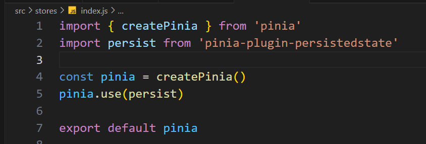

- 将所有仓库都导出到同一个出口再导出实现仓库的统一导出(可以将所有仓库的use函数都导出到index.js中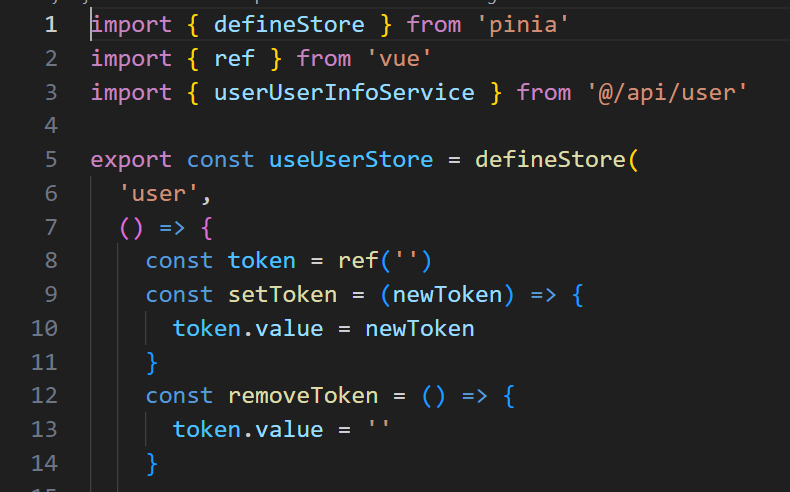


### Element-plus使用

#### 布局相关

- <el-row>标签表示一行，一行分为24份
- <el-col>标签表示一列
  - 属性span代表在一行中，占多少份
  - 属性offset代表在一行中，左侧margin份数
- <el-form>表示整个表单组件
- <el-form-item>表单的一行(一个表单域)
- <el-input>表单元素(输入框)


#### 校验相关

- <el-form> => :model="ruleForm"绑定的整个form的数据对象{xxx,xxx,xxx}
- <el-form> => :rules="rules"  绑定的整个表单的规则对象{xxx,xxx,xxx}
- 表单元素 => v-model="ruleForm.xxx" 给表单元素绑定form的子属性
- <el-item> => prop配置项生效的是哪个校验规则
- 校验规则：
  - 非空校验
  - 长度校验
  - 正则校验
  - 自定义校验：


#### menu组件

- <el-menu>表示整个表单组件
  - :default-active配置默认激活项
  - router表示是否启用 `vue-router` 模式。 启用该模式会在激活导航时以 index 作为 path 进行路由跳转 
- <el-menu-item>表示表单项
  - index属性在router模式下配置的是激活时跳转的路径


