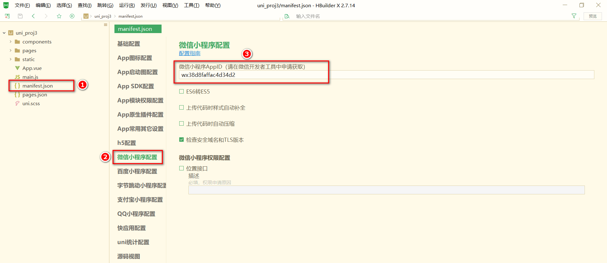
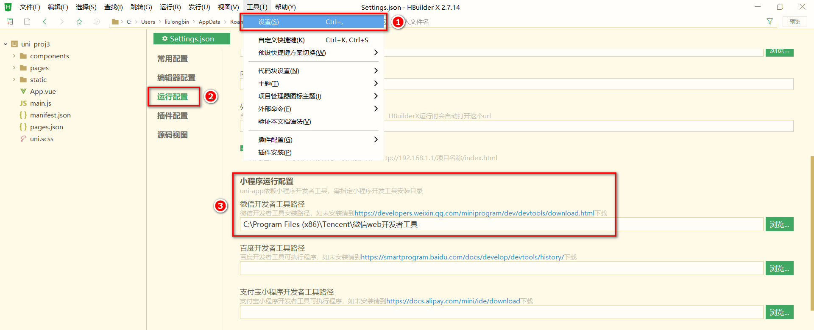
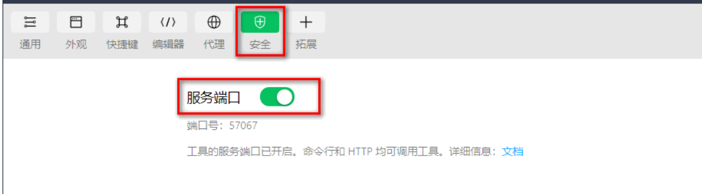
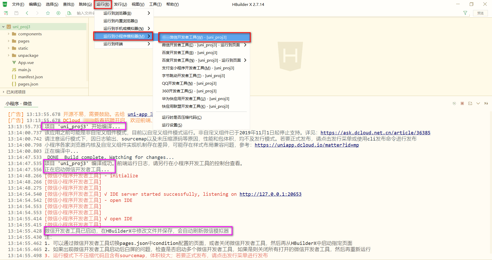

# 起步

## uniapp简介

**uni-app 是一个使用 Vue.js 开发所有前端应用的框架**。开发者编写一套代码，可发布到 iOS、Android、H5、以及各种小程序（微信/支付宝/百度/头条/QQ/钉钉/淘宝）、快应用等多个平台。


> 详细的 uni-app 官方文档，请翻阅 https://uniapp.dcloud.net.cn/


## 开发工具

uni-app 官方推荐使用 **HBuilderX** 来开发 uni-app 类型的项目。主要好处：

- 模板丰富
- 完善的智能提示
- 一键运行

> 当然，你依然可以根据自己的喜好，选择使用 VS Code、Sublime、~~记事本~~... 等自己喜欢的编辑器！


### 下载并按照HBuilderX 

官网如下：[HBuilderX-高效极客技巧 (dcloud.io)](https://www.dcloud.io/hbuilderx.html)


### 安装插件

进入到uniapp官网提供的插件市场进行下载安装即可，并且可以一键导入

> https://ext.dcloud.net.cn/plugin?name=compile-node-sass


## 目录结构

一个 uni-app 项目，默认包含如下目录及文件（不同模版可能不同）：

```
┌─components            uni-app组件目录
│  └─comp-a.vue         可复用的a组件
├─pages                 业务页面文件存放的目录
│  ├─index
│  │  └─index.vue       index页面
│  └─list
│     └─list.vue        list页面
├─static                存放应用引用静态资源（如图片、视频等）的目录，注意：静态资源只能存放于此
├─main.js               Vue初始化入口文件
├─App.vue               应用配置，用来配置小程序的全局样式、生命周期函数等
├─manifest.json         配置应用名称、appid、logo、版本等打包信息
└─pages.json            配置页面路径、页面窗口样式、tabBar、navigationBar 等页面类信息
```


## 将项目运行到微信开发者工具中

1. 在HBuilderX中配置自己微信开发者工具的AppId



2. 配置本机微信开发者工具的安装目录



3. 微信开发者工具打开``服务端口``(即允许第三方工具调用微信开发者工具的功能)



4. 在 HBuilderX 中，点击菜单栏中的 `运行 -> 运行到小程序模拟器 -> 微信开发者工具`，将当前 uni-app 项目编译之后，自动运行到微信开发者工具中，从而方便查看项目效果与调试：




## 使用Git管理项目


