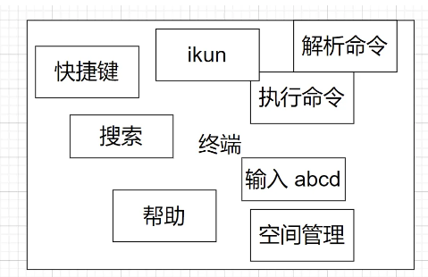
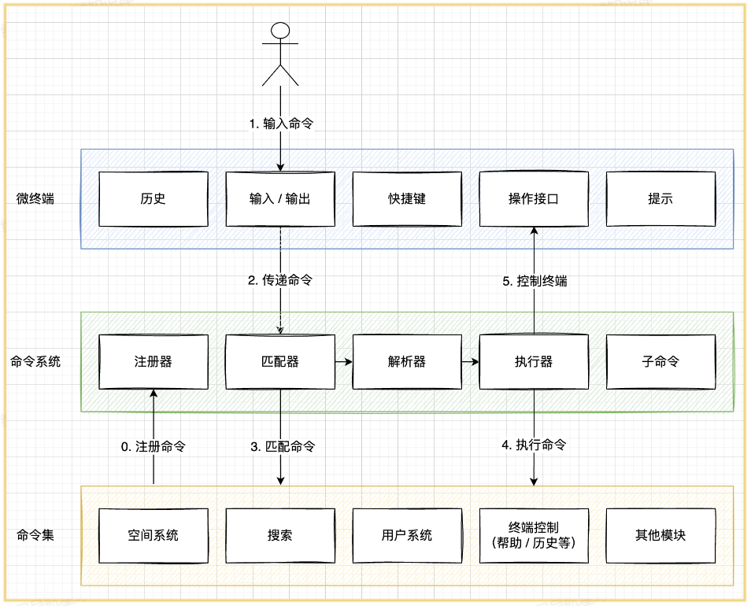
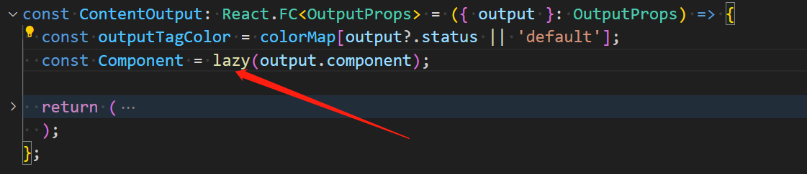

# web-terminal项目

## 项目介绍

定位：极客范儿的浏览器主页（大而全的工具箱，小而美的命令行）
开源地址：<https://github.com/liyupi/yuindex>
几分钟介绍视频：<https://www.bilibili.com/video/BV19B4y1Y7m8/>
完整项目讲解视频：<https://t.zsxq.com/07bqFI66M>


### 为什么不做成插件 / 软件？

现有软件比如 utools：单机、要安装
网页的优势：免安装、易分发、易同步


## 创作过程

1. 我自己的实际需求：我要同时用多个不同的工具，要反复跳转网页，我觉得麻烦（懒人推动世界）
2. 网上没有类似的项目
3. github 上 / 技术平台上很少有同学分享 web 终端，希望给大家一些参考，给这方面一些实际落地的贡献
4. 自学
5. 兴趣，我觉得这东西做出来会很帅


### 构思 + 需求分析

想一下做哪些功能？

挖掘需求：

1. 自己思考
2. 调研：常用的浏览器工具、其他的浏览器主页（竞品，分析竞品的不足之处，SWOT 分析）

如何确定哪些需求先做，哪些需求后做？
方法：排优先级

1. 这个功能有没有是否影响你项目的上线？（只要不影响，都先不做）
2. 功能的实用性、是否贴合主题（比如邮箱验证）

本项目的需求优先级：

1. 终端先做出来，先能看，能够输入命令后原样输出

2. 命令行：解析

3. **项目的通用性（系统设计、定规范，比如提示系统、快捷键系统、命令手册）**

   理解：我们不可能将所有内容都写在一个文件里使用大量if/else语句判断用户输入命令，因此需要设计，需要设计在开发者新增命令时的简便性，不能要新增一个命令需要在每个地方都改一下

4. 开发命令


### 技术选型

#### 原则

1. 有现成的、现成的能满足需求，就不要自己写
2. 尽早做技术选型！（结合需求分析 + 系统设计）


#### 前端技术选型

xterm.js包：更适合开发前后端一体的终端（webtty，websocket）
先跑 Demo，结果测试发现问题：

1. 项目的文档严重缺失
2. 满足不了我的需求，出了问题解决不了
3. 更实用于后端处理命令


#### 前端

该项目前端开发占用85%的时间

主要技术：
● Vue 3 前端开发，主流
● Vite 2 前端构建工具，新兴 / 优秀，本地编译速度很快，提高开发效率
● Ant Design Vue 3 组件库（不用 Element UI？用的熟练，ant design 主流，支持 vue 和 react，更通用）
● Pinia 2 状态管理（Vuex，pinia 兼容 vuex）
● TypeScript 类型控制（项目规范，编辑器 / 开发工具会给你提示问题）
● Eslint 代码规范控制（项目规范，自动语法校验）
● Prettier 美化代码（项目规范，自动格式化代码）
依赖库：
● axios 网络请求
● dayjs 时间处理
● lodash 工具库
● getopts 命令参数解析
库：getopts用于将字符串的命令参数转换为JavaScript对象

前端技术选型方法（怎么找到合适的技术解决方案）：

1. 百度
2. github中英文
3. npm官网


#### 后端

主要技术：
● Node.js
● Express、express-session（为什么不用 KOA？更灵活、更轻量，他的缺点是集成的功能不够，更适合 serverless、云函数；Express 考虑地更全面、更适合完整后台；midway、egg.js、nest.js 更符合 java 开发，有 点太全了，很多功能我用不到）
● MySQL
● Sequelize（ORM 框架）
● Redis
依赖库：
● Axios
● 网易云音乐 NeteaseCloudMusicApi
依赖服务：
● 百度翻译 API
● 博天 API

> 为什么使用Nodejs
>
> 1. 适应前端
> 2. 后端不复杂、对性能要求不高，用 Node.js 足够了
> 3. 自己学习练手


#### 后端开发

占用15%时间

后端项目文档：[点击了解后端详情](https://github.com/liyupi/yuindex/blob/master/server/README.md)


#### 测试

敏捷开发，忽略不计


#### 部署上线

用现成的平台比较简单，时间忽略不计

前端：vercel - 免运维、“免”部署 (<https://www.bilibili.com/video/BV1TV4y1j76t/>)
后端：微信云托管 - 容器化、流水线
（均脱离了服务器的概念）


## 系统设计

### 最初构想



1. 为什么不放在一起？想象一下几千行的 if else 在一个文件里
2. 为什么需要命令集？（理想情况：每个命令单独一个文件）想象一下所有命令都在一个文件里，分工不便，不利于扩展，代码冲突
3. 为什么需要命令系统？集中处理解析命令、异常情况等


### 怎么做系统设计

即时记录

1. 文档记录 Markdown 语法（有想法及时记录）
2. 画图记录 draw.io <https://app.diagrams.net/>


### 最终架构




#### 终端

什么是操作接口？一组可以操作终端的 API（函数）
为什么需要操作接口？

1. 控制哪些操作可以做，哪些不能做？
2. 解耦（比如你可以通过 $refs 强制访问，容易出现冲突）
3. 更清晰、更明确


#### 命令系统

用到了命令模式（设计模式），让你的代码更好理解更好维护
遥控器：接收一个命令数组【A 命令，B 命令】
命令模式介绍：<https://www.baidu.com/s?wd=%E8%8F%9C%E9%B8%9F%E6%96%87%E6%A1%A3%E5%91%BD%E4%BB%A4%E6%A8%A1%E5%BC%8F>


#### 部分模块解析

注册器：负责注册命令（其实就是一个 list + map），使用 TypeScript 定义命令接口，统一开发规范。
原始字符串：baidu   鱼皮 -s 你好
匹配器：命令 baidu，参数：鱼皮  -l 我不好 --self 你好
解析器：把字符串解析为 js 对象，支持别名，让下游处理更方便

```js
{
  _: ['鱼皮'],
  options: {
    s: '你好',
    l: '我不好',
    self: '你好'
  }
}
```

执行器：调用子命令的执行函数，具体执行


#### 父子命令实现

核心：递归
先匹配全局的命令集 user
再把剩余命令作为完整命令，按照同样的逻辑从 user 的子命令集中匹配：login -u yupi -p 1234


## 源码解读

### 怎么读

1通过 README.md 快速了解项目
2按 。键快速浏览文件，大概了解项目结构（比如用了哪些库，如何运行）
3先看项目依赖文件（package.json，java pom.xml）本地运行
4快速看目录，知道每个目录是干嘛的
5从用户的操作开始追踪代码，把一个流程串下来（比如用户输入命令后，发生了哪些事情？）


### 前端代码

初始化：vite 脚手架 vite create
代码规范：eslint + prettier + stylelint
IndexPage 负责连接终端和命令控制系统
useHint 使用了 Vue3 Composition API
shortCut 是一个最简单的命令系统


### 后端代码

利用 NODE_ENV 区分多环境
注意不要提交敏感文件：.gitignore
免费的 API 接口 - 搏天 API：<https://api.btstu.cn/>
Sequlize ORM 对象关系映射：<https://www.sequelize.com.cn/core-concepts/model-querying-basics>


## 思路扩展

1. 增加更多的命令
2. 改变终端的用途，比如改造为重后端的、和后端频繁交互的终端，比如远程操作 Linux 服务（前端传递命令，后端处理）
3. 命令市场，远程加载
   1. 开发者自己上传命令代码 => 后台（审核和校验）
   2. 前端用户可以安装 => 远程拉取已上传的命令代码 => vue 加载组件
4. 完善终端，比如性能，解决输入卡顿
5. web 端改移动端，提供虚拟键盘便于用户更快地输入


## 项目亮点

### 怎么挖掘项目亮点

1. 项目文档
2. 项目的工程文件（package.json）
3. 加一些自己的想法（吹牛皮）


### 举例

项目名称：极客范儿的浏览器主页
项目描述：从 0 到 1 自实现的 web 终端项目，用户可以在一个页面通过输入命令快速完成所有操作，开发者可以轻松自由地定制新命令
负责工作：

1. 基于 Vue 3 + Vite + Ant Design 实现响应式 web 终端页面；基于 Node.js Express + Sequelize ORM 实现后端
2. 考虑到系统较复杂，自主设计 web 终端、命令系统以及命令集 3 个子系统，使得整个系统逻辑清晰、职责分明
3. web 终端模块：采用 Vue3 Composition API 向终端集成历史命令、提示、快捷键等功能，使系统更易于维护
4. 命令系统：采用匹配 => 解析（getOps 库） => 执行机制实现，并通过递归的方式实现子命令解析
5. 命令集：采用注册机制来维护命令集，并通过 TypeScript 来规范命令的定义，统一开发标准，减少代码冲突
6. 为了更方便地管理用户配置（比如背景、提示语），使用 Pinia 全局管理器，实现多组件复用变量以及 LocalStorage 自动持久化
7. 为了防止频繁输入提示影响页面的性能， 使用 Lodash 库的防抖功能，减少用户输入的卡顿感
8. 引入 Axios、Dayjs 插件并二次封装为前端插件集，实现了多环境、全局统一的配置，不用重复定义接口地址等
9. 使用 ESLint + Prettier + TypeScript 配合 IDE 实现语法提示，统一项目规范，减少开发中的错误
10. **仿 Linux 命令自实现文件系统，封装为空间命令，可以像管理文件一样管理已收藏的网站**
11. 怎么部署？


## 重构记录

由于在react中并不能使用模板语法ref直接让其他组件调用组件内部暴露出的方法，这里选择将terminal相关的state以及方法都封装为一个自定义Hook并暴露出terminal相关方法（待执行，有更好方案？？？


今天本想使用umi内置的dva状态管理工具进行状态管理，但了解到在umi中像dva(react-redux)，use request等属于上古数据流方案，为了兼容旧项目升级所以保留下来了，但已经很多年不更新了，现代数据流更推荐使用 [jotai](https://github.com/pmndrs/jotai) / [valtio](https://umijs.org/docs/max/valtio) 管理全局状态，使用 [react-query](https://umijs.org/docs/max/react-query) / [swr](https://github.com/vercel/swr) 管理请求状态，而不再使用与 redux 相关的工具。

因而决定项目采用valtio与react-query进行开发


### valtio

使用起来还是很简单的

```ts
import { LOCAL_USER } from '@/constants/user';
import { derive, proxy } from '@umijs/max';

export const userStore = proxy({
  loginUser: {
    ...LOCAL_USER,
  },
  actions: {
    async getAndSetLoginUser() {
    },
    setLoginUser(user: User.UserType) {
      userStore.loginUser = user;
    },
  },
});
// 计算属性
derive({
  isLogin: (get) => !!get(userStore).loginUser.id,
});

```

核心：

- 创建仓库使用proxy
- 渲染仓库数据使用useSnapshot
- 修改仓库直接修改proxy返回的state即可


### react-query

三个核心概念：

- [Queries](https://tanstack.com/query/latest/docs/framework/react/guides/queries)
- [Mutations](https://tanstack.com/query/latest/docs/framework/react/guides/mutations)
- [Query Invalidation](https://tanstack.com/query/latest/docs/framework/react/guides/query-invalidation)

如下是一个关于Todos的例子： [simple StackBlitz example](https://tanstack.com/query/latest/docs/framework/react/examples/simple)

```jsx
import {
  useQuery,
  useMutation,
  useQueryClient,
  QueryClient,
  QueryClientProvider,
} from '@tanstack/react-query'
import { getTodos, postTodo } from '../my-api'

// Create a client
const queryClient = new QueryClient()

function App() {
  return (
    // Provide the client to your App
    <QueryClientProvider client={queryClient}>
      <Todos />
    </QueryClientProvider>
  )
}

function Todos() {
  // Access the client
  const queryClient = useQueryClient()

  // Queries
  const query = useQuery({ queryKey: ['todos'], queryFn: getTodos })

  // Mutations
  const mutation = useMutation({
    mutationFn: postTodo,
    onSuccess: () => {
      // Invalidate and refetch
      queryClient.invalidateQueries({ queryKey: ['todos'] })
    },
  })

  return (
    <div>
      <ul>{query.data?.map((todo) => <li key={todo.id}>{todo.title}</li>)}</ul>

      <button
        onClick={() => {
          mutation.mutate({
            id: Date.now(),
            title: 'Do Laundry',
          })
        }}
      >
        Add Todo
      </button>
    </div>
  )
}

render(<App />, document.getElementById('root'))

```


## bug记录

### 永远不要将React.lazy放到组件内部



如上图所示，我将`React.lazy`方法放到了组件内部执行，导致了页面出现频繁闪动！！！

这是因为在组件内部执行该方法会导致lazy组件状态重置


执行命令后无法自动滚到到底部


啊啊啊 使用仓库时忘记useSnapshot了


~~currentCommand有很大的渲染问题（貌似并不会引起渲染问题，因为在修改currentNewCommand时该变量还未被渲染到state里~~


~~useHistory存在问题~~

子命令tab不能补全


