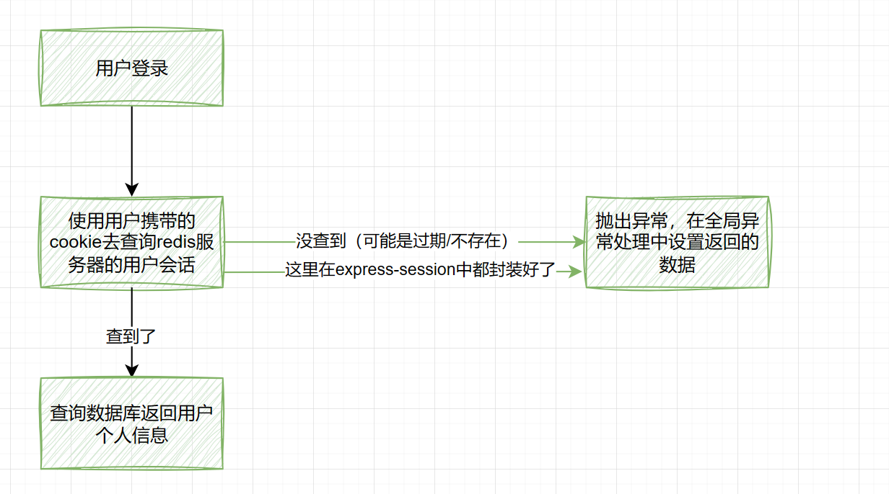
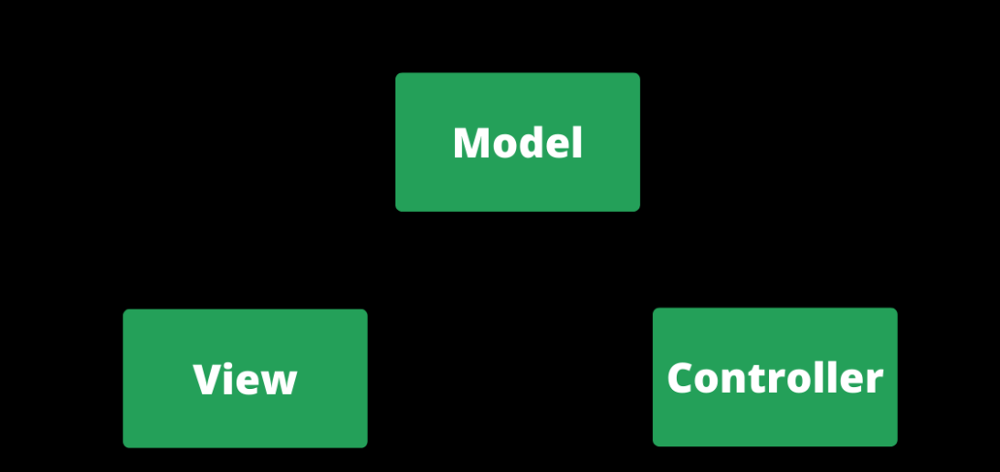
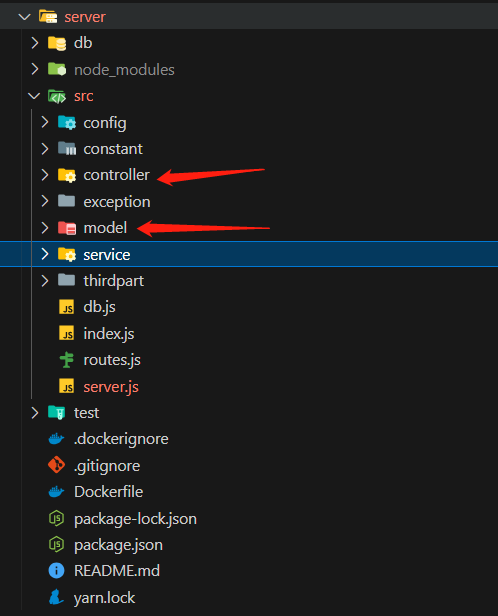

# web-terminal项目

## 项目介绍

定位：极客范儿的浏览器主页（大而全的工具箱，小而美的命令行）
开源地址：<https://github.com/liyupi/yuindex>
几分钟介绍视频：<https://www.bilibili.com/video/BV19B4y1Y7m8/>
完整项目讲解视频：<https://t.zsxq.com/07bqFI66M>


### 为什么不做成插件 / 软件？

现有软件比如 utools：单机、要安装
网页的优势：免安装、易分发、易同步


## 创作过程

1. 我自己的实际需求：我要同时用多个不同的工具，要反复跳转网页，我觉得麻烦（懒人推动世界）
2. 网上没有类似的项目
3. github 上 / 技术平台上很少有同学分享 web 终端，希望给大家一些参考，给这方面一些实际落地的贡献
4. 自学
5. 兴趣，我觉得这东西做出来会很帅


### 构思 + 需求分析

想一下做哪些功能？

挖掘需求：

1. 自己思考
2. 调研：常用的浏览器工具、其他的浏览器主页（竞品，分析竞品的不足之处，SWOT 分析）

如何确定哪些需求先做，哪些需求后做？
方法：排优先级

1. 这个功能有没有是否影响你项目的上线？（只要不影响，都先不做）
2. 功能的实用性、是否贴合主题（比如邮箱验证）

本项目的需求优先级：

1. 终端先做出来，先能看，能够输入命令后原样输出

2. 命令行：解析

3. **项目的通用性（系统设计、定规范，比如提示系统、快捷键系统、命令手册）**

   理解：我们不可能将所有内容都写在一个文件里使用大量if/else语句判断用户输入命令，因此需要设计，需要设计在开发者新增命令时的简便性，不能要新增一个命令需要在每个地方都改一下

4. 开发命令


### 技术选型

#### 原则

1. 有现成的、现成的能满足需求，就不要自己写
2. 尽早做技术选型！（结合需求分析 + 系统设计）


#### 前端技术选型

xterm.js包：更适合开发前后端一体的终端（webtty，websocket）
先跑 Demo，结果测试发现问题：

1. 项目的文档严重缺失
2. 满足不了我的需求，出了问题解决不了
3. 更实用于后端处理命令


#### 前端

该项目前端开发占用85%的时间

主要技术：
● Vue 3 前端开发，主流
● Vite 2 前端构建工具，新兴 / 优秀，本地编译速度很快，提高开发效率
● Ant Design Vue 3 组件库（不用 Element UI？用的熟练，ant design 主流，支持 vue 和 react，更通用）
● Pinia 2 状态管理（Vuex，pinia 兼容 vuex）
● TypeScript 类型控制（项目规范，编辑器 / 开发工具会给你提示问题）
● Eslint 代码规范控制（项目规范，自动语法校验）
● Prettier 美化代码（项目规范，自动格式化代码）
依赖库：
● axios 网络请求
● dayjs 时间处理
● lodash 工具库
● getopts 命令参数解析
库：getopts用于将字符串的命令参数转换为JavaScript对象

前端技术选型方法（怎么找到合适的技术解决方案）：

1. 百度
2. github中英文
3. npm官网


#### 后端

主要技术：
● Node.js
● Express、express-session（为什么不用 KOA？更灵活、更轻量，他的缺点是集成的功能不够，更适合 serverless、云函数；Express 考虑地更全面、更适合完整后台；midway、egg.js、nest.js 更符合 java 开发，有 点太全了，很多功能我用不到）
● MySQL
● Sequelize（ORM 框架）
● Redis
依赖库：
● Axios
● 网易云音乐 NeteaseCloudMusicApi
依赖服务：
● 百度翻译 API
● 博天 API

> 为什么使用Nodejs
>
> 1. 适应前端
> 2. 后端不复杂、对性能要求不高，用 Node.js 足够了
> 3. 自己学习练手


#### 后端开发

占用15%时间

后端项目文档：[点击了解后端详情](https://github.com/liyupi/yuindex/blob/master/server/README.md)


#### 测试

敏捷开发，忽略不计


#### 部署上线

用现成的平台比较简单，时间忽略不计

前端：vercel - 免运维、“免”部署 (<https://www.bilibili.com/video/BV1TV4y1j76t/>)
后端：微信云托管 - 容器化、流水线
（均脱离了服务器的概念）


## 系统设计

### 最初构想


1. 为什么不放在一起？想象一下几千行的 if else 在一个文件里
2. 为什么需要命令集？（理想情况：每个命令单独一个文件）想象一下所有命令都在一个文件里，分工不便，不利于扩展，代码冲突
3. 为什么需要命令系统？集中处理解析命令、异常情况等


### 怎么做系统设计

即时记录

1. 文档记录 Markdown 语法（有想法及时记录）
2. 画图记录 draw.io <https://app.diagrams.net/>


### 最终架构


#### 终端

什么是操作接口？一组可以操作终端的 API（函数）
为什么需要操作接口？

1. 控制哪些操作可以做，哪些不能做？
2. 解耦（比如你可以通过 $refs 强制访问，容易出现冲突）
3. 更清晰、更明确


#### 命令系统

用到了命令模式（设计模式），让你的代码更好理解更好维护
遥控器：接收一个命令数组【A 命令，B 命令】
命令模式介绍：<https://www.baidu.com/s?wd=%E8%8F%9C%E9%B8%9F%E6%96%87%E6%A1%A3%E5%91%BD%E4%BB%A4%E6%A8%A1%E5%BC%8F>


#### 部分模块解析

注册器：负责注册命令（其实就是一个 list + map），使用 TypeScript 定义命令接口，统一开发规范。
原始字符串：baidu   鱼皮 -s 你好
匹配器：命令 baidu，参数：鱼皮  -l 我不好 --self 你好
解析器：把字符串解析为 js 对象，支持别名，让下游处理更方便

```js
{
  _: ['鱼皮'],
  options: {
    s: '你好',
    l: '我不好',
    self: '你好'
  }
}
```

执行器：调用子命令的执行函数，具体执行


#### 父子命令实现

核心：递归
先匹配全局的命令集 user
再把剩余命令作为完整命令，按照同样的逻辑从 user 的子命令集中匹配：login -u yupi -p 1234


## 源码解读

### 怎么读

1通过 README.md 快速了解项目
2按 。键快速浏览文件，大概了解项目结构（比如用了哪些库，如何运行）
3先看项目依赖文件（package.json，java pom.xml）本地运行
4快速看目录，知道每个目录是干嘛的
5从用户的操作开始追踪代码，把一个流程串下来（比如用户输入命令后，发生了哪些事情？）


### 前端代码

初始化：vite 脚手架 vite create
代码规范：eslint + prettier + stylelint
IndexPage 负责连接终端和命令控制系统
useHint 使用了 Vue3 Composition API
shortCut 是一个最简单的命令系统


### 后端代码

利用 NODE_ENV 区分多环境
注意不要提交敏感文件：.gitignore
免费的 API 接口 - 搏天 API：<https://api.btstu.cn/>
Sequlize ORM 对象关系映射：<https://www.sequelize.com.cn/core-concepts/model-querying-basics>


## 思路扩展

1. 增加更多的命令
2. 改变终端的用途，比如改造为重后端的、和后端频繁交互的终端，比如远程操作 Linux 服务（前端传递命令，后端处理）
3. 命令市场，远程加载
   1. 开发者自己上传命令代码 => 后台（审核和校验）
   2. 前端用户可以安装 => 远程拉取已上传的命令代码 => vue 加载组件
4. 完善终端，比如性能，解决输入卡顿
5. web 端改移动端，提供虚拟键盘便于用户更快地输入


## 项目亮点

### 怎么挖掘项目亮点

1. 项目文档
2. 项目的工程文件（package.json）
3. 加一些自己的想法（吹牛皮）


### 举例

项目名称：极客范儿的浏览器主页
项目描述：从 0 到 1 自实现的 web 终端项目，用户可以在一个页面通过输入命令快速完成所有操作，开发者可以轻松自由地定制新命令
负责工作：

1. 基于 Vue 3 + Vite + Ant Design 实现响应式 web 终端页面；基于 Node.js Express + Sequelize ORM 实现后端
2. 考虑到系统较复杂，自主设计 web 终端、命令系统以及命令集 3 个子系统，使得整个系统逻辑清晰、职责分明
3. web 终端模块：采用 Vue3 Composition API 向终端集成历史命令、提示、快捷键等功能，使系统更易于维护
4. 命令系统：采用匹配 => 解析（getOps 库） => 执行机制实现，并通过递归的方式实现子命令解析
5. 命令集：采用注册机制来维护命令集，并通过 TypeScript 来规范命令的定义，统一开发标准，减少代码冲突
6. 为了更方便地管理用户配置（比如背景、提示语），使用 Pinia 全局管理器，实现多组件复用变量以及 LocalStorage 自动持久化
7. 为了防止频繁输入提示影响页面的性能， 使用 Lodash 库的防抖功能，减少用户输入的卡顿感
8. 引入 Axios、Dayjs 插件并二次封装为前端插件集，实现了多环境、全局统一的配置，不用重复定义接口地址等
9. 使用 ESLint + Prettier + TypeScript 配合 IDE 实现语法提示，统一项目规范，减少开发中的错误
10. **仿 Linux 命令自实现文件系统，封装为空间命令，可以像管理文件一样管理已收藏的网站**
11. 怎么部署？


## 遇到的困难

### 随机背景图切换时存在css渲染卡顿

因为获取的背景图片较大导致渲染到页面上时（不是请求接口慢的问题）卡顿+空背景

- 解决办法
  - 先使用loading缓解用户加载焦虑
  - 使用工具如`TinyPNG`这样的包可以减小图片的文件大小
  - cdn加速（假设你的图片都放在服务器中）
  - 使用不同格式的图片先后显示（例如可以使用较小可以快速加载出来的`webp`格式，叠加较清晰的`png`图片格式，这样浏览器可以先渲染出大致内容，再变清晰）


### 提示

- 当命令关键字之间存在多余空格时无法显示提示（正则表达式匹配分割即可，`trim(inputText).split(/\s+/)`）
- 必须完全输入子命令关键字才能显示提示（新增子查询时模糊匹配子命令）
- 存在子命令时tab失效

将当前已经输入的单词个数匹配到提示数组的个数，并将在此之前的所有单词都替换为提示数组的单词

```ts
    const wordArr = inputCommand.value.text.split(/\s+/);
    const hintArr = hint.value.split(/\s+/);
    const wordNum = wordArr.length;
    // 将当前输入个数的单词替换为提示的单词(除了用户输入之前的)
    inputCommand.value.text = [
      ...wordArr.slice(0, wordNum - 1),
      hintArr[wordNum - 1],
    ].join(" ");
```


### sasa的

- 发现pinia的action无法使用console.log

原来是我之前重构代码到一半就去写需求，导致pinia的store导入出现问题


### redis与cookie的协同工作

```ts
    const sessionOptions = {
      // store session存储实例，默认为一个新的 MemoryStore 实例。
      store: new RedisStore({ client: redisClient }), // 只需设置这个就可存储到redis
      name: "session_id", // 默认connect.sid
      secret: "IIndex", // 设置签名秘钥  内容可以任意填写
      resave: false, // 强制保存，如果session没有被修改也要重新保存,默认true(推荐false)
      saveUninitialized: true, // 如果原先没有session那么就设置，否则不设置(推荐true)
      rolling: true, // 每次请求更新有效时长
      cookie: {
        // domain: ".yuindex.com", // 需要共享 cookie 时再设置
        // 全局设置 cookie，就是访问随便 api 就会设置 cookie，也可以在登录的路由下单独设置
        maxAge: 1000 * 60 * 60 * 24 * 30, // 30 天后过期
        httpOnly: true, // 是否允许客户端修改 cookie（默认 true 不能被修改）
      },
    };
```

在这段代码中，Redis和Cookie被用于不同的目的。

`Cookie`主要用于在**客户端（用户的浏览器）存储会话信息**。当用户访问网站时，服务器会创建一个会话，并将**会话ID存储在Cookie**中，然后将Cookie发送给客户端。当用户再次访问网站时，浏览器会将Cookie发送回服务器，服务器通过Cookie中的会话ID来识别用户。

`Redis`在这里被用作**会话存储**。**当服务器创建会话后，会将会话数据（包括会话ID和其他相关信息）存储在Redis中。当服务器收到包含会话ID的Cookie时，会查询Redis来获取会话数据**。

所以，Cookie和Redis在这里是协同工作的。Cookie在客户端存储会话ID，而Redis在服务器端存储会话数据。


### 登录

- 为什么没有本地存储也能得到用户信息

今天突然产生一个疑问？？？我将浏览器的localStorage的内容删除后，发现还是可以得到个人的用户信息

自己还是没有完全理解，登录的业务逻辑：

先要理解上面redis与cookie的协同工作，理解之后，那么登录就是这样的




### 为什么后端代码通常会自己创建一个异常类

鱼皮的代码中：

```ts
class MyError extends Error {
  constructor(code, message) {
    super(message);
    this.code = code;
    this.message = message;
    this.name = "MyError";
  }
}

module.exports = MyError;

```

实际上，在原生的Error类中，没有code这个属性，因此，我们才需要创建一个新的类


### 为什么要使用controller、service两个目录分割请求代码

这里的controller实际上指的是计算机设计模式MVC中的控制器(controller)，



但是实际上在前后端分离的背景下，现在的项目中已经只剩下C了

而在这个项目中（拥有controller和model层，使用vue框架实现view层）：

- **Controller是控制层，或者叫接口层，主要用来接收请求的**
- **Service是业务层，在这一层里处理请求的业务逻辑**



原先还有个DAO层，用来执行SQL，现在用了MyBatis或MyBatis Plus的话DAO层也没怎么用了

> [MVC 模式是什么 (freecodecamp.org)](https://www.freecodecamp.org/chinese/news/what-does-mvc-mean-in-computer-science/)


### 路径处理

递归：

注意在递归里面的name传递最好没有任何前缀以便拼接当前路径字符串获取绝对路径

1. 递归出口：name以**单独**`/`开头时，或`dir + (dir === "/" ? "" : "/") + name;`
2. name以`./`开头时，调用`getFullPath(dir,name.substring(2))`避免多层`./`
3. name以`../`开头时，调用`getFullPath(dir,name.substring(3))`避免多层`../`

例子：

"/createDir", "../zhihu"  =>期望得到 /zhihu  实际得到 /zhihu

"/createDir", "../../../zhihu" => 期望得到/zhihu 实际得到 /zhihu

"/createDir", "./zhihu" => 期望得到  /createDir/zhihu 实际得到 /createDir/zhihu

"/createDir", "./createDir2/zhihu" => 期望得到 /createDir/createDir2/zhihu 实际得到 /createDir/createDir2/zhihu

"/", "../zhihu" => 期望得到 /zhihu 实际得到 /zhihu

"/", "../../../zhihu" => 期望得到 /zhihu 实际得到 /zhihu

"/", "./zhihu" => 期望得到 /zhihu 实际得到 /zhihu


### 路径补全

思路：利用已实现的getFullPath方法，例如传参"/createDir",""可以得到绝对路径"/createDir/"这一点，再去拼接用户输入的模糊路径后半部分（因为存储是使用的绝对路径），使用拼接的字符串去查询，如果能够查询得到，则再次拼接恢复用户输入的字符串前缀（因为用户可能输入的是相对路径，例如./ ../）

而判断什么时候使用路径补全则是利用当前的hint，提示中是否包含关键字"目录""路径"


### 递归复制目录

```ts
    copyDirectory(sourcePath: string, targetPath: string): ResultType {
      // console.log("sourcePath", sourcePath, "targetPath", targetPath);

      const items = this.listItems(sourcePath, true);
      // console.log("items", items);
      const itemName = getItemName(sourcePath);
      const newDirPath = targetPath + itemName;
      if (!this.space[newDirPath]) {
        this.addItem({
          dir: targetPath,
          name: itemName,
          type: "dir",
        });
      }
      for (const item of items) {
        // 计算在目标目录中的路径
        const targetItemPath = targetPath + itemName + "/" + item.name;
        // console.log("targetItemPath", targetItemPath);

        // 如果这一项是一个目录，则递归调用 copyDirectory
        if (item.type === "dir") {
          this.copyDirectory(item.dir, targetItemPath);
        } else {
          // 否则，直接复制这一项
          this.space[targetItemPath] = { ...item, dir: targetPath + itemName };
        }
      }
      return {
        result: true,
      };
    },

```


- 部分命令不支持cd /createDir/createDir2/
- 可选参数tab补全
- 将localStorage里的数据空间支持命令下载到本地，和从本地加载
- 将空间数据与用户绑定同时存储到数据库中


