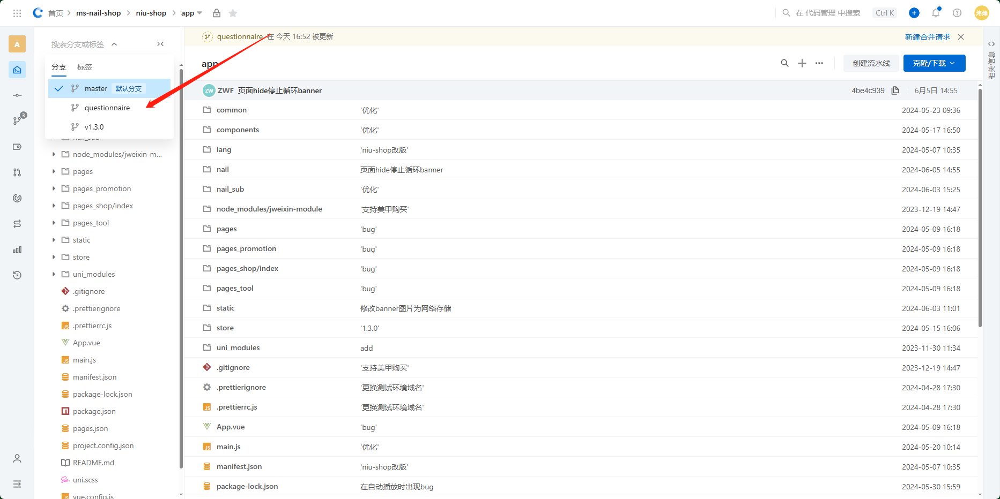

# 美甲管理端

## 引入腾讯地图封装并封装为dialog组件

组件位置：`src\components\dialog\choose-position.vue`


## 实现预约管理页面

位置：`src\views\booking\booking-manager.vue`


## 修改TableQuery组件

位置：`src\components\table\table-query.vue`

只是删除部分冗余代码及字段名，核心逻辑不变


## 修复pagination组件

位置：`src\components\pagination\pagination.vue`

新增判断当前 此时可能当前页码数据已经不存在因此统一请求第一页数据


## 实现推广位管理页面及弹框

位置：`src\views\advertisement\advertisement-manager.vue`

`src\views\advertisement\components\advertisement-dialog.vue`


## 封装detail-mask组件

位置：`src\components\detail-mask\detail-mask.vue`

就是一个全屏展示图片或视频的组件（~~封装完发现arco有提供现成的~~


## 重写美甲师弹框

`src\views\designer\designer-dialog`

即把原先一个tab显示的内容分为3个tab显示


## 封装美甲选择组件

`src\components\dialog\choose-nails.vue`


## 封装标签选择器组件

`src\components\form\tag-select.vue`


## 封装标签管理弹框

`src\components\dialog\tags-manager.vue`


## 标签数据统一存储于pinia

`src\store\modules\tags.js`


## 支持批量编辑美甲

`src\components\dialog\nail-bulk-dialog.vue`

`src\components\trigger\bulk-trigger.vue`


## wangeditor工具栏新增插入模板

`src\components\editor\components\insert-template.vue`

`src\components\editor\extends\InsertTemplate.js`


## 小程序二维码显示

`src\components\info-card\info-card.vue`

`src\components\dialog\nail-dialog\base-info.vue`


## 专区管理页面及弹框

`src\views\zone\zone-manager.vue`

`src\views\zone\components\zone-dialog.vue`


## 封装Radio组件支持拖拽

`src\components\form\radio.vue`


# 双层轮播图

`D:\software\project_mozi\app\nail\components\mo-swiper`

本质上就是使用一个div(存放淡入淡出层)和swiper同时赋予`position:absolute`层叠在一起，再利用swiper组件去控制淡入淡出层的前进与后退，注意需要在`touchmove`事件中同时计算"下一张"图片的`opacity`属性（~~可能存在一些没用的代码没删掉~~


# 曲线控件封装及使用

[stats · Codeup (aliyun.com)项目里的app.vue方便测试也可以跑](https://codeup.aliyun.com/motigo/web-components/stats)

[墨子谷npm服务-powered by Verdaccio (mozigu.cn)](https://npm.mozigu.cn/-/web/detail/@mzg/stats)

该曲线控件已包含文档在内具体参考`README.md`

已经通过配置使得css嵌入js了，无需再手动导入样式

这里忘记把modal框的使用做成这样了

```js
        showLineDialog(row) {
            this.$showMonitorCurve({
                showOptions: true,
                app: row.app,
                keyValue: '__visit__'
            });
        },
```

现在只能这样用

```js
            showLineDialog(row) {
                this.dialogTitle = `${this.serviceName} (${row.field})`;
                this.lines = [
                    {
                        group: this.serviceName,
                        field: row.field,
                        type: 'count',
                        period: 24,
                        color: '#000'
                    }
                ];
                console.log(this.lines);
                this.dialogVisible = true;
            },
```

哥有空可以改过来


## 使用

[在这个项目里使用了](https://codeup.aliyun.com/motigo/dev-ops/devstats/web)


# 问卷组件封装

`D:\software\project_mozi\app\nail\components\questionnaire`

[app · Codeup (aliyun.com)](https://codeup.aliyun.com/motigo/ms-nail-shop/niu-shop/app)

在questionnaire分支里



第一层与第二层（自下往上数）原理与之前做的双层轮播图一致，但是第三层不行

这里面还封装了一个进度条组件，但是使用时不知道为什么样式在外层组件穿透不进去，因此写得很丑

问卷组件内部存在的一些没用的代码还是蛮多的（~~因为迭代很多次了~~

例如之前需求想要等待第一第二层动画结束才展示第三层，所以里面有个isExiting变量

选项和问卷题目因为动画进出不对称用animation比较好理解


