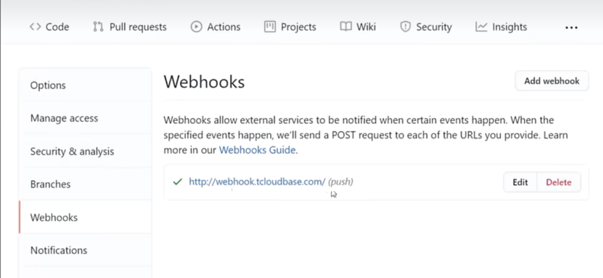

# 微信云托管快速部署上线

## 什么是微信云托管

[微信云托管 (qq.com)](https://cloud.weixin.qq.com/cloudrun/)

提供一个容器平台 + 一系列开发/运维常用服务（例如日志、监控、告警、DevOps、MySQL数据库等）

目的：提高开发部署维护项目的效率，降低成本

## 什么是镜像

一系列软件、环境的打包，镜像的好处：方便共享、方便管理

例如有一个程序：java代码+JDK+MySQL

传统上线程序的步骤：

1. 从代码库中拉取代码
2. 安装需要的环境
3. 打包
4. 本地搭建和启动MySQL
5. 运行打出的jar包

最主流的容器技术：Docker

Docker将一系列环境打包为Docker镜像，其他人想要运行这个程序，只需要将你打包的镜像拉取下来直接运行即可

## 怎么打包Docker镜像

Dockerfile：定义了如何打包镜像，镜像需要哪些基础环境（可以理解为一段脚本）

编写Dockerfile比自己从0到1写Shell脚本要简单很多

tips：不用从0自己写，找同类项目的Dockerfile去复制修改参考即可

编写Dockerfile的步骤：

1. 找现成的，看看有哪些可以直接用的环境
2. 定义工作空间
3. 把项目代码复制到工作空间内（Docker是一个空的服务器环境）
4. 根据自己的项目技术栈去执行构建命令
5. 启动项目

## 流水线

流水线可以帮助我们自动识别代码（或定时）的变更并根据你的Dockerfile打包构建一个可以运行的项目环境（镜像）

## 灰度发布

灰度发布我们将其与全量发布一起理解，很明显全量发布是将当前的版本直接发送到所有的服务器上

而常常我们不知道不确定这个新版本是否可以完美在线上运行，因此我们可以一台一台服务器发布，最大程度减小可能的风险，这就是灰度发布

> 部署与发布：
>
> - 部署（Deploy）
>   - 定义：安装、配置（如有）。
>   - **特征：将软件“放置”到某个环境中。**
> - 发布（Release）
>   - 定义：将集成（构建）出来那个整体（发布对象），打上一个发布标签，提供出来，受众可以获得。
>   - **特征：发布物有（标签）标识，提供出来可以获得。**

## 前端项目微信云托管

以本地打好的包上传到微信云托管为例，我们需要将前端项目打包出的`dist`目录下的内容，以及`Dockerfile`以及`nginx`配置文件，前端项目启动需要一个服务器（一般是nginx），因此需要`nginx`配置文件

