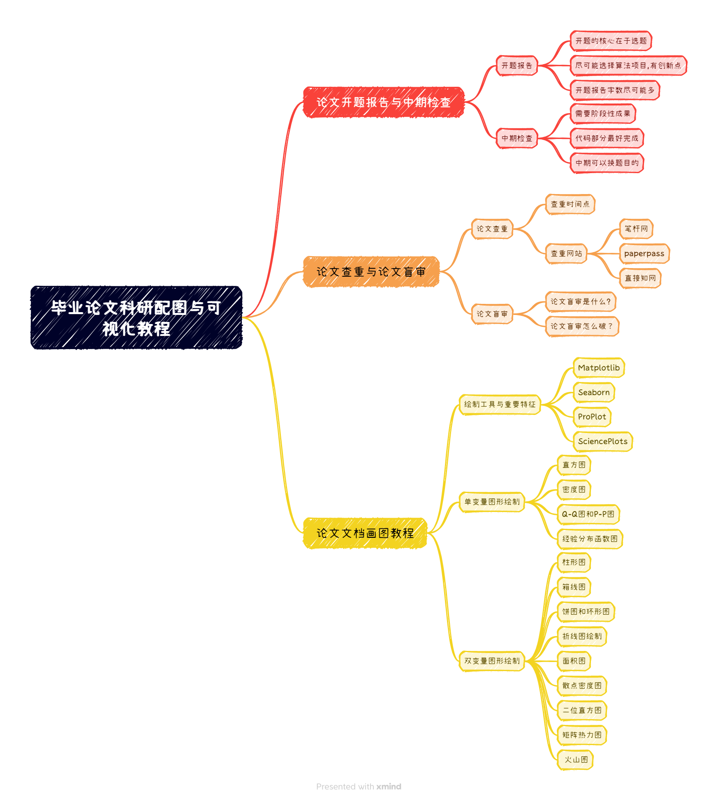
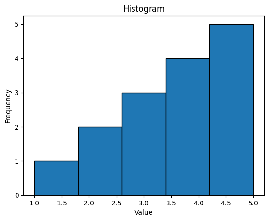
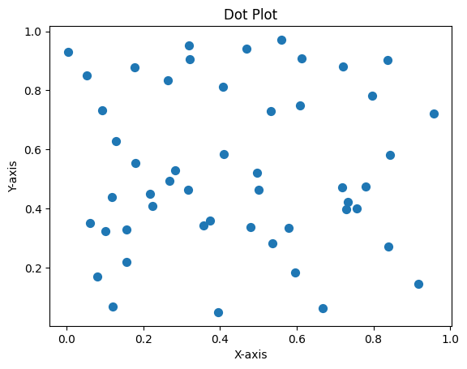
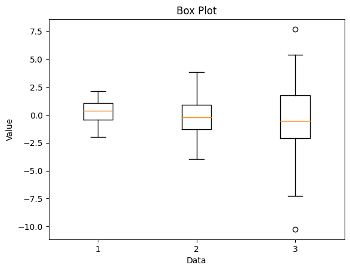
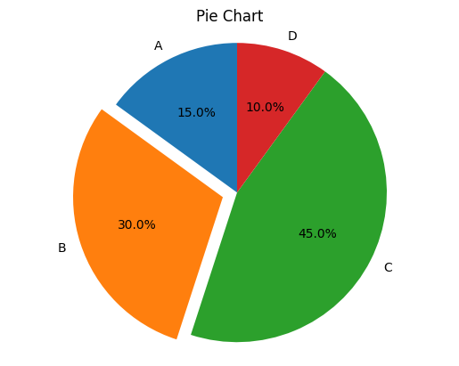
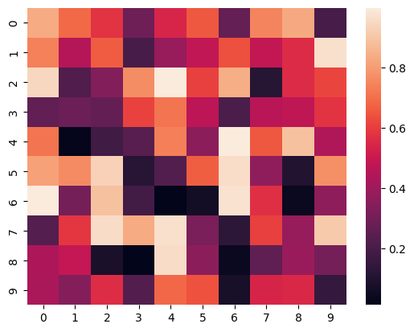
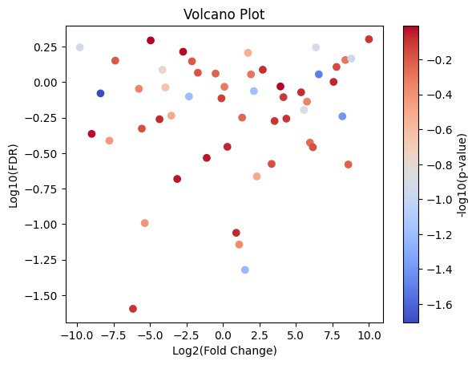

# 保姆级带你通关秋招教程之毕业论文开题与撰写注意事项辅导

[来自： 编程导航](https://wx.zsxq.com/dweb2/index/group/51122858222824)

千与编程

2023年11月13日 21:25

大家好，我是千与编程，上一篇发出去了关于海外硕士申请的辅导，有一些星友希望向我提问的星球问答问题。最终都可以以文章的形式发给广大新手同学，我在这里给大家吃一颗定心丸，可以的，完全没问题。

只要大家觉得对大家秋招或者学习就业辅导上有帮助的，我都会尽我所能分享。即使我不行，我有很多朋友资源，可以让他们帮助我去完成，尽力帮大家进行解决，最后在直播时给大家答疑和演示。

今天的文章，我将会开始去尝试第一次的技术演示性质的直播教学，就是第一次来给大家直播写代码。这一篇的话，我给大家讲解一下关于毕业设计的开题报告以及论文的撰写相关辅导经验。

作为硕士研究生的同学，现在可能说开题报告已经有点晚了，因为大部分硕士研究生毕设开题应该最晚在9月底，甚至研二的时候就已经开始进行了开题。

给大家讲一讲关于毕业设计的开题报告的撰写，以及如何应对论文中期检查，包括论文查重，论文的盲审。

因为星球里面硕士的同学也不少，更多是本科同学，本科同学是没有盲审环节。写论文的难点，我在这里先问一下同学们，你觉得论文当中最让你觉得头疼的是什么？是不是画图？

其实说实话只是单纯的写文字，因为现在有ChatGPT了，凑字数没啥难的，最让人头疼的就是画图。这个画图真的是最让人闹心的事情，在这里以后给大家重点讲解一下数据可视化。

大家可以在星球里面继续向我提问，我会及时给大家进行回复。

## **一、论文开题报告与中期检查**

论文的开题报告，说实话的核心就在于毕业设计的开题选择，一般来说计算机的毕业设计来说，包括开发类与算法类，相对来说，算法类的毕设使用的更多一些。

现在即使只是写一个图书管理系统这种程度的毕业设计已经不太行了。没办法，一句话，太卷了。。。

关于开题报告，其实可以会给大家一个建议，开题报告基本没有不过的，除非是题目选的太离谱。

## **二、论文查重与盲审**

论文的查重与盲审不是开玩笑的，是真的挂人的地方，所以要非常注意！论文的查重一般来说要求整篇论文的查重率为8%~10%。

一般来说，最好控制在5%总有会比较保险，因为最终的查重数据库肯可能还会更大，比如加入往年的学长学姐的毕业论文。

那么论文查重到底怎么破？

首先我建议大家自己写，纯手敲的论文一般来说，查重率只有1%，但是难度确实比较大。通常来说是找一篇论文的模板，按照论文的模板进行框架形式的复制撰写。

使用论文模版进行写作时候，其实可以大大提高效率，但是一般来说，不要有复制，在这里和大家阐述一下，一般来说，**查重算法是连续13个字重复就算重复**。因此千万不要去大量的复制，要不最后会很麻烦去降重。

## **三、毕业论文的推荐目录模块化结构**

以上是我给大家推荐的写毕业论文的结构目录。给大家介绍一下每一章结构的简要写法。

1、绪论

绪论一般来说用来讲述一篇毕业论文的背景，也就是为什么要写这篇毕业论文？遇见了什么需要解决的问题？阐述下这篇论文的写作背景。绪论部分情况是可以直接复制你的开题报告。

2、相关技术

相关技术就是你来对比一下这篇论文当中所用到的技术栈。使用的技术栈的一些实际用法以及国内外的研究现状，最主要的是写作课题的国内外研究现状。

3、阐述创新点1

创新点就是你怎么设计的？有什么过人之处，比如毕设是做开发系统的，第一个创新点可以是你怎么设计前端的？有没有什么过人之处或者是与众不同的？或者最基本的将设计的思想进行详细的阐述。

4、阐述创新点2

阐述第二个创新点的时候，那就更好说了，阐述第二个创新点阐述系统的后端设计思想，你有什么独到的设计思想，系统有哪些性能的提升？

5、实验结论对比

实验结论则是将你所阐述的两个创新点融入到你的系统，或者你的算法，最终算法与系统到底带来了什么信新的效果？最好与同类的项目进行一个对比，成为消融实验。

并且你的论文项目所取得的进步成果，一定要列出完整的表格，表格里面去对比不同设计方法的效果，结论不能矛盾一定是你的效果是最好的。

切忌你的项目论文从头到尾，要只介绍你的设计项目，而不要说去介绍别的项目，说白了，写论文和写书是两个感觉。

6、参考文献

参考文献，建议大家去知网找近五年之内的参考文献，为什么这么说？如果你这篇论文引用十年或者二十年前的文章，会给老师一种你这篇论文技术用的很老，没有什么特别明显突出的地方，不与时俱进。

所以说推荐大家使用三年~五年的参考文章，最多不许超过近七年之内的参考文献。

**四、数据可视化Python代码实现**

看最近鱼皮又出新的项目了，大家都很辛苦了，我自己需要准备一下，下周我们尝试一下，直播写代码的感觉！实际讲解一下，这些可视化数据图怎么画的！

\1. 直方图

2.点球图

3.箱线图

4.饼状图

5.矩阵热力图

6.火山图

怎么样这些图片还是不错的吧！毕业论文以及科研论文中的图片就是要用这样的风格绘制的才可以使用。至于实现的代码，我们周四直播见！

