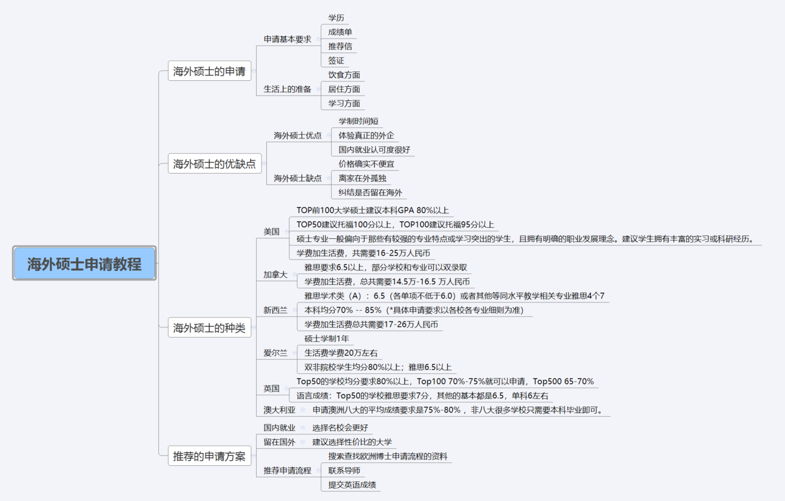
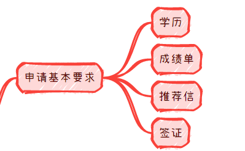
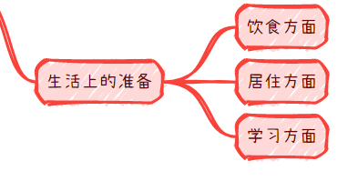
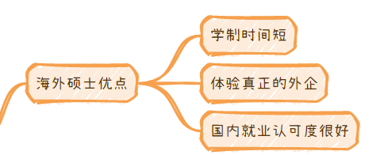
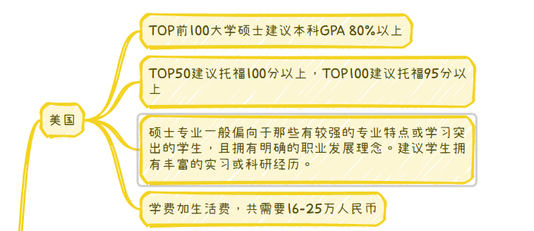
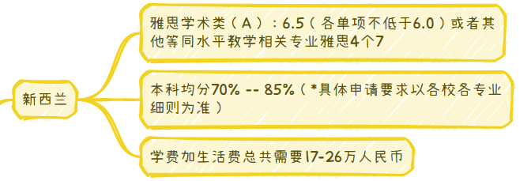
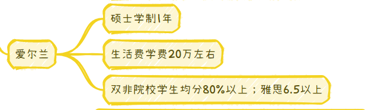
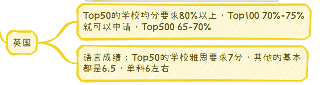
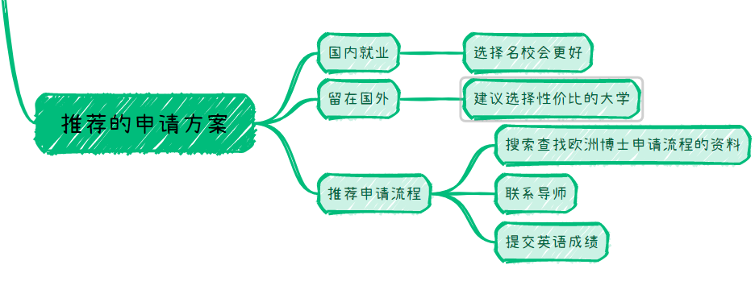

# 保姆级带你通关秋招教程之海外硕士申请教程详解

[来自： 编程导航](https://wx.zsxq.com/dweb2/index/group/51122858222824)

千与编程

2023年11月08日 07:52

大家好，我是千与编程，本来上周是保姆及通关秋招教程的最后一节。但是有一位同学在进行星球提问的时候，专门向我提问了关于如何申请海外的硕士研究生。

说到这里，可能这位同学被海外研究生的好处所吸引，确实海外研究生有很多明显的好处。

我一会儿也会在今天的文章里跟大家分享。关于海外研究生学位，如何申请？如何准备？我们直接进入正题，进入到我们今天的文章关于海外研究生申请详解的文章！

## 一、海外硕士申请

\1. 海外硕士的申请要求

学历上，一般来说也是需要二本以上，专科不太行，尤其是申请海外的名校。

成绩上，需要留意一下GPA，这里是GPA，不是绩点，GPA是国外认可的平均绩点。

推荐信上，最好找几个不错的老师，写推荐信，基本上找海外的大学导师求学，都是需要国内的本科大学推荐信的。

签证上，这是可能最麻烦的一个环节，当然也看具体的申请流程。

2.生活上的准备

饮食上、到了海外来说，吃饭真的不太习惯，比如吃的东西真的是不太习惯。

居住上、国外的居住条件不错，但是租房子那就不用说了，真的是非常的贵，基本认识的都是一千刀40平左右吧。

学习上、语言真的是一个难关，最开始适应是一个漫长的过程。

## 二、海外硕士优点

优点确实很多，学制时间短是一个明显的优点，国内的硕士一般来说，都是1-2年的学制时间，很有性价比。因为无论你是两年的硕士，还是一年半的硕士，其实对就业，尤其是工科生来说，影响真得不大。

但是以年薪30W的offer来看，早毕业一年，其实真的挺有用性价比。

## 三、海外硕士缺点

海外硕士是不是一点缺点都没有呢？当然不是，大家记住凡事都有两面性，海外硕士其实也是有一定的明显缺点的。有哪些明显的缺点呢？

第一。价格说实话真的不便宜，没有一定的经济基础真的可能不太容易，两年16万，平均一年8W，说实话，这个价格，也不是一般人能够承受的。

第二。孤独的感觉，一个人离乡在外，尤其是去美国的同学，时差问题，不是简简单单的黑白颠倒，而是你和父母的进行电话联系的可能会有点麻烦，因为正好时差12小时。

第三、很多同学，可能会想留在海外，但是永久的签证，真的不太好拿，确实整体来看，压力确实可以小不少。

## 四、海外硕士的种类

接下来，是我给大家搜集的一些比较热门的国家的留学要求，即使是香港，也是对英语要求的，成绩越好，越能申请到很不错的学校。

\1. 美国

\2. 加拿大

\3. 新西兰

\4. 爱尔兰

5.英国

6.澳大利亚

## 五、推荐的申请方案

海外硕士申请的推荐方案来说，没有办法说100%的满意，只能说是不同的有所侧重，

1、看中就业：如果比较看重就业的话，尽可能选择名校，会比较好一些，国外也是有野鸡大学的。所以，找一些大家听过的学校，可能去不了，剑桥大学，但是可以争取一下曼彻斯特大学，在国内的认可度也是不低的。

2、 想要留在海外：

如果说，你是想要干脆留在海外，那你相当于是面对国外的公司的面试官，需要名气特别的大，最好是更看重性价比即可。

好了，今天就说这么多，海外硕士就是时间短，这一点是真的吸引人，并且像华为等大厂，确实也是更加喜欢留学生，确实是喝过洋墨水的更加有吸引力，哈哈！

我是千与编程，一个只讲干货的码农，我们下期见！

知识星球

扫码加入星球

查看更多优质内容