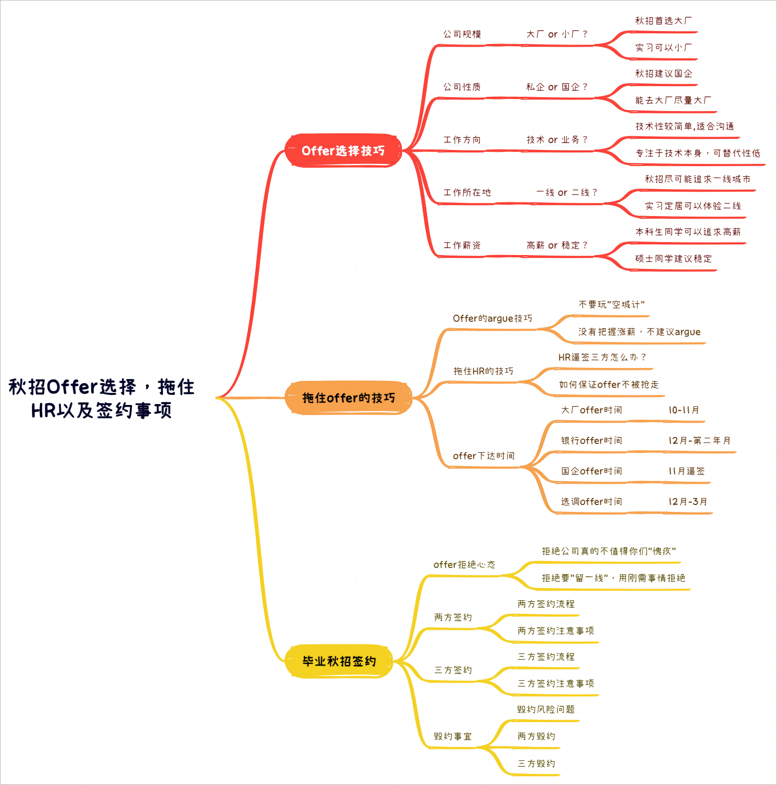
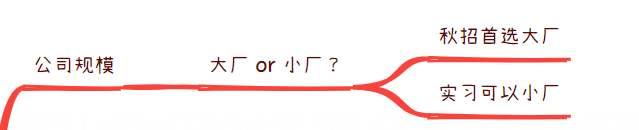
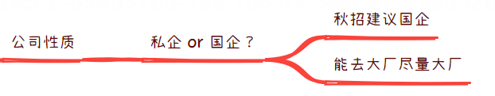
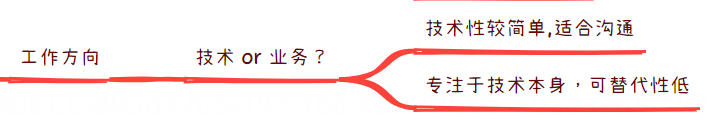
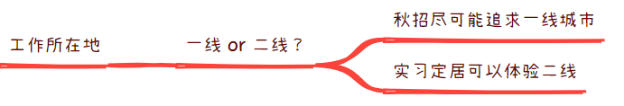
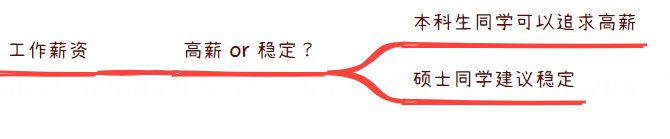
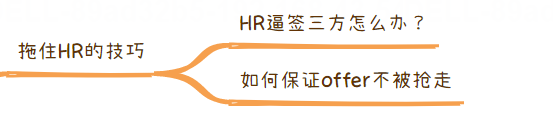
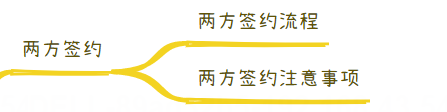
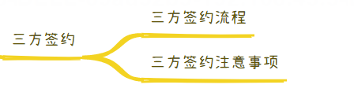
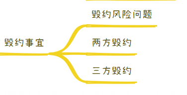

# 保姆级手把手带你通关秋招教程之秋招Offer选择，拖住HR以及三方就业协议签约全解

[来自： 编程导航](https://wx.zsxq.com/dweb2/index/group/51122858222824)

千与编程

2023年10月13日 07:52

大家好，我是千寻哥。真的好久不见，今天在这里跟大家分享保姆级手把手带你通关秋招教程的第六篇之秋招offer的选择以及如何拖住HR延长offer的保鲜期，以及你们最关心的就是毕业生三方签约问题。

今天我会详细的跟大家介绍关于校园招聘offer选择相关的问题,以下是我们今天的课程大纲！

说到这儿，可能有一些同学会伤心，因为秋招到现在可能还没有offer，这个先不用太担心，现在刚10月份假期回来。还有机会，有很多同学在春招捡了个漏上岸的，这都是很正常的事情。

另外24届秋招针对今年的行情来说，并没有比去年行情好太多。目前还没有offer的同学，以及明年秋招的同学，可以先提前学习一下，最好也是有一个心理准备。

## **一、offer选择技巧**

**1. 公司规模**

首先选择的是大厂or小厂，我个人的建议是秋招，马上要毕业去工作了的话，我建议尽可能选中大厂，同时25届暑期实习的同学，可以考虑优先选择方向更有针对性的小厂。

原因：刚一毕业，工作方向不好改，比如你一直做客户端开发，你想之后社招找一份后端的工作，几乎是不可能的。因为任何的方向都是需要积累的，换工作方向太难！所以如果中厂的业务方向好，不要盲目选择大厂的边缘部门方向。

**2. 公司性质**

今年的秋招，其实如果不是要特别非互联网不去那种，真的可以考虑一下国企，目前整体大厂的方向还是裁员，所以如果不想压力特别大的话，我的建议还是国企以及银行的稳定性质岗位。

**3. 工作方向**

关于秋招的工作方向，其实对于程序员的同学，基本分为技术以及业务方向的区别

技术方向：研究内部框架，内部Kafka中间件，数据库的相关扩展项目。

业务方向：就是常见的电商以及广告业务。

**4. 工作所在地**

秋招尽可能追求一线城市，考虑定居的话可以选择新一线城市以及二线城市。

**5. 工作薪资**

本科生的同学可以去几年大厂，硕士的同学建议去体制内。

讲完了这个offer选择，一些同学暂时拿到一个offer或者两个offer。我目前为止，包括Top2的周边学校，没有听说过有拿到四五家大厂的，大部分人是实习转正拿的兜底Offer。

同时其他人可能拿了一些中小厂。这样的同学已经算是今年秋招赢家。

## **二、如何科学合理拖住offer**

我想和各位同学们分享一下，如何合理拖住手里Offer，对于现在有几个Offer的同学来说，你手里现在的这个offer还只是“空头支票”，因为公司只是给了你意向，还没有给你具体薪资，没有法律效力的！

你肯定想要对不同公司的薪资进行对比。但是没有人想给你当备胎。HR会在你们学校三方协议下来后，第一时间问你的选择，也就是可能就会逼签！

什么叫“逼签”？就是马上告诉你到底来不来我们公司，不来，收回你的offer！

那这个时候你要怎么办呢？你只能尽可能将时间往后拖，争取是在另一家Offer的薪资发给你之后，另一件offer收回之前，你能拿到你理想的offer的回应。

千寻寄语：

\1. 应届生太单纯了，很多应届生同学有一些玻璃心，不忍心拒绝其他的公司的好意。

\2. 同学，你真的很善良，但是这些公司真的不值得你这样，HR的招聘人员也只是逢场作戏，是为了完成KPI的指标。

\3. 你对整个公司来说，你只是几万分之一，但是你对你的父母来说，你是你们家的100%，你要对你的父母以及你的家人负责，怎么负责，钱啊！

很多同学还会担心，这样会不会被公司拉入招聘的黑名单，我可以很负责的说，同学你真的太焦虑了！

如果大家心里有个预期。我只能以我去年的不同种类Offer的下达时间，来给你一个预期评估时间，至于今年的具体时间，还得看就业的形式。但是校园招聘是有系统性流程的，基本上每年的时间是差不多的。

PS：如果在差不多的时候，还没有收到积极的回复，那么我建议就不要浪费时间了，比如某为，会一直泡池子的。

## **三、毕业秋招三方的签约流程**

给大家介绍三方的具体签约流程，有两个原因：

1. 毕业三方的签订比较麻烦，提前知悉，可以防患于未然。
2. 不同学校的签约方法不一样，而且三方的签约流程比较麻烦的。

相当于给大家解除一个后顾之忧，很多同学可能觉得拿到offer之后，后面这个三方签约是不是很麻烦？

要走很多流程，尤其是很关心万一我需要毁约？是不是毁约非常难走啊？希望心理能有个大概的心理预期。

**关于两方签约：**

两方就业协议是你和公司之间的合同协议，注意两方有法律效益的。

有法律效益的含义就是两方如果你毁约的话，公司起诉你，也是合情合理的，但是目前为止99%的人毁约两方都是没有被要违约金，也没有其他的影响。

但是两方的就业协议并不是你最终的三方协议，当然如果你是留学生，留学生是不存在三方的。两方就可以直接就业了。

**关于三方签约：**

三方是在你已经签订了两方就业协议的基础之上，或者是已经拿到公司的正式Offer基础上，需要走学校的就业流程。

不同学校就业三方，分为网签三方和纸质版三方。

网签三方是由学生在网上发起，然后公司，学校点击确认，这个速度相对来说快一些，但是大部分学校现在采用的是纸质版三方。

需要你拿来公司发布的正式offer，申请下来三方文件。在三方之上，然后签订完，将三方文件寄给公司，公司那边进行盖章，盖章之后再回来给学校盖章，自己再留存一份。

整个三方的签订过程，你留一份三方，公司留一份三方，然后学校保存一份三方，因为两方仅仅是完成三方协议的一个简单预算。

## **四、毕业三方协议毁约**

大家可能最关心的是三方的毁约以及解约金的问题，那么这些东西到底是怎么回事？

两方毁约：一般来说，微信和HR说一声即可，即使已经签过字了

三方毁约：三方毁约由于有学校的接入，毁约变得麻烦了不少，而且注意：只有一次机会！需要先找上一家公司要来“解决函”，就是一个书面同意解约的凭证。支付违约金5000，这个必须支付，因为不支付违约金，可能拿不到解决函的。

然后换新的三方，重新走一遍三方的流程，即可。

很多同学会说：我现在还没有offer，好焦虑，千寻想告诉你，先不要心急，因为机会是留给有准备的人，这可不是安慰大家的毒鸡汤。

因为我去年的一个同学，秋招时发挥的非常好，拿了好几个offer，他把其他的offer全部都拒了，最后只剩了一个offer。

结果最后被毁约了。因此乱杀王最后的结果也未必理想，可能能力在你最后秋招时的50%。更重要可能是你的运气。

我是千与编程，一个只讲干货的码农，我们下期见~

知识星球

扫码加入星球

查看更多优质内容