> 本文参考[前端笔试常考设计模式，操作系统，数据结构，ACM模板，经典算法，正则表达式，常用方法_前端笔试题会考计算机网络吗?-CSDN博客](https://blog.csdn.net/qq_28838891/article/details/129828688)及[操作系统期末复习简记-CSDN博客](https://blog.csdn.net/ZZZWWWFFF_/article/details/131290265)进行编写

# 进程管理

## 程序、进程、线程

- 程序：（**静态**）以 文件形式 存于 **硬盘**的一个文件
- 进程：进程是**程序的一次执行**，是进程实体的**运行过程**，此处强调进程的动态，进程是系统进行**资源分配与调度的独立单位**，进程的结构包括PCB(进程唯一标识)、数据段、程序段
- 线程：线程是进程的“轻型实体”，是一条执行路径，不能单独存在，**必须包含在进程中**，线程是OS中**调度和执行**的基本单位，线程的存在进一步提高了系统的并发性，线程都共享自己进程的资源

## 进程的状态与转换

### 进程的状态

> 进程的生命周期：即一个进程从在内存中被创建PCB到从内存中销毁的过程

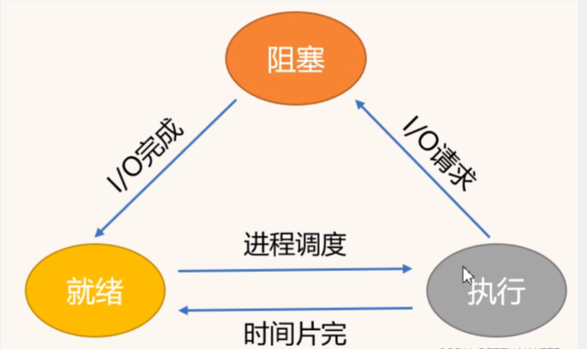

进程的三个基本状态如上图所示

- **就绪状态**：进程在内存中已经具备了除CPU以外的所有条件，就等着处理机调度（存在排队/队列的数据结构）
- **执行状态**：按照一定的进程调度算法，选择某个进程进入CPU处理（CPU可能按照算法分配时间片给进程，如果没有发生任何意外，那么进程的时间片用完了，就会回到就绪队列的队尾继续排队等待进入CPU）
- **阻塞状态**：进程在进入CPU之后，发生了意外，例如进程发现自己缺页了，发出了IO请求（当然引发阻塞的原因很多），那么相当于进程主动放弃了CPU，则该进程会进入阻塞队列中，直到意外解决，那么该进程则重新回到就绪队列排队等待CPU调度

接着补充两种状态：创建和终止

- **创建状态**：一个应用程序从磁盘中将所有需要的资源加载到内存中，同时创建自己的PCB
- **终止状态**：即一个进程的任务已经完成了或者我们人为结束了该进程，这里可以是正常终止也可以是异常终止

## 死锁

- **定义**：多进程 由于**资源竞争** 而造成 相互等待 的僵局，无外力作用下 都**无法** 继续**推进**

  - 类似于"饥饿"的概念，等待时间过长以至于给进程推进和响应带来明显影响，但是"饿而不死"

- **原因**：

  - 系统资源的竞争
  - 进程推进顺序非法

- 死锁产生的**必要条件**：

  - 互斥条件：即一个共享资源同一时刻只能有一个进程得到
  - 不剥夺条件：即进程拥有共享资源后不会被其他进程抢占
  - 请求并保持条件：即一个进程在拥有一个共享资源后还需要申请其他资源
  - 循环等待条件：即进程互相等待对方的资源释放

- 死锁的**预防**：设置某些限制条件，破坏产生死锁的必要条件中的一个或几个条件

  - 一次分配全部资源(摒弃“请求和保持”条件)
  - 当请求的资源得不到满足时，释放已分配的资源（摒弃“不剥夺”条件）
  - 对资源的申请必须按一定顺序进行（摒弃“循环等待”条件）

  ​

### 死锁的避免-银行家算法

分配资源之前，先判断是否会进入**不安全区**（危险区和禁区），如果会进入危险区，则不分配资源，进程在分配资源之前需要先告诉系统自己最大需要多少资源以便系统进行判断，即如果进程在动态分配过程中请求的资源数量大于自己的最大需要资源数则拒绝，此外如果系统所剩资源数不够分配给进程所申请的资源数也会拒绝

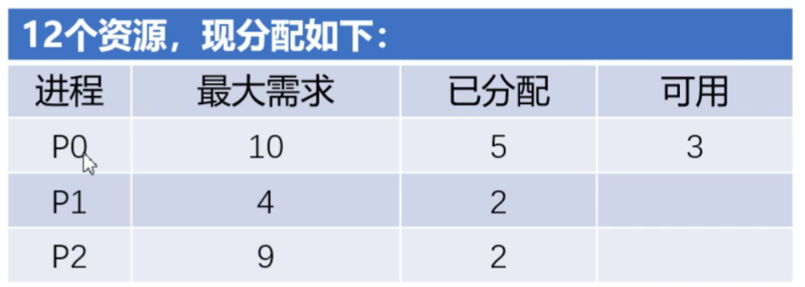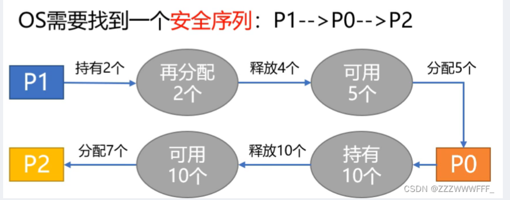

## 处理机调度

### 调度层次

- 高级调度/作业调度（相当于进入就绪状态）
  - 把后备作业调入内存
  - 只调入一次，调出一次
- 中级调度/内存调度（相当于挂起操作、激活操作）
  - 将进程调至外存，条件合适再调入内存
  - 在内外存对换区进行进程对换
- 低级调度/进程调度（即进入执行状态）
  - 从就绪队列分配进程给处理机
  - 调度频率很高

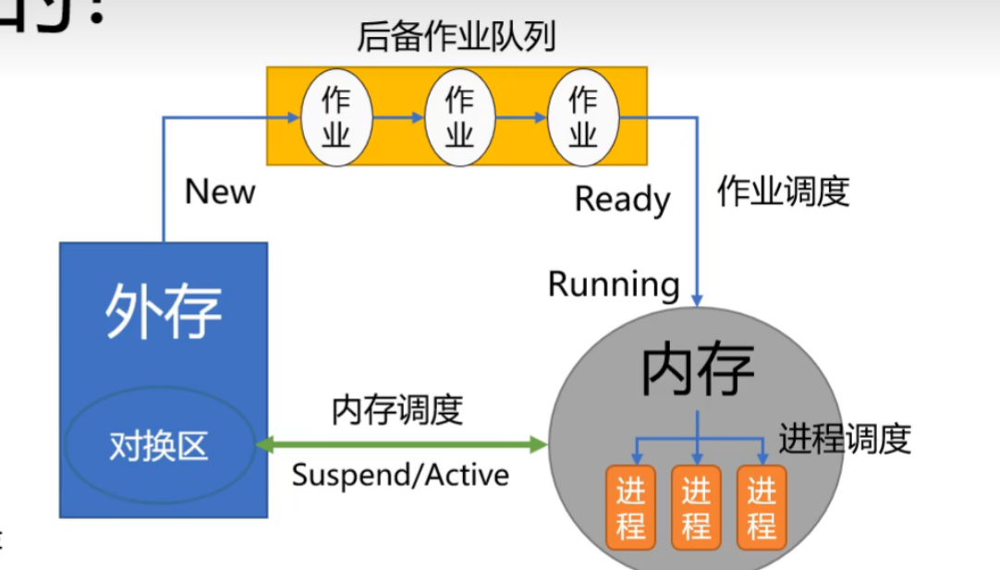

### 调度指标/准则

- CPU利用率

- 系统**吞吐量**：**单位时间**内 CPU**完成的作业量**

- **响应**时间＝**首次响应**时刻－提交时刻；

- 周转时间：作业（进程）i从提交（进入时刻）到完成的时间称为该作业的周转时间Ti

  - Ti = 完成时刻 – 进入时刻

- 平均周转时间：平均周转时间为n个作业（进程）周转时间的平均值

  - 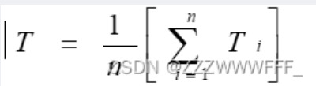

- 带权周转时间：作业(进程)周转时间Ti与实际运行时间Tsi之比称为该作业的带权周转时间Wi

  - 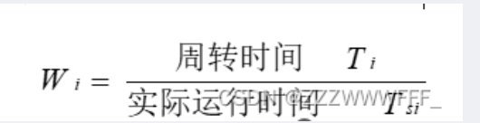

- 平均带权周转时间：平均带权周转时间为n个作业（进程）带权周转时间的平均值

  - 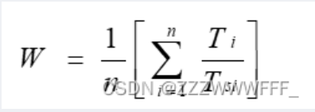

- 平均等待时间：进程i从进入就绪队列到获得CPU的时间称为该进程的等待时间WTi

  - 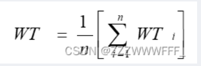

  	​	

### 调度方式

- 抢占式调度
  - 立即暂停当前进程
  - 分配处理机给另一个进程
  - 原则：优先权/短进程优先/时间片原则
- 非抢占式调度
  - 若有进程请求执行
  - 等待直到当前进程阻塞或完成
  - 适用于批处理系统，不适用于分时/实时

### 调度算法

#### 先来先服务FCFS

- *First Come First Serve*
-  算法内容：调度作业/就绪队列中最先入队者
- 算法原则：按照作业/进程到达顺序服务
- 调度方式：非抢占式
- 使用场景：作业/进程调度
- 优缺点
  - 有利于CPU繁忙型/长作业，充分利用CPU资源
  - 不利于IO繁忙型作业，操作耗时

#### 短作业优先SJF

- *short just first*
- 算法内容：所需服务时间最短的作业/进程优先服务（执行）
- 算法原则：追求最小的平均（带权）周转时间
- 调度方式：非抢占式
- 使用场景：作业/进程调度
- 优缺点
  - 平均等待/周转时间最小
  - 长作业周转时间会增加或饥饿
  - 估计时间不准确，不能保证紧急任务及时处理

#### 高响应比优先调度

-  算法内容：结合先来先服务、短作业优先，综合考虑等待时间和服务时间计算响应比，高的优先调度
- 算法原则：综合考虑作用/进程的等待时间和服务时间
- 调度方式：非抢占式
- 使用场景：作业/进程调度
- 优缺点
  - 响应比=（等待时间+预估服务时间）/预估服务时间
  - 只有当前进程放弃执行权（完成/阻塞）时，重新计算所有进程响应比
  - 长作业等待时间越久响应比越高，更容易获得处理机

#### 优先级调度

-  算法内容：按照作业/进程的优先级（紧迫程度）进行调度
- 算法原则：优先级最高（最紧迫）的作业/进程先调度
- 调度方式：抢占式/非抢占式
- 使用场景：作业/进程调度
- 优缺点
  - 静态（进程创建时即设置优先级不变了）/动态（进程在运行过程中优先级可能改变）
  - 系统进程>用户进程；交互型进程>非交互型进程；IO型进程>计算型进程
  - 低优先级进程可能会产生饥饿

#### 时间片轮转调度RR

-  算法内容：按照进程到达就绪队列的顺序，轮流分配一个时间片去执行，时间用完则剥夺
- 算法原则：公平、轮流地为每个进程服务，进程在一定时间内都能得到响应
- 调度方式：抢占式，由时钟中断确定时间到
- 使用场景：进程调度
- 优缺点
  - 公平、响应快，适用于分时系统
  - 时间片决定因素：系统响应时间、就绪队列进程数量、系统处理能力
  - 时间片太大，相当于先来先服务；太小，处理机切换频繁，开销大

#### 多级反馈队列调度

-  算法内容：设置多个按优先级排序的就绪队列，优先级从高到低，时间片从小到大，时间片从小到大，新进程采用队列降级法，即进程先进入第一级队列，按先到先得分配时间片，如果分配的时间片用完了进程也未完成，那么进程进入下一级队列队尾，直至进程完成，需要注意的时，CPU按照优先级队列执行进程，如果前面队列不为空，不会执行后续队列进程
- 算法原则：集前面所学算法的优点，相当于优先级调度+时间片算法
- 调度方式：抢占式
- 使用场景：进程调度
- 优缺点
  - 对各个类型进程相对公平，能够快速响应
  - 短作业优先
  - 周转时间短
  - 长作业也能够在前面的队列先得到部分执行

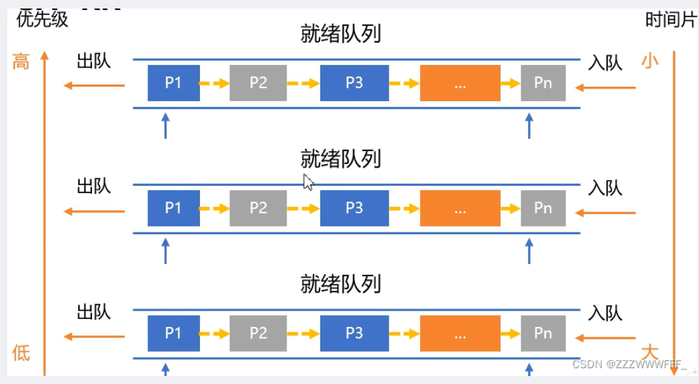

## 补充

### 并发和并行

并发：**逻辑上**的同时发生（simultaneous）一个处理器同时处理多个任务。 
并行：**物理上**的同时发生，是指多个处理器或者是[多核](https://so.csdn.net/so/search?q=%E5%A4%9A%E6%A0%B8&spm=1001.2101.3001.7020)的处理器同时处理多个不同的任务。

# 内存管理

## 用户程序如何变为进程

- 编译（即我们在写程序时进行的编译操作，是由用户完成的）
- 链接（将我们在程序中需要的一些库与我们所写程序合并为一个链接程序并成为一个模块）
- 装入（将模块装入内存，形成绝对地址）

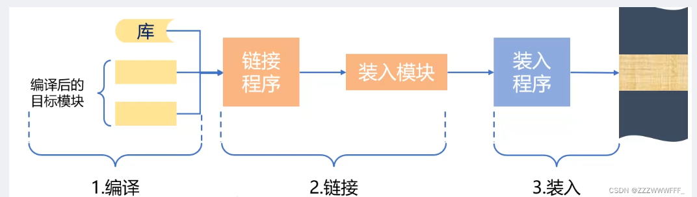

## 地址

- **相对/逻辑地址**：编译后，每个目标模块 都从0号单元开始编址
- **逻辑地址空间**：各个目标模块 的 相对地址 构成 的统一 从0号单元开始编址的 集合（内存管理的具体机制 完全透明，只有系统编程人员 才涉及，用户程序/程序员只需 知道逻辑地址）
- **物理地址空间**：内存 中 物理单元的集合
- **地址重定位**：**逻辑**地址->**物理**地址

## 管理方式

### 连续分配管理方式

#### 单一连续分配

- 注意理解这里的外部碎片指的是分配给用户进程之外的内存空间是否全部利用，因为这里是单用户，因此整个用户区都是当前用户的也就不存在用户进程之外的空间，故无外部碎片
- 内部碎片指的是分配给用户进程内的内存空间是否全部利用，在整个用户区中，可能当前用户只使用了其中的一小部分空间，那么其他的空间便被浪费了，因此存在内部碎片

#### 固定分区分配

固定分区分配指的是预先对内存的空间进行划分，划分为一个又一个的分区空间用于分配给进程，其中，我们可以有两种分区划分的方式：

即分区大小相等与分区大小不等

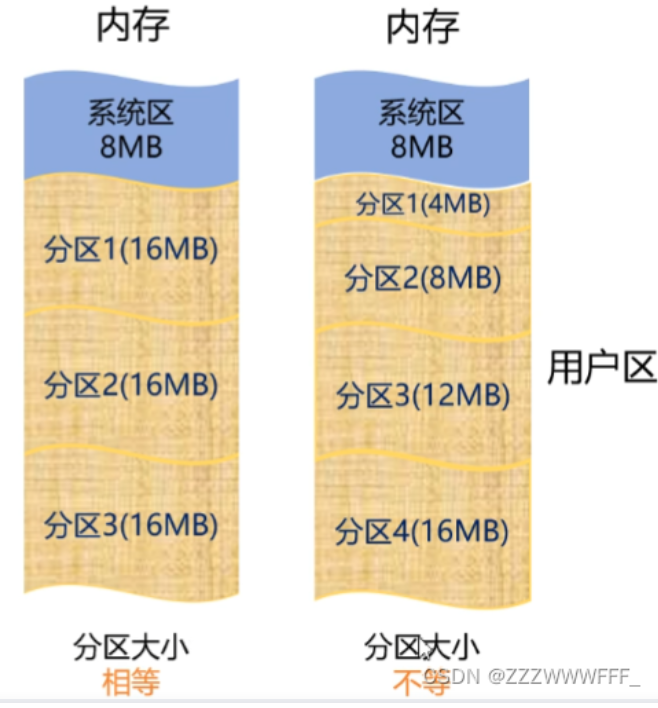

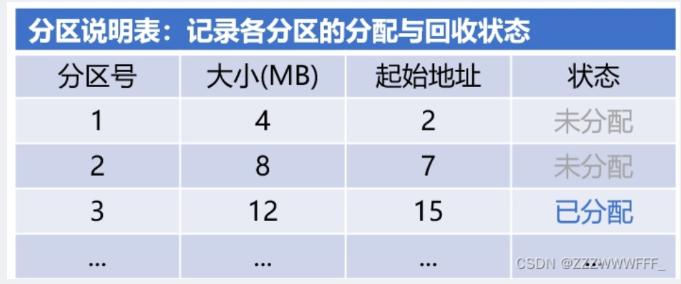

此外为了方便对各个分区进行分配与回收，我们还会有一个分区记录表，用于记录各个分区的使用情况

这里因为内存空间都被划分为分区进行分配，因此无外部碎片

因为分区的大小不可能完全匹配进程所需空间，因此有内部碎片

#### 动态分区分配

动态分区分配可以根据进程所需的空间在内存中创建相应的分区空间，因此系统分区的大小和数目是可变的

有两种常用的数据结构：空闲分区表与空闲分区链

例如某一时刻内存使用情况如下：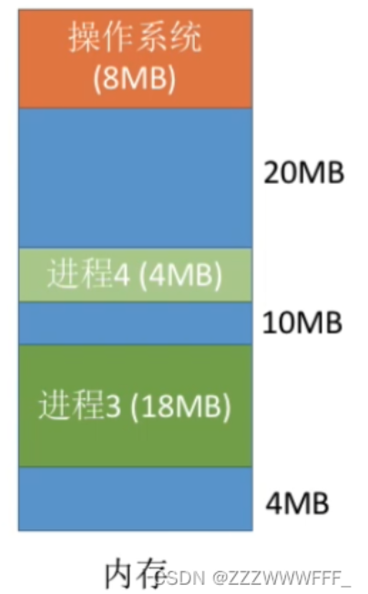

 那么空闲分区表如下：

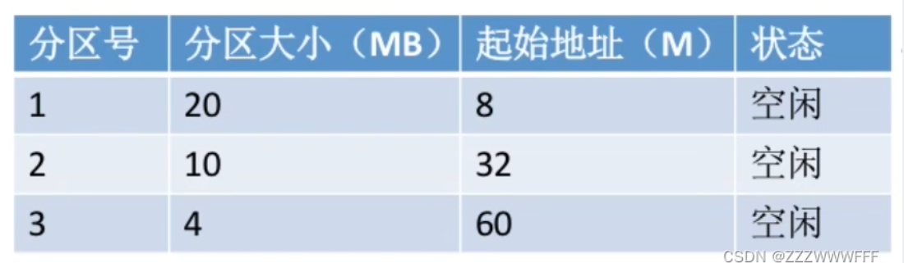

空闲分区链如下（双向链表）：

正如上面的情况，例如现在有一个4MB的进程进来内存了，那么我们应该选择哪个分区进行分配呢？这里就需要考虑进程的分区分配算法了，常用算法如下

- 首次适应算法FF：从低地址查找合适空间
- 最佳适应算法BF：优先使用最小空闲空间
- 最坏适应算法WF：优先使用最大连续空间
- 临近适应算法NF：从上次查找处向后查找

具体各个算法的优缺点如下：

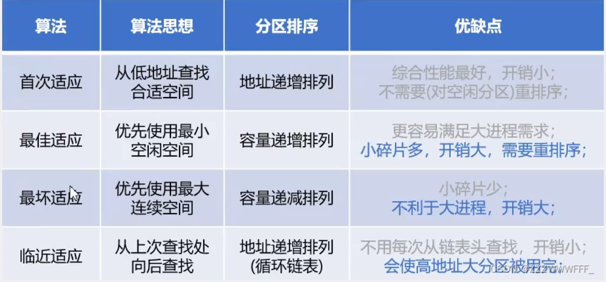

现在我们讨论分区的回收问题

- 如果回收的进程空间前后相邻空间均为空闲空间，那么我们将其合并为一个大空间，同时加入空闲分区表或分区链即可
- 反之，我们直接将其加入空闲分区表/链

### 非连续分配管理方式

如上图所示，标出大小的空间为空闲空间，如果现在有一个大小为13M的进程想要进入内存，我们如果使用连续分配的话很明显是无法分配成功的，但是如果使用非连续分配就可以，即**将进程拆分成多个模块放入内存中**

如果我们将进程拆分为多个内存块的话，那我们的进程在内存中想要进行计算什么的，就**需要一个数据结构**去记录下各个内存块的位置以及大小等信息

#### 基本分页存储管理方式

我们将**整个内存空间按照固定大小去给他划分为分区**（一般为4k），这个分区的大小一般不会太大，如果太大，产生的内部碎片也会随之变大，太小的话，分区的数目也会太多

实际上分页存储管理方式的实质类似我们前面所学的**固定分区分配**，只不过这里的分区大小较小

这里的**页框**的名字不是固定的，各个版本的叫法不同，我们这里统一叫**内存块** 

 同样的，想要进入内存的进程也拥有类似**页框**的概念，即**对进程也进行分区**，我们称之为**页**

**页表**

页表是实现我们在**进程中的逻辑地址到内存中的物理地址**的转换的关键

页表存储在进程控制块中(PCB)

如上图所示，页表中存储了**页号**与**块号**，例如我们现在有一个数据存储在逻辑地址1024中，我们希望使得这个数据加1，那么我们需要得到该数据的物理地址对其加一，我们需要先得到逻辑地址1024在哪个页，然后通过页表得到其所在块，最后得到该数据的物理地址进行计算

**逻辑地址与物理地址的转换**

例如现在我们希望得到逻辑地址4097的物理地址

首先计算该逻辑地址所在页号，4097/4096=1，即该地址处于页号为1的位置，那么我们对照页表可以得到其所在块号为2，那么在2号块的哪个位置呢，我们还需要计算偏移量4097%4096=1，据此我们就得到了物理地址在2号块里位置为1的地方

#### 基本分段存储管理

我们知道前面所学的分页是指我们把物理内存空间按照固定的大小分成很多很多的块，实际上用户进程一般都会被划分为多个模块，例如子进程作为一个模块，所有进程的公共数据作为一个模块，因此我们就把用户进程的地址空间也按照模块进程划分，这就是**分段存储管理**，它与**分页存储**的**区别**在于每个段的大小都是不一定相同的，因为一个进程的模块一般都是不相等的

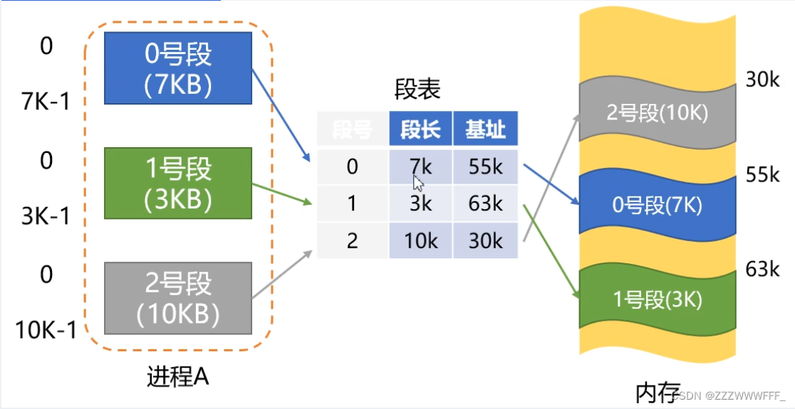

与页表类似的，分段存储也有段表，其逻辑地址与物理地址的转换也与页表基本相同，即**得到一个逻辑地址后查询段表得到物理基地址后再根据段内地址合成物理地址**

## 页面置换算法

- 最佳页面置换算法(OPT)

  - 选择被置换的页面，将是**未来永不使用**的页面，或以后**最长时间**不使用的页面
  - 优点：可保证最低的缺页率
  - 缺点：不可能真正实现，只可作为其它算法的评价参考

- 先进先出算法(FIFO)

  - 选择最**先进入内存的页面**，即选择在内存中驻留时间最长的页面予以淘汰
  - 优点：算法简单
  - 缺点：性能不佳

- 最近最久未使用算法（LRU）

  - 选择**最近最久未被使用**的页面淘汰
  - 优点：性能较好
  - 缺点：需要较多的硬件支持

- Clock算法

  - Clock 算法中，设置 1 位访问位，记录页面是否被访问过 ( 访问过为 1 ，未访问为 0)

    	

- 改进型Clock算法

  - 改进型 Clock 置换算法除设置 1 位访问位 (A) ，还设置 1 位修改位(M)

    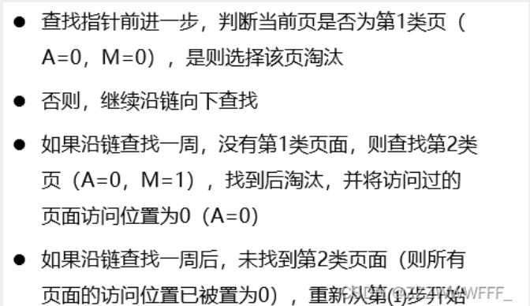

## 虚拟内存

虚拟内存即具有请求调入与置换功能，从**逻辑上**对内存容量加以扩充的一种存储器系统

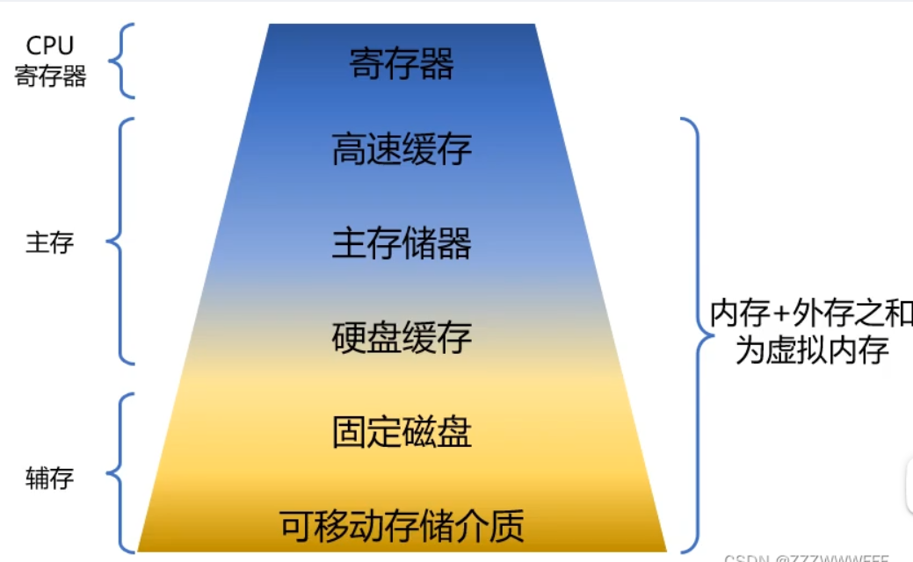

虚拟内存的特征如下：

- 多次性：即这里对于一些大进程不再是一次性将其全部加入到内存中，而是先将其核心内容加入到内存中，之后需要什么内容再动态地加入
- 对换性：即我们在不需要某一个进程时运行将其挂起到硬盘缓存中
- 虚拟性：即虚拟内存实现了对内存逻辑大小的扩充

