# 算法

- 定义：
  - 算法是解决特定问题求解步骤的描述，在计算机中表现为指令的有限序列并且每条指令表示一个或多个操作，简而言之，算法是描述解决问题的方法
- 特性：
  - 输入、输出、有穷性、确定性和可行性
  - 好的算法：应该具有正确性，可读性，健壮性，高效率和低存储量的特征


## 时间效率度量

**（1）可以忽略加法常数**

```
O(2n + 3) = O(2n)
```

**（2）与最高次项相乘的常数可忽略**

```
O(2n^2) = O(n^2)
```

**（3） 最高次项的指数大的，函数随着 n 的增长，结果也会变得增长得更快**

```
O(n^3) > O(n^2)
```

**（4）判断一个算法的（时间）效率时，函数中常数和其他次要项常常可以忽略，而更应该关注主项（最高阶项）的阶数**

```
O(2n^2) = O(n^2+3n+1)

O(n^3) > O(n^2)
```


## 时间复杂度

> 可参考[一套图 搞懂“时间复杂度”-CSDN博客](https://blog.csdn.net/qq_41523096/article/details/82142747)

使用大O阶推导方法

- 定义：时间复杂度所需消耗的时间**即基本操作执行次数**

- 计算：

  - 用**常数 1** **取代**运行时间中的**所有加法常数**
  - 在修改后的运行次数函数中，**只保留最高阶项**
  - 如果最高阶项**存在且不是 1**，**则**去**除与这个项相乘的常数**，得到的结果就是大 O 阶

- 举例：

```
int i,j;
for ( i = 0; i < n; ++i){
    for(j = i; j < n; ++j){
        /*时间复杂度为 O(1) 的程序步骤序列 */
    }
}
```

分析：

> 对于外循环，其时间复杂度为 O(n)；
>
> 对于内循环环，当 i=0 时，内循环执行了 n 次，当 i=1 时，执行了 n-1 次，······当 i=n-1 时，执行了 1 次。
>
> 因此内循环总的执行次数为：
>
> 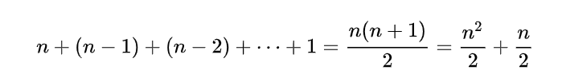
>
> 根据大 O 阶推导方法，最终上述代码的时间复杂度为 ：
>
> 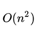

- 常见的时间复杂度：

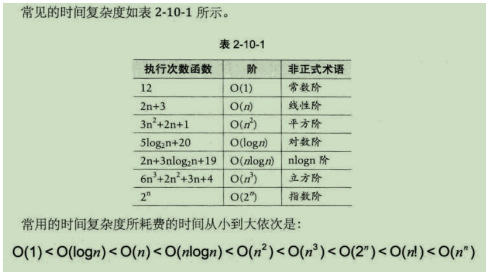


## 空间复杂度

- 定义

  - 算法的空间复杂度**通过计算算法**所需的**存储空间**实现

    **即**运行完一个程序**所需内存的大小**

>  算法的时间复杂度和空间复杂度是可以**相互转化的**

- 计算：利用程序的空间复杂度，可以对程序的运行所需要的内存多少有个**预先估计一个**算法所需的存储空间**用f(n)表示**

```

空间复杂度的计算公式记作：S(n)=O(f(n))　　
其中n为问题的规模
S(n)表示空间复杂度
```

（1）**忽略常数**，用O(1)表示

举例1：

```
a = 0
b = 0
print(a,b)
它的空间复杂度O（n）=O（1）；
```

 

（2）递归算法的**空间复杂度=递归深度N\*每次递归所要的辅助空间** 

举例2：

```
def fun(n):
    k = 10
    if n == k:
        return n
    else:
        return fun(++n)
递归实现，调用fun函数，每次都创建1个变量k。调用n次，空间复杂度O（n*1）=O（n)。
```

 

（3）对于**单线程**来说，**递归有运行时堆栈**，求的是递归**最深的那一次压栈所耗费的空间的个数，**因为**递归最深的那一次所耗费的空间足以容纳它所有递归过程**

举例3：

```

temp=0;
for(i=0;i<n;i++):
    temp = i
 
变量的内存分配发生在定义的时候，因为temp的定义是循环里边，所以是n*O(1)
temp定义在循环外边，所以是1*O(1) 
```


一般情况下，一个程序在机器上执行时：

**除了**需要存储**程序本身的指令，常数，变量和输入数据外**

**还**需要存储**对数据操作的存储单元****的辅助空间**

**若**输入数据所占空间只取决于问题本身，和算法无关

这样就只需要分析该算法在实现时所需的辅助单元即可。若算法执行时所需的辅助空间相对于输入数据量而言是个常数，则称此算法为原地工作，空间复杂度为O（1）


- 需存储空间包括以下两部分：
  - 固定部分：这部分属于**静态空间**，这部分空间的大小与**输入/输出的数据**的个数多少、数值**无关**，主要包括指令空间（即代码空间）、数据空间（常量、简单变量）等所占的空间
  - 可变空间：这部分空间的**主要包括**动态分配的空间，以及**递归栈所需的空间等**这部分的空间大小与**算法**有关


- 常见算法的时间复杂度与空间复杂度

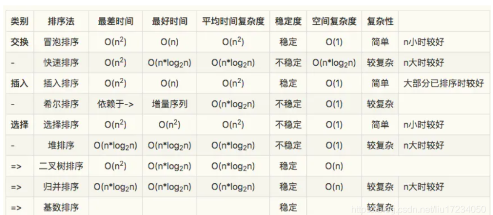


# 线性表

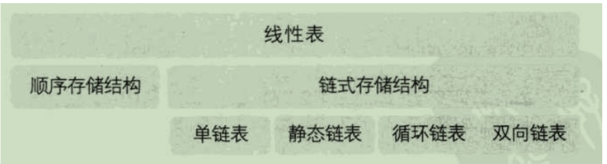


## **线性表的顺序存储结构**

### 概述

- 定义：是用一段**地址**连续的存储**单元依次存储**线性表的**数据元**
- 顺序存储示意图如下所示：

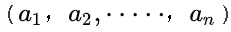

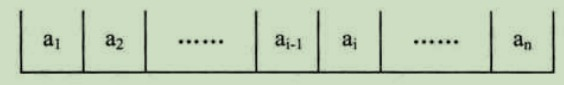

- 编号地址

  - 存储器中的每个存储单元都有自己的编号，这个编号称为地址

- 存储位置公式

  - 每个数据元素，不管它是整型，实型还是字符型，它**都是需要**占用一定的存储单元空间的

  - 假设占用的是 **c 个存储单元**，那么对于线性表的**第 i 个数据元素**  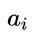的**存储位置**都可以由 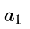 推导算出：

    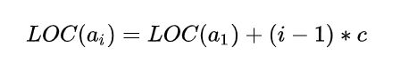

- 存取操作性能

  - 通过上面公式，就可以**随时算出**线性表中**任意位置的地址**

    不管是第一个还是最后一个，都是相同的时间

    **也即**对于线性表**每个位置**的**存入或者取出数据**

    对于计算机来说**都是相等的时间**，也就是一个**常数时间**

    因此，线性表的**存取操作时间性能**为 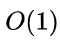

- 随机存储结构

  - 我们通常将**存取操作**具备**常数性能**（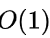）的**存储结构**称为随机存储结构


### 时间复杂度

（1）对于存取操作

线性表的顺序存储结构，对于**存取操作**，其**时间复杂度**为 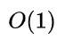

因为**元素位置**可以**直接计算得到**


 （2）对于**插入和删除**操作

对于**插入和删除**操作，其**时间复杂度**为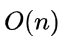

因为插入或删除后，需要**移动其余元素**

### 使用场景

线性表顺序存储结构**比较适用于**元素**存取操作较多，增删操作较少**的场景


## 线性表的链式存储结构

- 定义：**一个或多个结点** **组合而成**的**数据结构**称为*链表*
- 结点
  - **结点** 一般由**两部分**内容构成：
  - **数据域**：存储**真实数据元素**
  - **指针域**：存储**下一个**结点的**地址（指针）**

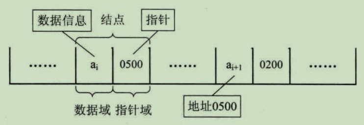

- **头指针&头结点**
  - **头结点的数据**域可以不**存储任何信息**，其指针域存储**指向**第一个结点
  - **头指针**：一般把**链表**中的**第一个结点称为 **头指针，其存储链表的**第一个数据元素**
  - **头结点**：为了能更加方便地对链表进行操作，会在**单链表的第一个结点前**附**设一个结点**，称为 **头结点**

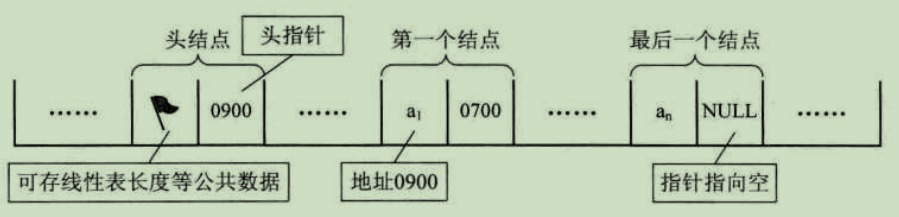


### 单链表

#### 时间复杂度

（1）对于存取操作

> 而对于单链表结构，假设需要获取第 i 个元素，则必须从第一个结点开始依次进行遍历，直到达到第 i 个结点。因此，对于单链表结构而言，其数据元素读取的**时间复杂度**为 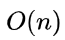

（2）对于**插入和删除**操作

> 而对单链表结构来说，对其任意一个位置进行增删操作，其**时间复杂度**为 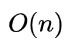
>
> **因为**需要先进行**遍历找到目标元素**，对头指针的增删操作其**时间复杂度**为 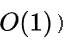

#### 对比线性表

> 因此，如果只对一个元素进行增删操作，两种结构并不存在优劣之分，但如果针对多个数据进行增删，由于线性表每一次增删都需要移动 n-i 个元素，即**每个元素**的操作都为 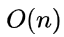

> 而单链表只在**第一次**遍历定位目标元素时为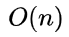
>
> **对后续元素**的增删只需简单地赋值移动指针即可，其时间复杂度为

**总结：**

> **对于插入或删除数据越频繁的操作，单链表的效率就越明显**


### 循环链表

> 将单链表中的**终端结点**的**指针端**由**空指针**改为**指向头结点**
>
> 就使整个单链表**形成一个环**
>
> 这种头尾相接的单链表称为单循环链表，简称 **循环链表（circular linked list）**
>
> **循环链表不一定需要头结点**

#### 对比单链表

> 为了使**空链表**与**非空链表****处理一致**，我们通常**设一个头结点（**循环链表不一定需要头结点**）
>
> **主要差异****就在于**循环的判断**条件上

（1）单链表判断条件

> 为尾结点是否**指向空**：
>
> ```
> p->next = NULL
> ```
>
>  

（2）循环链表判断条件

> 当前结点是否指**向头结点**：
>
> ```
> p->next = head
> ```
>
> 是则当前结点为尾结点

### **双向链表**

> **双向链表（double linked list）**：在**单链表**的**每个结点中**，再设置一个**指向其前驱结点**的指针域


## 一些比较

数组**静态**分配内存，链表**动态**分配内存;
数组在内存中**连续**，链表**不连续**;
数组元素在**栈**区，链表元素在**堆**区;
数组利用下标**定位**，时间复杂度为O(1)，链表定位元素时间复杂度O(n);
数组**增删**元素的时间复杂度O(n)，链表的时间复杂度O(1);


# 栈

## 概述

- 定义：栈是限定仅在表尾（栈顶）进行插入和删除操作的线性表，栈又称为 后进先出（Last In First Out） 的线性表，简称 LIFO 结构

- 栈的内部实现原理

  栈的内部实现原理其实就是数组或链表的操作，而之所以引入 栈 这个概念，是为了将程序设计问题模型化，用高层的模块指导特定行为（栈的先进后出特性），划分了不同关注层次，使得思考范围缩小，更加聚焦于我们致力解决的问题核心，简化了程序设计的问题


（1） 栈顶（top）

```
我们把允许插入和删除的一端称为 栈顶
```

（2）**栈底（bottom）**

```
另一端称为 栈底
```

（3） **空栈**

```
不含任何任何数据元素的栈称为 空栈
```


## 顺序栈与链栈

栈 是线性表的特例，其具备先进后出 FILO 特性

（1） **顺序栈**

```
可以使用线性表的顺序存储结构（即数组）实现栈，将之称之为 顺序栈
```

（2）**链栈**

```
可以使用单链表结构实现栈，将之称之为 链栈
```

（3）示意图如下所示


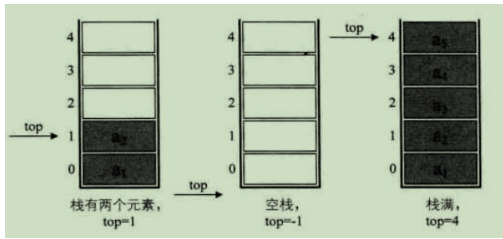

（4）顺序栈&链栈的异同

```
A:同【时间复杂度】
    顺序栈和链栈的时间复杂度均为O(1)
 
 
B:异【空间性能】
    a:顺序栈
        顺序栈需要事先确定一个固定的长度（数组长度）
        可能存在内存空间浪费问题，但它的优势是存取时定位很方便
    b:链栈
        要求每个元素都要配套一个指向下个结点的指针域
        增大了内存开销，但好处是栈的长度无限
        因此，如果栈的使用过程中元素变化不可预料，有时很小，有时很大，那么最好使用链栈
        反之，如果它的变化在可控范围内，则建议使用顺序栈
```


# 队列

## 概述

（1）定义 

是只允许在一端进行插入操作，而在另一端进行删除操作的线性表
队列 是一种 先进先出（First In First Out） 的线性表

线性表有顺序存储和链式存储，栈是线性表，所以有这两种存储方式
同样，队列作为一种特殊的线性表，也同样存在这两种存储方式

（2）队头

允许删除的一端称为对头
（3）队尾

允许插入的一端称为队尾


# 串

## 概述

- 定义：串（string） 是由零个或多个字符组成的有限序列，又名叫 字符串

- 逻辑结构：

  串 的逻辑结构和线性表很相似
  不同之处在于串针对的是字符集
  也就是**串中的元素都是字符**

  因此，对于串的基本操作与线性表是有很大差别的
  **线性表更关注的是单个元素的操作**，比如查找一个元素，插入或删除一个元素
  但**串中更多的是查找子串位置，得到指定位置子串，替换子串等操作**

- 存储结构：

  - **串的顺序存储结构**

    串的顺序存储结构是用 一组地址连续的存储单元 来存储串中的字符序列。一般是用**定长数组**来定义

    由于是定长数组，因此就会存在一个预定义的最大串长度

    一般可以将实际的串长度值保存在数组 0 下标位置，也可以放在数组最后一个下标位置

    也有些语言使用在串值后面加一个不计入串长度的结束标记符（比如\0）

    来表示串值得终结，这样就无需使用数字进行记录

  - （2）**串的链式存储结构**

    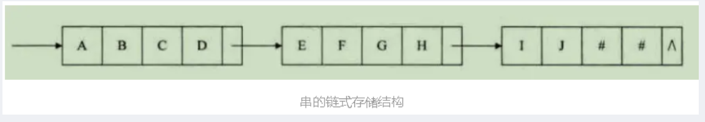

    对于串的链式存储结构，与线性表是相似的
    但由于串结构的特殊性（结构中的每个元素数据都是一个字符）
    如果也简单地将每个链结点存储一个字符，就会存在很大的空间浪费

    因此，**一个结点可以考虑存放多个字符**
    如果最后一个结点未被占满时，可以使用 "#" 或其他非串值字符**补全**

    串的链式存储结构除了在链接串与串操作时有一定的方便之外
    **总的来说不如顺序存储灵活，性能也不如顺序存储结构好**

  ​


# 树

## 概述

- 定义：

  树是n(n>=0)个结点的有限集
  当n=0时称为空树

  树 其实也是一种递归的实现，即树的定义之中还用到了树的概念

- 特点：

  - （1）且仅有一个特定的结点：根结点（Root）

  - （2）当  n>1时，其余结点可分为m(m>0)个互不相交的有限集T1、T2、T3......Tm

    其中每一个集合本身又是一棵树，并且称为根的 子树（SubTree）

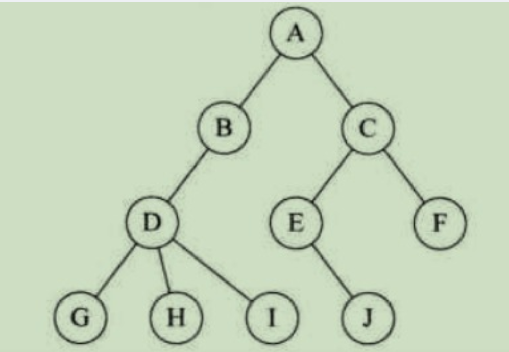

下图所示的结构就不符合树的定义，因为它们都有相交的子树：

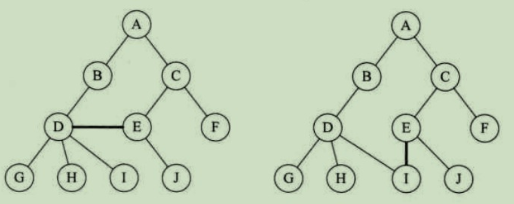

- 线性表与树结构

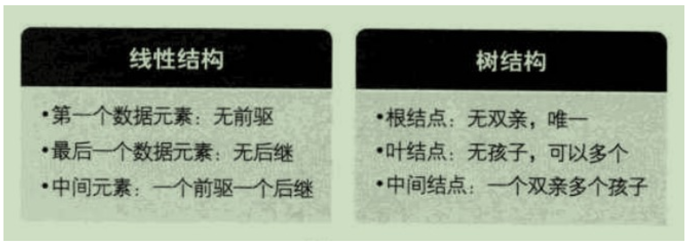

单独使用顺序存储结构（即数组）无法很好地实现树的存储概念
不过如果充分利用顺序存储和链式存储结构的特点，则完全可以实现对数的存储结构的表示


## 二叉树

- 定义：

  二叉树（Binary Tree）：是 n(n>=0)个结点的有限集合

  该集合或者为空集（称为空二叉树）

  或者由一个根结点和两棵互不相交的

  分别称为根结点的左子树和右子树的二叉树组成

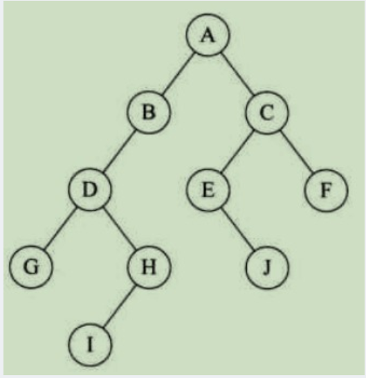

- 特点：

  A:每个结点最多只能有两棵子树

  B:左子树和右子树是有顺序的，次序不能任意颠倒

  C: 即使树中某结点只有一棵子树，也要区分它是左子树还是右子树

- 5种形态：

  A：空二叉树

  B：只有一个跟结点

  C：根结点只有左子树

  D：根结点只有右子树

  E：根结点既有左子树又有右子树


### 四种遍历方式

- 树的遍历即**从根结点出发**，按照某种次序**依次访问**[二叉树](https://so.csdn.net/so/search?q=%E4%BA%8C%E5%8F%89%E6%A0%91&spm=1001.2101.3001.7020)中**所有结点**，使得每个结点被**访问一次****且**仅被访问一次**

而二叉树的遍历方式有很多，如果我们限制了**从左到右的**习惯方式，那么主要就**分为四种**


#### 前序遍历

规则是**先**访问**根结点**

**然后**前序遍历**左子树**

**再**前序遍历**右子树**

**（总结：根结点 -> 左子树 -> 右子树）**

如下图所示，遍历的顺序为：ABDGHCEIF

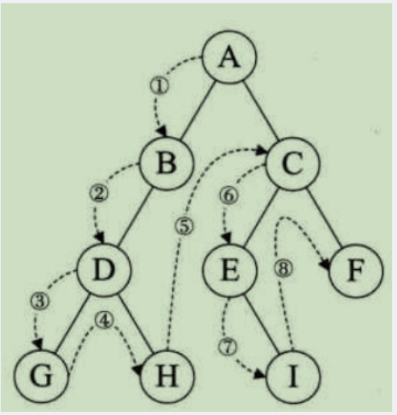


#### 中序遍历

从根结点**开始**（注意并不是先访问根结点）

中序遍历根结点的**左子树**

然后**再**访问**根结点**

**最后**中序遍历**右子树**

**（总结：左子树 -> 根结点 -> 右子树）**

如下图所示，遍历的顺序为：GDHBAEICF

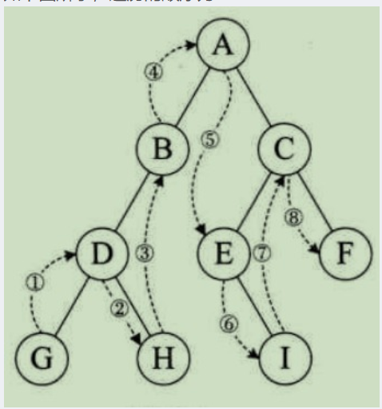


#### 后序遍历

从左到右**先叶子**

**后结点**的方式遍历**访问左右子树**

**最后**访问**根结点**

**（总结：\**从左到右访问叶子结点 -> 根结点）**

如下图所示，遍历的顺序为：GHDBIEFCA

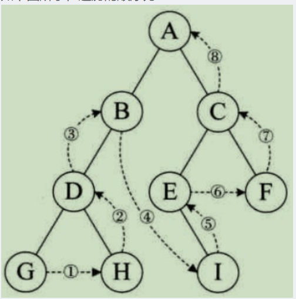


#### 层序遍历

从树的第一层，即根结点**开始**访问

**从上而下**逐层**遍历**

在**同一层中**按**从左到右**的顺序对结点逐个访问

**（总结：第一层 -> 第二层（从左到右访问结点）-> ··· -> 最后一层（从左到右访问结点）**

如下图所示，遍历的顺序为：ABCDEFGHI

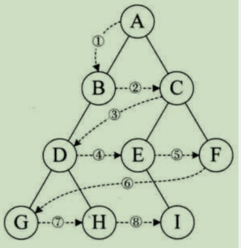


## 哈夫曼编码

树，森林看似复杂,其实它们都可以转化为简单的二叉树来处理
这样就使得面对树和森林的数据结构时，编码实现成为了可能


最基本的压缩编码方法：赫夫曼编码


给定n个权值作为n个叶子结点
构造一棵二叉树，若树的带权路径长度达到最小，则这棵树被称为哈夫曼树

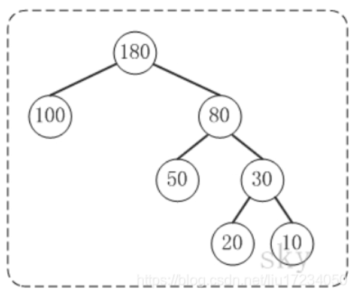

- 路径和路径长度

  - 定义：在一棵树中，从一个结点往下可以达到的孩子或孙子结点之间的通路，称为**路径**

  - 通路中分支的数目称为**路径长度**

  - 若规定根结点的层数为1，则从根结点到第L层结点的路径长度为L-1

  - 如上图的树，我们可知：

    ​      100和80的路径长度都是1
          50和30的路径长度都是2
          20和10的路径长度都是3


-  结点的权及带权路径长度

  - 定义：若将树中结点赋给一个有着某种含义的数值，则这个数值称为该结点的权

  - 结点的带权路径长度为：从根结点到该结点之间的路径长度与该结点的权的乘积

    例子：节点20的路径长度是3
          它的带权路径长度= 路径长度 * 权 = 3 * 20 = 60 


- 树的带权路径长度

  - 定义：树的带权路径长度规定为**所有叶子结点**的**带权路径长度之和**，记为WPL

    例子：示例中，树的WPL= 1\*100 + 2\*50 + 3\*20 + 3\*10 = 100 + 100 + 60 + 30 = 290


比较下面两棵树: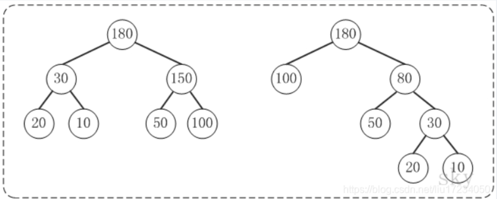

上面的两棵树都是以{10, 20, 50, 100}为叶子节点的树

左边的树WPL=2\*10 + 2\*20 + 2\*50 + 2\*100 = 360  
右边的树WPL=350
左边的树WPL > 右边的树的WPL

你也可以计算除上面两种示例之外的情况，但实际上右边的树就是{10,20,50,100}对应的哈夫曼树


- 应用：

而哈夫曼树的应用可以使得我们知道每个字符的最短二进制组成形式

参考[哈夫曼编码详解——图解真能看了秒懂_已知字符集abcdef,若各字符出现的次数-CSDN博客](https://blog.csdn.net/Young_IT/article/details/106730343)


# 图

A:在线性表中
    数据元素之间是被串起来的，仅有线性关系
    每个数据元素只有一个直接前驱和一个直接后驱


B:在树形结构中
    数据元素之间有着明显的层次关系
    并且每一层上的数据元素可能和下一层中多个元素相关
    但只能和上一层中一个元素相关


C:图是一种较线性表和树更加复杂的数据结构
    在图形结构中，结点之间的关系可以是任意的
    图中任意两个数据元素之间都可能相关

## 概述

- 定义：

  由顶点的**有穷非空集合**和顶点之间边的集合组成

  通常表示为：G(V,E)
      G表示一个图
      V是图G中的顶点的集合
      E是图G中边的集合

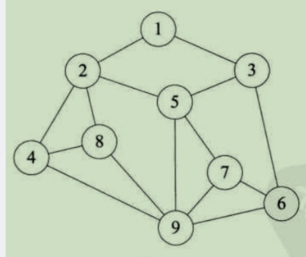

 

> 对比线性表与树：
>
> [数据结构——线性表&树&图的【数据元素名称-有无结点-内部之间的关系】的区别_数据结构中有结点和没有结点区别-CSDN博客](https://blog.csdn.net/liu17234050/article/details/104256952)


## 五种图的类别

### 无向图

若顶点 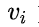到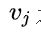之间的边**没有方向**，则称这条边为 **无向边（Edge）**

用无序偶对 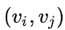来**表示**

如果图中任意**两个顶点**之间的边都是无向边，则称该图为**无向图**

无向图顶点的边数叫做 **度**

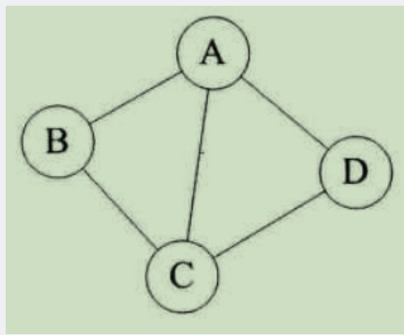

如上图记为表达式G(V, E)，则：

由于无向图是无方向的，连接顶点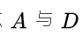的边

可以表示成无序对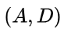

也可以写成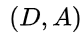

对于上图中的无向图 来说


其中**顶点集合**

**边集合**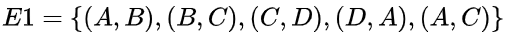


### 有向图

- 定义

  若从顶点  到  的边**有方向**，则称这条边为 **有向边**，也称为 **弧（Arc）**

  用有序偶 来**表示**，称为**弧尾**（Tail），称为**弧头**（Head）

  如果图中**任意两个顶点之间的边都是有向边**，则称该图为 **有向图（Directed graphs）**

  有向图顶点分为 **入度（箭头朝自己）** 和 **出度（箭头朝外）**

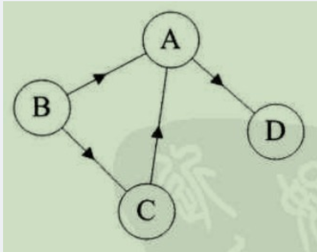

假如上图表达式为G(V, E)则：

连接到顶点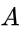到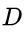的有向边就是**弧**

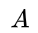是**弧尾**

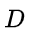 是**弧头**

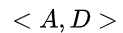**表示弧**，注意**不能写成**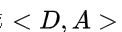

对于上图的有向图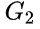


其中**顶点集合** 

**弧集合** 


> **注**：看清楚了，**无向边**用小括号**表示**
>
> 而**有向边**则是使用尖括号**表示**


### 简单图

- 定义：在图中，若**不存在顶点到其自身的边**，**且同一条边不重复出现**，则称这样的图为简单图


### 无向完全图

- 定义：在无向图中，如果**任意两个顶点之间都存在边**，则称该图为 **无向完全图**


### 有向完全图

- 定义：在有向图中，如果**任意两个顶点之间**都存在 **方向互为相反** 的**两条弧**，则称该图为 **有向完全图**


## 权

有些图的边或弧具有与它相关的数字，这种 与图的边或弧相关的数叫做**权**（Weight）

这些权可以表示从一个顶点到另一个顶点的距离或耗费

这种**带权的图**通常称为**网**（Network）


​    上图就是一张带权的图
    即标识中国四大城市的直线距离的网
    此图中的权就是两地的距离

 

图结构中，路径的长度是路径上的边或弧的数据
第一个顶点到最后一个顶点相同的路径称为 **回环** 或 **环**（Cycle）
序列中顶点不重复出现的路径称为 **简单路径**


## 环

除了第一个顶点和最后一个顶点之外
其余顶点不重复出现的回路，称为 **简单回路** 或 **简单环**


如图所示两个图粗线都构成环
    左侧的环只有第一个顶点和最后一个顶点都是 B
    其余顶点没有重复出现，因此其是一个简单环

而右侧的环，由于顶点 C 的重复，因此它就不是简单环了


## 连通 生成树 有向图 森林

A: **连通**
    图中顶点间存在 路径，两顶点存在路径则说明是 连通 的


B:**简单路径**
    如果路径最终回到起始点则成为 环，当中不重复叫 简单路径


C:**强连通图**
    若任意两顶点都是连通的，则图就是 连通图，有向则称为 强连通图


D: **强连通分量**
    图中有子图，若子图极大连通则就是 连通分量，有向的则称为 强连通分量


E:**生成树**
    无向图中连通且n个顶点n-1条边叫 生成树


F:**有向树**
    有向图中一顶点入度为0
    其余顶点入度为1的叫 有向树


G:**森林**
    一个有向图由若干棵有向树构成生成 森林


## 图的两种遍历

图的遍历和树的遍历**类似**

我们希望 **从图中某一顶点触发，遍历图中其余顶点**

**且使每一个顶点仅被访问一次，这一过程就叫做图的遍历（Traversing Graph）**

> 可参考https://www.cnblogs.com/nr-zhang/p/11236369.html

### 深度优先搜索

称为 **深度优先搜索**，简称 **DFS**

二叉树的前序、中序、后序遍历，本质上也**可以认为**是深度优先遍历，深度优先搜索**是先序遍历的推广**

- 思想：

  **A：**首先以一个**未被**访问过的顶点作为**起始顶点**

  **沿当**前顶点的**边走**到**未访问过的顶点**

  **B：**当没有未访问过的顶点时则回到上一个顶点

  **继续试探**别的顶点，**直**至所有的顶点**都被访问过**

- 例子：


A:1.从v = 顶点1开始出发，先访问顶点1 

B:2.按深度优先搜索递归访问v的某个未被访问的邻接点2

C:顶点2结束后，应该访问3或5中的某一个

D:这里为顶点3，此时顶点3不再有出度，因此回溯到顶点2

E:再访问顶点2的另一个邻接点5，由于顶点5的唯一一条边的弧头为3，已经访问了

F:所以此时继续回溯到顶点1，找顶点1的其他邻接点。


需要**注意**的是：

- 对于连通图

  **A:**它从图中**某个顶点** 触发，访问此顶点

  **B**:然后**从  的**未被访问**的**邻接点出发**深度优先遍历图

  **C:**直至**图中所有和 有路径**相通**的顶点**都被访问到**

- 对于非连通图

  只需要对它的**连通分量**分别进行深度优先遍历

  **A:**即在**先前一个**顶点**进行一次**深度优先遍历后

  **B:**若图中**尚未有**顶点**未被访问**

  则另选图中一个**未曾被访问的顶点****作为起始点**

  **C:重复**上述过程，**直至**图中**所有顶点**都被**访问到为止**


### 广度优先搜索

又称为 **广度优先搜索**，简称 **BFS**

广度优先遍历(Depth First Search)的主要思想是：类似于树的层序遍历

- 思想

  A:广度优先搜索是按层来处理顶点

  B:距离开始点最近的那些顶点首先被访问

  C:而最远的那些顶点则最后被访问

- 例子：

用一副图来表达这个流程如下：


A:初始状态，从顶点1开始，队列={1} 


B:访问1的邻接顶点，1出队变黑，2,3入队，队列={2,3,} 


C:访问2的邻接顶点，2出队，4入队，队列={3,4} 


D:访问3的邻接顶点，3出队，队列={4} 


E:5.访问4的邻接顶点，4出队，队列={ 空} 

从顶点1开始进行广度优先搜索： 

     初始状态，从顶点1开始，队列={1} 
  访问1的邻接顶点，1出队变黑，2,3入队，队列={2,3,} 
  访问2的邻接顶点，2出队，4入队，队列={3,4} 
  访问3的邻接顶点，3出队，队列={4} 
  访问4的邻接顶点，4出队，队列={ 空} 
  顶点5对于1来说不可达

- 注意：与DFS一样，如果图中存在多个连通分量则需要分别遍历


### 异同

1.同
深度优先遍历与广度优先遍历算法在**时间复杂度上是一样的**

2.异
不同之处仅仅在于**对顶点访问的顺序不同**

A:深度优先
更适合目标比较明确，以**找到目标为主要目的的情况**

B:而广度优
先更适合在不断扩大遍历范围时**找到相对最优解的情况**


## 最小生成树两种算法

### 最小生成树

- 定义

把**构造连通网**的**最小代价**生成树**称为 **最小生成树

 成本最小

**就是**n**个顶点**，**用**n-1**条边把一个连通图连接起来**，**并且使权值的和最小**

例子：


如图假设

表示9个村庄，现在需要在这9个村庄假设通信网络

村庄之间的数字代表村庄之间的直线距离，求用最小成本完成这9个村庄的通信网络建设

- 分析：

这幅图只一个**带权值的图，即网结构**

如果**无向连通图**是一个**网图**

那么它的所有生成树中**必有一颗**是**边的权值总和最小的生成树**，即**最小生成树**

**找**连通网的最小生成树**，经典的算法有两种：普里姆（Prim）算法** 和 **克鲁斯卡尔（Kruskal）算法**


### 普利姆Prim算法

- 定义：

  **A:**图论中的一种算法

  **B:**可在**加权连通图**里搜索最小生成树

  意即由此算法搜索到的边子集所构成的树中

  **C:****不但**包括了连通图里的**全部顶点**（英语：Vertex (graph theory)）

  **D:****且**其全部边的**权值之和亦为最小**

- 描述：

  A:输入：一个加权连通图。当中顶点集合为V，边集合为E；

  B:初始化：
  Vnew = {x}，当中x为集合V中的任一节点（起始点），Enew = {},为空；

  C:反复下列操作，直到Vnew = V：
         a.在集合E中选取权值最小的边<u, v>，当中u为集合Vnew中的元素

  ​       而v不在Vnew集合当中。而且v∈V
       （如果存在有多条满足前述条件即具有同样权值的边，则可随意选取

  ​       当中之中的一个）；b.将v增加集合Vnew中，将<u, v>边增加

  ​        集合Enew  中。

  D:输出：使用集合Vnew和Enew来描写叙述所得到的最小生成树。
  ​

- 算法步骤：


| 图例                                                         | 说明                                               | 不可选 | 可选 | 已选（Vnew） |
| ------------------------------------------------------------ | -------------------------------------------------- | ------ | ---- | ------------ |
|  | 此为原始的加权连通图。每条边一側的数字代表其权值。 | -      | -    | -            |
|  | 顶点**D**被随意选为起始点。顶点**A**、**B**、**E**和**F**通过单条边与**D**相连。**A**是距离**D**近期的顶点。因此将**A**及对应边**AD**以高亮表示。 | C, G | A, B, E, F | D    |
|  | 下一个顶点为距离**D**或**A**近期的顶点。**B**距**D**为9，距**A**为7。**E**为15。**F**为6。因此，**F**距**D**或**A**近期，因此将顶点**F**与对应边**DF**以高亮表示。 | C, G | B, E, F | A, D |
|  | 算法继续反复上面的步骤。距离**A**为7的顶点**B**被高亮表示。 | C | B, E, G | A, D, F |
|  | 在当前情况下，能够在**C**、**E**与**G**间进行选择。**C**距**B**为8，**E**距**B**为7，**G**距**F**为11。**E**近期。因此将顶点**E**与对应边**BE**高亮表示。 | 无 | C, E, G | A, D, F, B |
|  | 这里。可供选择的顶点仅仅有**C**和**G**。**C**距**E**为5。**G**距**E**为9，故选取**C**，并与边**EC**一同高亮表示。 | 无 | C, G | A, D, F, B, E |
|  | 顶点**G**是唯一剩下的顶点，它距**F**为11，距**E**为9，**E**近期。故高亮表示**G**及对应边**EG**。 | 无 | G | A, D, F, B, E, C |
|  | 如今，全部顶点均已被选取，图中绿色部分即为连通图的最小生成树。在此例中，最小生成树的权值之和为39。 | 无 | 无 | A, D, F, B, E, C, G |


> 时间复杂度：
>
> 根据图的数据结构而不同（记顶点数为v，边数为e）：
>
> - 邻接矩阵：O(v^2)
> - 邻接表：O(e log v)以2为底数


### 克鲁斯卡尔Kruskal算法

与Prim选点的思想不同的是，克鲁斯卡尔算法的思想在于**选边**

- 描述：

  A:记Graph中有v个顶点，e个边

  B:新建图Graphnew
  Graphnew中拥有原图中同样的e个顶点，但没有边

  C:将原图Graph中全部e个边**按权值从小到大排序**

  D:循环：从权值最小的边开始遍历每条边 直至图Graph中全部的节点都在同一个连通分量中（if 这条边连接的两个节点于图Graphnew中不在同一个连通分量中，增加这条边到图Graphnew中）

  ​

- 步骤：

  首先第一步。我们有一张图Graph，有若干点和边 


将全部的边的长度排序，用排序的结果作为我们选择边的根据。

这里再次体现了贪心算法的思想。资源排序，对局部最优的资源进行选择，排序完毕后。我们领先选择了边AD。这样我们的图就变成了下图


在剩下的边中寻找。我们找到了CE。

这里边的权重也是5


​	依次类推我们找到了6,7,7，即DF。AB，BE。


继续选择， BC或者EF虽然如今长度为8的边是最小的未选择的边。可是如今他们已经连通了（对于BC能够通过CE,EB来连接，相似的EF能够通过EB,BA,AD,DF来接连）。所以不须要选择他们。

相似的BD也已经连通了（这里上图的连通线用红色表示了）。

最后就剩下EG和FG了。当然我们选择了EG。

最后成功的图


> 时间复杂度：
>
> elog2e 
>
> e为图中的**边数**


### 对比

假设网中有n个**节点**和e**条边**

**普利姆算法**的时间复杂度是**O(n^2)**

**克鲁斯卡尔算法**的时间复杂度是**O(eloge)**

可以看出**前者**与网中的边数**无关**

而**后者****相反**

**因此**

**普利姆算法适用于边稠密的网络**

**克鲁斯卡尔算法适用于求解边稀疏的网**


## 最短路径两种算法

什么是最短路径：

在网图和非网图中，最短路径的含义是不同的。由于非网图没有边上的权值，所谓最短路径，其实指的就是两个顶点之间经过的边数最少的路径（即可以理解为把每一条边的权值看作是1）。

对于网图来说，所谓最短路径，就是指两顶点之间经过的边上的权值之和最少的路径，并且我们称路径上的第一个顶点是源点，最后一个顶点是终点

求带权有向图G的最短路径问题一般可分为两类：一是单源最短路径，即求图中某一个顶点到其它顶点的最短路径，可以通过经典的 Dijkstra（迪杰斯特拉）算法求解

二是求每对顶点间的最短路径，可通过[Floyd](https://so.csdn.net/so/search?q=Floyd&spm=1001.2101.3001.7020)（弗洛伊德）算法来求解

### Floyd弗洛伊德算法

- 算法流程：

1、初始化矩阵，将所有相邻的节点对应的权值写入矩阵，不相邻的节点对应的权值初始化为inf，如下面的例子所示：


   2、初始化结束后，开始进行**三重循环**，每层循环从第一个节点开始遍历，直至遍历到第n个节点，设**最外层循环**当前节点为i，**中间层循环**的当前节点为j，**内层循环**的当前节点为k，且**i≠j≠k**。则**以节点i为中介点，以节点j为起点，节点k为目标点**，判断由起点j经由中介点i到达目标点k的代价值是否小于由起点j直接到目标点k的代价值，若小于，则将从起点j到目标点k的代价值d\[j][k]更新为d\[j][i]+d\[i][k]（即d\[j][k]=min(d\[j][k],d\[j][i]+d\[i][k] )）。三重循环结束后，路径规划结束。

下面是一个具体例子：

 ① 以A为中介点，分别更新B/C/D/E/F/G经中介点A到其他节点的累积权值


② 以B为中介点，分别更新A/C/D/E/F/G经中介点B到其他节点的累积权值


③ 以C为中介点，分别更新A/B/D/E/F/G经中介点C到其他节点的累积权值


④ 以D为中介点，分别更新A/B/C/E/F/G经中介点D到其他节点的累积权值


⑤ 以E为中介点，分别更新A/B/C/D/F/G经中介点E到其他节点的累积权值

⑥ 以F为中介点，分别更新A/B/C/D/E/G经中介点A到其他节点的累积权值


⑦ 以G为中介点，分别更新A/B/C/D/E/F经中介点G到其他节点的累积权值


​	

​	3、此时遍历结束，我们得到的矩阵便记录了图中各个点之间的最短路径值

定义一个**矩阵P用来记录最短路径的具体路径怎么走**，P\[i][j]表示从Vi到Vj需要经过的点，初始化P\[i][j]=j。把各个顶点插入图中，比较插点后的距离与原来的距离，D\[i][j] = min( D\[i][j], D\[i][k]+D\[k][j] )，如果D\[i][j]的值变小，则P\[i][j]=k。在D中包含有两点之间最短道路的信息，而在P中则包含了最短通路径的信息。

   比如，要寻找从V5到V1的路径。根据P，假如P(5,1)=3则说明从V5到V1经过V3，路径为{V5,V3,V1}，如果P(5,3)=3，说明V5与V3直接相连，如果P(3,1)=1，说明V3与V1直接相连。

   进一步来说，假设从1到4的最短路径为1→2→3→4，则以P（1，4）开始在P中查询，P（1,4）里面记录的是当前点（也就是1点）的下一个路径点，即P（1,4）=2，则进一步查询P（2,4）的值，即为3，则进一步查询P（3,4），即为4，也就是我们需要的终点，终止查询，找到最短路径1→2→3→4。


### Dijkstra迪杰斯特拉算法

注意：该算法只适用于**非负权重**有向图/无向图


