# 国考

**官方公告**：一般在报名前一天发布，例如2024年国考官方公告于`2023-10-14`发布（==官方公告要仔细阅读！==[2024国考官方公告](http://bm.scs.gov.cn/pp/gkweb/core/web/ui/business/article/articledetail.html?ArticleId=8a81f6d18b137024018b2829eddc0254&id=0000000062b7b2b60162bccd55ec0006&eid=0000000062b7b2b60162bccdd5860007)）

**报名时间**：考生可于`10月15日8:00至10月24日18:00`期间登录“中央机关及其直属机构2024年度考试录用公务员专题网站”（http://bm.scs.gov.cn/kl2024）进行网上报名

**资格审查**：如2024国考官方会在`2023年10月15日8:00至10月26日18:00`期间对报考申请进行审查，确认报考者是否具有报考资格。报考者可登录专题网站查询资格审查结果。**通过资格审查的，不能再报考其他职位**。如**在报名时间内报考申请未审查或者未通过资格审查的，可以改报其他职位**。

**查询报名序号**：2024国考通过资格审查的报考者，可于`2023年10月28日8:00`后登录专题网站查询报名序号（报名序号用于报名确认与准考证下载打印）

**报名确认与准考证打印**：一般官方公告在**报名结束第二天**即发布，如2024国考于`2023-10-25`发布相关信息[链接](http://bm.scs.gov.cn/pp/gkweb/core/web/ui/business/article/articledetail.html?ArticleId=8a81f6d18b484669018b65cce11675bd&id=0000000062b7b2b60162bccd55ec0006&eid=0000000062b7b2b60162bcce3de20008)，其中**报名确认时间**为`2023年11月1日0:00至11月6日24:00`，准考证打印时间为考试前一周`2023年11月20日0:00至11月26日15:00`

**笔试时间**：一般为**11月下旬**，如2024国考为`2023-11-26`

笔试成绩公布：一般为1月中旬公布，如2024国考是`2024-01-14`公布成绩[查询地址这里](http://bm.scs.gov.cn/pp/gkweb/core/web/ui/business/home/gkhome.html)

查询进面：需要在笔试成绩公布后查看如下文件中情况

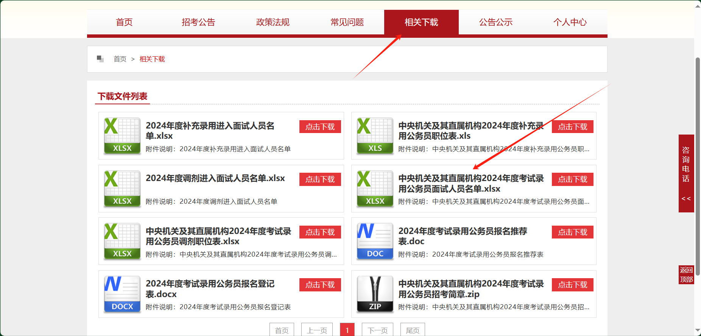

进面查看面试安排：需要关注所报职位的机关公告

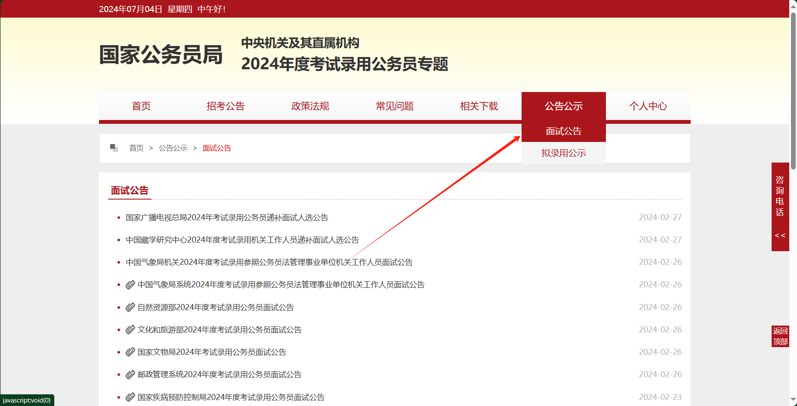

## 报考指南

[2024国考报考指南](http://bm.scs.gov.cn/pp/gkweb/core/web/ui/business/article/articledetail.html?ArticleId=8a81f6d18b137024018b282f6f100260&id=0000000062b7b2b60162bccd55ec0006&eid=0000000062b7b2b60162bccdd5860007)

- 对于**艰苦边远地区基层职位**，通过降低进入门槛等倾斜政策录用的人员，应当在所报考市（地、州、盟）辖区内的艰苦边远县乡机关最低服务**5年**（含试用期）

-  **报考者在报名参加中央机关及其直属机构公务员招考过程中，被地方机关录用为公务员或者参照公务员法管理的机关（单位）工作人员，应当如何处理？**

  答：报考者在参加中央机关及其直属机构公务员招考过程中，被地方机关录用为公务员或者参照公务员法管理的机关（单位）工作人员的，应当如实报告情况，并终止参加中央机关及其直属机构公务员招考的行为，招录机关不再将其列为面试、体检、考察、公示或者备案人选。

- 资格审查工作有谁负责？

  答：资格审查工作由招录机关负责。**报名期间**，招录机关对报考申请进行集中审查，确认报考者是否具有报考资格，一般应当在报考者报名次日起2日内提出审查意见。

- **如何选择考试地点？**

  答：笔试在全国各直辖市、省会城市、自治区首府和部分较大城市设置考点。其中，对于8个非通用语职位、金融监管总局及其派出机构职位、中国证监会及其派出机构职位和公安机关人民警察职位的报考者，将统一安排在直辖市、省会城市和自治区首府参加考试。

- **什么时间进行面试？**

  答：面试具体时间由招录机关确定，**一般在2024年3月底前进行**。面试内容和方式结合招考职位的工作内容、工作性质和工作特点确定。面试时间、地点等事项，报考者可登录专题网站或者招录机关网站查询面试公告，也可直接向招录机关咨询。

- **报考人民警察职位，需要参加体能测评吗？**

  答：公安机关人民警察职位对报考者进行体能测评。体能测评项目和标准按照《公安机关录用人民警察体能测评项目和标准（暂行）》执行。国家安全机关、监狱、强制隔离戒毒管理机关的人民警察和人民法院、人民检察院的司法警察职位需对报考者进行体能测评的，参照《公安机关录用人民警察体能测评项目和标准（暂行）》执行。体能测评不合格的，不得确定为拟录用人员。

- 体能测评合格即可？

  是的，合格即可进入面试，不会计入总成绩

- 对于特殊岗位可能需要视力要求

## 考试流程

### 笔试

#### 大纲

[2024国考大纲](http://bm.scs.gov.cn/pp/gkweb/core/web/ui/business/article/articledetail.html?ArticleId=8a81f6d08b136fb3018b285a0cd00261&id=0000000062b7b2b60162bccd55ec0006&eid=0000000062b7b2b60162bccdd5860007)

中央机关及其直属机构2024年度考试录用公务员公共科目笔试分为行政职业能力测验和申论两科，全部采用闭卷考试的方式。其中，**行政职业能力测验**为客观性试题，**考试时限120分钟，满分100分**。**申论**为主观性试题，**考试时限180分钟，满分100分**。

- 行测：

  - **常识判断**。主要测查报考者在政治、经济、文化、科技等方面应知应会的基本知识以及运用这些知识进行分析判断的基本能力（**单选题**）
  - **言语理解与表达**。主要测查报考者运用语言文字进行思考和交流、迅速准确地理解和把握文字材料内涵的能力。包括根据材料查找主要信息及重要细节；正确理解阅读材料中指定词语、语句的含义；概括归纳阅读材料的中心、主旨；判断新组成的语句与阅读材料原意是否一致；根据上下文内容合理推断阅读材料中的隐含信息；判断作者的态度、意图、倾向、目的；准确、得体地遣词用字等。
  - **数量关系**。主要测查报考者理解、把握事物间量化关系和解决数量关系问题的能力，主要涉及数据关系的分析、推理、判断、运算等。常用题型有**数字推理和数学运算**两种。
    - **数字推理：**每道题给出一个数列，但其中缺少一项，要求报考者仔细观察这个数列各数字之间的关系，找出其中的排列规律，然后从四个供选择的答案中选出最合适、最合理的一个来填补空缺项，使之符合原数列的排列规律。
    - **数学运算：**每道题给出一个算术式子或者表达数量关系的一段文字，要求报考者熟练运用加、减、乘、除等基本运算法则，并利用其他基本数学知识计算或推出结果。
  - **判断推理**。主要测查报考者对各种事物关系的分析推理能力，主要涉及对图形、语词概念、事物关系和文字材料的理解、比较、组合、演绎和归纳等。常用题型有**图形推理、定义判断、类比推理、逻辑判断四种**。
    - **图形推理：**每道题给出一套或两套图形，要求报考者通过观察分析找出图形排列的规律，选出符合规律的一项。
    - **定义判断：**每道题先对相关概念进行定义，然后分别列出四种情况，要求报考者严格依据定义选出一个最符合或最不符合该定义的答案。
    - **类比推理：**给出一组相关的词，要求通过观察分析，在备选答案中找出一组与之在逻辑关系上最为贴近或相似的词。
    - **逻辑判断：**每道题给出一段陈述，这段陈述被假设是正确的，不容置疑的。要求报考者根据这段陈述，运用一定的逻辑推论，选择一个最恰当的答案。
  - **资料分析**。主要测查报考者对文字、数字、图表等统计性资料的综合理解与分析加工能力。

- 申论（按照3类职位分别命题）：

  - 中央机关及其省级直属机构综合管理类

    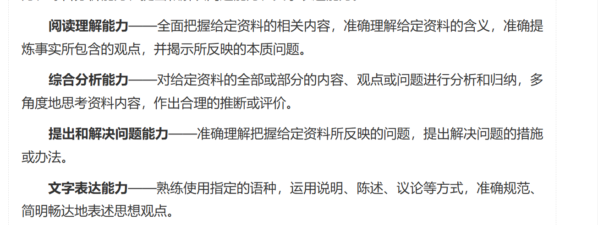

  - 市（地）级及以下直属机构综合管理类职位

    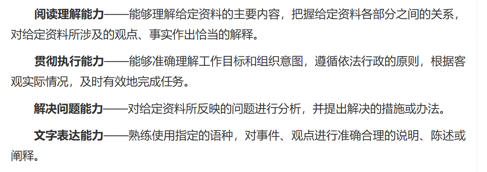

  - 行政执法类职位

    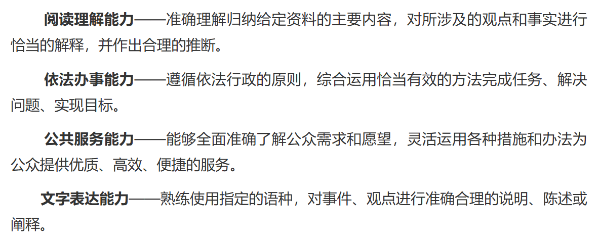

#### 考情分析

[参考自](https://www.bilibili.com/read/cv27070542/#:~:text=%E5%B8%B8%E8%AF%86%E5%88%A4%E6%96%AD20%E9%A2%98%EF%BC%9B%20%E8%A8%80%E8%AF%AD%E7%90%86%E8%A7%A340%E9%A2%98%EF%BC%8C%E5%8C%85%E6%8B%AC20%E9%A2%98%E9%80%BB%E8%BE%91%E5%A1%AB%E7%A9%BA%E5%92%8C20%E9%A2%98%E6%96%87%E6%AE%B5%E9%98%85%E8%AF%BB%EF%BC%9B,%E6%95%B0%E9%87%8F%E5%85%B3%E7%B3%BB10%E9%A2%98%EF%BC%9B%20%E5%88%A4%E6%96%AD%E6%8E%A8%E7%90%8640%E9%A2%98%EF%BC%8C%E5%8C%85%E6%8B%AC10%E9%A2%98%E5%9B%BE%E5%BD%A2%E6%8E%A8%E7%90%86%E3%80%8110%E9%A2%98%E5%AE%9A%E4%B9%89%E5%88%A4%E6%96%AD%E3%80%8110%E9%A2%98%E7%B1%BB%E6%AF%94%E6%8E%A8%E7%90%86%E4%BB%A5%E5%8F%8A10%E9%A2%98%E9%80%BB%E8%BE%91%E5%88%A4%E6%96%AD%E9%A2%98%EF%BC%9B%20%E8%B5%84%E6%96%99%E5%88%86%E6%9E%9020%E9%A2%98%EF%BC%8C%E5%8C%85%E6%8B%AC4%E5%A5%97%E6%9D%90%E6%96%99%EF%BC%8C%E6%AF%8F%E5%A5%97%E6%9D%90%E6%96%99%E5%90%84%E6%9C%895%E9%A2%98%E3%80%82)

根据职位机构层次的不同，题目数量及分布也不同

各个模块的分值可以参考[国考行测分值分布表汇总 (huatu.com)](https://ah.huatu.com/guojia/zt/xcfz/)

==注意==：每年行测分值会根据其题目数量及难度进行调整

- 行测（副省级）
  - 共135题（国考行测是2小时）
    - 常识判断20题
    - 言语理解40题
      - 15题逻辑填空和25题文段阅读，注意25题文段阅读存在1段材料后面跟着若干道题目的类型
    - 数量关系15题
    - 判断推理40题，包括10题图形推理、10题定义判断、10题类比推理以及10题逻辑判断题
    - 资料分析20题，包括4套材料，每套材料各有5题
- 行测（地市级）
  - 共130题
    - 常识判断20题
    - 言语理解40题，包括20题逻辑填空20题文段阅读
    - 数量关系10题
    - 判断推理40题，包括10题图形推理、10题定义判断、10题类比推理以及10题逻辑判断题
    - 资料分析20题，包括4套材料，每套材料各有5题
- 申论：
  - 考试时间180分钟，分值100分，5道题
  - 22年开始分为三套卷：执法类、地市级、副省级
  - 对于申论而言：一般三套卷 题型一致

> 常识：
>
> 
>
> 言语：
>
> 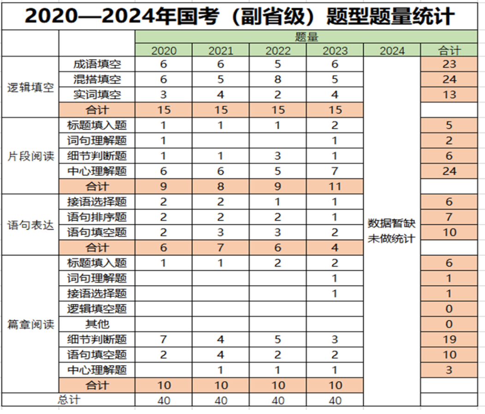
>
> 
>
> 
>
> 判断：
>
> 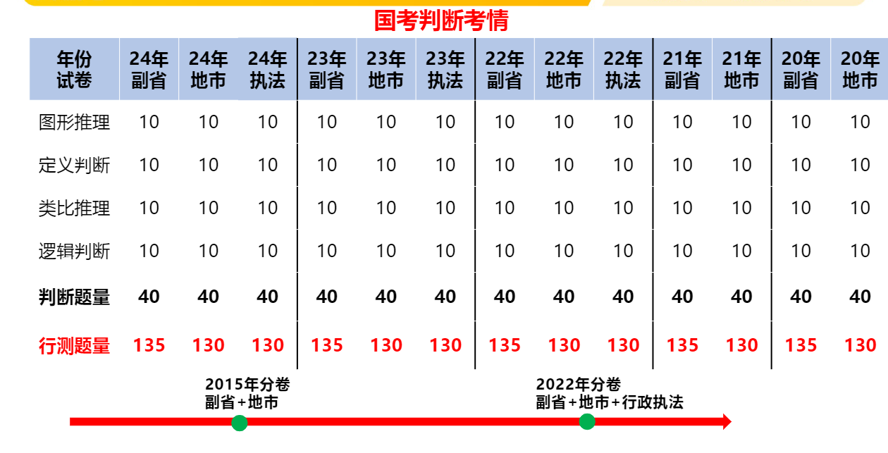
>
> 数量关系与资料分析：
>
> 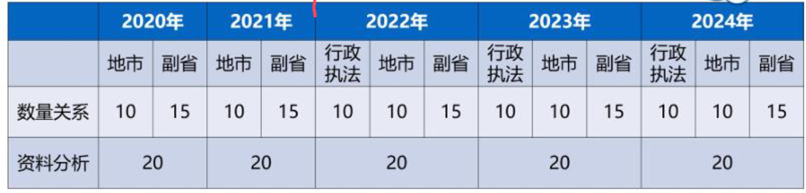
>
> 申论：
>
> 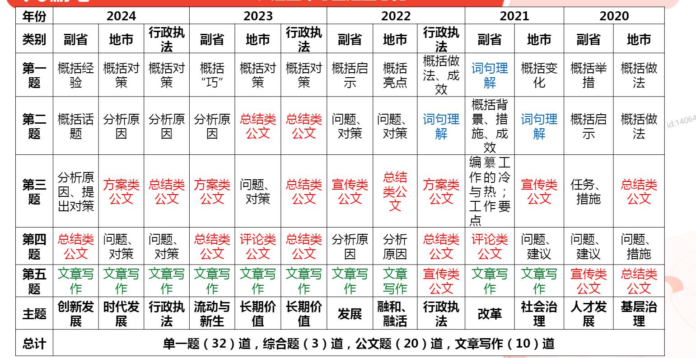

#### 内容

笔试包括公共科目和专业科目

公共科目笔试试卷分为3类，分别适用于：

1. 中央机关及其省级直属机构综合管理类职位
2. 市（地）级及以下直属机构综合管理类职位
3. 行政执法类职位

所有报考者均需参加公共科目笔试。

金融监管总局及其派出机构职位、中国证监会及其派出机构职位，以及公安机关人民警察职位的报考者，还需参加**统一组织的专业科目笔试**，考试大纲可在专题网站和金融监管总局、中国证监会、公安部网站查询

- 笔试
  - 公共科目	
    - 行测（客观题，满分100）
    - 申论（主观题，满分100）
  - 专业科目（非特殊职位无需）

#### 时间地点

以2024国考为例：

公共科目笔试时间为：

2023年11月26日上午  9:00—11:00   行政职业能力测验

2023年11月26日下午  14:00—17:00   申论

专业科目笔试时间为(8个非通用语职位外语水平测试，金融监管总局及其派出机构职位、中国证监会及其派出机构职位以及公安机关人民警察职位)：

2023年11月25日下午  14:00—16:00

**笔试在全国各直辖市、省会城市、自治区首府和部分较大城市设置考点**。报考者按照**准考证上确定的时间和地点**，携带**准考证和报名时使用的身份证件**等参加考试。

金融监管总局及其派出机构职位、中国证监会及其派出机构职位、公安机关人民警察职位以及8个非通用语职位的报考者在网上报名时，务必将考点选择为直辖市、省会城市或者自治区首府。

> 成绩组成：
>
> 一般非特殊职位：笔试成绩按照行测申论各占50%组成
>
> 公安机关人民警察职位：笔试成绩按照行测、申论、专业科目笔试成绩分别占40%、30%、30%的比例合成
>
> 金融监管总局及其派出机构职位和中国证监会及其派出机构职位：笔试成绩按照行测、申论、专业科目笔试成绩分别占25%、25%、50%的比例合成
>
> 8个非通用语职位：笔试成绩按照行测、申论、外语水平测试成绩分别占25%、25%、50%的比例合成

### 面试

根据《招考简章》中规定的面试人数与计划录用人数的比例，按照笔试成绩从高到低的顺序确定各职位进入面试的人选，并在专题网站上公布

**招录机关**负责面试实施，时间、地点等事项详见**招录机关在本部门网站和专题网站**上发布的面试公告（[这里](http://bm.scs.gov.cn/pp/gkweb/core/web/ui/business/article/articlelist.html?id=0000000062b7b2b60162bccf03930009&eid=0000000062b7b2b60162bccf480c000a)）

面试时，报考者须提供本人身份证件（本人有效居民身份证、学生证、工作证等）原件、所在学校或者单位盖章的报名推荐表、报名登记表等材料

**部分招录机关在面试阶段组织专业能力测试**，专业能力测试设置情况和测试内容、分值比重等见《招考简章》或者招录机关发布的面试公告。

面试结束后，招录机关通过**专题网站**发布报考者的面试成绩以及综合成绩。

面试满分一般为100

其中，**未组织专业能力测试的，综合成绩按照笔试、面试成绩各占50%的比例合成**；**组织专业能力测试的，综合成绩按照笔试成绩占50%、面试成绩和专业能力测试成绩共占50%的比例合成**。

#### 调剂

达到笔试合格分数线的人数与计划录用人数比例低于规定面试比例的职位，将面向社会进行调剂（例如某职位计划录用人数为3人，但达到笔试合格分数线的只有1人，此时会发生调剂）

调剂在**公共科目考试内容相同**（即指报考者应答的是同一类试卷）的职位之间进行，调剂公告、职位等通过专题网站发布。

==注意==：调剂时间很短，一般在笔试成绩公布后发现自己未进面即可准备调剂了，一般调剂职位公告与笔试成绩公布的时间是同步的，根据2024国考来看，调剂申请时间只有两天（在笔试成绩公布后的两天内）[参考2024国考调剂文档](http://bm.scs.gov.cn/pp/gkweb/core/web/ui/business/article/articledetail.html?ArticleId=8a81f6d88cf2b29e018d05ab6c780003&id=0000000062b7b2b60162bccd55ec0006&eid=0000000062b7b2b60162bccdd5860007)

调剂申请完成后，会有两天时间进行资格审查，资格审查结束即可上官网查看调剂结果了

### 体检与考察

招录机关按照综合成绩从高到低的顺序，确定进入体检和考察的人选

根据职位需要，部分招录机关将对报考者有关心理素质进行测评，测评结果作为择优确定拟录用人员的重要参考。公安机关人民警察职位，将对报考者有关体能情况进行测评，体能测评不合格的，不得确定为拟录用人员。

### 公示

体检和考察结束后，招录机关根据综合成绩、体检结果和考察情况等择优确定拟录用人员，并在本部门网站和专题网站上公示。公示内容包括招录机关名称、拟录用职位、拟录用人员姓名、性别、准考证号、毕业院校、工作单位等，同时公布举报电话，接受社会监督。公示期为5个工作日。

### 补录

招考期间出现空缺的职位或者招录机关由于新增用人需求需要及时补充人员的职位，将面向社会统一进行补充录用。补充录用公告、职位等通过专题网站发布。

参考2024国考，补录时间为2024年5月上旬

报考条件：

（一）参加了中央机关及其直属机构2024年度考试录用公务员笔试。

（二）符合拟报考职位所要求的资格条件。

（三）**公共科目笔试成绩同时达到拟报考职位和原报考职位的合格分数线，且考试类别相同**。拟报考职位设置了专业科目笔试条件的，专业科目笔试成绩还须同时达到合格分数线，且考试类别相同。

（四）在中央机关及其直属机构2024年度考试录用公务员工作中，尚未被原报考职位确定为拟录用人员。

- 流程：
  - 职位查询（一般在补录公告发布即日起即可查询）
  - 报名，时间很短，参考2024国考，报名时间只在补录公告发布后的两天内
  - 资格审查：报名结束之后有两天的资格审查
  - 查询进面结果：（资格审查结束后即可在官网的**文件下载**中查看）
  - 后续安排要看具体单位的面试安排公告：[这里](http://bm.scs.gov.cn/pp/gkweb/core/web/ui/business/article/articlelist.html?id=0000000062b7b2b60162bccf03930009&eid=0000000062b7b2b60162bccf480c000a)

# 广东省考

[通知公告_中共广东省委组织部 (gdzz.gov.cn)](https://www.gdzz.gov.cn/tzgg/index.html)

**官方公告**：一般在报名前一天发布，例如2024年广东省考官方公告于`2024-01-15 17:29:31`发布（==官方公告要仔细阅读！==）

**报名时间**：一般为每年1月份，例如2024年广东省考则是`2024年1月16日9︰00至22日16︰00`

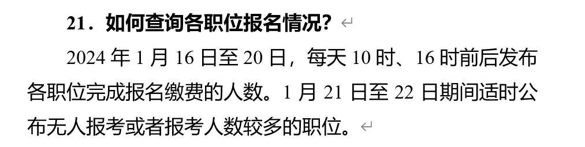

一般在报考前就要确定好**报考职位**（参考官方公共发布的附件）

报考者登录广东省公务员考试录用管理信息系统（https://ggfw.hrss.gd.gov.cn/gwyks/index.do），用本人身份证号码进行注册

**网上报名**期间，报名系统**实时**对报考者信息进行初步审核，定期公布各职位报考人数信息。报考者未缴费确认前可更改**报考职位**，缴费确认后不能再改报其他职位。

未按期**缴费确认**的报考者视为自动放弃考试资格

**考试确定**：如2024广东省考已完成报名缴费的报考者，需于`2024年2月23日9︰00至26日16︰00`期间，登录报名系统确认是否参加笔试。确认参加的，需签署考试承诺书；确认放弃的，将按原缴费渠道全额退返考试费用

**下载并打印准考证**：如2024广东省考参加笔试的报考者，请于`2024年3月11日9︰00`后在报名系统自行下载并打印准考证

一般**笔试时间**也在==3月==，如2024广东省考为`2024年3月16日 下午`

**是否入围面试查询**：

需要关注广东省省考官网的面试公告，时间并不固定，并且省考也不公布各个岗位进面最低分数线

| 2024 | 24.5.10 |
| ---- | ------- |
| 2023 | 23.4.11 |
| 2022 | 22.6.17 |

面试公告发布后，便可以到**自己所报考的岗位所在地区的公务员网站**查询是否进面

一般搜索`${对应城市名}公务员`即可，例如报考广州市公务员岗位，搜索`广州市公务员`即可看到 广州市人力资源和社会保障局 ，查看对应公告即可

**面试结束总成绩查询**：面试结束后在考试总成绩合格的考生中按高分到低分的顺序确定进入体检和考察人选，名单在广东省公务员考试录用管理信息系统（https://ggfw.hrss.gd.gov.cn/gwyks/index.do）公布。

## 报考指南

参考自2024广东省考报考指南

- **体能测评有哪些规定？**

  报考公安机关、监狱戒毒管理机关人民警察和法检两院司法警察职位的报考者，须进行体能测评，不合格者不能进入面试。体能测评按照《关于印发公安机关录用人民警察体能测评项目和标准（暂行）的通知》（人社部发〔2011〕48号）执行，测评项目为10米×4往返跑，男子1000米跑、女子800米跑，纵跳摸高。其中：男子1000米跑、女子800米跑测评次数仅为1次；10米×4往返跑测评次数不超过2次；纵跳摸高测评次数不超过3次。各项目有1次测评达标的，即视为该项目测评合格。测评结果得出后均不进行复测或补测。其中一项不达标的，视为体能测评不合格。不合格者不能进入面试。

- 体能测评合格即可？

  是的，合格即可进入面试，不会计入总成绩

  ​

  ​

## 考试流程

### 笔试

#### 大纲

考试科目包含《行政职业能力测验》《申论》两科。《行政职业能力测验》科目考试时限90分钟，满分100分。《申论》科目分为4类，考试时限150分钟，满分100分。（注意与国考时间都不同，国考行测是120分钟，申论是180分钟）

其中，《申论一》适用于**省、市级综合管理类**（不含公安、法院、检察院、监狱戒毒管理机关）职位；《申论二》适用于**县、镇级综合管理类职位以及公安**（不含执法勤务）、法院、检察院和监狱戒毒管理机关职位；《行政执法专业和申论》适用于**行政执法类**职位；《公安专业和申论》适用于**公安机关执法勤务**职位。所有科目均不指定考试用书。

- 行测：

  - **常识应用**：本部分试题包含**判断题、单选题和多选题**，主要测查报考者在政治、经济、文化、科技等方面应知应会的基本知识以及运用这些知识进行分析判断的基本能力。
  - **言语理解与表达**：本部分试题为**单选题**，主要测查报考者运用语言文字进行思考和交流、迅速准确地理解和把握文字材料内涵的能力。
    - **选词填空**：每道题给出一句（段）不完整的表述，要求对4个备选项进行思考、辨析，选出最合适的1项填补空缺。
    - **阅读理解**：每道题给出一段文字，这段文字后面有一个不完整的陈述，要求从4个备选项中选出最符合题干要求的1项。
  - **数量关系**：本部分试题为**单选题**，主要测查报考者理解、把握事物间量化关系和解决数量关系问题的能力，主要涉及数据关系的分析、推理、判断、运算等。
    - **数字推理：**每道题给出一组（多组）数列，但其中缺少一项（几项），要求仔细观察数列中数字之间的关系，找出其中的规律，从4个备选项中选出最合理的1项来填补空缺。
    - **数学运算：**每道题给出表达数量关系的一段资料，要求迅速、准确地计算出结果，从4个备选项中选出正确的1项。
  - **判断推理**：本部分试题为**单选题**，主要测查报考者对各种事物关系的分析推理能力，涉及对图形和文字材料的理解、比较、组合、演绎和归纳，以及运用基本科学知识作出推理判断等。
    - **图形推理：**每道题给出图形或符号，要求认真观察，根据题干要求，从4个备选项中选出最合理的1项。
    - **逻辑判断：**每道题给出一段陈述，要求仅根据这段陈述直接推理，从4个备选项中选出最合理的1项。
    - **科学推理（广东特有）：**每道题给出文字或图表信息，要求在此基础上，运用基本科学知识进行推理判断，从4个备选项中选出最合理的1项。
  - **资料分析**：本部分试题为**单选题**，主要测查报考者对文字、图形、表格等各种形式资料的综合理解与分析加工能力。

- 《申论一》

  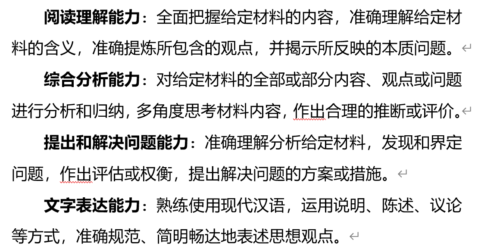

- 《申论二》

  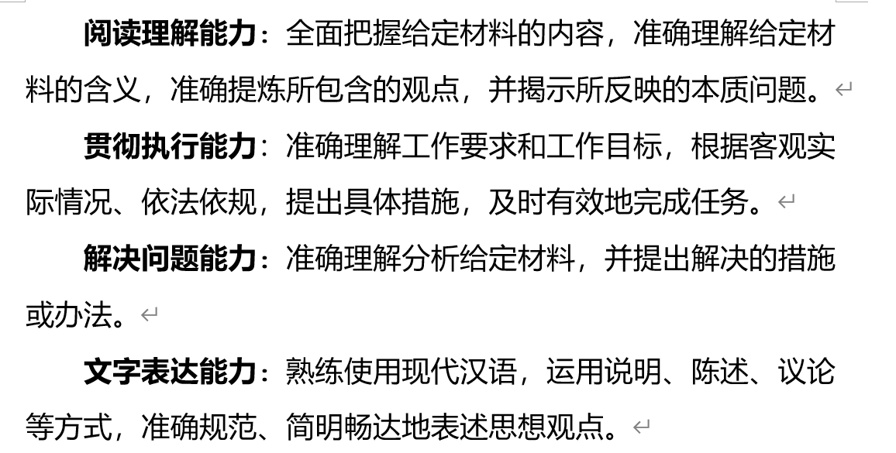

- 《行政执法专业和申论》：包含专业和申论两部分。其中专业部分为客观题，包括判断题、单选题、多选题；申论部分为主观题。

  - 专业部分题型：

    - 判断题
    - 单选题
    - **多选题：**根据给出的情境材料作出分析，按照题目要求作答，每题所设选项至少有2个正确答案，要求选出所有正确答案，**多选、少选、错选均不得分**。

  - 申论部分：

    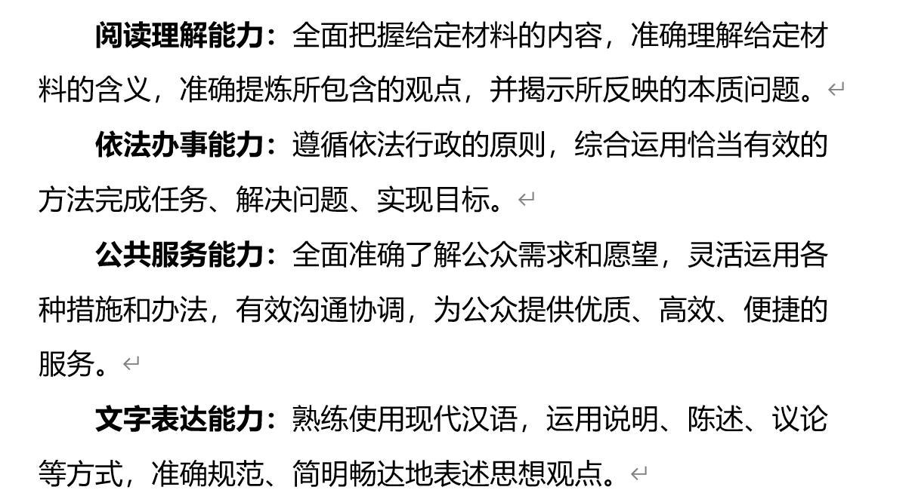

- 《公安专业和申论》

  - 专业部分题型：

    - 单选题
    - 多选题：每题所设选项中至少有两个正确答案，**多选、少选、错选或不选均不得分**。
    - 情景题**：**根据给出的情境材料做出分析，按照提问选择正确答案。

  - 申论部分：

    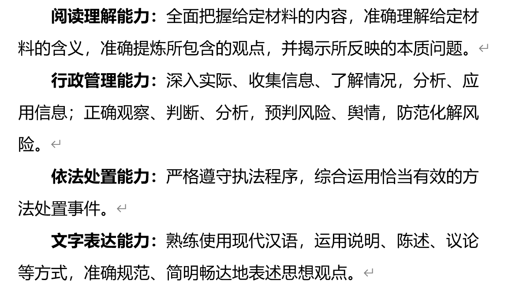

  ​

#### 考情分析

[参考自](https://www.gwy.com/gdgwy/300669.html)

分值仅参考！

| 模块                        | 题型     | 题量    | 分值/题 | 总分 |      |
| --------------------------- | -------- | ------- | ------- | ---- | ---- |
| 言语理解与表达              | 选词填空 | 10      |         |      |      |
|                             | 片段阅读 | 5       |         |      |      |
| 数量关系                    | 数字推理 | 5       |         |      |      |
|                             | 数学运算 | 10      |         |      |      |
| 判断推理                    | 图形推理 | 5       |         |      |      |
| 科学推理                    |          | 5       |         |      |      |
|                             |          | -       |         |      |      |
|                             | 逻辑判断 | 15      |         |      |      |
| 常识判断(单选多选判断各5道) |          | 15      |         |      |      |
| 资料分析                    |          | 20(4*5) |         |      |      |
| 总计                        |          | 90      | 100     |      |      |

- 申论：
  - 考试时间150分钟
  - 申论试卷分为《申论一》、《申论二》、《行政执法专业和申论》、《公安专业和申论》四类

> 常识：
>
> 
>
> 言语（2024不再分卷）：
>
> 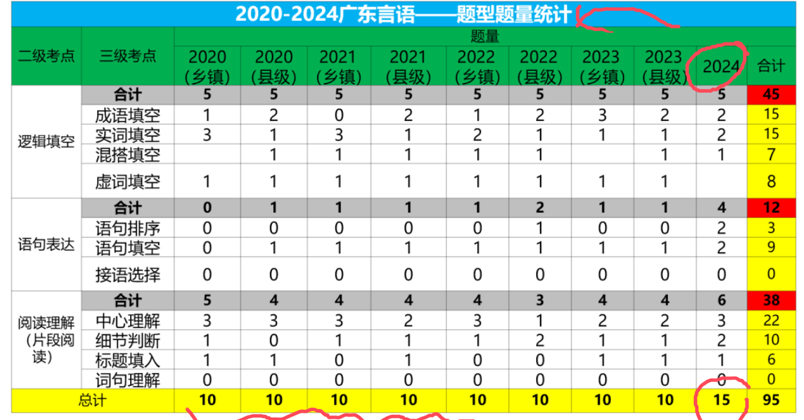
>
> 判断推理（2024不再分卷）：
>
> 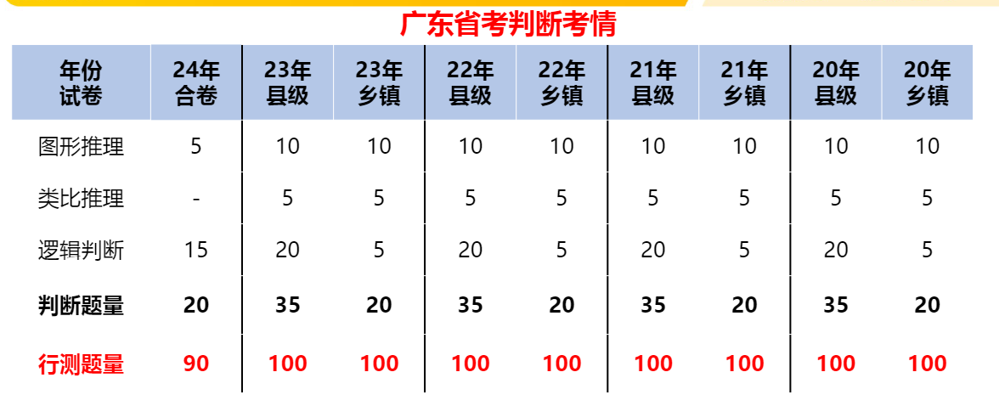
>
> 数量关系与资料关系：
>
> 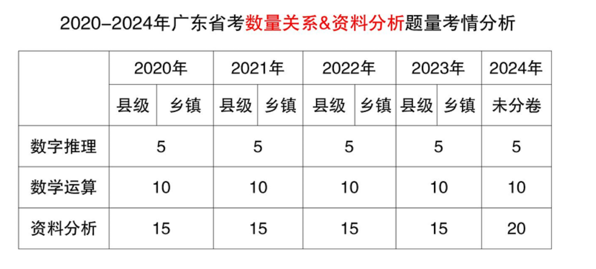
>
> 申论：
>
> 

##### 广东特色：科学推理

2024不再分卷

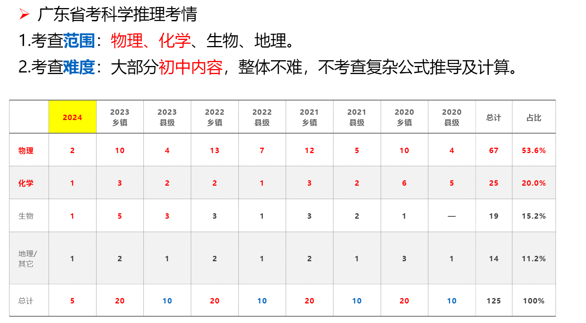

#### 内容

分为三种职位，笔试的科目并不完全相同：

- 一般职位：
  - 行测
  - 申论
- 行政执法类：
  - 行测
  - 《行政执法专业和申论》
- 公安机关执法勤务：
  - 行测
  - 《公安专业和申论》

**笔试时间**（参考2024广东省考）：

　　2024年3月16日 下午

　　2∶00—3∶30  《行政职业能力测验》

　　4∶15—6∶45  《申论》（含《行政执法专业和申论》《公安专业和申论》）

> 各种职位笔试成绩计算（保留小数点后2位）：
>
> 一般职位笔试成绩=《行政职业能力测验》成绩×50%+《申论》成绩×50%；
>
> 行政执法类职位笔试成绩=《行政职业能力测验》成绩×40%+《行政执法专业和申论》成绩×60%；
>
> 公安机关执法勤务职位笔试成绩=《行政职业能力测验》成绩×50%+《公安专业和申论》成绩×50%

成绩公布：

　笔试结束后适时公布成绩和合格分数线。报考者可凭身份证号码和准考证号码登录[广东省公务员考试录用管理系统（考生报名） (gd.gov.cn)](https://ggfw.hrss.gd.gov.cn/gwyks/index.do)查询笔试成绩。（一般广东省考成绩会在笔试结束后15~20个工作日之间公布）

### 面试

[广东省2024年考试录用公务员资格审核和面试等事项公告_中共广东省委组织部 (gdzz.gov.cn)](https://www.gdzz.gov.cn/tzgg/content/post_20699.html)

#### 资格审核

面试之前还需要进行**资格审核**，参考2024年广东省考是在`4月10日至4月23日`线上进行的

考生须在指定时间通过广东省公务员考试录用管理信息系统上传相关审核资料照片（jpg格式），上传照片需清晰、准确，以便审核。

　　需上传的资料主要包括：身份证、报名登记表（需在报名系统下载核准后签名）以及职位要求的其他资格条件证明材料等；国内2024年应届毕业生另需提供学生证。

　　资格审核的具体要求，请考生密切留意公务员主管部门或招录机关的相关公告或通知。

#### 体测

**公安、法院、检察院及监狱、戒毒系统人民警察（司法警察）职位**的报考者，通过资格审核后，还须进行体能测评。体能测评由公务员主管部门会同招录机关组织实施，具体测评时间、地点等事项另行通知。

　**公安、法院、检察院及监狱、戒毒系统人民警察（司法警察）职位**的报考者，**通过资格审核后，还须进行体能测评**。体能测评由公务员主管部门会同招录机关组织实施，具体测评时间、地点等事项另行通知。为能有效递补和按时完成体能测评，资格审核和体能测评可在报考者自愿基础上按不低于招录人数1︰4不高于1︰6的比例组织实施。通过资格审核和体能测评、排名在面试名额以外的为面试递补人员。**体能测评不组织补测，不合格者不能参加面试**。（也就是先进行资格审核->体能测评->面试）

部分招录职位（见职位表）将在面试前后对报考者进行心理素质测评，测评结果作为择优确定拟录用人员的重要参考。

查看珠海市[2024体能评测公告](https://www.zhuhai.gov.cn/zw/rsxx/gzzk/content/post_3652167.html)发现是在面试前一个月发布的信息即2024.4.9

#### 成绩计算

总成绩计算方法

　　考试总成绩＝笔试成绩×50%＋面试成绩×50%。

　　考试总成绩四舍五入保留小数点后3位。

　　若同一职位报考者总成绩相同，则**依次按照面试成绩、《申论》**（行政执法类职位为《行政执法专业和申论》，公安机关执法勤务职位为《公安专业和申论》）**成绩高低顺序确定名次**。

### 体检与考察

　　考试结束后，在考试总成绩合格的报考者中按从高分到低分的顺序，按招录人数等额确定进入体检和考察的人选。

这里与国考类似，不再赘述

### 公示与录用

　　招录机关按照规定的程序和标准，根据考试成绩、体检结果、考察情况择优确定拟录用人员。

　　新录用公务员试用期一年，试用期满考核合格的予以任职定级。

### 递补录用与调剂补录

有下列情形之一的，可按考试总成绩从高分到低分依次递补体检、考察人选。

　　（一）体检不合格的；

　　（二）体检人选放弃体检的；

　　（三）考察不合格的；

　　（四）考察人选放弃考察的；

　　（五）拟录用人员放弃录用资格的。

　　如无人报考、无人入围的职位较多，省公务员主管部门将面向符合空缺职位要求且考试类别相同的人员进行调剂补录（具体以届时所发公告为准），录用人员需在录用单位服务满5年。

# 一些思考

- 原来广东省考也有非定向选调生的概念，即大部分岗位是针对当年的应届生招聘的，但是都是基层的岗位，广州深圳的岗位，都是街道办的岗位，最重要的是最低服务年限需要5年（应该是包含了1年的试用期的）
  - 如果报考这些基层岗位并且上岸后，发现晋升空间不大，可能需要在5年后再次参加国考遴选（处级岗位），国考遴选需要基层工作经验并且本人已成为公务员的情况下
  - [这里](https://zhuanlan.zhihu.com/p/349639086)提到乡镇机关现在最高也有二级调研员以下的职位了，不清楚是不是真的
- 了解到国考也有要求计算机专业的深圳省直岗位，而且看了进面的分数线都蛮低的（笔试60多分就进面），但是是人民警察岗位，不清楚是否有视力要求

# 公考经验

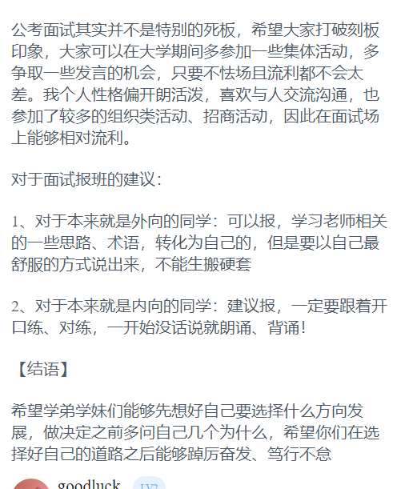

