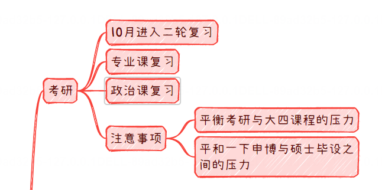
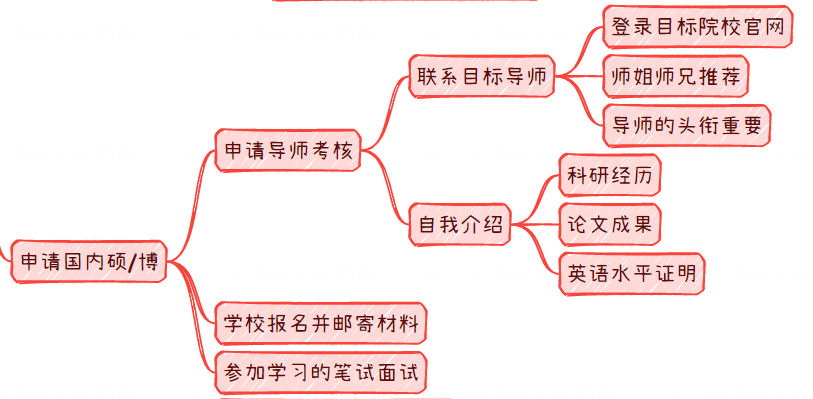
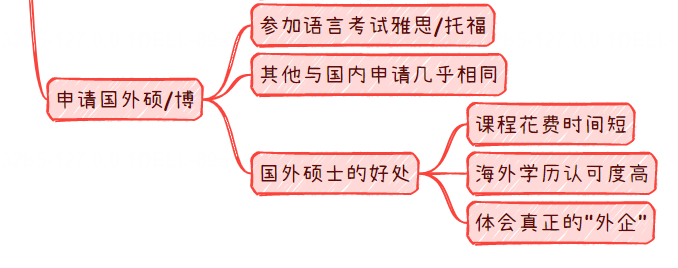
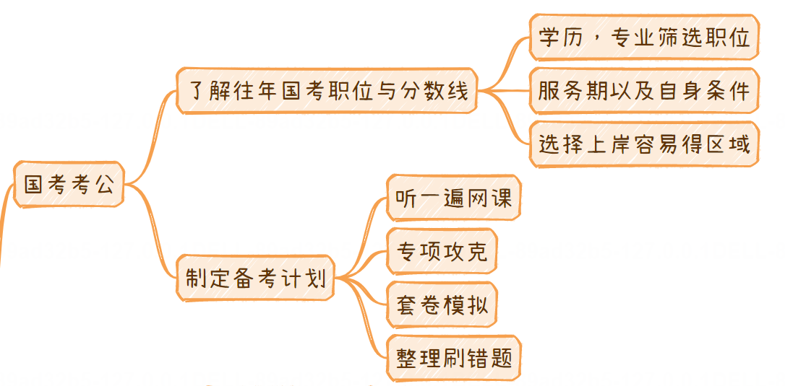
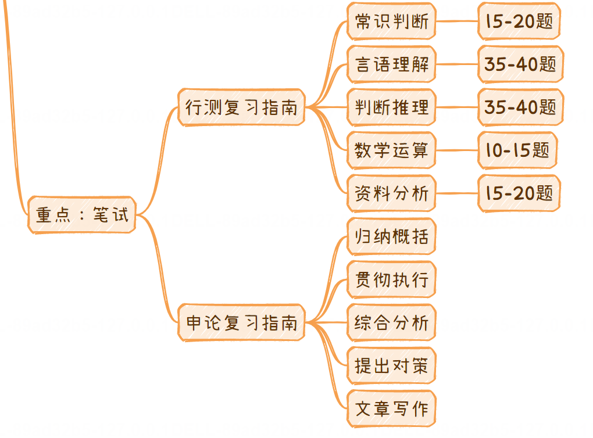

# 保姆级手把手带你通关秋招教程之读研/博与考公全解（完结篇）

[来自： 编程导航](https://wx.zsxq.com/dweb2/index/group/51122858222824)

千与编程

2023年10月25日 07:43

大家好，我是千与编程，今天给大家讲解的是保姆级手把手带你通关秋招教程之读研/博与考公全解（完结篇），为什么是完结篇呢？

现在已经是最后一篇文章了，24届秋招基本上快结束了，已经到了十月底了。大部分的互联网国企都已经发了面试结果，等待的就是11月份公布最终offer薪资。

最后一篇给大家来介绍读研/申博还有参加国考的同学，24届秋招应该只剩下选调的机会了。千寻在这里帮大家做了最大的努力，最后一站读研以及申博以及考公务员。今天给大家进行一个详细的介绍，那我们直接进入正题。

## 一、读研/读博方向

首先给大家介绍一下关于读研和读博方向。第一个是考研，考研的话，现在已经进入到十月份。10月份这个时候，要进入到你的二轮复习。

因为12月初，你要进行考试了，如果这个时候你还在一轮复习的话，时间真的有点来不及。你要把你的大部分精力放在专业课和政治。针对数学和英语，每天要维持做套卷的感觉。

这里的注意事项就是千万还是不要本末倒置，你在大四的过程当中，一定要平衡好，大四的课程以及考研之间的压力。你需要平衡一下你的申博和春招，以及你硕士毕业的压力。

## 二、申请国内硕/博

关于如何申请国内的硕士和博士。在这里，首先给大家介绍一下申请国内的硕士和博士，你要怎么做？

首先申请导师考核，你需要去联系目标院校导师，一般来说，推荐大家直接去登陆目标院校的官网，或者去找比较靠谱的师兄师姐进行推荐。

要记住导师的头衔一定很重要！比如长江学者，杰出青年计划。为什么？因为你博士期间的发表的文章最后都是要挂老师名字的，那么老师是什么水平？基本上就审稿人默认你的论文是什么水平，所以说比较大牛的导师，你读博压力会压力小一些。

第二准备你的自我介绍，自我介绍主要包括科研经历、参加什么比赛，拿过什么奖，都算科研范围。如果说申请博士，必须有论文加持，要求论文的加持其实也是为了你好，如果你在硕士期间就没有什么成果，发不出论文，到了博士，你不发3篇SCI论文强制毕不了业，你会非常痛苦，老师也痛苦。

第三英语水平证明，申请博士是必须通过六级的，还没有通过六级的抓紧。每年6月份和12月份考一次六级。针对不同学校进行报名，博士的话，相对来说申请竞争会小一点。

## 三、申请国外硕/博

申请国外的硕/博，国外的硕士和博士的话，其实和国内的申请方式来上来说，没有什么太大区别，基本上来说，就是多一个雅思和托福的考试，价格确实比较贵。

但是就国外硕士/博士，我认为他好处主要以下几点：

国外的硕士，一般来说，课程整体时间比较短，香港硕士，澳大利亚硕士应该是一年到一年半，时间非常短。国内说是现在很少有两年的硕士，大部分都是三年。

早毕业的话，可以早一年赚钱。同时海外学历来说，相对来说喝洋墨水的，认可度更高，第二次咱们互联网行业就是你可以有机会去体会真真正正的外企。

## 四、国考考公

给大家介绍一下到底怎么准备国考？首先就是说第一点你要去了解往年国考的职位线和分数线。国考和选调的感觉是不太一样的，学历和专业他会筛选一点。很多专业你不能报，有些专业具有优势，比如很多岗位只有计算机才能报，第二个需要了解什么叫服务期？就是你需要下基层。

下基层，就是你需要在基层待多久，才能把你调回来。如果基层非常辛苦，比如你需要去一个村子里的山沟里面，你就出不来了，这个就很难受。

第三你尽可能去你上岸比较容易的城市，最好是离家比较近。

制定一个完整的备考计划。一般来说，建议大家听一遍网课，从头到尾听一些粉笔考公，第二个进行专项的功课，和复习考研差不多，然后套卷模拟。个刷错题，跟复习考研的感觉很类似。

## 五、应届生选调

关于应届生的选调，他和公务员好处在于他是只针对应届生，竞争压力会小一些。应届生选项他的决定因素就是你的学校了，给大家一个难度排行，排行的话，你不是有非常实力，不要报什么浙江，江苏，广东这些富贵省。

都非常难，竞争压力非常大，给大家说一下吧，差不多200人要一个名额，甚至可能更多。500人要一个人也是有可能的，还得看你具体什么部门，压力会非常大。

## 六、重点笔试剖析

考公以及选调的重点就是复试，其实来说，如果说你没有什么特殊关系，拉不开什么差距，基本上大家就差在一个笔试上。

那这个笔试怎么办呢？笔试的话首先你要知道公务员考试的笔试内容，分为行测和申论。

行测和申论，这里第一个行测复习的话，分为常识判断，言语言语理解，判断推理。数字运算，资料分析这五种题。

申论分为归纳概括，贯彻执行，综合分析，提出决策，文章写作，这个文章写作就是我们经常说的小作文和大作文。

这个就是公务员考试的特色，怎么说呢？公务员也不好考，压力很大，因为现在太多人想要追求铁饭碗了。我给大家建议就是你尽可能的去接近这些，好好准备！

今天这个秋招专栏就要和大家说再见了，我后期会把这些文章整理为一个专栏，可以供大家查阅！

我是千与编程，一个只讲干货的码农！祝大家24届秋招顺利！

知识星球

扫码加入星球

查看更多优质内容