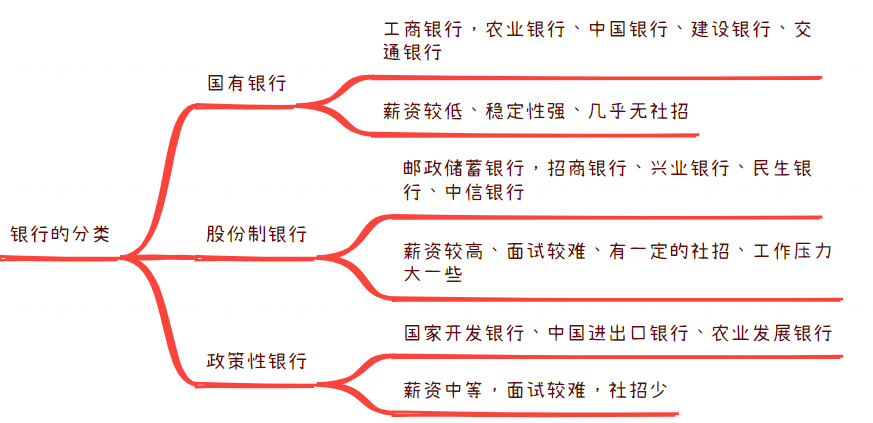
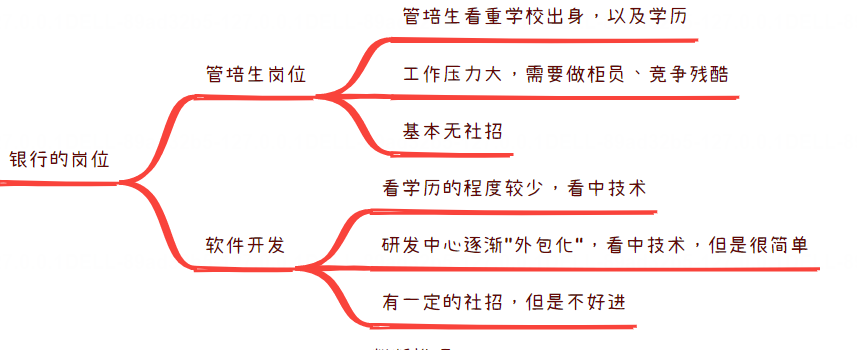
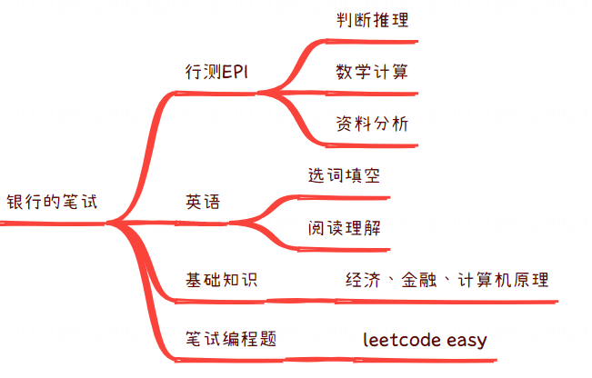
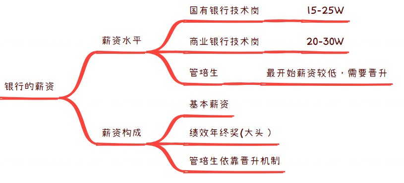
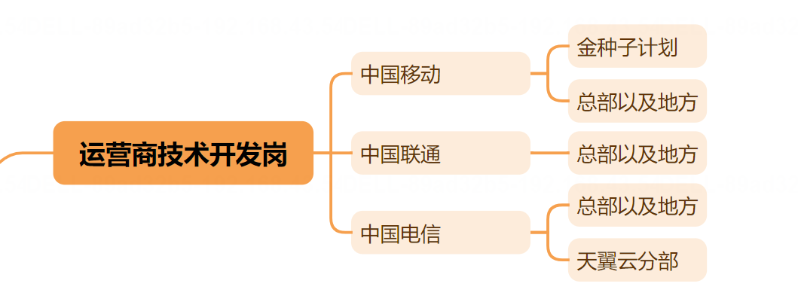
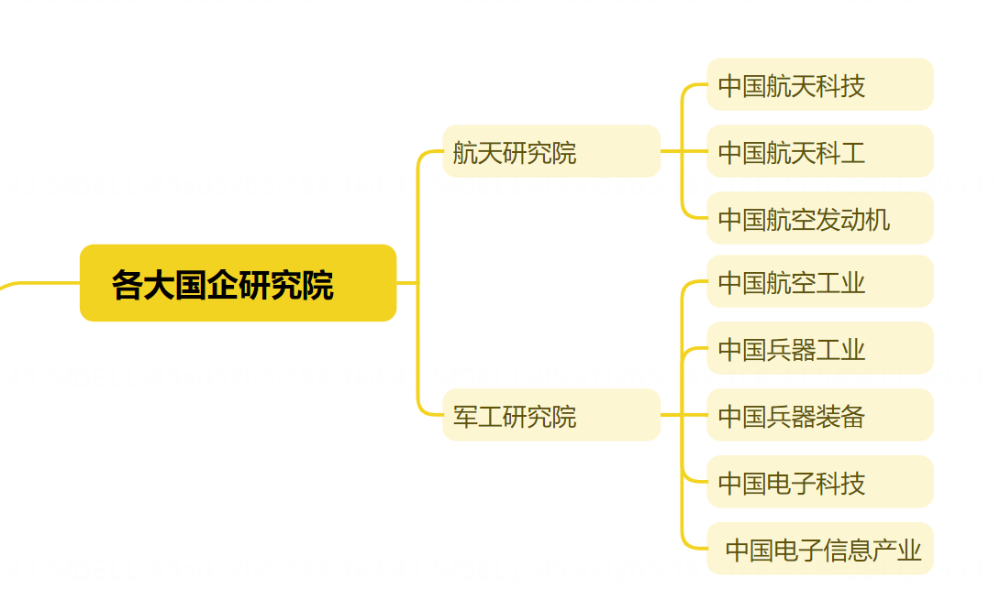
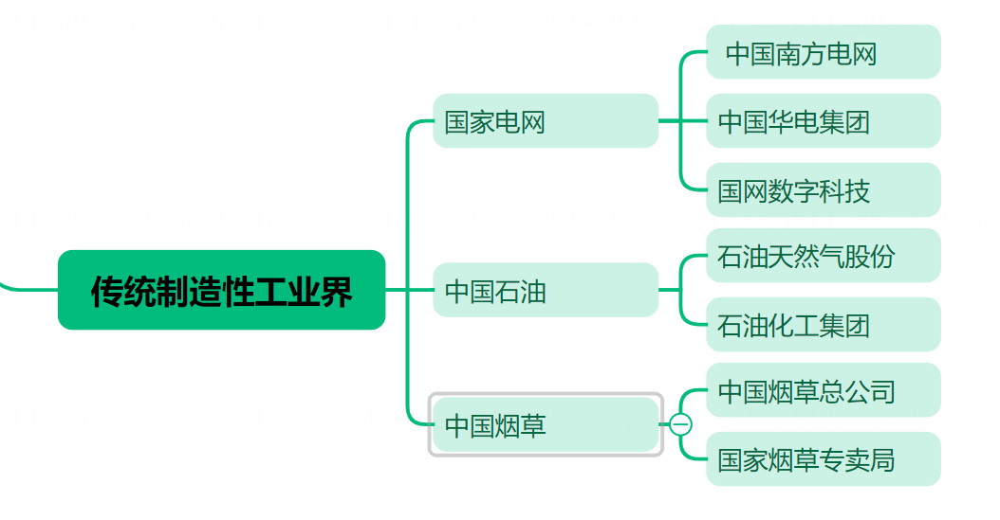
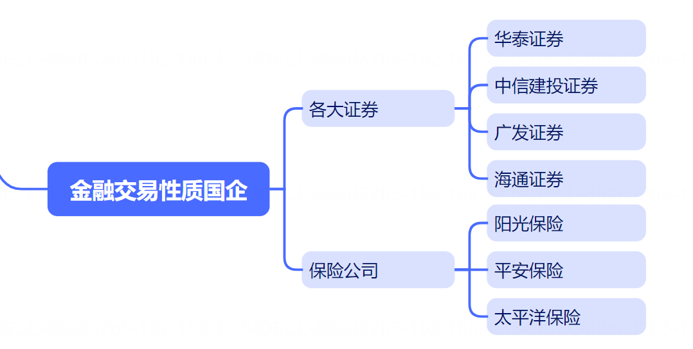
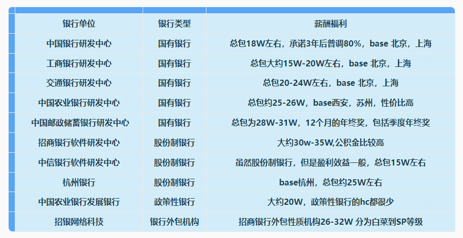

# 保姆级手把手带你通关秋招教程之详解银行、运营商技术岗求职面试（上）

[来自： 编程导航](https://wx.zsxq.com/dweb2/index/group/51122858222824)

千与编程

2023年09月06日 07:52

大家好，我是千寻哥，现在已经是9月份了，互联网大厂的秋招，基本提前批应该快要结束了。

现在已经到了金九银十了，如果你现在项目还没做，八股文还没有刷多，那要面互联网中大厂，估计是有点来不及了，但是如果你要面银行国企，那么还是来得及的，因为银行国企比较看学历，面试不怎么难，而且开的比较晚。

**同时有一个隐藏的buff，一般来说，默认你直通国企技术岗终面！ （面试可以说的，秀肌肉）**

说到面试国企的话，对于计算机专业来说，比较合适的就是银行以及运营商的技术开发岗，另外和大家打一个“预防针”，选择国企的薪资确实不如互联网大厂，即使是很卷的国企，**但是对于目前互联网的就业行情来说**，比去外包强太多了，而且福利待遇也不差，薪资中等。

**重点：计算机去国企秋招，比较推荐银行，算是除互联网大厂外，最看重编程的企业，需要大量的数据存储服务以及页面Web开发人员，但是算法岗几乎没有，很多算法岗需要转开发，提前考虑好！**

## **一、银行的分类**

其实银行的本质是一个存贷款的盈利场所，但是因为银行主要是和钱打交道的，所以还会涉及一些金融方向的政策。所以银行也是分类的：

1.国有银行：工商银行，农业银行、中国银行、建设银行、交通银行，俗称“五大行”。

国有银行的特点：薪资较低，但是稳定性最强，Offer的发放要经过很多轮检查，绝对是最稳的Offer，国有银行的开发人员基本全部来源于校招，基本没社招。

2.股份制银行：邮政储蓄银行，招商银行、兴业银行、民生银行、中信银行等，这些银行不属于国有银行，属于国有控股。股份制银行是需要自负盈亏，更加类似私企，有盈利的压力

3.政策性银行：国家开发银行、中国进出口银行、农业发展银行 三家银行，是为了更好的实行金融方向的政策，这里就不详细展开了,哈哈哈。

## **二、银行的就业岗位**

1.管培生岗位：银行的管培生的原始是为了培养“行长”以及未来的管理层，会选拔有潜力的同学，但是管培生岗位有一个特点：压力比较大。

PS：管培生都是为了晋升的，但是管理层的岗位哪有那么多，所以管培生的竞争压力的真的很大，可能就得一直做柜员。因为管培生需要积累基层经验，所以只能说要做1-2年柜员。

2.技术开发岗位：这个就比较接近互联网大厂了，和大厂的工作模式基本上没啥区别，只能说是更换了业务的类型，相对来说，金融性质的业务更加偏向crud，这个原因是银行追求的是系统的稳定，而不是性能。

## **三、银行的笔试内容**

1.行测EPI部分：性格测试，材料分析，数学单价之类的计算，图形推理，类似行政编考试。

2.英语部分：完形填空，阅读理解，短时间的提高，不太可能，只能说练练手。

3.金融基础知识：找到卷子背一背，牛客网上面找一找。

4.笔试编程题：一般来说，招商银行，农业银行，邮储银行会考察编程题目，当然也是最累的，不同的base可能会有差距，西安那边的邮储研发中心貌似加班不少。深圳那边的招商研发中心，据说也不少。当然公司这么大，也是需要看具体的组的。

## **四、银行的面试考察**

1. 技术面试
2. HR面试

## **五、银行求职的薪资与工作机制**

这个可是大家比较感兴趣的一个话题，哈哈哈，但是银行真的很少有高薪的，银行的特点是相对稳定，不过我觉得，银行的工作真的挺有性价比的。

国有银行的技术岗：15-25W（总包）

商业银行技术岗：20-30W （总包）

管培生：管培生的薪资之间存在较大的差异，决定银行薪资的关键，就是看学历，学历决定你的薪资，学校决定你的offer难度。当然不是100%，只是较大部分。

银行薪资的构成：基本薪资，**绩效年终奖（占大头）**

几乎所有的国有企业的都是绩效大头，大家要有心理准备，国企一般不会裁员，但是你如果一下子高枕无忧，那么不好意思，你每个月可能只有底薪，刚刚够吃饭，所有都得努力工作。

## **六、银行求职面试的注意事项**

1.银行笔试难度中等，但是题目量巨大，一般时间2-3小时，需要耐心的做。

2.技术开发岗的面试一般来说，比互联网的简单，很多都是群面面试官面试，这里和大家说一下，如果面试官不开摄像头，建议大家不要生气。

摆好自己的位置，真的很介意，可以拿到它的offer，把他当成兜底，切忌被情绪化，向Offer看齐.

3.银行的offer发的非常慢，要有心理准备，一般来说在12月份才会发放正式的offer，可以和选调一起准备。

我的总结是，从薪资来说，银行不是很高，即使是股份制银行的薪资也是最多和互联网的白菜价持平，但是银行是有一些“隐藏福利”，不如内部员工进行贷款，是可以有更低的存款利率的。

**如果单纯从买房的目的来看，如果银行的工作稳定的话，选择银行也是可以的。**

现在9月份了，秋招已经进入中期，大家好好加油，拿到满意的offer！

# 保姆级手把手带你通关秋招教程之除银行外，计算机专业还有那些可投递的国央企？

[来自： 编程导航](https://wx.zsxq.com/dweb2/index/group/51122858222824)

千与编程

2023年09月20日 07:40

大家好，我是千寻哥。很高兴今天跟大家来讲一讲第五篇的保姆级手把手带你通关秋招系列教程文章！

今天主要的分享内容是跟大家讲一下计算机专业除了银行之外，还可以投递哪些国企央企就业，之前和大家讲解了**关于银行的技术开发岗要怎么投递，以及银行的笔试内容以及面试内容都是什么区别？**

很多星友们提问说，如果能再讲一讲计算机专业除了银行以外，还能有哪些投递的工作岗位以及可投递的公司。好的，我们今天就安排一下。

其实计算机能投递的公司以及岗位真的是非常非常的多，计算机真的是目前为止所有行业当中涉猎最广泛的，没有之一。几乎所有的公司都是有计算机的岗位的，毕竟信息化，智能化是一个大的方向！

## **一、银行技术开发岗**

关于银行的技术开发岗的话，我们在上一期的这个文章当中已经介绍的非常详细了，大家如果说想详细在了解。

看一下，我的上篇文章，关于银行的技术开发岗，面试技术以及笔试的具体内容。总行以及地方性银行他们的不同岗位的区别都有明显的详细和提示。

**优点：薪资20-30W，比较稳定**

**缺点：涨工资比较慢，而且工作压力也不会特别的小**

## **二、运营商技术开发岗**

除了银行的技术开发岗位以外，我们来说一下，运营商能提供的技术开发岗位。对运营商开发岗位来说，运营商主要是包括三大运营商，中国移动。中国联通，中国电信这个大家都肯定耳熟能详了。

中国移动，记得好像有一个叫金种子计划，薪资大概30W左右，但是它有一个硬性要求就是他只要博士学历。

运营商的明显优点：这个工作强度来说的话应该是非常小，从时间机制来看，属于是标准的955时间工作机制。

中国移动有一个金种子的招聘计划，中国电信的话，大家就都知道的天翼云招聘。而且天翼云开的薪资其实也不低。跟大家提一点，可能会出现一个“假国企”问题，比较通俗一点，就是他可能明着是国企。以为他会955工作机制，非常轻松的感觉，但实际上他的工作压力可能和互联网也差不多。

各位同学们要有个心理准备。确实，国企的现在工作压力也不低，或者说程序员这个行业其实都差不多。这里我跟大家说一下运营商的。offer的运营商的话，它主要其实是笔试，运营商的笔试题目和银行的差不多，但是难度比较简单。

运营商的话基本上编程题都没有，运营商的话，只要认真答了，我没有听说过运营商笔试不过的，前提是必须做完。

运营商薪资比较低，如果说你在一线城市，可能就是1万多一点点。在二线城市的话大概就是八九千。不过确实是工作很轻松，也很稳定，甚至明确告诉你，我们没有末位淘汰。只要你不是摆烂到过分，一般来说是没有问题的，也是运营商的一个好处。

**优点：工作节奏真的很轻松，完全没有末位淘汰，适合选择二三线城市的岗位。**

**缺点：薪资真的不高，可能说起来，二三线城市月薪八九千税前，其实生活质量也不高。**

## **三、各大国企研究机构**

计算机还可以投递的国企就是一些研究院以及研究机构，这个部分来说，薪资可能相对高一点，比方说有航天研究院，还有军工研究院，研究院的话基本上要求入门必须硕士学历以上。一些研发岗研发组的话，一般来说需要是博士，因为从事的这个行业来说难度会比较难。

航天方向包括像航天一院，航天二院，航天三院，航天五院。各位同学们可以回去查一下，他们是不同的，负责控制的，有的负责制导。航天研究院，可能会更累一些，还需要就是外地出差，并且加班也不是。

工作压力来说和华为差不多，这些研究院的话，待遇其实也不算差，可能确实没有互联网工资高。但是星友们要明白。真的就是互联网行业一家独大，其他行业薪资都没有那么高。

所以互联网现在其实扛不住也开始裁员了。航天这些他们也需要很多计算机方向的开发人员。当然了还是银行需要的软件开发岗hc是最多的。

**优点：薪资算是国企的天花板了，并且也很稳定。**

**缺点：工作强度与互联网大厂几乎完全没区别，很多工作需要长期外地出差。**

## **四、传统制造业工业界**

传统制造行业的话，这分的不是特别准确，国家电网，中国石油，以及中国烟草。这些其实更偏向于体制内，尤其中国烟草是非常非常好的体制内。

一般同学真的不太容易进去像中国烟草这么好单位，因为他真的是完完全全的不裁员，而且进去也非常非常轻松，不过说到这儿，给大家辟谣一下，我也有在国家电网和中国石油干的同学，其实工作压力也没有传言的那么小，不过真的很稳定，基本没听说过这几个地方没钱了，或者说是发不出来工资了。这个各位同学们可以心里有一个数。

**优点：工作轻松，体面，稳定，薪资在二三线城市算是十分有性价比了**

**缺点：真的很不好申请，竞争难度与要求极大。**

## **五、金融交易性质国企**

金融性质国企其实是计算机求职的首选，为什么这么说呢？

计算机尤其是后端开发岗的话，还有算法业务岗，我们更多的是数据操作或者数据运算处理，金融行业中会有非常多的金融数据，其实银行也是金融。除了银行之外，就金融方向来说的话，还包括像各大证券，然后各大银行，各大保险公司，这些来说都是需要的。

金融行业的开发岗位的面试以及笔试感觉来说，和银行是差不多的，考察的笔试题目来说，也是行测，图型推理，可能一些比较厉害的头部券商来说，比如华泰证券，他可能也会像互联网公司似的。考察几道笔试编程题，其它的部门来说，难度都不是很高。

**优点：算是业务上最接近互联网的了，薪资也不低，华泰证券等38W**

**缺点：但是存在末位淘汰，工作强度也很大，可能跳槽难度大一些。**

## **六、公务员与选调生**

这个就是大家都耳熟能详的就是公务员和选调生了。这部分来说的话，也是需要计算机专业的同学，基本可以去的核心部门就是网信办，虽然说是公务员，他也是需要开发系统以及小程序的。

选调以及公务员的性价比还是很高的，而且说说我先建议就是公务员的话，你要么选择非常有前景的厉害城市，像北上广的公务员，然后这些来说都会比较有前景。

另一方面就是你就直接回老家附近的或者老家所在省会的。

专门的一些行政岗，但是行政岗位的话，这个可能就是跟计算机写代码关系不太大了。比方说HR沟通性人员，管理型人员可能和技术岗位关系不是很大。但是这个方向也不是特别好做。

**优点：最稳定，最体面的工作，回老家基本可以直接躺平。**

**缺点：选调真的比较难，竞争比较大，很多热门的岗位只能看运气。**

总之任何的选择都是有利有弊的，选择主要的，在意的因素，世界上不存在仙丹！

# 保姆级带你通关秋招教程之盘点一下各大银行技术岗薪酬（含社招）

[来自： 编程导航](https://wx.zsxq.com/dweb2/index/group/51122858222824)

千与编程

2023年12月01日 07:18

大家好，我是千与编程，在之前的保姆级带你通关秋招系列教程中，给大家介绍过了银行技术岗位的招聘的内容，但是还是没有专门给大家盘点一下银行的技术岗薪酬。

最近每一个人都能够感受到，整个经济大环境并不乐观，许多互联网大厂都在裁员。

在这样的互联网寒冬，选择进入稳定的体制内，尤其是银行，是一个不错的选择。

应各大读者朋友的要求，我今天给大家同步一份**各大银行的薪资一览表**，具体的数据主要来源于 offershow，以及相关人员的咨询。但是不同银行，不同岗位，不同地点，差异真的比较大。

大家可以对比看一下，包括国有银行、股份制银行、政策性银行三种主要的银行分类。

## **1. 校招技术岗位各大银行薪资**

在校园招聘中，会有很多的计算机专业的同学选择进入银行，为什么呢？因为相对来说，在现在的这个经济形势不是很好的前提之下，银行这种稳定性强，同时薪资也不是特别低的工作单位，就很吃香了！

我们一起看一看各大银行在校招的薪酬，汇总于下表中，看看效果：

关于银行的校招来说，相比于以下的社招来说，薪资相对稳定，基本每年都是这个参考的范围，着重介绍其中的三家比较有代表的银行，中国农业银行研发中心，中国邮政储蓄银行研发中心，招商银行研发中心。

（1）中国农业银行研发中心：

农业银行研发中心，其中西安base那边26W左右，但是整体来说，加班也是最多的，并且同样也是所有银行研发中心中比较累的。

（2）中国邮政储蓄银行研发中心：邮政储蓄银行的研发中心，应该基本上是最高薪资的国有银行研发中心，苏州，合肥的邮储总包大概28W左右，同时邮政储蓄银行支持实习转正。

一般来说，实习转正的会比普通的Offer再多3W的签字费，总包就是31W左右，基本和互联网大厂的白菜价薪资是持平的，同时兼顾有稳定的特点。

（3）招商银行研发中心：招商银行研发中心的面试难度是所有银行中难度最大的，难度和互联网其实没什么区别了，基本上也要刷算法题，也要进行笔试机考。薪资上35W需要去总部深圳那边，也是包括了公积金。

虽然是去银行，但是基本上也是会为了高薪的，以上的三家算是薪资待遇最高的了，热度最高，因此进行详细的解释。

## **2. 社招技术岗位各大银行薪资**

社招上，银行真的是历史般的缺失，因为银行是国家的企业，基本全部面向校招，尤其是五大国有银行，基本上只面向校招生，只有需要有人离职了，或者上人手实在不够了，才会再进行招聘。

社招的技术岗可以称呼为“一个萝卜一个坑”。以下的几个资源信息是我问了好多人最后得出的结论：

在一定程度上，社招都会参考一下上一家公司工作的薪资，但是基本上，就是维持在8K-12k的一个价格。同时银行的社招真的是少之又少，很少有人抱着社招进入银行的心态来面试的。

因为社招进入银行必须接受一点就是“你可能只能是劳务派遣员工”！

**社招的银行员工与校招的不太一样，属于劳务派遣性质的员工，简单来说就是“外包性质的员工”。**

社招重点区别在于社招属于劳务派遣，校招员工属于正式员工，二者的核心区别在于：

（1）劳务派遣员工的薪资比正式员工的薪资大概低于1-2K。

（2）劳务派遣员工是不能晋升的，因为相对来说，你都不算银行的正式员工，不适用银行的晋升与规章制度。

## **3.银行技术岗位面试的主要流程，考察的范围**

银行技术岗位面试的流程，主要分为四个步骤：

**第一步， 简历考察**

银行基本要求是硕士学历，几乎本科是无法进入银行的，也是学历太内卷了。

**第二步，笔试考察**

考察的内容以行测（行政能力测试）的题目为主，同时还有金融，数学以及计算机的知识，以及英语的阅读理解。去银行的话，英语四六级是必须要通过的。

**第三步， 一面**

银行的科技信息岗相对互联网来说，面试难度低一些，也不会刻意追求高并发高性能高可用，甚至不会问分布式/微服务，一面主要是技术面，技术栈以 Java 为主，会问一些计算机的基础知识、数据库，以及做过的项目。

**第四步，二面**

可能会有无领导小组面试，主要考察沟通、组织和写作能力。

总体来说，相对于互联网大厂，银行的面试真的技术性质没有那么强，比较注重考研情商，以及业务沟通能力。

## **4. 银行技术岗位面试的注意事项**

对银行来说，技术栈比较落后，比较适合想要一开始就追求躺平和稳定的人，如果你想先去互联网公司，再去银行。只能说这样很难，并且希望不大，除非你能有一定的“关系”。

银行内的VIP员工很多，虽然不太适合直接这么说，但是也是大家都墨守成规的了。

同时银行基本上都有拉存款的业务压力，信息技术岗可能相对好一些，但是也会有“情理之中的义务”，你懂我意思就好。

## **5.银行的工作内容**

国有银行的技术开发岗工作内容基本类似运维工程师，因为银行更加看中的是稳定，系统的100%稳定，毕竟出了问题，就是直接金钱上的损失。

银行的技术栈基本都是被淘汰的，同时保密性质要求很高，据说即使是实习生了，还是有很多权限必须是申请才能进入，可见保密条件十分严格。

银行通常是密薪制，意味着甚至签约的时候也不会告诉你薪水，我这里总结的内容仅供大家参考，各地研发中心一定有所差距，我会尽全力的总结在这里关于薪水的话题，这种不敢说的态度，是不是该点个赞支持下。

各行有一二级机构，其笔试面试环节不尽相同，加不加班完全看项目组，有一定的运气成分。

最后关于银行的技术岗，我问了很多资深的在银行工作10年的员工，关于大家最好奇的薪资，真的已经尽力了，他们给出的结论：

**银行的信息技术岗边缘到不足以为了软件开发岗，制定一套完整的薪资待遇体系。**

好了，以上就是对各大银行薪酬和岗位的基本介绍。

基于以上的结论，大家可以进行一下结合自己的经历与追求，鱼和熊掌真的是不可兼得，但是还是那句话，**在现在经济形势不是很乐观，**确实银行是一个不错的“避风港”！但是进入银行，就别追求技术了，如何选择，读者可以自行评估一下。

2023年末，祝愿大家都能够找到理想的工作，一起加油！

